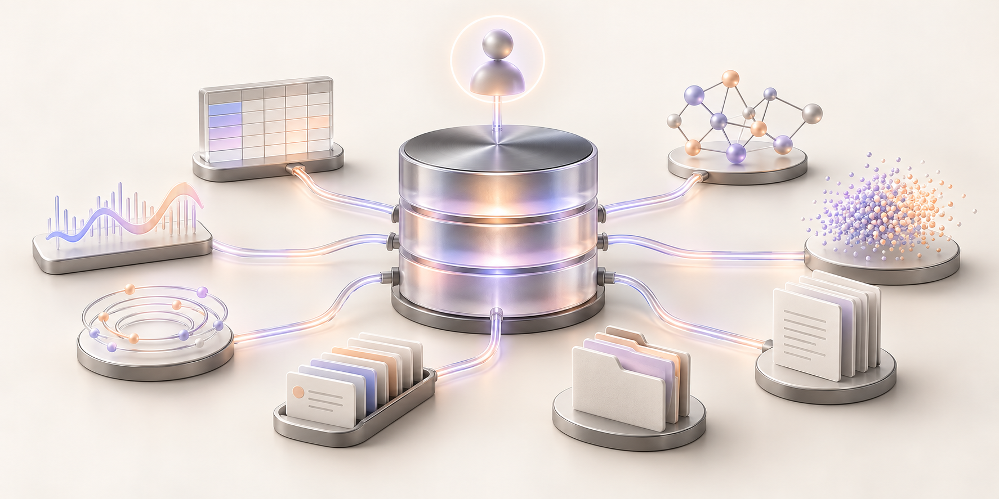
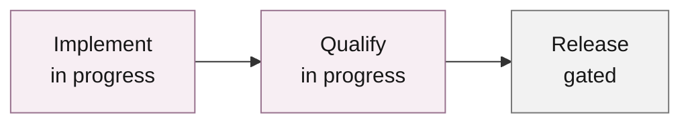
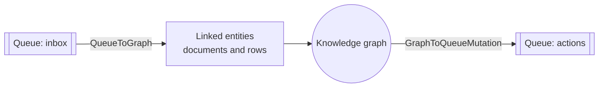
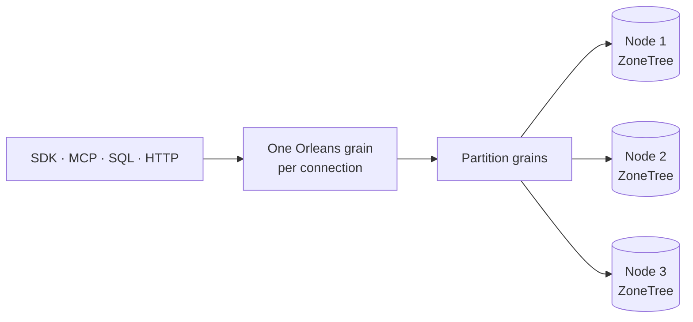

<p align="center">
  
</p>

<h1 align="center">KeyLoad</h1>

<p align="center">
  <strong>The AI-native database. One database for AI agents.</strong><br>
  Your agent's context, relationships and next action. Together.<br>
  SQL · Native MCP · .NET SDK
</p>

<p align="center">
  <a href="https://github.com/managedcode/KeyLoad/actions/workflows/build-and-tests.yml"></a>
  <a href="LICENSE"></a>
  
  
</p>

<p align="center">
  <a href="https://www.keyload.cloud/">Website</a> ·
  <a href="#quick-start">Quick start</a> ·
  <a href="#capability-matrix">Capabilities</a> ·
  <a href="docs/README.md">Docs</a> ·
  <a href="#project-status">Status</a>
</p>

---

## Why an AI-native database?

At [Managed Code](https://www.managed-code.com/), we've spent years building agents. Different projects. Same story: the agent always needs more than the database we started with.

You start with **vectors**. Great, the agent can find similar things. But it also needs real records. Add **SQL**. Then **hybrid search**. Still missing relationships? Add a **graph**. Now it needs to remember what happened: **events**. Read a PDF? **Files**. Do something later? **Queues**. Track what changes over time? **Time series**.

Every requirement makes sense. Put them together, and suddenly you're running a stack of databases just to build one agent. Different clients, permissions, backups and sync jobs. A lot of plumbing before the interesting work even starts.

**Agents shouldn't need a dozen databases.**

We came to a simple conclusion: we need an **AI-native database** that keeps the agent's context, relationships and work together. With **MCP built in**, so the agent can actually use it.

**Meet KeyLoad. One database for AI agents.**



Documents, typed tables, graphs, vectors/search, blobs, queues, events and time series belong to the same database. They connect through **canonical entity references**, so a row can be part of a graph, an event can point to a document, and a queued task can carry the context it needs.

**SQL is the familiar shared language.** The built-in MCP server and typed .NET SDK reach the same authorized operations. The full product is still being built; [the status below](#project-status) shows what's accepted and what remains.

| The idea | Why it matters |
|---|---|
| **Keep context together** | Search, relationships, files and history connect to the same entities |
| **Keep work next to the data** | A document, event, graph edge and queued task in one partition commit together |
| **Give agents a native way in** | MCP discovery finds the relevant tools; SQL and the SDK use the same operations |
| **Keep permissions in the database** | Persisted keys and row/field policies apply across every caller |

### Why we think this is the future

A support agent doesn't ask for a vector database. It needs the ticket, the customer, similar cases, the attached file and a way to schedule the next action. Those things belong together.

That's what we're building: **one place for context, one place for the work that follows.** Same-partition writes already commit atomically. Leased receives, blob uploads and cross-partition work are separate steps today. [Try the preview](#quick-start) or [bring us your agent workload](https://github.com/managedcode/KeyLoad/issues).

## What you can build

| You want to… | KeyLoad gives you |
|---|---|
| Give an agent long-term **memory and retrieval (RAG)** | Documents, files and embeddings in one place, with vector, full-text and hybrid search |
| Build a **knowledge graph** | Relationships between any entities, including typed rows, and graph traversal |
| Run **reliable agent workflows** | Queues with scheduling, leases, retries and dead letters, stored next to the data they change |
| Make **event-driven** apps | Ordered event history, durable subscriptions, change feeds and projections |
| Analyze **time series** | Timestamped samples, range reads, aggregates, time windows and retention |
| Store **files** for agents | Chunked uploads and partial reads of large blobs |

## Project status

> **Development preview.** Production qualification is still open.

| Original tasks | Accepted | In progress |
|---|---|---|
| **104** | **17** | **87** |



**Accepted** = original task criteria passed for a recorded source. **In source** = implemented, with qualification open. Later changes require fresh checks.

Local focused checks on 2026-10-10 passed: full Release build and formatter, 116/116 unit, 116/116 scalar and 20/20 process-recovery tests. These checks cover the joined messaging, event traversal and native-contract work; complete Linux/RF3 qualification and product coverage remain open.

| Workstream | What it does and why | State | Remaining work |
|---|---|---|---|
| **Records & indexes** | CRUD and revision checks keep records consistent | ✓ Accepted | [Recovery and fault gates](docs/Features/StorageRecovery.md) |
| **Backup & restore** | Recover a saved local database | ✓ Local scope | [RF3 cluster restore drills](docs/Features/BackupRestore.md) |
| **Atomic batches** | Commit related writes together; retry without duplicates | ✓ Accepted | [Cross-partition composition](docs/Features/DatabaseComposition.md) |
| **Graphs** | Store relationships and traverse agent knowledge | ✓ Accepted | [Cross-partition graphs](docs/Features/GraphTraversal.md) |
| **Time series** | Samples, ranges and aggregates track history | ✓ Accepted | [Chunk and scale checks](docs/Features/TimeSeries.md) |
| **Search** | Exact vectors, hybrid ranking and Explain retrieve context | ✓ Accepted | [ANN, rebuilds and freshness](docs/Features/Search.md) |
| **SQL & tables** | `SELECT`, `CALL` and bounded INNER JOIN share one language | ◐ In source | [Full SQL, foreign keys and client protocol](docs/Features/QueryExecution.md) |
| **Queues & events** | Leases, history and queue ↔ graph flows drive agent work | ◐ In source | [Failure, security and recovery checks](docs/Features/Messaging.md) |
| **SDK & MCP** | SDK, tool discovery, CLI and admin connect callers | ◐ In source | [Gateway and official MCP RF3 checks](docs/Features/ClientApi/ToolDiscovery.md) |
| **Authorization** | Persisted keys and row/field policies protect context | ◐ In source | [Adversarial and revocation checks](docs/Features/Authorization.md) |
| **RF3 & Orleans** | Three replicas, follower reads and partition movement | ◐ In source | [Fault, restart and runtime checks](docs/Features/ClusterRouting.md) |
| **RAM & SIMD** | Bounded caches and CPU vectorization target lower memory/latency | ◐ In progress | [Comparable Linux measurements](docs/implementation/memory-performance.md) |
| **Production** | Qualified database and operator guidance | ○ Gated | Full unit/scalar, recovery, RF3, coverage, performance, endurance and power-loss gates |

Product functional coverage is **unmeasured**. Public performance figures require original GitHub measurements; process-kill tests do not prove power-loss durability.

[Task tracker](docs/implementation/status.json) · [SQL conformance](docs/implementation/sql-client-conformance.json) · [Coverage](docs/Features/CodeQuality.md) · [Benchmark methodology](docs/Features/BenchmarkComparisons/Methodology.md) · [Published benchmarks](https://www.keyload.cloud/#benchmarks)

## One database, connected models

### Capability matrix

| Model | Operations in source | Atomic write scope |
|---|---|---|
| **Documents** | CRUD, revision checks, indexed and live queries | Put, patch, delete |
| **Typed tables** | Schemas, primary keys, unique constraints and indexed reads | Row mutations |
| **Graphs** | Edges and bounded traversal | Add/remove edges |
| **Vectors & search** | Exact vector, full-text and hybrid retrieval | Store vectors with documents |
| **Queues & topics** | Scheduling, leases, ACK, retries, dead letters and peek | Enqueue/publish |
| **Events** | Append, replay and durable subscriptions | Append with expected revision |
| **Time series** | Ranges, aggregates, windows and retention | Append samples |
| **Files & blobs** | Chunked uploads and byte-range reads | Separate upload/publication |
| **Change feeds** | Resumable feeds and projections | Record document changes |

Atomic batches share one partition. SQL `SELECT` reads documents, typed rows and model views; `CALL` reaches the shared operation catalog. MCP discovers those operations on demand. [SQL syntax](docs/Features/QueryExecution.md) · [API and tool catalog](docs/Features/ClientApi.md).

### Models that work together

| Flow | What one request does |
|---|---|
| **Queue to knowledge graph** (`QueueToGraph`) | Reads ready messages, resolves linked entities and writes knowledge-graph relationships |
| **Graph to queued actions** (`GraphToQueueMutation`) | Follows relationships and can enqueue actions for linked entities |



The current composition API uses .NET `CommitAsync`, SQL `CALL keyload_documents_commit(@arguments)` or the official MCP server.

| Boundary | Current contract |
|---|---|
| Atomicity | The same atomic partition and transaction domain (`PartitionRef`); the batch succeeds or rolls back together |
| Queue readsтобін  | Composition does not lease or ACK messages |
| Files | Blobs remain part of the same database, with separate upload and publication operations |
| Preview limits | Full declarative SQL, the native SQL-client protocol and cross-partition composition are still in development; production guarantees remain under qualification |

Details: [composition guide](docs/Features/DatabaseComposition.md) · [transaction contract](docs/ADR/ADR-067-composable-agent-database.md).

## How it works



Each actual connection reuses one Orleans grain and admits bounded parallel operations and commands. Every operation has its own signed identity, fresh persisted authorization, cancellation and stream cleanup; completed requests are not retained. Disconnect or idle expiry closes admission, joins the original work and requests native deactivation.

Connection execution under [ADR-125](docs/ADR/ADR-125-connection-owned-execution.md) passed eight local native flows and five real SDK/official MCP Aspire Docker RF3 flows. Complete Linux fault, endurance and performance qualification remains open. This transport ownership does not deliver native SQL session compatibility. Partition grains route to node-local storage owners; moving a grain does not move its storage handles. Writes require a persisted majority of the three replicas. See the [architecture map](docs/Architecture.md) and [grain lifetime contract](docs/Features/ClusterRouting/ExecutionPrimitives.md#connection-and-request-lifetimes).

## Why .NET, Orleans and ZoneTree

| Foundation | Why we use it |
|---|---|
| [.NET 10](https://github.com/dotnet/runtime) | C# end to end, pooled buffers, `Span<T>` and native SIMD intrinsics; speedups need measurements |
| [Orleans](https://github.com/dotnet/orleans) | Request isolation, membership, routing and generated binary serialization; experimental directory/repartitioning remain under qualification |
| [ZoneTree](https://github.com/ZoneTree/ZoneTree) | Embedded ordered storage and a write-ahead log for every model; data stays on its node |
| [ZoneTree.FullTextSearch](https://github.com/ZoneTree/ZoneTree.FullTextSearch) | Native full-text indexing on the same storage foundation |
| [Aspire](https://github.com/dotnet/aspire) | Owns Docker cluster startup, readiness and cleanup |

**Orleans moves the routing; ZoneTree keeps the data in place.**

## Quick start

**You need:** the .NET SDK version pinned in [global.json](global.json), and Docker.

**1. Build the solution**

```bash
dotnet restore KeyLoad.slnx
```

```bash
dotnet build KeyLoad.slnx --no-restore --configuration Release
```

**2. Build the server image**

The cluster runs the server image pinned by its digest, so build it from source and push it to a local registry:

```bash
docker run -d --name keyload-registry -p 5050:5000 registry:3
```

```bash
docker build -t localhost:5050/keyload/server:dev . && docker push localhost:5050/keyload/server:dev
```

```bash
export KeyLoad__ContainerImages__Server="localhost:5050/keyload/server:dev@$(docker inspect --format '{{index .RepoDigests 0}}' localhost:5050/keyload/server:dev | cut -d@ -f2)"
```

**3. Start the three-node cluster**

```bash
dotnet run --project src/KeyLoad.AppHost --configuration Release --no-build
```

[Aspire](https://github.com/dotnet/aspire) starts three nodes at `http://localhost:5101`, `:5102` and `:5103`. Node data and your local development credentials are stored in `data/cluster/`, which git ignores. Keep that folder between restarts.

**4. Look around**

- Open the [admin console](http://localhost:5101/admin).
- Or check the cluster from the CLI:

```bash
dotnet run --project src/KeyLoad.Cli --configuration Release --no-build -- status http://localhost:5101 data/cluster/local-profile.json
```

Your local admin API key is the `AdminKey` value in `data/cluster/local-profile.json`. Export it as `KEYLOAD_API_KEY` for the examples below.

## Use it

### From .NET

The [client SDK](src/KeyLoad.Client) gives you typed database operations. This creates a collection, writes an order and reads it back:

```csharp
using KeyLoad;
using KeyLoad.Client;

var apiKey = Environment.GetEnvironmentVariable("KEYLOAD_API_KEY")
    ?? throw new InvalidOperationException("Set KEYLOAD_API_KEY.");
using var http = new HttpClient { BaseAddress = new Uri("http://localhost:5101") };
var client = new KeyLoadClient(http, apiKey);

// tenant, database, transaction domain, partition key
var partition = new PartitionRef("acme", "shop", "orders", "customer-42");

var collection = await client.ConfigureResourceAsync(Guid.NewGuid(), new("acme", "shop",
    new ResourceDefinition("orders", ResourceKind.Collection, "orders")));
collection.ThrowIfFail();

var commandId = Guid.NewGuid(); // Reuse this ID if you retry the same write.
var result = await client.CommitAsync(new CommandRequest(commandId, partition,
[
    new PutDocument("orders", "order-1", "{\"status\":\"new\"}", ExpectedRevision: 0)
]));
result.ThrowIfFail();

var order = await client.GetAsync(new EntityRef(partition, "orders", "order-1"));
order.ThrowIfFail();
```

### With SQL

Use SQL to read data and to call any database operation:

```csharp
using System.Text.Json;

var rows = await client.ExecuteSqlAsync(new SqlOperationRequest(partition,
    "SELECT * FROM orders WHERE status = @status LIMIT 20",
    new() { ["status"] = JsonSerializer.SerializeToElement("new") },
    AllowFullScan: true));
rows.ThrowIfFail();
Console.WriteLine(rows.Value);
```

Here's what works today:

```sql
SELECT * FROM orders WHERE number BETWEEN 1 AND 9 ORDER BY id
SELECT * FROM QUEUE_MESSAGES('jobs')
SELECT e.eventType FROM EVENTS('events', 'stream-a', 3) AS e
EXPLAIN SELECT * FROM orders
CALL keyload_documents_commit(@arguments)
```

Model views (`QUEUE_MESSAGES`, `EVENTS`) and unindexed filters require `AllowFullScan: true`, and model views don't support cursors. Bounded same-partition INNER JOIN is in source. Full SQL, foreign keys and the native SQL-client protocol remain in progress. The [query guide](docs/Features/QueryExecution.md) lists the supported syntax, and the [compatibility inventory](docs/implementation/sql-client-conformance.json) tracks the rest.

### From an AI agent (MCP)

Every node serves [MCP](https://modelcontextprotocol.io/) at `/mcp`. Its compact catalog offers `gateway_tools_search`, `gateway_tools_route` and `gateway_tool_invoke`; tools are discovered on demand. Connect with an API key, for example in Claude Code's `.mcp.json`:

```json
{
  "mcpServers": {
    "keyload": {
      "type": "http",
      "url": "http://localhost:5101/mcp",
      "headers": { "Authorization": "Bearer ${KEYLOAD_API_KEY}" }
    }
  }
}
```

| Step | Agent workflow |
|---|---|
| **Learn** | Read `keyload://guides/agent-quickstart` or request the no-argument `keyload_agent_quickstart` prompt |
| **Discover** | Call `gateway_tools_search` with `{ "query": "keyload_query_capabilities", "maxResults": 1 }` |
| **Inspect** | Use the returned exact schema and effect hints |
| **Invoke** | Call `gateway_tool_invoke` with `{ "toolId": "keyload_query_capabilities", "arguments": {} }` |

Every invocation checks current persisted permissions. Retry uncertain writes with the same command identity and payload. Details: [API guide](docs/Features/ClientApi.md) · [discovery and qualification contract](docs/Features/ClientApi/ToolDiscovery.md).

## FAQ

| Question | Answer |
|---|---|
| **Is this a vector database?** | Vectors share a database with documents, graphs, queues and files. Exact search is available; [ANN is in progress](docs/Features/Search/ManagedAnn.md). |
| **Can it hold agent memory?** | Yes: linked documents, embeddings, files, graphs and history are the main use case. |
| **Does it replace a stack of databases?** | That's the goal for agent workloads. Check the [preview limits](#project-status) before moving data. |
| **How do agents connect?** | MCP at `/mcp`, with an API key and on-demand tool discovery. |
| **What about Python or TypeScript?** | Use MCP or `/v1/` HTTP. The typed SDK is .NET. |
| **Can I use it commercially?** | [Elastic License 2.0](LICENSE) permits application use. Offering a substantial set of KeyLoad features as a hosted or managed service requires ManagedCode authorization. KeyLoad is source available. |
| **Production ready?** | Not yet: endurance, fault and power-loss qualification remain open. |

## Repository map

<details>
<summary>Source map and development commands</summary>

Feature code uses `Features/<SliceName>/<Responsibility>/` across the solution.

| Path | What's inside |
|---|---|
| [`src/KeyLoad.Server`](src/KeyLoad.Server) | The database server: HTTP API, MCP server and admin console |
| [`src/KeyLoad.Client`](src/KeyLoad.Client) | The .NET SDK |
| [`src/KeyLoad.Cli`](src/KeyLoad.Cli) | Command-line tool for operators and workers |
| [`src/KeyLoad.AppHost`](src/KeyLoad.AppHost) | Aspire host for the local cluster and every test suite |
| [`src/KeyLoad.Abstractions`](src/KeyLoad.Abstractions) | Shared public contracts |
| `src/KeyLoad.Core`, `Query`, `Orleans`, `Replication`, `Security`, `Storage.*` | Database engine, SQL, cluster, replication, permissions and storage |
| [`tests/`](tests) | Unit, crash-recovery, three-node and website tests ([TUnit](https://github.com/thomhurst/TUnit)) |
| [`benchmarks/`](benchmarks) | Comparisons with other databases, plus microbenchmarks |
| [`site/`](site) | Source for [keyload.cloud](https://www.keyload.cloud/) |
| [`docs/`](docs/README.md) | Architecture, feature specifications and design decisions |

### Contributing

Start with the [architecture map](docs/Architecture.md), the [feature specs](docs/Features) and [repository rules](AGENTS.md). After building, run a functional suite (`unit`, `unit-scalar`, `recovery`, `rf3`, `analyzers` or `site`):

```bash
node scripts/Features/TestInfrastructure/run-tests.mjs --KeyLoadTests:Suite=unit
```

```bash
dotnet format KeyLoad.slnx --verify-no-changes --no-restore
```

Native TUnit fixtures own Aspire startup and cleanup; `rf3` uses real .NET and official MCP clients against three Docker nodes. Benchmark builds, checks and measurements run exclusively in GitHub's Benchmarks workflow.

</details>

## License

KeyLoad is licensed under the [Elastic License 2.0](LICENSE). Use it in your own applications; contact [ManagedCode](https://www.managed-code.com/) for authorization to offer it as a hosted or managed database service to third parties. Dependency licenses remain with their respective owners.

## Credits

KeyLoad is built by [Managed Code](https://www.managed-code.com/). We get to build it because other people built great tools first. **Thank you to their authors and contributors.**

A special thanks to **[ZoneTree](https://github.com/ZoneTree/ZoneTree)** and **[ZoneTree.FullTextSearch](https://github.com/ZoneTree/ZoneTree.FullTextSearch)** for the storage and text-index foundation, **[Orleans](https://github.com/dotnet/orleans)** for the cluster runtime, and the **[MCP C# SDK](https://github.com/modelcontextprotocol/csharp-sdk)** team for the native agent connection.

| Project | How KeyLoad uses it |
|---|---|
| [.NET](https://github.com/dotnet/runtime) and [ASP.NET Core](https://github.com/dotnet/aspnetcore) | Server, client SDK and HTTP hosting |
| [Orleans](https://github.com/dotnet/orleans) | Distributed request execution, cluster routing and binary serialization |
| [ZoneTree](https://github.com/ZoneTree/ZoneTree) | Persistent ordered storage for every database model |
| [ZoneTree.FullTextSearch](https://github.com/ZoneTree/ZoneTree.FullTextSearch) | Full-text search index |
| [MCP C# SDK](https://github.com/modelcontextprotocol/csharp-sdk) | Built-in MCP server and real MCP clients in tests |
| [ManagedCode.Communication](https://github.com/managedcode/Communication) | Typed operation results and ASP.NET Core/Orleans integration |
| [ManagedCode.Storage](https://github.com/managedcode/Storage) | File-system storage and backup transfer support |
| [ManagedCode.TimeSeries](https://github.com/managedcode/TimeSeries) | Time-series aggregation |
| [ManagedCode.Orleans.Graph](https://github.com/managedcode/Orleans.Graph) | Grain call relationship policies |
| [ManagedCode.Orleans.Identity](https://github.com/managedcode/Orleans.Identity) | Native Orleans request identity context |
| [ManagedCode.MCPGateway](https://github.com/managedcode/MCPGateway) | Agent authentication and on-demand tool discovery |
| [ManagedCode.MarkdownLd.Kb](https://github.com/managedcode/markdown-ld-kb) | Knowledge-graph search over tool metadata |
| [Cartograph](https://github.com/angelhernandezm/Cartograph) | Segmented backup archives and catalogs |
| [OpenTelemetry .NET](https://github.com/open-telemetry/opentelemetry-dotnet) | Logs, metrics and traces |

| Development & presentation | Contribution |
|---|---|
| [Aspire](https://github.com/dotnet/aspire) · [TUnit](https://github.com/thomhurst/TUnit) | Docker orchestration and real operation tests |
| [Roslyn](https://github.com/dotnet/roslyn) · [BenchmarkDotNet](https://github.com/dotnet/BenchmarkDotNet) | Repository analyzers and microbenchmarks |
| [Three.js](https://github.com/mrdoob/three.js) | Website cluster illustration |

The comparison suite uses free community editions and real native clients:

| Workload family | Comparison projects | Client projects |
|---|---|---|
| Records & SQL | [PostgreSQL](https://github.com/postgres/postgres), [MongoDB](https://github.com/mongodb/mongo), [Redis](https://github.com/redis/redis) | [Npgsql](https://github.com/npgsql/npgsql), [MongoDB .NET Driver](https://github.com/mongodb/mongo-csharp-driver), [StackExchange.Redis](https://github.com/StackExchange/StackExchange.Redis) |
| Vectors & text | [pgvector](https://github.com/pgvector/pgvector), [Qdrant](https://github.com/qdrant/qdrant), [OpenSearch](https://github.com/opensearch-project/OpenSearch) | — |
| Queues & events | [RabbitMQ](https://github.com/rabbitmq/rabbitmq-server), [KurrentDB](https://github.com/kurrent-io/KurrentDB) | [RabbitMQ .NET Client](https://github.com/rabbitmq/rabbitmq-dotnet-client), [KurrentDB .NET Client](https://github.com/kurrent-io/KurrentDB-Client-Dotnet) |
| Graphs & connected models | [Neo4j](https://github.com/neo4j/neo4j), [SurrealDB](https://github.com/surrealdb/surrealdb), [HelixDB](https://github.com/helixdb/helix-db) | — |
| Time series | [TimescaleDB](https://github.com/timescale/timescaledb) | — |

Active scale: **100,000 and 1,000,000 records**, at native **1 or 3 nodes** where supported. New adapters remain under qualification. The [vector comparison contract](docs/Features/BenchmarkComparisons/VectorQualification.md) defines accuracy, latency, index cost and memory checks; only qualified original GitHub results become public figures.

---

<p align="center">Developed by <a href="https://www.managed-code.com/">Managed Code</a></p>
