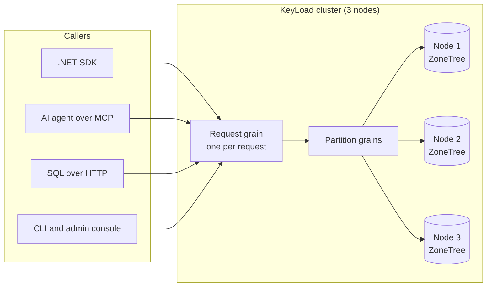

<p align="center">
  
</p>

<h1 align="center">KeyLoad</h1>

<p align="center">
  <strong>One database for AI agents.</strong><br>
  Documents, typed tables, graphs, vectors/search, blobs, queues, events and time series in one replicated cluster.<br>
  Everything links to everything else, and you reach all of it through SQL, MCP and the .NET SDK.
</p>

<p align="center">
  <a href="https://github.com/managedcode/KeyLoad/actions/workflows/ci.yml"></a>
  <a href="LICENSE"></a>
  
  
  
  
</p>

<p align="center">
  <a href="https://www.keyload.cloud/">Website</a> ·
  <a href="#quick-start">Quick start</a> ·
  <a href="docs/README.md">Documentation</a> ·
  <a href="docs/Architecture.md">Architecture</a> ·
  <a href="#project-status">Status</a>
</p>

---

## Why KeyLoad?

A typical AI agent stack ends up as five systems glued together: Postgres for records, a vector database for embeddings, Redis or RabbitMQ for tasks, S3 for files and Kafka for events. Each one has its own permissions, its own failure modes and its own copy of the truth. The agent spends its time keeping them in sync.

KeyLoad puts all of that in **one database**:

- 🔗 **One reference for everything.** All models share canonical entity references. A queue message can point to a document, that document can be a node in a knowledge graph, and its files, embeddings and history stay attached to it.
- 🗣️ **One language.** SQL is the familiar shared language for querying and combining the models. Agents get the same operations as MCP tools, and applications get them through a typed .NET SDK.
- 🔐 **One permission model.** API keys and access policies live in the database itself. Every call is checked, down to rows and fields, and clients can't grant themselves roles.
- 🛡️ **Replicated from day one.** The default server is a three-node cluster that keeps three copies of your data (RF3). It runs on [Orleans](https://github.com/dotnet/orleans), with [ZoneTree](https://github.com/ZoneTree/ZoneTree) storage on each node.

## What you can build

| You want to… | KeyLoad gives you |
|---|---|
| Give an agent long-term **memory and retrieval** | Documents, files and embeddings in one place, with vector, text and hybrid search |
| Build a **knowledge graph** | Relationships between any entities, including typed rows, and graph traversal |
| Run **reliable agent workflows** | Queues with scheduling, leases, retries and dead letters, stored next to the data they change |
| Make **event-driven** apps | Ordered event history, durable subscriptions, change feeds and projections |
| Analyse **time series** | Timestamped samples, range reads, aggregates, time windows and retention |
| Store **files** for agents | Chunked uploads and partial reads of large blobs |

## One database, connected models

| Model | What it holds |
|---|---|
| 📄 Documents | JSON records with indexes and revision checks |
| 🧾 Typed tables | Rows with a schema, primary keys and unique constraints |
| 🕸️ Graphs | Edges between entities and traversal |
| 🧭 Vectors and search | Vector similarity, full-text search and combined ranking |
| 📦 Files and blobs | Large files stored in chunks, readable by byte range |
| 📬 Queues | Scheduled work, leases, retries and dead-letter handling |
| 📜 Events and topics | Ordered history, subscriptions and checkpoints |
| 📈 Time series | Samples over time, aggregates and windows |

These aren't separate silos. Collections, tables and queues live in the same database and reference each other, so one request can work across models:

- **Queue to knowledge graph** (`QueueToGraph`). Reads ready messages from a queue, resolves their linked entities and writes the new knowledge-graph relationships.
- **Graph to queued actions** (`GraphToQueueMutation`). Follows graph relationships and can enqueue actions for each entity it finds.

**What the first version does.** The current composition API runs through .NET `CommitAsync`, SQL `CALL keyload_documents_commit(@arguments)` or the official MCP server:

- All data in one request must live in the same atomic partition and transaction domain, which is the `PartitionRef` you pass in. The whole batch succeeds or rolls back together.
- Reading a queue into the graph does not lease or ACK the messages, so they stay in the queue for their regular consumers.
- Blobs remain part of the same database, but use their separate upload and publication operations.
- KeyLoad is a development preview. Full declarative SQL, the native SQL-client protocol and cross-partition composition are still in development, and production guarantees remain under qualification.

The [composition guide](docs/Features/DatabaseComposition.md) and its [transaction contract](docs/ADR/ADR-067-composable-agent-database.md) cover the details.

## How it works



1. A caller sends an operation to any node, through the SDK, MCP, SQL or plain HTTP.
2. KeyLoad gives that request its own [Orleans](https://github.com/dotnet/orleans) grain, which checks permissions and calls the database grains it needs.
3. Database grains route the work to the storage owner on each node. Storage stays on its node, even when Orleans moves grains around the cluster.
4. A write is acknowledged only after a majority of the three replicas has stored it durably. If a node fails, the other two keep the acknowledged data.

You'll find the full picture in the [architecture map](docs/Architecture.md).

## Quick start

**You need:** the .NET SDK version pinned in [global.json](global.json), and Docker.

**1. Build the solution**

```bash
dotnet restore KeyLoad.slnx
```

```bash
dotnet build KeyLoad.slnx --no-restore --configuration Release
```

**2. Build the server image**

The cluster runs the server image pinned by its digest, so build it from source and push it to a local registry:

```bash
docker run -d --name keyload-registry -p 5050:5000 registry:3
```

```bash
docker build -t localhost:5050/keyload/server:dev . && docker push localhost:5050/keyload/server:dev
```

```bash
export KeyLoad__ContainerImages__Server="localhost:5050/keyload/server:dev@$(docker inspect --format '{{index .RepoDigests 0}}' localhost:5050/keyload/server:dev | cut -d@ -f2)"
```

**3. Start the three-node cluster**

```bash
dotnet run --project src/KeyLoad.AppHost --configuration Release --no-build
```

[Aspire](https://github.com/dotnet/aspire) starts three nodes at `http://localhost:5101`, `:5102` and `:5103`. Node data and your local development credentials are stored in `data/cluster/`, which git ignores. Keep that folder between restarts.

**4. Look around**

- Open **http://localhost:5101/admin** for the admin console.
- Or check the cluster from the CLI:

```bash
dotnet run --project src/KeyLoad.Cli --configuration Release --no-build -- status http://localhost:5101 data/cluster/local-profile.json
```

Your local admin API key is the `AdminKey` value in `data/cluster/local-profile.json`. Export it as `KEYLOAD_API_KEY` for the examples below.

## Use it

### From .NET

The [client SDK](src/KeyLoad.Client) gives you typed database operations. This creates a collection, writes an order and reads it back:

```csharp
using KeyLoad;
using KeyLoad.Client;

var apiKey = Environment.GetEnvironmentVariable("KEYLOAD_API_KEY")
    ?? throw new InvalidOperationException("Set KEYLOAD_API_KEY.");
using var http = new HttpClient { BaseAddress = new Uri("http://localhost:5101") };
var client = new KeyLoadClient(http, apiKey);

// tenant, database, transaction domain, partition key
var partition = new PartitionRef("acme", "shop", "orders", "customer-42");

var collection = await client.ConfigureResourceAsync(Guid.NewGuid(), new("acme", "shop",
    new ResourceDefinition("orders", ResourceKind.Collection, "orders")));
collection.ThrowIfFail();

var commandId = Guid.NewGuid(); // Reuse this ID if you retry the same write.
var result = await client.CommitAsync(new CommandRequest(commandId, partition,
[
    new PutDocument("orders", "order-1", "{\"status\":\"new\"}", ExpectedRevision: 0)
]));
result.ThrowIfFail();

var order = await client.GetAsync(new EntityRef(partition, "orders", "order-1"));
order.ThrowIfFail();
```

### With SQL

Use SQL to read data and to call any database operation:

```csharp
using System.Text.Json;

var rows = await client.ExecuteSqlAsync(new SqlOperationRequest(partition,
    "SELECT * FROM orders WHERE status = @status LIMIT 20",
    new() { ["status"] = JsonSerializer.SerializeToElement("new") },
    AllowFullScan: true));
rows.ThrowIfFail();
Console.WriteLine(rows.Value);
```

Here's what works today:

```sql
SELECT * FROM orders WHERE number BETWEEN 1 AND 9 ORDER BY id  -- filter and sort documents
SELECT * FROM QUEUE_MESSAGES('jobs')                           -- peek at a queue without consuming it
SELECT e.eventType FROM EVENTS('events', 'stream-a', 3) AS e   -- read event history
EXPLAIN SELECT * FROM orders                                   -- see the query plan
CALL keyload_documents_commit(@arguments)                      -- run any database operation
```

Scans of a whole collection have to be enabled explicitly with `AllowFullScan`. Full SQL, including joins, is still in progress. The [query guide](docs/Features/QueryExecution.md) lists the supported syntax, and the [compatibility inventory](docs/implementation/sql-client-conformance.json) tracks the rest.

### From an AI agent (MCP)

Every node has a built-in [MCP](https://modelcontextprotocol.io/) server at `/mcp`. Database operations are available as tools, such as `keyload_sql_execute`, `keyload_documents_commit`, `keyload_search_execute`, `keyload_graph_traverse`, `keyload_messages_receive` and `keyload_blobs_read_range`. Add it to any MCP client. In Claude Code's `.mcp.json`, for example:

```json
{
  "mcpServers": {
    "keyload": {
      "type": "http",
      "url": "http://localhost:5101/mcp",
      "headers": { "Authorization": "Bearer ${KEYLOAD_API_KEY}" }
    }
  }
}
```

The agent sees exactly what its API key allows. Permissions are stored in the database, so a prompt can't escalate them. The [MCP and API guide](docs/Features/ClientApi.md) describes the full operation catalog, along with the plain HTTP routes under `/v1/`.

## Project status

> **KeyLoad is a development preview.** Try it, build with it and [tell us what breaks](https://github.com/managedcode/KeyLoad/issues), but don't trust it with production data yet.

| Ready to try (in source, covered by tests) | Still in progress |
|---|---|
| Documents, typed rows, graphs, queues, events, time series, blobs and search behind one permission model | Full SQL (joins, foreign keys) and a native SQL client protocol |
| SQL `SELECT`, model views and `CALL`, plus the .NET SDK, MCP server and HTTP API | Combining data across partitions in one request |
| Queue ↔ graph composition within one partition | [Approximate vector search (ANN)](docs/Features/Search/ManagedAnn.md); vector search is exact for now |
| Three-node Orleans cluster, crash recovery, local backup and restore | Production, endurance and power-loss qualification |
| Admin console and CLI | [Storage upgrades](docs/Features/StorageRecovery.md) from older versions, which still have an [open cold-cluster failure](docs/implementation/node-epoch-linux-0d78-2026-10-04.json) |
| | Published performance comparisons with other databases |

Full-text search comes from [ZoneTree.FullTextSearch](https://github.com/ZoneTree/ZoneTree.FullTextSearch). KeyLoad then ranks the results it finds and checks permissions on each one.

For detailed status, see the [implementation tracker](docs/implementation/status.json) and the [qualification records](docs/implementation/documentation-coverage.json). We publish performance numbers only from real GitHub Actions runs, on the [website](https://www.keyload.cloud/).

## Repository map

| Path | What's inside |
|---|---|
| [`src/KeyLoad.Server`](src/KeyLoad.Server) | The database server: HTTP API, MCP server and admin console |
| [`src/KeyLoad.Client`](src/KeyLoad.Client) | The .NET SDK |
| [`src/KeyLoad.Cli`](src/KeyLoad.Cli) | Command-line tool for operators and workers |
| [`src/KeyLoad.AppHost`](src/KeyLoad.AppHost) | Aspire host for the local cluster and every test suite |
| [`src/KeyLoad.Abstractions`](src/KeyLoad.Abstractions) | Shared public contracts |
| `src/KeyLoad.Core`, `Query`, `Orleans`, `Replication`, `Security`, `Storage.*` | Database engine, SQL, cluster, replication, permissions and storage |
| [`tests/`](tests) | Unit, crash-recovery, three-node and website tests ([TUnit](https://github.com/thomhurst/TUnit)) |
| [`benchmarks/`](benchmarks) | Comparisons with other databases, plus microbenchmarks |
| [`site/`](site) | Source for [keyload.cloud](https://www.keyload.cloud/) |
| [`docs/`](docs/README.md) | Architecture, feature specifications and design decisions |

## Contributing

All test suites run through the Aspire AppHost. After building, pick a suite: `unit`, `unit-scalar`, `recovery`, `rf3`, `analyzers`, `comparison` or `site`.

```bash
dotnet run --project src/KeyLoad.AppHost --no-build --no-restore --configuration Release -- --KeyLoadTests:Suite=unit
```

```bash
dotnet format KeyLoad.slnx --verify-no-changes --no-restore
```

The `rf3` suite starts a real three-node cluster in Docker and tests it through the .NET SDK and the official MCP client. Before your first change, read the [architecture map](docs/Architecture.md) and the feature spec in [`docs/Features/`](docs/Features). If you work with AI coding agents, [AGENTS.md](AGENTS.md) holds the repository rules.

## Credits

KeyLoad is developed by [Managed Code](https://www.managed-code.com/) and stands on the shoulders of these projects. Thank you to their authors and contributors.

| Project | How KeyLoad uses it |
|---|---|
| [.NET](https://github.com/dotnet/runtime) and [ASP.NET Core](https://github.com/dotnet/aspnetcore) | Server, client SDK and HTTP hosting |
| [Orleans](https://github.com/dotnet/orleans) | Distributed request execution, cluster routing and binary serialization |
| [ZoneTree](https://github.com/ZoneTree/ZoneTree) | Persistent ordered storage for every database model |
| [ZoneTree.FullTextSearch](https://github.com/ZoneTree/ZoneTree.FullTextSearch) | Full-text search index |
| [MCP C# SDK](https://github.com/modelcontextprotocol/csharp-sdk) | Built-in MCP server and real MCP clients in tests |
| [ManagedCode.Communication](https://github.com/managedcode/Communication) | Typed operation results and ASP.NET Core/Orleans integration |
| [ManagedCode.Storage](https://github.com/managedcode/Storage) | File-system storage and backup transfer support |
| [ManagedCode.TimeSeries](https://github.com/managedcode/TimeSeries) | Time-series aggregation |
| [ManagedCode.Orleans.Graph](https://github.com/managedcode/Orleans.Graph) | Grain call relationship policies |
| [Cartograph](https://github.com/angelhernandezm/Cartograph) | Segmented backup archives and catalogs |
| [OpenTelemetry .NET](https://github.com/open-telemetry/opentelemetry-dotnet) | Logs, metrics and traces |

Development and presentation also use [Aspire](https://github.com/dotnet/aspire) for Docker orchestration, [TUnit](https://github.com/thomhurst/TUnit) for tests, [Roslyn](https://github.com/dotnet/roslyn) for the repository's own code analyzers, [BenchmarkDotNet](https://github.com/dotnet/BenchmarkDotNet) for microbenchmarks, and [Three.js](https://github.com/mrdoob/three.js) for the website's cluster illustration. The database comparisons connect through the official clients [Npgsql](https://github.com/npgsql/npgsql), [MongoDB .NET Driver](https://github.com/mongodb/mongo-csharp-driver), [StackExchange.Redis](https://github.com/StackExchange/StackExchange.Redis), [RabbitMQ .NET Client](https://github.com/rabbitmq/rabbitmq-dotnet-client) and [KurrentDB .NET Client](https://github.com/kurrent-io/KurrentDB-Client-Dotnet).

## License

KeyLoad is licensed under [MIT](LICENSE).

---

<p align="center">Developed by <a href="https://www.managed-code.com/">Managed Code</a></p>
