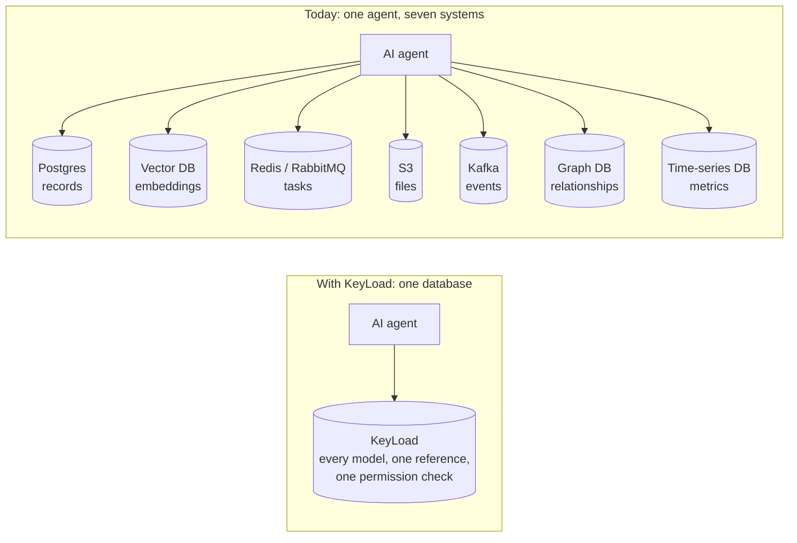
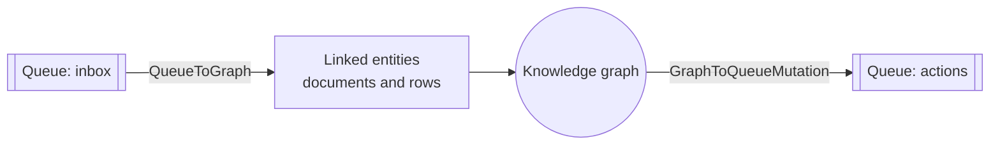
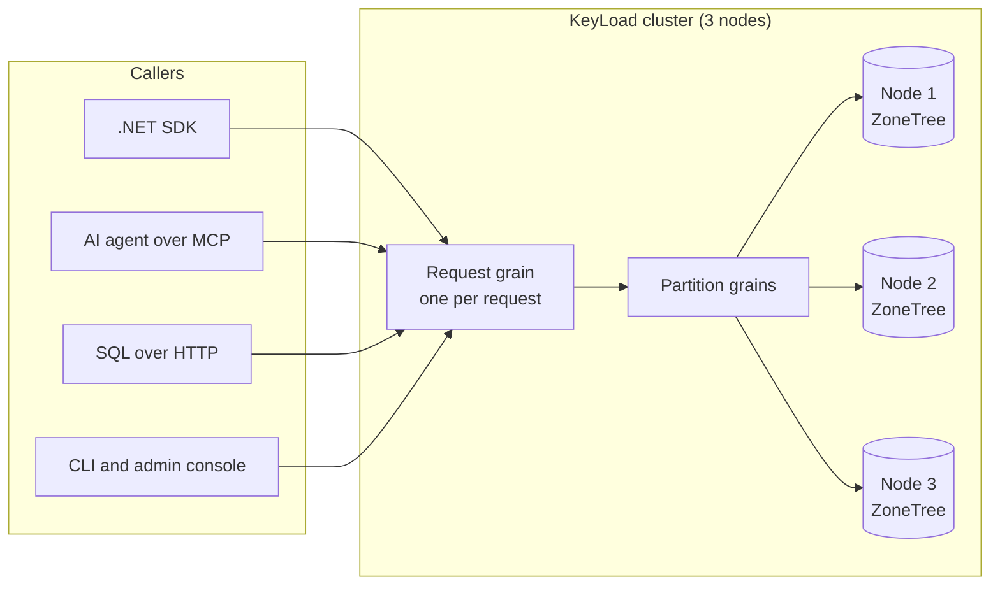
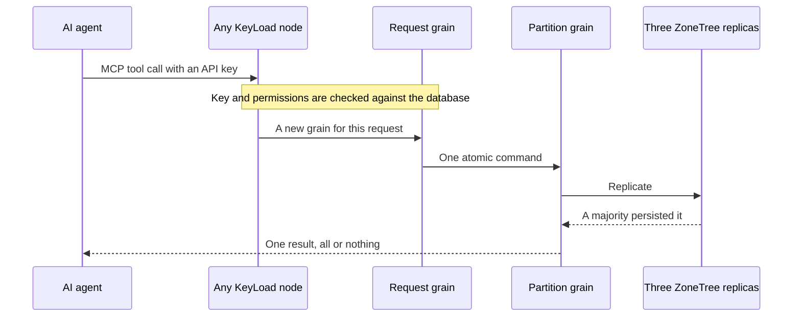

<p align="center">
  
</p>

<h1 align="center">KeyLoad</h1>

<p align="center">
  <strong>The AI-native database. One database for AI agents.</strong><br>
  Documents, typed tables, graphs, vectors/search, blobs, queues, events and time series in one replicated .NET cluster.<br>
  Everything links to everything else, and agents reach all of it through SQL, a built-in MCP server and a typed .NET SDK.
</p>

<p align="center">
  <a href="https://github.com/managedcode/KeyLoad/actions/workflows/build-and-tests.yml"></a>
  <a href="LICENSE"></a>
  
  
  
  
  
</p>

<p align="center">
  <a href="https://www.keyload.cloud/">Website</a> ·
  <a href="#quick-start">Quick start</a> ·
  <a href="#capability-matrix">Capabilities</a> ·
  <a href="#why-net-orleans-and-zonetree">Why .NET, Orleans and ZoneTree</a> ·
  <a href="docs/README.md">Docs</a> ·
  <a href="#project-status">Status</a>
</p>

---

## Why an AI-native database?

**Agents shouldn't need a dozen databases.** Yet an agent that needs memory and the ability to act can easily end up wired to seven: Postgres for records, a vector database for embeddings, Redis or RabbitMQ for tasks, S3 for files, Kafka for events, a graph database for relationships and a time-series database for metrics. Every one of them brings its own client, credentials, permission model, backups and failure modes. The agent, and your team, spend their time keeping seven copies of the truth in sync.



KeyLoad is an **AI-native database**: it's designed around how agents work, not bolted onto a database built for something else.

- **One reference for everything.** All models share canonical entity references. A queue message can point to a document, that document can be a node in a knowledge graph, and its files, embeddings and history stay attached to it.
- **One language.** SQL is the familiar shared language for querying and combining the models. Agents get the same operations as MCP tools, and applications get them through a typed .NET SDK.
- **One permission model.** API keys and access policies live in the database itself. Every call is checked, down to rows and fields, and neither clients nor prompts can grant themselves extra roles.
- **One atomic write.** A document, its event, a graph edge and the follow-up task in the same partition commit together, or not at all.
- **Limits on every operation.** Full scans must be requested explicitly, and every request has caps on work and memory, so a runaway request is rejected at its limit instead of running unbounded.
- **Replicated from day one.** The default server is a three-node cluster that keeps three copies of your data (RF3), on [Orleans](https://github.com/dotnet/orleans) with [ZoneTree](https://github.com/ZoneTree/ZoneTree) storage on each node.

### Why we think this is the future

Agents don't think in tables, queues or buckets. Picture a support agent handling a refund: it takes the ticket off a queue, loads the customer and the order, finds similar past cases with vector search, links the case into a knowledge graph, attaches the receipt and schedules a follow-up. Spread across separate systems, that one step turns into a distributed saga held together by glue code and stale copies, and the agent needs a key to every one of them.

When everything lives in one database, that step should become **one authorized operation**. Today its writes within one partition already commit atomically, while leased receives, blob uploads and cross-partition work are still separate steps. Our goal is that building context becomes one query instead of a join written in prompt code, and that access is one policy you can read. That's why we're building KeyLoad: so that nobody has to stand up and run a stack of databases just to let agents get work done.

KeyLoad is a development preview today: the [status section](#project-status) lists what works and what's still in progress. If you'd rather run one database than seven, **star the repo** to follow along, [try the quick start](#quick-start) and [open an issue](https://github.com/managedcode/KeyLoad/issues) describing the agent workload you want it to handle.

## What you can build

| You want to… | KeyLoad gives you |
|---|---|
| Give an agent long-term **memory and retrieval (RAG)** | Documents, files and embeddings in one place, with vector, full-text and hybrid search |
| Build a **knowledge graph** | Relationships between any entities, including typed rows, and graph traversal |
| Run **reliable agent workflows** | Queues with scheduling, leases, retries and dead letters, stored next to the data they change |
| Make **event-driven** apps | Ordered event history, durable subscriptions, change feeds and projections |
| Analyze **time series** | Timestamped samples, range reads, aggregates, time windows and retention |
| Store **files** for agents | Chunked uploads and partial reads of large blobs |

## One database, connected models

### Capability matrix

| Model | In one atomic commit | Read and query | SQL | MCP tools |
|---|---|---|---|---|
| 📄 Documents | ✅ Put, patch, delete with revision checks | Get by key, indexed queries, live queries | `SELECT` | `keyload_documents_*`, `keyload_query_*` |
| 🧾 Typed tables | ✅ Rows with a schema, primary keys and unique constraints | Indexed queries | `SELECT` | `keyload_documents_commit`, `keyload_sql_execute` |
| 🕸️ Graphs | ✅ Add and remove edges | Graph traversal | `CALL` | `keyload_graph_traverse` |
| 🧭 Vectors and search | ✅ Store a vector with its document | Exact vector, full-text and hybrid search | `CALL` | `keyload_search_execute` |
| 📬 Queues and topics | ✅ Enqueue, publish | Receive with leases, ACK, retries, dead letters, peek | `SELECT … FROM QUEUE_MESSAGES(…)` | `keyload_messages_*`, `keyload_subscriptions_*` for topics |
| 📜 Events | ✅ Append with an expected revision | Read, replay, durable subscriptions | `SELECT … FROM EVENTS(…)` | `keyload_streams_*`, `keyload_subscriptions_*` |
| 📈 Time series | ✅ Append samples | Ranges, latest value, aggregates, windows, retention | `CALL` | `keyload_series_*` |
| 📦 Files and blobs | Separate upload and publish steps | Chunked uploads, byte-range reads | `CALL` | `keyload_blobs_*` |
| 🔁 Change feeds | Document changes recorded in the same commit | Resumable change feed, projections | `CALL` | `keyload_changes_read`, `keyload_projections_*` |

`SELECT` reads data. `CALL` runs any operation from the same catalog the MCP server exposes, so every model is reachable from SQL.

### Models that work together

These aren't separate silos. Collections, tables and queues live in the same database and reference each other, so one request can work across models:

- **Queue to knowledge graph** (`QueueToGraph`). Reads ready messages from a queue, resolves their linked entities and writes the new knowledge-graph relationships.
- **Graph to queued actions** (`GraphToQueueMutation`). Follows graph relationships and can enqueue actions for each entity it finds.



**What the first version does.** The current composition API runs through .NET `CommitAsync`, SQL `CALL keyload_documents_commit(@arguments)` or the official MCP server:

- All data in one request must live in the same atomic partition and transaction domain, which is the `PartitionRef` you pass in. The whole batch succeeds or rolls back together.
- Reading a queue into the graph does not lease or ACK the messages, so they stay in the queue for their regular consumers.
- Blobs remain part of the same database, but use their separate upload and publication operations.
- KeyLoad is a development preview. Full declarative SQL, the native SQL-client protocol and cross-partition composition are still in development, and production guarantees remain under qualification.

The [composition guide](docs/Features/DatabaseComposition.md) and its [transaction contract](docs/ADR/ADR-067-composable-agent-database.md) cover the details.

## How it works



1. A caller sends an operation to any node, through the SDK, MCP, SQL or plain HTTP.
2. KeyLoad gives that request its own [Orleans](https://github.com/dotnet/orleans) grain, which calls only the database grains it needs.
3. Database grains route the work to the storage owner on each node. Storage stays on its node, even when Orleans moves grains around the cluster.
4. A write is acknowledged only after a majority of the three replicas has persisted it. If a node fails, the other two keep the acknowledged data.

Here's one agent tool call, end to end:



You'll find the full picture in the [architecture map](docs/Architecture.md).

## Why .NET, Orleans and ZoneTree

We picked a stack where the database, its cluster and its storage all run in one runtime, inside one process per node, with no glue in between.

**[.NET 10](https://github.com/dotnet/runtime): a fast, memory-efficient runtime.**
- `Span<T>`, pooled buffers and hardware intrinsics let hot paths avoid allocations and use SIMD. Vectorized paths are a priority workstream, and we'll publish measurements before claiming any speedup.
- One language end to end. The server, SDK, CLI, analyzers and tests are all C#.
- [Aspire](https://github.com/dotnet/aspire) orchestrates the whole three-node cluster, locally and in CI, from one AppHost.
- Open source, cross-platform and at home in Linux containers.

**[Orleans](https://github.com/dotnet/orleans): a cluster runtime that's proven in production.**
- Virtual actors (grains) that the cluster places, activates and moves for you. Orleans came out of Microsoft Research and has powered Halo's cloud services, among others.
- KeyLoad gives each request its own grain, so isolation, cancellation and backpressure work per request.
- Membership and failure detection are built in. KeyLoad also turns on Orleans' experimental distributed grain directory and activation repartitioning, which we're still qualifying.
- Fast generated binary serialization between nodes.

**[ZoneTree](https://github.com/ZoneTree/ZoneTree): storage that lives inside the node.**
- An embedded, persistent, ordered key-value engine written in C#. Data lives in each node's own process, with no extra network hop and no native interop.
- A write-ahead log on each node, and ordered keys for range scans and indexes.
- One storage engine under every model: documents, rows, graphs, vectors, queues, events, time series and blobs.
- [ZoneTree.FullTextSearch](https://github.com/ZoneTree/ZoneTree.FullTextSearch) adds the full-text index on the same foundation.

Together: **Orleans moves the routing, and ZoneTree keeps the data in place.** Storage never travels with a grain, so the cluster can rebalance work without copying files between nodes.

## Quick start

**You need:** the .NET SDK version pinned in [global.json](global.json), and Docker.

**1. Build the solution**

```bash
dotnet restore KeyLoad.slnx
```

```bash
dotnet build KeyLoad.slnx --no-restore --configuration Release
```

**2. Build the server image**

The cluster runs the server image pinned by its digest, so build it from source and push it to a local registry:

```bash
docker run -d --name keyload-registry -p 5050:5000 registry:3
```

```bash
docker build -t localhost:5050/keyload/server:dev . && docker push localhost:5050/keyload/server:dev
```

```bash
export KeyLoad__ContainerImages__Server="localhost:5050/keyload/server:dev@$(docker inspect --format '{{index .RepoDigests 0}}' localhost:5050/keyload/server:dev | cut -d@ -f2)"
```

**3. Start the three-node cluster**

```bash
dotnet run --project src/KeyLoad.AppHost --configuration Release --no-build
```

[Aspire](https://github.com/dotnet/aspire) starts three nodes at `http://localhost:5101`, `:5102` and `:5103`. Node data and your local development credentials are stored in `data/cluster/`, which git ignores. Keep that folder between restarts.

**4. Look around**

- Open **http://localhost:5101/admin** for the admin console.
- Or check the cluster from the CLI:

```bash
dotnet run --project src/KeyLoad.Cli --configuration Release --no-build -- status http://localhost:5101 data/cluster/local-profile.json
```

Your local admin API key is the `AdminKey` value in `data/cluster/local-profile.json`. Export it as `KEYLOAD_API_KEY` for the examples below.

## Use it

### From .NET

The [client SDK](src/KeyLoad.Client) gives you typed database operations. This creates a collection, writes an order and reads it back:

```csharp
using KeyLoad;
using KeyLoad.Client;

var apiKey = Environment.GetEnvironmentVariable("KEYLOAD_API_KEY")
    ?? throw new InvalidOperationException("Set KEYLOAD_API_KEY.");
using var http = new HttpClient { BaseAddress = new Uri("http://localhost:5101") };
var client = new KeyLoadClient(http, apiKey);

// tenant, database, transaction domain, partition key
var partition = new PartitionRef("acme", "shop", "orders", "customer-42");

var collection = await client.ConfigureResourceAsync(Guid.NewGuid(), new("acme", "shop",
    new ResourceDefinition("orders", ResourceKind.Collection, "orders")));
collection.ThrowIfFail();

var commandId = Guid.NewGuid(); // Reuse this ID if you retry the same write.
var result = await client.CommitAsync(new CommandRequest(commandId, partition,
[
    new PutDocument("orders", "order-1", "{\"status\":\"new\"}", ExpectedRevision: 0)
]));
result.ThrowIfFail();

var order = await client.GetAsync(new EntityRef(partition, "orders", "order-1"));
order.ThrowIfFail();
```

### With SQL

Use SQL to read data and to call any database operation:

```csharp
using System.Text.Json;

var rows = await client.ExecuteSqlAsync(new SqlOperationRequest(partition,
    "SELECT * FROM orders WHERE status = @status LIMIT 20",
    new() { ["status"] = JsonSerializer.SerializeToElement("new") },
    AllowFullScan: true));
rows.ThrowIfFail();
Console.WriteLine(rows.Value);
```

Here's what works today:

```sql
SELECT * FROM orders WHERE number BETWEEN 1 AND 9 ORDER BY id  -- filter and sort documents
SELECT * FROM QUEUE_MESSAGES('jobs')                           -- peek at a queue without consuming it
SELECT e.eventType FROM EVENTS('events', 'stream-a', 3) AS e   -- read event history
EXPLAIN SELECT * FROM orders                                   -- see the query plan
CALL keyload_documents_commit(@arguments)                      -- run any database operation
```

Model views (`QUEUE_MESSAGES`, `EVENTS`) and unindexed filters require `AllowFullScan: true`, and model views don't support cursors. Full SQL, including joins, is still in progress. The [query guide](docs/Features/QueryExecution.md) lists the supported syntax, and the [compatibility inventory](docs/implementation/sql-client-conformance.json) tracks the rest.

### From an AI agent (MCP)

Every node has a built-in [MCP](https://modelcontextprotocol.io/) server at `/mcp`. Its compact discovery entry lists `gateway_tools_search`, `gateway_tools_route` and `gateway_tool_invoke`. Our ManagedCode.MCPGateway uses the native Markdown-LD graph to find relevant database operations and return their exact schemas and effect hints. Add the server to an MCP client. In Claude Code's `.mcp.json`, for example:

```json
{
  "mcpServers": {
    "keyload": {
      "type": "http",
      "url": "http://localhost:5101/mcp",
      "headers": { "Authorization": "Bearer ${KEYLOAD_API_KEY}" }
    }
  }
}
```

Read the Markdown resource `keyload://guides/agent-quickstart` or request the no-argument prompt `keyload_agent_quickstart` for an introduction and usage instructions. Search with `gateway_tools_search` using `{ "query": "keyload_query_capabilities", "maxResults": 1 }`, inspect the returned tool schema, then call `gateway_tool_invoke` with `{ "toolId": "keyload_query_capabilities", "arguments": {} }`. Use the returned canonical argument shape for other operations; retain the same command identity and payload when retrying an uncertain write.

Discovery exposes static operation documentation. Each invocation checks current permissions persisted in the database, so neither a prompt nor caller-supplied roles can escalate them. The [MCP and API guide](docs/Features/ClientApi.md) describes canonical operations and `/v1/` HTTP routes. The [gateway integration contract](docs/Features/ClientApi/ToolDiscovery.md) records the open runtime, RF3 and delivery qualification gates for this discovery revision.

## Project status

> **KeyLoad is a development preview.** Try it, build with it and [tell us what breaks](https://github.com/managedcode/KeyLoad/issues), but don't trust it with production data yet.

The original 104-task plan has **3 fully accepted, 101 in progress and 0 pending**.
KL-075 now has its first scaling source stage; six-node, open-loop, shard-skew,
fanout, recovery and movement acceptance remains open. The joined stage has
passed the local Release build with zero analyzer errors and warnings. The
[original Linux run at 259a3fa5](https://github.com/managedcode/KeyLoad/actions/runs/37554329420/job/112576973966)
passed normal and scalar **2,765/2,765**, recovery **235/235** and same-job native
source/test-image identity verification, without skips. Later native codec and
captured-envelope criteria now close **KL-007**, with all19 mapped cases passing
in both modes and all33 owned source files bound to the original compiled images.
Original document **KL-010 CRUD/CAS** and **KL-012 batch/idempotency** acceptance
is also closed: unchanged product/test source is bound to original Linux reports
and compiled PDBs, including100 retries in each of two real processes. Their
five SDK/MCP/restart RF3 cases pass in both retained Linux reports and a fresh
local native Aspire/Docker run. This does not qualify the full RF3 cohort.
The newer cross-process ownership and read-cut regressions pass locally; their
task acceptance remains open. The [newer original Linux run at 6816ae91](https://github.com/managedcode/KeyLoad/actions/runs/37560457057/job/112596312154)
passed normal and scalar **2,767/2,767**, recovery **235/235** and same-job native
source/test-image identity checks. Its RF3 job was canceled near the original
60-minute aggregate budget without producing a completed RF3 report. That job
now has 180 minutes, with individual scenario deadlines and gates unchanged.
The [later Linux run at 57532cd5](https://github.com/managedcode/KeyLoad/actions/runs/37569205558/job/112623818966)
passed normal and scalar **2,769/2,769**, recovery **235/235**, and same-job
source/test-image checks. Its complete RF3 report records **131/141 passed,
10 failed**, with bootstrap admission exhaustion, a specific missing ACK grant
and separate startup/cancellation failures retained. The next source's Linux
normal/scalar reports each pass **2,770/2,771**; the sole failure is a test
expecting logger-selection rejection after image-provenance rejection, and
recovery passes **235/235**. That fixture correction remains pending.
Local Stage V fixes pass **99/99** owning unit operations in
each mode and the two real RF3 admission cases. SDK backup and dispatch also
pass their actual RF3 flows, including native archive restore and queue delivery,
replay/conflict/denial checks. Full current-source Linux/RF3 remains open.
All six unchanged native Aspire logger-control flows pass locally, including
caller cancellation and original task settlement; these model/logger controls
do not qualify Docker database execution. Six focused local Docker RF3 flows
pass through the real SDK and official MCP clients, covering native schema
discovery and autonomous saga timeout/replay. The owned image lifecycle also
passes prepare, verify, cleanup and repeated cleanup. Full Linux RF3,
functional coverage, scale and release qualification remain open. The
[implementation status](docs/implementation/status.json) records each
source and report boundary.

Functional coverage excludes load/comparison runs and admits complete operation
flows only. The current Query profile binds exactly 25 named cases and 103 source
files; fresh current-source coverage is pending. Scoped local KeyCodec coverage
records **202/203 executable lines** across three files, with all19 native cases
passing normal and scalar. Its branch coverage is unmeasured. The complete
sixteen-module/RF3-server cohort remains unmeasured. See the
[coverage contract](docs/Features/CodeQuality.md) for source/contributor binding,
native report preservation and complete-operation test requirements.

| Ready to try (in source, covered by tests) | Still in progress |
|---|---|
| Documents, typed rows, graphs, queues, events, time series, blobs and search behind one permission model | Full SQL (joins, foreign keys) and a native SQL client protocol |
| SQL `SELECT`, model views and `CALL`, plus the .NET SDK, MCP server and HTTP API | Combining data across partitions in one request |
| Queue ↔ graph composition within one partition | [Approximate vector search (ANN)](docs/Features/Search/ManagedAnn.md); vector search is exact for now |
| Three-node Orleans cluster, crash recovery, local backup and restore | Production, endurance and power-loss qualification |
| Admin console and CLI | |
| | The full performance comparison with other databases (current runs are on the [website](https://www.keyload.cloud/#benchmarks)) |

Full-text search comes from [ZoneTree.FullTextSearch](https://github.com/ZoneTree/ZoneTree.FullTextSearch). KeyLoad then ranks the results it finds and checks permissions on each one.

Native Orleans [runtime adoption](docs/Features/ClusterRouting/RuntimeAdoption.md)
and [journal-backed Durable Jobs](docs/Features/ClusterRouting/RuntimeJournal.md)
are being integrated. The source includes due-work wakeups, bounded telemetry,
local lifecycle ownership and saga timeout jobs; current-source build and runtime
qualification remain in progress. Native
job restart/adoption and real SDK/MCP RF3 fault qualification remain open.

Runtime timeouts, retries and resource limits use centrally validated typed options. The [configuration contract](docs/ADR/ADR-113-centralized-runtime-options.md)
also covers the SDK, CLI and Aspire host; complete build and runtime verification
of the current source remain pending.

For detailed status, see the [implementation tracker](docs/implementation/status.json) and the [qualification records](docs/implementation/). We publish performance numbers only from real GitHub Actions runs, on the [website](https://www.keyload.cloud/).

The [TimeProvider contract](docs/Features/ResourceExecution/TimeProvider.md)
supplies explicit clocks for timestamps, elapsed budgets and managed timers.
Controlled-time regressions and the remaining runtime qualification gates
are tracked in the feature specification.

Website publication runs independently in CI when source changes. It uses the newest completed benchmark run with a verified aggregate when available; otherwise it publishes the product site without performance figures. A completed benchmark run triggers a fresh website build. [ADR-112](docs/ADR/ADR-112-independent-website-publication.md) records the source, artifact and publication checks; the revised route still needs delivered-source Linux CI and Pages verification.

## FAQ

### What is an AI-native database?

A database designed around how AI agents work: every kind of agent data in one place, linked by shared references, reachable through MCP and SQL, with permissions an agent can't talk its way around. That's what KeyLoad is built to be.

### Is KeyLoad a vector database for .NET?

It includes vector search, but vectors don't sit in a separate store. They live next to the documents, graph, queues and files they belong to, and one request can use all of them. Vector search is exact today, and [approximate (ANN) search](docs/Features/Search/ManagedAnn.md) is in progress.

### Can KeyLoad be the memory layer for my agents?

That's the main use case. Documents, embeddings, files, a knowledge graph and event history live together, so long-term memory, retrieval (RAG) and the task queue share one store and one permission model.

### Does KeyLoad replace Postgres, Redis, Kafka or S3?

For agent workloads, that's the goal: one database instead of a stack of them. KeyLoad is still a development preview, so check the [project status](#project-status) before you move anything.

### How do AI agents connect?

Every node runs a built-in MCP server at `/mcp`. Point any MCP client at it with an API key, and the agent can use exactly the operations that key allows.

### Why build a database on Orleans?

Orleans already handles cluster membership, failure detection and request routing for .NET. KeyLoad gives every request its own grain, while ZoneTree keeps each node's data on that node. See [Why .NET, Orleans and ZoneTree](#why-net-orleans-and-zonetree).

### Can I use KeyLoad from Python, TypeScript or another language?

Yes, through MCP or the HTTP API under `/v1/`. The typed SDK is .NET for now.

### Is the KeyLoad source available?

Yes. KeyLoad is developed publicly on GitHub under the [Elastic License 2.0](LICENSE). You can use it in your own applications, including commercial production applications. Providing KeyLoad to third parties as a hosted or managed database service with access to a substantial set of its features requires separate authorization from ManagedCode. KeyLoad is source available.

### Can I run it in production?

Not yet. Endurance, fault and power-loss qualification are still in progress.

## Repository map

C# feature code uses `Features/<SliceName>/<Responsibility>/` throughout the solution,
including SDK, infrastructure, benchmarks and tests. For example, ClusterRouting keeps
`Grains`, `Commands`, `Queries`, `Contracts` and `Streaming` inside its own slice.
Shared primitives and composition entry points remain at project roots.

| Path | What's inside |
|---|---|
| [`src/KeyLoad.Server`](src/KeyLoad.Server) | The database server: HTTP API, MCP server and admin console |
| [`src/KeyLoad.Client`](src/KeyLoad.Client) | The .NET SDK |
| [`src/KeyLoad.Cli`](src/KeyLoad.Cli) | Command-line tool for operators and workers |
| [`src/KeyLoad.AppHost`](src/KeyLoad.AppHost) | Aspire host for the local cluster and every test suite |
| [`src/KeyLoad.Abstractions`](src/KeyLoad.Abstractions) | Shared public contracts |
| `src/KeyLoad.Core`, `Query`, `Orleans`, `Replication`, `Security`, `Storage.*` | Database engine, SQL, cluster, replication, permissions and storage |
| [`tests/`](tests) | Unit, crash-recovery, three-node and website tests ([TUnit](https://github.com/thomhurst/TUnit)) |
| [`benchmarks/`](benchmarks) | Comparisons with other databases, plus microbenchmarks |
| [`site/`](site) | Source for [keyload.cloud](https://www.keyload.cloud/) |
| [`docs/`](docs/README.md) | Architecture, feature specifications and design decisions |

## Contributing

CI runs native TUnit tests after building, with live Detailed output. TUnit fixtures start and dispose the real Aspire infrastructure. Pick a suite: `unit`, `unit-scalar`, `recovery`, `rf3`, `analyzers`, `comparison` or `site`.

```bash
node scripts/Features/TestInfrastructure/run-tests.mjs --KeyLoadTests:Suite=unit
```

```bash
dotnet format KeyLoad.slnx --verify-no-changes --no-restore
```

Benchmark measurements and their contract tests run exclusively in the separate Benchmarks pipeline, through TUnit and Aspire with real C# clients. The `rf3` suite starts a real three-node cluster in Docker and tests it through the .NET SDK and the official MCP client. Before your first change, read the [architecture map](docs/Architecture.md) and the feature spec in [`docs/Features/`](docs/Features). If you work with AI coding agents, [AGENTS.md](AGENTS.md) holds the repository rules.

## Credits

KeyLoad is developed by [Managed Code](https://www.managed-code.com/) and stands on the shoulders of these projects. Thank you to their authors and contributors.

| Project | How KeyLoad uses it |
|---|---|
| [.NET](https://github.com/dotnet/runtime) and [ASP.NET Core](https://github.com/dotnet/aspnetcore) | Server, client SDK and HTTP hosting |
| [Orleans](https://github.com/dotnet/orleans) | Distributed request execution, cluster routing and binary serialization |
| [ZoneTree](https://github.com/ZoneTree/ZoneTree) | Persistent ordered storage for every database model |
| [ZoneTree.FullTextSearch](https://github.com/ZoneTree/ZoneTree.FullTextSearch) | Full-text search index |
| [MCP C# SDK](https://github.com/modelcontextprotocol/csharp-sdk) | Built-in MCP server and real MCP clients in tests |
| [ManagedCode.Communication](https://github.com/managedcode/Communication) | Typed operation results and ASP.NET Core/Orleans integration |
| [ManagedCode.Storage](https://github.com/managedcode/Storage) | File-system storage and backup transfer support |
| [ManagedCode.TimeSeries](https://github.com/managedcode/TimeSeries) | Time-series aggregation |
| [ManagedCode.Orleans.Graph](https://github.com/managedcode/Orleans.Graph) | Grain call relationship policies |
| [Cartograph](https://github.com/angelhernandezm/Cartograph) | Segmented backup archives and catalogs |
| [OpenTelemetry .NET](https://github.com/open-telemetry/opentelemetry-dotnet) | Logs, metrics and traces |

Development and presentation also use [Aspire](https://github.com/dotnet/aspire) for Docker orchestration, [TUnit](https://github.com/thomhurst/TUnit) for tests, [Roslyn](https://github.com/dotnet/roslyn) for the repository's own code analyzers, [BenchmarkDotNet](https://github.com/dotnet/BenchmarkDotNet) for microbenchmarks, and [Three.js](https://github.com/mrdoob/three.js) for the website's cluster illustration. The benchmark suite compares KeyLoad with the free community editions of [PostgreSQL](https://github.com/postgres/postgres) with [pgvector](https://github.com/pgvector/pgvector), [TimescaleDB](https://github.com/timescale/timescaledb), [MongoDB](https://github.com/mongodb/mongo), [Redis](https://github.com/redis/redis), [RabbitMQ](https://github.com/rabbitmq/rabbitmq-server), [KurrentDB](https://github.com/kurrent-io/KurrentDB), [Neo4j](https://github.com/neo4j/neo4j), [Qdrant](https://github.com/qdrant/qdrant), [SurrealDB](https://github.com/surrealdb/surrealdb), [HelixDB](https://github.com/helixdb/helix-db) and [OpenSearch](https://github.com/opensearch-project/OpenSearch), connecting through the official clients [Npgsql](https://github.com/npgsql/npgsql), [MongoDB .NET Driver](https://github.com/mongodb/mongo-csharp-driver), [StackExchange.Redis](https://github.com/StackExchange/StackExchange.Redis), [RabbitMQ .NET Client](https://github.com/rabbitmq/rabbitmq-dotnet-client) and [KurrentDB .NET Client](https://github.com/kurrent-io/KurrentDB-Client-Dotnet).

The active comparison scale is 100,000 and 1,000,000 records for every database. The [vector qualification contract](docs/Features/BenchmarkComparisons/VectorQualification.md) covers exact and native approximate search, filtered queries, concurrent index updates, recall@k, index construction cost, p95/p99 and separately observed database RAM. New adapter and pipeline source is in progress; these additions do not yet have qualified original GitHub measurements.

## License

KeyLoad is licensed under the [Elastic License 2.0](LICENSE). Use it in your own applications; contact [ManagedCode](https://www.managed-code.com/) for authorization to offer it as a hosted or managed database service to third parties. Dependency licenses remain with their respective owners.

---

<p align="center">Developed by <a href="https://www.managed-code.com/">Managed Code</a></p>
