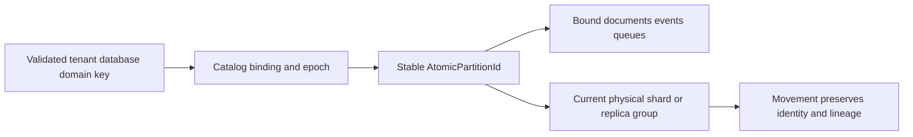

# ADR-001: Atomic partition identity and affinity

Status: Accepted; implementation and GitHub qualification pending. Related product source: [architecture sections 4, 18, 28, 37, and 41](../design/architecture-v0.3.uk.md).

## Context

Document, event, queue, graph, and series operations need a stable atomic scope. Textually equal partition keys in different tenant, database, or transaction-domain bindings must not authorize shared state. Physical node/shard placement changes independently from logical atomic identity.

## Decision

Resolve one `AtomicPartitionId` from the server-validated tenant, database, `TransactionDomainId`, and versioned partition key. Catalog resource bindings determine whether resources participate in that domain. The client cannot select an arbitrary physical node or make unrelated resources atomic by reusing a key string. An atomic partition may be packed with others in a physical shard; movement preserves its logical identity and committed lineage.

## Rationale, alternatives, consequences

This makes authorization, command routing, transaction scope, and idempotency agree. Per-resource independent identity would prevent required document/event/local-queue transactions; using a raw key string globally would leak state across domains. A partition-per-engine/grain model is also rejected because it couples logical cardinality to physical resources. Catalog binding and physical movement are correctness-critical; movement must preserve unique constraints and command/read tokens or reject the operation.

## Related requirements

`REQ-DSTORE-004`/`AC-DSTORE-004`, `REQ-MSG-005`/`AC-MSG-005`, and `REQ-GRAPH-001`/`AC-GRAPH-001`; see [DocumentStorage](../Features/DocumentStorage.md), [Messaging](../Features/Messaging.md), and [GraphTraversal](../Features/GraphTraversal.md). Cluster routing and placement requirements remain in [ClusterRouting](../Features/ClusterRouting.md) and [ClusterReplication](../Features/ClusterReplication.md).

## Implementation contract

1. Freeze canonical identity fields, catalog binding validation, movement fixtures, and token lineage before changing routing.
2. Add real tests for cross-domain key reuse, valid shared resources, authorization, stable command scope, and split/movement boundaries.
3. Implement in `src/KeyLoad.Abstractions/Features/ClusterRouting/` and `src/KeyLoad.Core/Features/ClusterRouting/`; route via the owning Orleans request/partition grains. Preserve the current node-local `PartitionHost` ownership of stores and locks.
4. Create resources under the canonical catalog binding and reject ambiguous or absent bindings. A physical move fences the current owner, publishes only after a verified catalog/ownership epoch and complete committed cut, and returns to that owner on rollback only while its state remains complete and fenced.
5. GitHub Actions must run TUnit, recovery, and Aspire RF3 through .NET and MCP SDKs; compare stable outcomes across failover and movement. Root owns shared resolver/contracts; worker joins only after exact tests and changed paths are reported.

Dependencies: [ADR-002](ADR-002-command-idempotency.md), [ADR-004](ADR-004-committed-read-views.md), [ADR-005](ADR-005-canonical-keyspace-codec.md), [ADR-007](ADR-007-replica-consensus-bootstrap.md), and [ADR-016](ADR-016-atomic-physical-placement.md). Verification: named catalog tests plus the repository GitHub CI matrix; no local test qualification. Stop if a source binding, token lineage, or multi-resource atomic scope is ambiguous; do not add a physical-placement shortcut.

