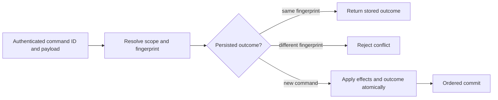

# ADR-002: Command identity and persisted idempotency

Status: Accepted; implementation and GitHub qualification pending. Source contract: `CommandRequest`, `CommandOutcome`, and `CommitReceipt` in `src/KeyLoad.Abstractions/Contracts.cs`; product source [sections 5, 38, and 41](../design/architecture-v0.3.uk.md).

## Context and decision

Network retries can repeat a request after its outcome committed but before the client received the response. Every mutating command therefore has a stable caller-generated `CommandId`, scoped to its authenticated principal and resolved atomic partition. The server fingerprints canonical command content and persists the outcome in the same ordered transaction as its effects. Matching retries return the stored receipt/error; reuse with a different fingerprint is a conflict. Event and message identities provide resource-level deduplication with their own declared retention horizons; they do not replace command identity.

## Rationale and consequences

Persisting command identity with effects resolves lost responses across process restart and leader change. An in-memory response cache cannot do so. Fingerprinting raw noncanonical JSON or omitting principal/scope could alias distinct requests, so canonicalization and authorization precede replay. Deduplication is bounded by persisted retention/format rules; this decision does not promise eternal retry safety after dedup metadata expires or exactly-once external side effects.

## Related requirements

`REQ-DSTORE-004`/`AC-DSTORE-004`, `REQ-MSG-002`/`AC-MSG-002`, `REQ-MSG-005`/`AC-MSG-005`, plus EventStreams `REQ-EVENT-004`/`AC-EVENT-004` (append OCC/idempotency extension owned by the integration lead). See [DocumentStorage](../Features/DocumentStorage.md) and [Messaging](../Features/Messaging.md).

## Implementation contract

1. Freeze command fingerprint inputs, principal/scope binding, error replay, and retention horizon before changing envelopes.
2. Add TUnit tests for same-ID/same-content replay, same-ID/changed-content conflict, lost response after commit, precondition failure replay, and unrelated principal/partition scope.
3. Keep shared command/request/outcome contracts in the existing `src/KeyLoad.Abstractions/Contracts.cs` building block and dispatch/persisted outcome handling in `src/KeyLoad.Core/DatabaseEngine.cs`; feature-specific mutation logic remains in its canonical owning `Features/<SliceName>/` directory. Do not create a separate CommandExecution slice or project.
4. The current outcome format has one canonical reader and writer. Unknown, malformed, or unsupported outcomes fail closed without rewrite or alternate-key lookup.
5. GitHub qualification is TUnit, real process recovery, and RF3 SDK outcomes after leader change. Root owns shared command contracts; feature owners join with fingerprint vectors and named test evidence.

Dependencies: [ADR-001](ADR-001-partition-identity-affinity.md), [ADR-003](ADR-003-durability-ack-barrier.md), [ADR-004](ADR-004-committed-read-views.md), [ADR-005](ADR-005-canonical-keyspace-codec.md), and [ADR-016](ADR-016-atomic-physical-placement.md). Stop if canonical fingerprint or dedup expiry behavior is not specified. Do not infer exactly-once handler execution or include an external API call in the database transaction.

## TASK-DSTORE-COMMAND-100-RESTART implementation contract

TASK-DSTORE-OUTCOME-MATRIX maps REQ-DSTORE-007 / AC-DSTORE-007 to actual persisted
precondition-error replay and independent authenticated-principal tests in
UnitTests/Features/DocumentStorage. Root freezes the literal error, document,
revision and outbox oracles; query_wave owns only the new cases/helpers. This
stage changes no outcome format, canonical key or public API. Current source
uses the accepted full-scope v2 outcome and locator keys below, with independent
principal, Global/Unknown and complete resolved-partition identity. Actual
partition/reopen/RF3 cases supplement principal isolation; one scope cannot
stand in for another.

Current command outcomes have no automatic TTL or purge implementation. A
matching authorized retry resolves its retained canonical outcome in the same
store incarnation. This does not promise a finite minimum retention period,
eternal replay after explicit store/record removal, or replay across a changed
incarnation; an existing outcome from another incarnation is TokenInvalidated.
Expiry, purge, a minimum temporal horizon, and outcome-format changes require
a separately accepted current-product contract before implementation.

REQ-DSTORE-006 / AC-DSTORE-006 and original KL-012 require two actual CrashHost
processes over one owned native ZoneTree store. The first commits one authorized
document/event/queue batch, verifies exactly one hundred matching retries and
changed-content Conflict, captures the original complete receipt as bounded test
evidence, and waits at the existing real process-kill handshake. The parent kills
and joins that child. A distinct second process opens the same store and verifies
one hundred more matching retries, the retained authorized outcome, unchanged
receipt and single effects, changed-content Conflict and healthy follow-up.
Evidence sidecars are never canonical recovery authority. Physical commit/log
position may advance on replay; the original receipt, domain effects and outbox
cut must remain exact. A runner-only close/reopen is not process-restart proof,
and process kill is not power-loss qualification.

Ordered ownership: root freezes this contract and owns the minimal mode dispatch
join in `tests/KeyLoad.CrashHost/Features/StorageRecovery/Helpers/CrashHostApplication.cs`.
The query worker owns new scenario/helper files only under CrashHost and
RecoveryTests `Features/DocumentStorage/`; one canonical DocumentStorage slice
applies on both surfaces. Root reviews, joins, runs the actual Aspire recovery
entry, retains original artifacts and updates KL-012. No new project, public API,
serializer/fingerprint change, TTL path or copied database implementation is in
scope. Root retains the required exact-source Linux recovery and RF3 gates.

The existing real CrashHost recovery and C1 inspection helpers must inspect the
actual private native outcome records and scoped keys, rather than infer durable
state from caller evidence. Core grants internal visibility to the named
`KeyLoad.CrashHost` assembly alongside its existing UnitTests and RecoveryTests
friends in `Features/InternalSerialization/Execution/CoreTestVisibility.cs`.
This test-only compile join preserves AC-DSTORE-006, the existing C1 inspection
contract, private production records, scoped-key bytes and public APIs. Its
verification remains the original full Aspire recovery and RF3 flows; no
accessor-only regression or fabricated outcome is introduced.

## Accepted scoped command-outcome contract, 2026-10-05

REQ/AC-DSTORE-009 and TASK-DSTORE-SCOPED-OUTCOMES-001..004 in
[DocumentStorage](../Features/DocumentStorage.md) freeze the complete atomic
partition identity in persisted command-outcome lookup. Current command writes
use the accepted outcome representation; every lookup is bound to its normalized
operation, authenticated principal, and complete partition scope. Public
principal/ID-only result or key access is not an accepted path.

The current contract rejects a missing or contradictory locator, malformed
record, duplicate scoped identity, or unsupported outcome without rewriting
persisted bytes, searching an alternate key, or deriving identity from a hash.
The current `Unknown` scope represents a normalized operation that failed before
partition resolution. Its matching, freshly authorized retry replays only that
same failed operation; it never invents partition authority or permits effects.
Unknown scope values and contradictory identities fail closed. New commands use the
canonical current identity and outcome representation. Ordered source ownership
and the real unit, scalar, process-recovery, restart, and RF3 cases remain mapped
in the feature contract; root owns shared joins and actual qualification. This
section records the current behavior contract and does not claim gate completion.

## Original KL-012 task acceptance, 2026-10-07

The implementation and original KL-012 batch/idempotency acceptance are
qualified by the exact source/PDB-matched Linux reports and current native RF3
refresh in TASK-DSTORE-KL010-KL012-CLOSEOUT under
[DocumentStorage](../Features/DocumentStorage.md). The original two distinct
CrashHost processes each verify100 matching retries, one complete effect cut,
changed-content Conflict and a healthy follow-up; source and the original235/235
recovery report match. The stated retention window is the current retained
canonical record in the same incarnation with fresh persisted authorization;
no automatic TTL/purge or finite-expiry policy is implemented. Public SDK/MCP
full-partition replay and owned restart also pass. This task-local result does
not mark the complete DocumentStorage/Messaging/EventStreams feature contracts,
full Linux RF3, coverage, endurance, external effects or power-loss durability
qualified. This ADR remains Accepted while its broader feature gates are open.
