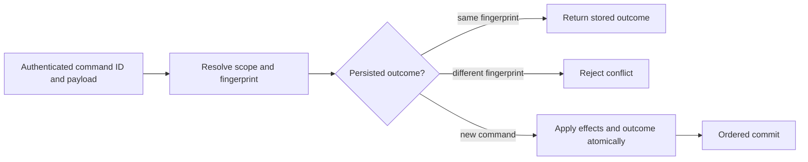

# ADR-002: Command identity and persisted idempotency

Status: Accepted; implementation and GitHub qualification pending. Source contract: `CommandRequest`, `CommandOutcome`, and `CommitReceipt` in `src/KeyLoad.Abstractions/Contracts.cs`; product source [sections 5, 38, and 41](../design/architecture-v0.3.uk.md).

## Context and decision

Network retries can repeat a request after its outcome committed but before the client received the response. Every mutating command therefore has a stable caller-generated `CommandId`, scoped to its authenticated principal and resolved atomic partition. The server fingerprints canonical command content and persists the outcome in the same ordered transaction as its effects. Matching retries return the stored receipt/error; reuse with a different fingerprint is a conflict. Event and message identities provide resource-level deduplication with their own declared retention horizons; they do not replace command identity.

## Rationale and consequences

Persisting command identity with effects resolves lost responses across process restart and leader change. An in-memory response cache cannot do so. Fingerprinting raw noncanonical JSON or omitting principal/scope could alias distinct requests, so canonicalization and authorization precede replay. Deduplication is bounded by persisted retention/format rules; this decision does not promise eternal retry safety after dedup metadata expires or exactly-once external side effects.

## Related requirements

`REQ-DSTORE-004`/`AC-DSTORE-004`, `REQ-MSG-002`/`AC-MSG-002`, `REQ-MSG-005`/`AC-MSG-005`, plus EventStreams `REQ-EVENT-004`/`AC-EVENT-004` (append OCC/idempotency extension owned by the integration lead). See [DocumentStorage](../Features/DocumentStorage.md) and [Messaging](../Features/Messaging.md).

## Implementation contract

1. Freeze command fingerprint inputs, principal/scope binding, error replay, and retention horizon before changing envelopes.
2. Add TUnit tests for same-ID/same-content replay, same-ID/changed-content conflict, lost response after commit, precondition failure replay, and unrelated principal/partition scope.
3. Keep shared command/request/outcome contracts in the existing `src/KeyLoad.Abstractions/Contracts.cs` building block and dispatch/persisted outcome handling in `src/KeyLoad.Core/DatabaseEngine.cs`; feature-specific mutation logic remains in its canonical owning `Features/<SliceName>/` directory. Do not create a separate CommandExecution slice or project.
4. The current outcome format has one canonical reader and writer. Unknown, malformed, or unsupported outcomes fail closed without rewrite or alternate-key lookup.
5. GitHub qualification is TUnit, real process recovery, and RF3 SDK outcomes after leader change. Root owns shared command contracts; feature owners join with fingerprint vectors and named test evidence.

Dependencies: [ADR-001](ADR-001-partition-identity-affinity.md), [ADR-003](ADR-003-durability-ack-barrier.md), [ADR-004](ADR-004-committed-read-views.md), [ADR-005](ADR-005-canonical-keyspace-codec.md), and [ADR-016](ADR-016-atomic-physical-placement.md). Stop if canonical fingerprint or dedup expiry behavior is not specified. Do not infer exactly-once handler execution or include an external API call in the database transaction.

## TASK-DSTORE-COMMAND-100-RESTART implementation contract

TASK-DSTORE-OUTCOME-MATRIX maps REQ-DSTORE-007 / AC-DSTORE-007 to actual persisted
precondition-error replay and independent authenticated-principal tests in
UnitTests/Features/DocumentStorage. Root freezes the literal error, document,
revision and outbox oracles; query_wave owns only the new cases/helpers. This
stage changes no outcome format, canonical key or public API. Current source
uses the accepted full-scope v2 outcome and locator keys below, with independent
principal, Global/Unknown and complete resolved-partition identity. Actual
partition/reopen/RF3 cases supplement principal isolation; one scope cannot
stand in for another.

Current command outcomes have no automatic TTL or purge implementation. A
matching authorized retry resolves its retained canonical outcome in the same
store incarnation. This does not promise a finite minimum retention period,
eternal replay after explicit store/record removal, or replay across a changed
incarnation; an existing outcome from another incarnation is TokenInvalidated.
Expiry, purge, a minimum temporal horizon, and outcome-format changes require
a separately accepted current-product contract before implementation.

REQ-DSTORE-006 / AC-DSTORE-006 and original KL-012 require two actual CrashHost
processes over one owned native ZoneTree store. The first commits one authorized
document/event/queue batch, verifies exactly one hundred matching retries and
changed-content Conflict, captures the original complete receipt as bounded test
evidence, and waits at the existing real process-kill handshake. The parent kills
and joins that child. A distinct second process opens the same store and verifies
one hundred more matching retries, the retained authorized outcome, unchanged
receipt and single effects, changed-content Conflict and healthy follow-up.
Evidence sidecars are never canonical recovery authority. Physical commit/log
position may advance on replay; the original receipt, domain effects and outbox
cut must remain exact. A runner-only close/reopen is not process-restart proof,
and process kill is not power-loss qualification.

Ordered ownership: root freezes this contract and owns the minimal mode dispatch
join in `tests/KeyLoad.CrashHost/Features/StorageRecovery/Helpers/CrashHostApplication.cs`.
The query worker owns new scenario/helper files only under CrashHost and
RecoveryTests `Features/DocumentStorage/`; one canonical DocumentStorage slice
applies on both surfaces. Root reviews, joins, runs the actual Aspire recovery
entry, retains original artifacts and updates KL-012. No new project, public API,
serializer/fingerprint change, TTL path or copied database implementation is in
scope. Root retains the required exact-source Linux recovery and RF3 gates.

The existing real CrashHost recovery and C1 inspection helpers must inspect the
actual private native outcome records and scoped keys, rather than infer durable
state from caller evidence. Core grants internal visibility to the named
`KeyLoad.CrashHost` assembly alongside its existing UnitTests and RecoveryTests
friends in `Features/InternalSerialization/Execution/CoreTestVisibility.cs`.
This test-only compile join preserves AC-DSTORE-006, the existing C1 inspection
contract, private production records, scoped-key bytes and public APIs. Its
verification remains the original full Aspire recovery and RF3 flows; no
accessor-only regression or fabricated outcome is introduced.

## Accepted scoped command-outcome contract, 2026-10-05

REQ/AC-DSTORE-009 and TASK-DSTORE-SCOPED-OUTCOMES-001..004 in
[DocumentStorage](../Features/DocumentStorage.md) freeze the complete atomic
partition identity in persisted command-outcome lookup. Current command writes
use the accepted outcome representation; every lookup is bound to its normalized
operation, authenticated principal, and complete partition scope. Public
principal/ID-only result or key access is not an accepted path.

The current contract rejects a missing or contradictory locator, malformed
record, duplicate scoped identity, or unsupported outcome without rewriting
persisted bytes, searching an alternate key, or deriving identity from a hash.
The current `Unknown` scope represents a normalized operation that failed before
partition resolution. Its matching, freshly authorized retry replays only that
same failed operation; it never invents partition authority or permits effects.
Unknown scope values and contradictory identities fail closed. New commands use the
canonical current identity and outcome representation. Ordered source ownership
and the real unit, scalar, process-recovery, restart, and RF3 cases remain mapped
in the feature contract; root owns shared joins and actual qualification. This
section records the current behavior contract and does not claim gate completion.

## Original KL-012 task acceptance, 2026-10-07

The implementation and original KL-012 batch/idempotency acceptance are
qualified by the exact source/PDB-matched Linux reports and current native RF3
refresh in TASK-DSTORE-KL010-KL012-CLOSEOUT under
[DocumentStorage](../Features/DocumentStorage.md). The original two distinct
CrashHost processes each verify100 matching retries, one complete effect cut,
changed-content Conflict and a healthy follow-up; source and the original235/235
recovery report match. The stated retention window is the current retained
canonical record in the same incarnation with fresh persisted authorization;
no automatic TTL/purge or finite-expiry policy is implemented. Public SDK/MCP
full-partition replay and owned restart also pass. This task-local result does
not mark the complete DocumentStorage/Messaging/EventStreams feature contracts,
full Linux RF3, coverage, endurance, external effects or power-loss durability
qualified. This ADR remains Accepted while its broader feature gates are open.

## TASK-EVENT-APPEND-SEEDED-CRASH-001 implementation contract

Accepted private scope; implementation/qualification pending. Canonical requirements and exact AC-EVENT-CRASH-001/002 are frozen in [EventStreams](../Features/EventStreams.md#task-event-append-seeded-crash-001), covering original KL083/KL091 plus REQ-MSG-005/AC-MSG-005 and REQ/AC-STORAGE-006/007. This is an additive current-format test mode, not a product seam or new storage contract.

1. Freeze the seeded same-domain doc+Exact1 append+queue command and seven original pre/post-commit/apply cuts before implementation.
2. CrashHost/EventStreams/Contracts and Helpers implement scenario/data; root joins its one existing CrashHostApplication dispatch arm. RecoveryTests/EventStreams/Cases, Processes and Assertions implement genuine native child kill/join/reopen and literal complete-prefix/receipt/replay/healthy flow. Reuse actual CanonicalCrashBoundary and bounded CommandIdempotencyProcessChild original readers/exit; no output-hook replacement or after-ACK substitute.
3. Root verifies source guards, unchanged original modes/serialization/options, complete original child and store-lock joins, numeric400/200/64/depth3 limits, then formats/builds and executes the exact seven new cases and full native recovery. Retain exact CrashHost DLL/PDB/source/runtime identities, native arguments/marker/cut/index/exit/readers and original reports. New output does not qualify an unexecuted gate.
4. Mandatory Linux exact-SHA full normal/scalar/recovery/RF3/coverage gates remain unchanged. No migration, dependency, trust, public protocol or deadline changes. Rollback removes the additive mode/cases and linked task contracts only. Root owns private-packet join and final gates; no parallel shared writer.

### TASK-AUTH-DENIED-REPLAY-CLOCK-001

REQ-AUTH-008, original ADR002 same-ID outcome contract and TASK-BACKUP-EVENTING-CUT-001 require current authorization to be checked before outcome reuse, while an unreplicated authorization-denied retry of a retained same command must not append another clock-only native commit. A concrete current source path authorizes before outcome selection; denial retains ForNew/persistOutcome=true, skips overwriting an existing outcome, but stages equal ClockBytes. Native ZoneTree staged writes are real journal changes. Thus repeated denied native calls advance the store position despite unchanged immutable receipt.

Freeze before correction: reuse the existing one outcome-key presence read in PersistCommandOutcome. If a previously stored key exists and replicationIndex is nonpositive, the denial has no staged domain effect; preserve current error/current policy checks and immutable outcome and return before clock staging. New rejected IDs still persist failure outcome/clock exactly once. Supplied positive replicated indexes retain original applied watermark and supplied-time clock staging unchanged, including distinct log entries that share an ID. Do not return old success after revoked permissions or weaken authorization, fingerprints/incarnation, compiled validation or token/placement checks. No storage/public/serializer format changes.

Ownership: shared Core AtomicCommandCommit.PersistCommandOutcome only; new UnitTests Authorization real native denial/replay/replicated-apply metadata/healthy flow, plus BackupRestore eventing administrator-resume denial. Before execution, root reviews exact guards, build/analyzers/format and actual full normal/scalar/recovery/RF3 Linux gates. Literal expected native positions/outcomes and full stored bytes—not implementation getters—prove unchanged embedded replay, positive supplied index advancement and healthy effects. Source review is not runtime proof or consensus qualification. Rollback removes this correction and these task contracts/regressions coherently.

AC-AUTH-REPLAY-001 has two native arguments (same evaluatedAt / later trusted evaluatedAt). CommandFingerprint freezes Id/Kind/PrincipalId/PayloadJson, explicitly excluding evaluatedAt; the tests supply actual typed trusted native operation time without substituting a clock provider or waiting. The original ADR002 permission that physical commit position may advance is retained for positive replica indexes and broader historical work; this owner-authorized task tightens only unreplicated, already-retained, no-effect authorization rejection. The native regression independently asserts current exact PermissionDenied, one failure/clock commit, immutable full-store bytes under both same-ID times, then genuine Apply indexes1/2 with exact applied watermark and supplied clock, unchanged original outcome bytes, already-applied-index idempotence and a new authorized document operation. It is not RF3 consensus proof.

The native removed-grant case also first commits a real writer document, removes its persisted grant with the next exact policy epoch, then repeats the original identity and payload with later trusted time: current PermissionDenied, immutable original success receipt, unchanged complete store bytes/position, and a healthy root revision update are required.

### TASK-KL011-COMPOSITE-RANGE-PROCESS-001

REQ-DSTORE-002 / AC-DSTORE-002 and new AC-DSTORE-COMPOSITE-PROCESS-001: preserve original KL011 equality/range/composite/partition-unique scope. A real four-process CrashHost matrix verifies inserted, replaced, patched, deleted and tombstoned documents, complete composite/ordered-score/unique native index images in two atomic partitions, literal membership and native exclusive-after-key ranges. Composite equality must report the genuine declared composite index; native range Scan proof is distinct from KL013 query-planner inequality seeks. A mixed document/event/enqueue unique conflict must roll back every effect; its original persisted failure and successful acknowledged receipt replay unchanged after crash with complete store-byte and position invariance. A fresh command follows recovery and a fourth reopen preserves it.

Reuse original JournalFlushed cut, acknowledged first kill, original child stdout/stderr and joined cleanup/deadlines. Parent literal tuples are independent of observed index values; native public KeySpace encodes the specified literal keys, never calls the index mutation implementation. No provider doubles, fallback, retry-until-pass, power-loss or closure claim. Existing scalar scenario is untouched. Ownership: CrashHost DocumentStorage Contracts/Scenarios owns new current-format private modes; Recovery DocumentStorage Cases/Helpers/Assertions owns actual process orchestration and independent oracle; only existing CrashHost application adds closed dispatch. Source-only packet requires full strict build, native discovery, focused process matrix and original full Linux recovery plus unchanged normal/scalar/RF3 gates. ADR002 owns command replay; ADR011 owns atomic journal/recovery.

### Original bounded task scope qualified at556c — 2026-10-09

This scoped closeout accepts the original architecture task predicates at exact
[source556c13ab](https://github.com/managedcode/KeyLoad/tree/556c13ab78c839df68b09dce1e9fc92bef576bfe),
[run37891957916 attempt1](https://github.com/managedcode/KeyLoad/actions/runs/37891957916).
It does not qualify the subsequently changed source. Every original API/ZIP digest,
confined extracted file, raw native discovery UID/class/constructor/method/display/
parameter/source identity, complete no-skip TRX/counters, source/PDB/Git hash and
prepared/before/after image was authenticated. Original native20 argument, strict
normal-null/scalar0 caller environment, child exits/readers/disposal and same-job
source verification passed. No job-status inference or synthetic report is used.

KL011 normal and scalar each executed the exact16-case union without failures
or skips:11 native Unit, one mixed transaction conflict, one honestly ordinary
MCP-envelope control, two genuine process scenarios and one complete Aspire RF3
SDK/official MCP flow. REQ/AC-DSTORE-002, AC-DSTORE-INDEX-PROCESS-001,
AC-DSTORE-COMPOSITE-PROCESS-001, AC-DSTORE-COMPOSITE-SPARSE-001 and
AC-DSTORE-COMPOSITE-RF3-001 now bind scalar/composite equality and native ordered
range images to independent reference models after insert/replacement/patch/
delete/tombstone/crash. All four null/missing inclusion combinations retain exact
unique scope; conflict atomically rolls back document/index/event/enqueue effects.
The real RF3 flow preserves full literal membership/cuts and original receipts,
delete/key reuse across different IDs, equal keys in distinct atomic partitions,
persisted grant denial/no value and restoration with healthy stable retry.
Declared native range scans do not claim unsupported inequality planner seeks.

Normal job113694642562 artifact11599100919 ZIP SHA
`62156129bd5a1371059aa8e740871e44ba133b2b025e75b5ca52d2fe2d813ec6`;
scalar job113694642694 artifact11599665304 ZIP SHA
`30d7d2a573f48cd102f9d6db44880c823ca00c81895cac4cad3e4c776814c408`.
Each genuine server image is exact-source/run/attempt bound; original fixture
cleanup and owned registry removal passed. The envelope control remains ordinary
and contributes no product coverage. Original canonical receipts/source images
are retained unchanged; later dirty source is not promoted by these results.

All existing mandatory full-feature/source-suite/coverage/RF3 and separate
endurance/performance/power-loss gates remain OPEN or retain their own authentic
status; this closes only the stated original bounded task predicates. It neither
waives their contracts nor claims broad StorageRecovery/DocumentStorage/product
readiness. Current source repairs and additional feature requirements require
fresh exact-source evidence. Root alone joins durable status/README provenance.

## TASK-EVENT-APPEND-RF3-001 — original KL083 public whole flow

REQ-EVENT-004/005 and AC-EVENT-004/005 retain the current expected-revision,
stream-generation EventId identity and same-command replay contracts. The new
AC-EVENT-APPEND-RF3-001 requires one actual Aspire RF3 flow through the .NET SDK
and official MCP SDK: the existing literal three-event NoStream seed; exact
NoStream refusal, same-command changed-content Conflict, changed EventId Conflict,
partial-duplicate DuplicateEventId and stale append-generation TokenInvalidated
with full canonical stream invariance;
persisted EventsRead-only append/retained-command refusal with safe problems;
two joined Exact3 producers with exactly one complete winner and one immutable
RevisionConflict; unchanged full successful/failed replay; a fresh Any append
and the complete independent five-event literal stream, head, revision, sequence,
metadata and receipt oracle. Each page independently covers the actual receipt
cut; running-cluster physical positions may advance and are not domain-effect
oracles. Original event RecordedAt values are retained across refusal/replay.

`EventAppendRf3WholeFlowTests.AcEvent004005PublicConcurrentExactDedupDeniedReplayAndHealthyAnyAppend`
owns this additive public operation flow. Existing EventAppendWholeFlowTests
retain isolated local OCC/full mixed rollback controls and the seven original
EventAppendProcessRecoveryTests retain genuine seeded kill/join/reopen and
full receipt/dedup/healthy proof. Shared RF3 resources are never stopped by the
new case. Native ConnectionGrain call-local execution, fresh persisted policy,
existing caller deadline and full joined SDK/MCP/fixture cleanup remain unchanged.
No new product format, alias, field ID, capability, quota, dependency or timeout.
Root owns integration and exact-source Linux normal/scalar/process/RF3 discovery,
execution and provenance; source presence is not qualification or task closure.
Broader ADR002 leader-change, full feature/coverage/endurance and power-loss gates
remain mandatory and explicitly unqualified by this source-only packet.

The final fresh Any append uses the previously rolled-back new EventId from the
partial-duplicate batch under a fresh CommandId and literal new payload. A leaked
dedup reservation must fail this healthy operation; it cannot hide behind page
invariance. The original rejected command retains its failed outcome unchanged.

After that fresh append, the same failed partial batch must replay its exact
original DuplicateEventId problem. Re-evaluation would now encounter changed
content at the formerly rolled-back ID and cannot substitute a different error.
The original NoStream successful command must still replay its original receipt
at the later head; full canonical events/head remain unchanged.
