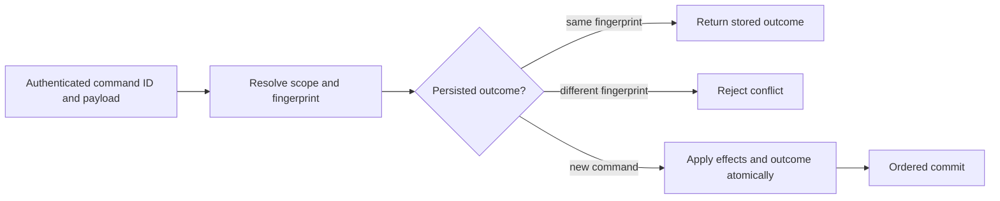

# ADR-002: Command identity and persisted idempotency

Status: Accepted; implementation and GitHub qualification pending. Source contract: `CommandRequest`, `CommandOutcome`, and `CommitReceipt` in `src/KeyLoad.Abstractions/Contracts.cs`; product source [sections 5, 38, and 41](../design/architecture-v0.3.uk.md).

## Context and decision

Network retries can repeat a request after its outcome committed but before the client received the response. Every mutating command therefore has a stable caller-generated `CommandId`, scoped to its authenticated principal and resolved atomic partition. The server fingerprints canonical command content and persists the outcome in the same ordered transaction as its effects. Matching retries return the stored receipt/error; reuse with a different fingerprint is a conflict. Event and message identities provide resource-level deduplication with their own declared retention horizons; they do not replace command identity.

## Rationale and consequences

Persisting command identity with effects resolves lost responses across process restart and leader change. An in-memory response cache cannot do so. Fingerprinting raw noncanonical JSON or omitting principal/scope could alias distinct requests, so canonicalization and authorization precede replay. Deduplication is bounded by persisted retention/format rules; this decision does not promise eternal retry safety after dedup metadata expires or exactly-once external side effects.

## Related requirements

`REQ-DSTORE-004`/`AC-DSTORE-004`, `REQ-MSG-002`/`AC-MSG-002`, `REQ-MSG-005`/`AC-MSG-005`, plus EventStreams `REQ-EVENT-004`/`AC-EVENT-004` (append OCC/idempotency extension owned by the integration lead). See [DocumentStorage](../Features/DocumentStorage.md) and [Messaging](../Features/Messaging.md).

## Implementation contract

1. Freeze command fingerprint inputs, principal/scope binding, error replay, and retention horizon before changing envelopes.
2. Add TUnit tests for same-ID/same-content replay, same-ID/changed-content conflict, lost response after commit, precondition failure replay, and unrelated principal/partition scope.
3. Keep shared command/request/outcome contracts in the existing `src/KeyLoad.Abstractions/Contracts.cs` building block and dispatch/persisted outcome handling in `src/KeyLoad.Core/DatabaseEngine.cs`; feature-specific mutation logic remains in its canonical owning `Features/<SliceName>/` directory. Do not create a separate CommandExecution slice or project.
4. This ADR authorizes no outcome-format migration, compatibility reader, dual-format read/write path, or legacy fallback. If an existing persisted outcome requires an upgrade, stop until [ADR-011](ADR-011-format-upgrades.md) is Accepted with the concrete format version, migration mode, and rollback boundary. Any temporary compatibility transition additionally requires a documented reason, owner, exact scope, verification, and removal date. Until then, unknown formats fail closed.
5. GitHub qualification is TUnit, real process recovery, and RF3 SDK outcomes after leader change. Root owns shared command contracts; feature owners join with fingerprint vectors and named test evidence.

Dependencies: [ADR-001](ADR-001-partition-identity-affinity.md), [ADR-003](ADR-003-durability-ack-barrier.md), [ADR-004](ADR-004-committed-read-views.md), [ADR-005](ADR-005-canonical-keyspace-codec.md), [ADR-011](ADR-011-format-upgrades.md), and [ADR-016](ADR-016-atomic-physical-placement.md). Stop if canonical fingerprint or dedup expiry behavior is not specified. Do not infer exactly-once handler execution or include an external API call in the database transaction.

## TASK-DSTORE-COMMAND-100-RESTART implementation contract

TASK-DSTORE-OUTCOME-MATRIX maps REQ-DSTORE-007 / AC-DSTORE-007 to actual persisted
precondition-error replay and independent authenticated-principal tests in
UnitTests/Features/DocumentStorage. Root freezes the literal error, document,
revision and outbox oracles; query_wave owns only the new cases/helpers. This
stage changes no outcome format, canonical key or public API. Current source
uses principal/command keys and partition-bearing fingerprints; independent
resolved-partition identity remains an explicit implementation gap. The Accepted
decision above is unchanged. Root must define the exact upgrade and public
resolution contract under ADR-011 before repairing that separate gap. Tests of
principal isolation must not stand in for partition isolation.

Current command outcomes have no automatic TTL or purge implementation. A
matching authorized retry resolves its retained canonical outcome in the same
store incarnation. This does not promise a finite minimum retention period,
eternal replay after explicit store/record removal, or replay across a changed
incarnation; an existing outcome from another incarnation is TokenInvalidated.
Adding expiry, purge, a minimum temporal horizon or an outcome-format change
requires its own accepted policy and migration contract before implementation.

REQ-DSTORE-006 / AC-DSTORE-006 and original KL-012 require two actual CrashHost
processes over one owned native ZoneTree store. The first commits one authorized
document/event/queue batch, verifies exactly one hundred matching retries and
changed-content Conflict, captures the original complete receipt as bounded test
evidence, and waits at the existing real process-kill handshake. The parent kills
and joins that child. A distinct second process opens the same store and verifies
one hundred more matching retries, the retained authorized outcome, unchanged
receipt and single effects, changed-content Conflict and healthy follow-up.
Evidence sidecars are never canonical recovery authority. Physical commit/log
position may advance on replay; the original receipt, domain effects and outbox
cut must remain exact. A runner-only close/reopen is not process-restart proof,
and process kill is not power-loss qualification.

Ordered ownership: root freezes this contract and owns the minimal mode dispatch
join in `tests/KeyLoad.CrashHost/Features/StorageRecovery/Helpers/CrashHostApplication.cs`.
The query worker owns new scenario/helper files only under CrashHost and
RecoveryTests `Features/DocumentStorage/`; one canonical DocumentStorage slice
applies on both surfaces. Root reviews, joins, runs the actual Aspire recovery
entry, retains original artifacts and updates KL-012. No new project, public API,
serializer/fingerprint change, TTL path or copied database implementation is in
scope. Root retains the required exact-source Linux recovery and RF3 gates.

## Accepted scoped-key completion, 2026-10-05

REQ/AC-DSTORE-009 and TASK-DSTORE-SCOPED-OUTCOMES-001..004 in
[DocumentStorage](../Features/DocumentStorage.md) now freeze the independent
full-partition identity missing from the earlier test-only matrix. The exact
[ADR-011 outcome-v2 matrix](ADR-011-format-upgrades.md) accepts cold homogeneous
writes to scoped v2 keys while retaining and validating original native outcome
bytes. Existing fingerprint/authorization/incarnation/error/atomicity semantics
remain required. Remove public principal/ID-only result/key access; every active
lookup carries its original normalized operation. No SDK/HTTP/MCP endpoint
replacement is needed because none exposes that removed Core API.

Ordered stages and exact file/test ownership are in the feature contract. Root
joins its contract before Luna implements Core keys/locator inventory and the
existing commit/resolution path, then updates all actual callers and adds real
unit/scalar/prior-process/restart/RF3 scenarios. Root reviews, qualifies and
delivers the full joined stage. Wrong/missing locator, contradictory scope,
same-scope old/new duplicates and malformed frames fail closed without rewrite.
Unknown prior scope blocks ambiguous reuse, never hash-derived backfill. New
Unknown failures have a distinct explicit nonmovable v2 identity and cannot
install an old-key barrier over a prior Global/Partition success; every new
write is v2, with bounded point resolution and no shared reservation protocol.
After the first v2 write recover forward; a legacy-only downgrade requires the
verified full pre-upgrade backup and explicit accepted data-loss scope. The
accepted contract does not close any original KL-012 acceptance gate by itself.
