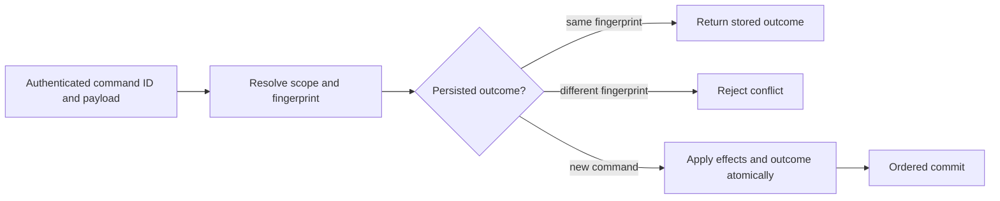

# ADR-002: Command identity and persisted idempotency

Status: Accepted; implementation and GitHub qualification pending. Source contract: `CommandRequest`, `CommandOutcome`, and `CommitReceipt` in `src/KeyLoad.Abstractions/Contracts.cs`; product source [sections 5, 38, and 41](../design/architecture-v0.3.uk.md).

## Context and decision

Network retries can repeat a request after its outcome committed but before the client received the response. Every mutating command therefore has a stable caller-generated `CommandId`, scoped to its authenticated principal and resolved atomic partition. The server fingerprints canonical command content and persists the outcome in the same ordered transaction as its effects. Matching retries return the stored receipt/error; reuse with a different fingerprint is a conflict. Event and message identities provide resource-level deduplication with their own declared retention horizons; they do not replace command identity.

## Rationale and consequences

Persisting command identity with effects resolves lost responses across process restart and leader change. An in-memory response cache cannot do so. Fingerprinting raw noncanonical JSON or omitting principal/scope could alias distinct requests, so canonicalization and authorization precede replay. Deduplication is bounded by persisted retention/format rules; this decision does not promise eternal retry safety after dedup metadata expires or exactly-once external side effects.

## Related requirements

`REQ-DSTORE-004`/`AC-DSTORE-004`, `REQ-MSG-002`/`AC-MSG-002`, `REQ-MSG-005`/`AC-MSG-005`, plus EventStreams `REQ-EVENT-004`/`AC-EVENT-004` (append OCC/idempotency extension owned by the integration lead). See [DocumentStorage](../Features/DocumentStorage.md) and [Messaging](../Features/Messaging.md).

## Implementation contract

1. Freeze command fingerprint inputs, principal/scope binding, error replay, and retention horizon before changing envelopes.
2. Add TUnit tests for same-ID/same-content replay, same-ID/changed-content conflict, lost response after commit, precondition failure replay, and unrelated principal/partition scope.
3. Keep shared command/request/outcome contracts in the existing `src/KeyLoad.Abstractions/Contracts.cs` building block and dispatch/persisted outcome handling in `src/KeyLoad.Core/DatabaseEngine.cs`; feature-specific mutation logic remains in its canonical owning `Features/<SliceName>/` directory. Do not create a separate CommandExecution slice or project.
4. This ADR authorizes no outcome-format migration, compatibility reader, dual-format read/write path, or legacy fallback. If an existing persisted outcome requires an upgrade, stop until [ADR-011](ADR-011-format-upgrades.md) is Accepted with the concrete format version, migration mode, and rollback boundary. Any temporary compatibility transition additionally requires a documented reason, owner, exact scope, verification, and removal date. Until then, unknown formats fail closed.
5. GitHub qualification is TUnit, real process recovery, and RF3 SDK outcomes after leader change. Root owns shared command contracts; feature owners join with fingerprint vectors and named test evidence.

Dependencies: [ADR-001](ADR-001-partition-identity-affinity.md), [ADR-003](ADR-003-durability-ack-barrier.md), [ADR-004](ADR-004-committed-read-views.md), [ADR-005](ADR-005-canonical-keyspace-codec.md), [ADR-011](ADR-011-format-upgrades.md), and [ADR-016](ADR-016-atomic-physical-placement.md). Stop if canonical fingerprint or dedup expiry behavior is not specified. Do not infer exactly-once handler execution or include an external API call in the database transaction.

