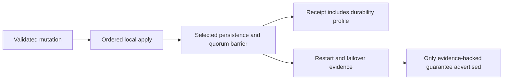

# ADR-003: Durability profile and acknowledgement barrier

Status: Accepted; exact profile qualification pending. Related product source: [architecture sections 5–6, 14, and 37–45](../design/architecture-v0.3.uk.md); source enum: `DurabilityProfile` in `src/KeyLoad.Abstractions/Contracts.cs`.

## Context and decision

An acknowledgement is meaningful only relative to an explicit persistence and replication profile. The current contract names `Buffered`, `ProcessDurable`, `LocalDurable`, `QuorumProcessDurable`, and `QuorumDurable`. The write path must report the selected profile and must cross that profile's declared barrier before returning committed success. ProcessDurable and QuorumProcessDurable describe process-recovery scope; they do not prove survival of power loss. LocalDurable/QuorumDurable must not be advertised as qualified until filesystem/device flush semantics and fault evidence support them.

## Rationale, alternatives, consequences

One generic “durable” label would conceal materially different failure models. Separate acknowledgement contracts let callers choose and compare guarantees. Every profile increases latency/resource cost and needs direct failure evidence; source enums alone do not establish the barrier. No claim of power-loss safety follows from process-kill tests.

## Related requirements

`REQ-MSG-001`/`AC-MSG-001`, `REQ-MSG-005`/`AC-MSG-005`, EventStreams `REQ-EVENT-004`/`AC-EVENT-004`, and ClusterReplication `REQ-REP-002/003` with `AC-REP-002/003`. Cross-link [Messaging](../Features/Messaging.md), [EventStreams](../Features/EventStreams.md), and [ClusterReplication](../Features/ClusterReplication.md).

## Implementation contract

1. Freeze per-profile acknowledged record, local persistence, quorum, and response semantics; keep unsupported profiles unavailable in the capability manifest.
2. Add TUnit state-machine and real-process interruption cases at every barrier, including write/ACK response loss and restart. Power-loss/endurance tests remain separate required evidence for local/quorum durable claims.
3. Implement local persistence and read-lifetime barriers under `src/KeyLoad.Storage.ZoneTree/Features/StorageRecovery/`, quorum commit under `src/KeyLoad.Replication/Features/ClusterReplication/`, and shared receipt contracts in the existing Abstractions durability contract. Preserve node-local `PartitionHost` ownership; do not add standalone Durability or Commit slices.
4. Upgrade profile metadata explicitly. Rollout may advertise only profiles proven by the active deployment; rollback disables stronger profiles before changing barriers and never relabels old receipts.
5. GitHub CI runs build, TUnit, process recovery, and real RF3 .NET/MCP operations; power-loss and endurance require their own CI/environment evidence before qualification. Root owns the profile matrix and review join.

Dependencies: [ADR-004](ADR-004-committed-read-views.md), [ADR-007](ADR-007-replica-consensus-bootstrap.md), [ADR-008](ADR-008-backup-log-retention.md), [ADR-011](ADR-011-format-upgrades.md), and [ADR-016](ADR-016-atomic-physical-placement.md). No test run is implied by source presence. Escalate if the actual flush/replication barrier cannot be identified; never infer power-loss durability from an enum or process kill.

