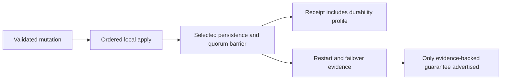

# ADR-003: Durability profile and acknowledgement barrier

Status: Accepted; exact profile qualification pending. Related product source: [architecture sections 5–6, 14, and 37–45](../design/architecture-v0.3.uk.md); source enum: `DurabilityProfile` in `src/KeyLoad.Abstractions/Contracts.cs`.

## Context and decision

An acknowledgement is meaningful only relative to an explicit persistence and replication profile. The current contract names `Buffered`, `ProcessDurable`, `LocalDurable`, `QuorumProcessDurable`, and `QuorumDurable`. The write path must report the selected profile and must cross that profile's declared barrier before returning committed success. ProcessDurable and QuorumProcessDurable describe process-recovery scope; they do not prove survival of power loss. LocalDurable/QuorumDurable must not be advertised as qualified until filesystem/device flush semantics and fault evidence support them.

## Rationale, alternatives, consequences

One generic “durable” label would conceal materially different failure models. Separate acknowledgement contracts let callers choose and compare guarantees. Every profile increases latency/resource cost and needs direct failure evidence; source enums alone do not establish the barrier. No claim of power-loss safety follows from process-kill tests.

## Related requirements

`REQ-MSG-001`/`AC-MSG-001`, `REQ-MSG-005`/`AC-MSG-005`, EventStreams `REQ-EVENT-004`/`AC-EVENT-004`, and ClusterReplication `REQ-REP-002/003` with `AC-REP-002/003`. Cross-link [Messaging](../Features/Messaging.md), [EventStreams](../Features/EventStreams.md), and [ClusterReplication](../Features/ClusterReplication.md).

## Implementation contract

1. Freeze per-profile acknowledged record, local persistence, quorum, and response semantics; keep unsupported profiles unavailable in the capability manifest.
2. Add TUnit state-machine and real-process interruption cases at every barrier, including write/ACK response loss and restart. Power-loss/endurance tests remain separate required evidence for local/quorum durable claims.
3. Implement local persistence and read-lifetime barriers under `src/KeyLoad.Storage.ZoneTree/Features/StorageRecovery/`, quorum commit under `src/KeyLoad.Replication/Features/ClusterReplication/`, and shared receipt contracts in the existing Abstractions durability contract. Preserve node-local `PartitionHost` ownership; do not add standalone Durability or Commit slices.
4. Validate profile metadata explicitly. Advertise only profiles proven by the active deployment; rollback disables stronger profiles before changing barriers and never relabels receipts.
5. GitHub CI runs build, TUnit, process recovery, and real RF3 .NET/MCP operations; power-loss and endurance require their own CI/environment evidence before qualification. Root owns the profile matrix and review join.

Dependencies: [ADR-004](ADR-004-committed-read-views.md), [ADR-007](ADR-007-replica-consensus-bootstrap.md), [ADR-008](ADR-008-backup-log-retention.md), and [ADR-016](ADR-016-atomic-physical-placement.md). No test run is implied by source presence. Escalate if the actual flush/replication barrier cannot be identified; never infer power-loss durability from an enum or process kill.

## TASK-KL009-NATIVE-APPLY-SCOPE-001 (follower-owner implementation contract, 2026-10-07)

REQ-REP-APPLY-SCOPE-001 / AC-REP-APPLY-SCOPE-001 binds original KL009 to a genuine node-local canonical apply owner and real independent replica-network progress. Preserve native ZoneTree, original ordered commit/apply gates, deterministic replay, bounded admission, RF3 acknowledgements and separate authenticated request grains. This is authored acceptance infrastructure; Linux/native execution and original task closure are not claimed.

Docs-first current private-format boundary: all RequestCqrsProbe owner/arm/release/marker producers/readers select version2 and reject version1 without fallback, migration or mixed records. Original request/read phases retain exact original semantics with nullable new arm fields all null and marker EntryIndex/EntryTerm null. CanonicalJournalFlushed is Hold-only and requires complete four-scalar Partition, nonempty SourceRequestId, distinct nonempty SourceArmId and exact TargetVoter. CanonicalOutboundObserved, CanonicalIndependentAppendCompleted and CanonicalOwnerDisposed are unarmable observation-only phases. Canonical markers contain positive real entry index/term and the genuine original request actor ID. Release still addresses the exact arm/request identity. Keep original 32-arm, 400-file, 8-marker, 8192-record-byte, 1048576-aggregate-byte and depth4 ceilings, original component/principal byte bounds, hold/poll/admission/shutdown deadlines and validated configurable lower bounds. No status/receipt is invented.

Identity bridge is bounded test control, never authority: the original real BeforeSubmit Hold publishes its actual signed-voter request actor marker. While held, the fixture writes a distinct canonical arm referencing that source BeforeSubmit arm, principal, stable Batch CommandId, observed actor ID, complete partition and an explicitly observed nonleader voter. Both arms retain their original immutable bytes until joined shutdown. The actual Channel worker opens its own synchronous scope from the genuine ReplicaEntry Id/index/term and exact physical voter plus active source arm. No request ExecutionContext/AsyncLocal propagation across Channel is assumed and no synthetic actor ID is created. Actual Database.Apply retains original persisted authorization, identity/fingerprint/replay and strict clock validation; only its construction-owned native JournalFlushed FaultObserver may hold that owner. Unmatched bootstrap/recovery/job/store work has no hold and the replica store gets no callback.

Independent network evidence is produced only by actual PartitionReplicaGrainService.ExchangeAsync after peer request authentication, original readiness/admission/native endpoint validation and successful signed reply construction. Begin captures the same currently held follower owner; completion decodes only already-admitted request/result bytes and requires an accepted empty native Append, exact term and matched/next position, with prior/committed cuts covering the held genuine entry. Completion must still see that exact held scope. Failed/cancelled/rejected exchanges do not qualify. It emits one bounded presence marker, never credentials, payloads or invented counts. Actual ReplicaGrainServiceClient.InvokeAsync separately observes any external invocation originating in the explicit canonical apply scope; any such marker fails acceptance. The real native RPC boundary is used, not HTTP discovery or a replacement transport.

The leader-owned draft cannot qualify this operation: ReplicaLeader owns rounds through WaitForApplyAsync, and that waiter synchronously reads canonical LastApplied. The accepted proof therefore holds a follower, leaves leader semaphores/cancellation untouched, and avoids node Status/State calls while held (they may read LastApplied under ProtocolGate). Discovery/leader identity is captured before the hold. Original health/readiness routes remain unchanged.

Lifetime: the physical host owns bridge, real materializer worker, storage callback and DI observer. Real GrainService construction resolves the observer before accepting replica RPC, including followers without a local public request. One exact scope owns hold, origin observation and callback admission, restores its prior execution context, writes canonical-owner disposal and joins original callback lifecycle. Synchronous apply errors and scope cleanup errors both propagate, preserving original failures; no second commit, retry, lock change, cancellation clamp or timeout increase. Existing host stop cancels hold and joins callbacks/materializer before store disposal. The fixture releases both arms, joins the actual SDK operation and original request producer plus canonical owner before deleting owned controls/resources.

Whole flow: actual Aspire current-image RF3, persisted non-admin principal and document+queue scope, original SDK atomic Batch, original signed BeforeSubmit marker, native follower JournalFlushed marker carrying real entry index/term, accepted authenticated Append settlement while held, and absent canonical-origin outbound evidence. Original leader SDK receipt must be successful under unchanged deadlines. Release the exact canonical arm and join its owner; verify independent literal complete document (reference/revision/JSON/redaction/empty fields) and queue inspection metadata/body/headers through SDK and official MCP. Assert exact receipt effects and native-byte same-ID SDK/MCP replay, changed-payload conflict with unchanged public state, then distinct healthy queue continuation. This proves the full scoped public projections, not a complete raw-store image or power-loss durability.

Owned paths: Replication ClusterReplication real ApplyBatch/worker scope; Orleans ClusterReplication real GrainService incoming/outgoing transport; Server ClusterRouting existing private control codecs/lifecycle and observer composition; Server StorageRecovery physical host/native storage callback; AppHost ClusterRouting strict current owner reader; IntegrationTests ClusterRouting actual Aspire wave/probe/SDK/MCP helpers; UnitTests ClusterRouting bounded private codec-negative control. That unit codec case is supporting infrastructure, not a product coverage contributor. Root-only format/full build, genuine new census/source-image binding, focused native codec in normal/scalar, existing probe request/read/fault flows, new current-image RF3 operation and mandatory full normal/scalar/recovery/RF3 gates remain required. No numeric coverage or successful native execution is claimed. Rollback removes the same-current private diagnostics coherently; persisted database, replication/native binary/public JSON formats and authorities are unchanged.
