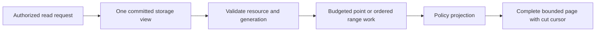

# ADR-004: Committed read views and pagination cuts

Status: Accepted; end-to-end qualification pending. Related source: `IAtomicStore.Read` and `IKeyValueView` under `src/KeyLoad.Abstractions/Storage/StorageContracts.cs`; product source [sections 5, 12, 24–25, and 38](../design/architecture-v0.3.uk.md).

## Context and decision

Read operations must not combine a head from one commit with records or projections from another. Every response is derived from one committed storage view and carries any required cut, generation, or cursor needed to continue consistently. A range page reports ordered committed records plus explicit continuation metadata; it must not present speculative or uncommitted state. Derived search projections expose their own freshness positions rather than pretending to be canonical state.

## Rationale and consequences

A stable view makes pagination, CAS reads, graph traversal, and security projection explainable under concurrent writes. Holding a database transaction across client paging is rejected; the cursor/cut is bounded and validated per request. Read views consume storage and output budgets. Cross-partition/global total order requires a separate cursor/merge contract and is not implied here.

## Related requirements

EventStreams `REQ-EVENT-001..003`/`AC-MP-005`, QueryExecution `REQ-QUERY-001..003`/`AC-MP-003`, GraphTraversal `REQ-GRAPH-003..004`, and TimeSeries `REQ-SERIES-001..003`/`AC-MP-005`. See [EventStreams](../Features/EventStreams.md), [QueryExecution](../Features/QueryExecution.md), and [GraphTraversal](../Features/GraphTraversal.md).

## Implementation contract

1. Freeze the read cut and generation semantics for each canonical, feed, and derived-projection read.
2. Add tests for concurrent append/page, exact boundary/lookahead, stale generation/retention, cancellation, and complete metadata byte limits.
3. Keep the common storage view contract in `src/KeyLoad.Abstractions/Storage/StorageContracts.cs` and implement its lifetime/committed cut under `src/KeyLoad.Storage.ZoneTree/Features/StorageRecovery/`; per-feature readers live under their canonical Core `Features/<SliceName>/` roots and do not leak borrowed spans beyond the gate. Do not add a ReadViews slice.
4. Migrate existing cursors only with explicit versioning and invalidation behavior. Rollback rejects unsupported/new cursors with a stable error rather than guessing their cut.
5. GitHub CI runs real-store TUnit, process recovery, and RF3 client reads across leader changes; root owns the common cut/token contract and joins feature-specific tests.

Dependencies: [ADR-001](ADR-001-partition-identity-affinity.md), [ADR-003](ADR-003-durability-ack-barrier.md), [ADR-005](ADR-005-canonical-keyspace-codec.md), [ADR-006](ADR-006-strict-derived-indexes.md), [ADR-010](ADR-010-query-budgets-security.md), [ADR-011](ADR-011-format-upgrades.md), and [ADR-017](ADR-017-migration-tokens.md). Stop on any ambiguity about visibility, cut translation, or cancellation lifetime; do not claim read-your-writes or global ordering beyond the verified contract.

