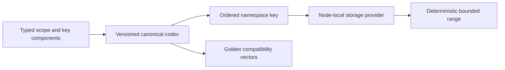

# ADR-005: Canonical namespaces and ordered key codec

Status: Accepted; compatibility qualification pending. Related current source: `src/KeyLoad.Abstractions/Storage/KeyCodec.cs` and `src/KeyLoad.Core/KeySpace.cs`; product source [sections 4, 7–9, 18, and 36](../design/architecture-v0.3.uk.md).

## Context and decision

Canonical persisted keys must encode resource scope, identity, and ordered range fields without collisions, while preserving seek/range ordering. Each key has an explicit namespace and codec version; only the server's canonical codec composes components. Public SDK contracts never expose ZoneTree key bytes. New feature records use reserved, documented namespaces and must not collide with existing document, event, queue, graph, sample, or vector spaces.

## Rationale and consequences

One codec enables deterministic storage ordering, scans, migration checks, and independent providers. Ad-hoc concatenation or case/Unicode normalization would make identity ambiguous and could expose cross-resource data. Encoding changes affect durable formats and therefore require ADR-011 upgrade planning, golden vectors, and rollback constraints.

## Related requirements

`REQ-DSTORE-002`/`AC-DSTORE-002`, `REQ-GRAPH-001`/`AC-GRAPH-001`, EventStreams `REQ-EVENT-005`/`AC-EVENT-005`, and TimeSeries `REQ-SERIES-003`/`AC-MP-012`. Related: [DocumentStorage](../Features/DocumentStorage.md), [GraphTraversal](../Features/GraphTraversal.md), [ADR-011](ADR-011-format-upgrades.md).

## Implementation contract

1. Freeze namespace allocation, type ordering, escaping, null/missing representation, and version vectors before introducing a new key family.
2. Add golden ordering/round-trip/collision tests for each new resource key plus unknown-version rejection; include range lower/upper-bound and malformed-input cases. Historical-format fixtures are added only for versions explicitly supported after ADR-011 is Accepted.
3. Implement codec changes only in `src/KeyLoad.Abstractions/Storage/` and shared Core key builders in `src/KeyLoad.Core/Features/StorageRecovery/`; feature-owned key construction stays in its slice.
4. This ADR authorizes no dual-version reader, compatibility fallback, or in-place migration. Stop any persisted format change until ADR-011 is Accepted with a concrete version, offline/rolling migration and rollback contract. If a temporary compatibility transition is explicitly required, document its reason, owner, exact scope, verification, and removal date before implementation; otherwise unsupported versions fail closed.
5. GitHub CI runs storage TUnit and recovery/open-existing-store checks; feature and storage owners join on golden fixtures and exact format IDs.

Dependencies: [ADR-001](ADR-001-partition-identity-affinity.md), [ADR-006](ADR-006-strict-derived-indexes.md), [ADR-008](ADR-008-backup-log-retention.md), [ADR-011](ADR-011-format-upgrades.md), and [ADR-016](ADR-016-atomic-physical-placement.md). Stop if ordering or legacy bytes are uncertain. Do not export provider-native types or declare compatibility based only on a new-store test.

