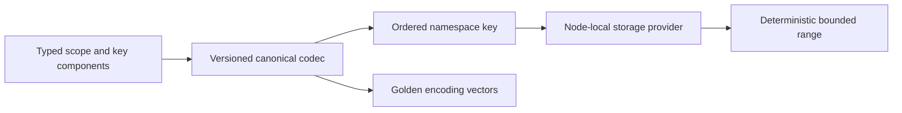

# ADR-005: Canonical namespaces and ordered key codec

Status: Accepted; golden-vector and current-format qualification pending. Related current source: `src/KeyLoad.Abstractions/Storage/KeyCodec.cs` and `src/KeyLoad.Core/KeySpace.cs`; product source [sections 4, 7–9, 18, and 36](../design/architecture-v0.3.uk.md).

## Context and decision

Canonical persisted keys must encode resource scope, identity, and ordered range fields without collisions, while preserving seek/range ordering. Each key has an explicit namespace and codec version; only the server's canonical codec composes components. Public SDK contracts never expose ZoneTree key bytes. New feature records use reserved, documented namespaces and must not collide with existing document, event, queue, graph, sample, or vector spaces.

## Rationale and consequences

One codec enables deterministic storage ordering, scans, and independent providers. Ad-hoc concatenation or case/Unicode normalization would make identity ambiguous and could expose cross-resource data. The current key format is fixed by the first-release storage contract; unsupported versions fail closed. Golden vectors and rollback constraints protect the current encoding.

## Related requirements

`REQ-DSTORE-002`/`AC-DSTORE-002`, `REQ-GRAPH-001`/`AC-GRAPH-001`, EventStreams `REQ-EVENT-005`/`AC-EVENT-005`, and TimeSeries `REQ-SERIES-003`/`AC-MP-012`. Related: [DocumentStorage](../Features/DocumentStorage.md) and [GraphTraversal](../Features/GraphTraversal.md).

## Implementation contract

1. Freeze namespace allocation, type ordering, escaping, null/missing representation, and version vectors before introducing a new key family.
2. Add golden ordering/round-trip/collision tests for each current resource key plus unknown-version rejection; include range lower/upper-bound and malformed-input cases. Tests exercise only the accepted current format.
3. Implement codec changes only in `src/KeyLoad.Abstractions/Storage/` and shared Core key builders in `src/KeyLoad.Core/Features/StorageRecovery/`; feature-owned key construction stays in its slice.
4. The current codec has one reader and writer. Unsupported versions and malformed encodings fail closed; no alternate reader or rewrite path is permitted.
5. GitHub CI runs storage TUnit and recovery/open-existing-store checks; feature and storage owners join on golden fixtures and exact format IDs.

Dependencies: [ADR-001](ADR-001-partition-identity-affinity.md), [ADR-006](ADR-006-strict-derived-indexes.md), [ADR-008](ADR-008-backup-log-retention.md), and [ADR-016](ADR-016-atomic-physical-placement.md). Stop if ordering or current bytes are uncertain. Do not export provider-native types or infer qualification from source presence.

## 2026-10-04 v1 validation and ownership completion

KL-007 adds REQ-KEYCODEC-001..004 and AC-KEYCODEC-001..004 in
[StorageRecovery](../Features/StorageRecovery.md). This freezes validation of
the existing format; every byte emitted for a supported valid existing key
remains unchanged. Identity digests, native aliases/Ids, current data epoch7, journals,
RF3 and public wire DTOs remain unchanged. Unsupported data epochs fail closed.

The v1 type order is missing10, null11, bool20, int64/normalized int30, decimal31,
finite double32, UTC timestamp40, UTF-8 string50, and byte array60 (hex tags).
Guid is an existing input convenience normalized to its lowercase `N` string;
it is not a separate tagged type. Timestamps normalize their comparison identity
to UTC; decimal scale and floating signed zero normalize numeric identity.
Different numeric tags remain different types. Preserve these mappings and
UTF-8 ordinal ordering, including zero escaping and composite prefix ordering.

| Boundary | Frozen result |
|---|---|
| Encode0..256 components | Exact existing valid writer bytes; empty composite is version byte1 |
| Encode257+ components | ResourceExhausted before buffer creation or component encoding |
| Unsupported CLR component | Existing UnsupportedCapability |
| Nonfinite double or invalid UTF-16 string | Validation with a constant safe message |
| Empty/unknown key version | Existing FormatUnsupported |
| Invalid/truncated tag, scalar, escape, UTF-8, timestamp or decimal | Corruption with a constant safe message |
| Decode257+ components | Corruption before decoding component257 |
| Noncanonical negative-zero double or nonzero-form decimal zero | Corruption; these bytes are never emitted by the valid v1 writer |
| Noncanonical decimal leading/trailing zero, exponent, precision or scale | Corruption; reject rounding/underflow rather than aliasing another canonical key |

Decimal decoding must accept every value emitted by the existing writer,
including its extrema and all scales0..28. Bound canonical nonzero exponents
and significant digits before parsing; use the BCL decimal parser with exact
representability checks. Both parse-text construction and parsing must use
InvariantCulture: a changed CurrentCulture or custom non-ASCII negative sign
cannot change a durable key's meaning. Pin literal positive/negative fractional
decimal v1 vectors and decode them under such a culture, restoring the caller's
culture in finally. TASK-KEYCODEC-CULTURE assigns only this invariant construction
and new KeyCodecCultureContractTests to query_wave Luna/high before the final
normal/scalar/recovery source freeze. Do not add a duplicate decimal serializer or re-encode
every decoded key. Keep successful hot paths free of new full-envelope copies.
Invalid UTF text and timestamps use narrow validation; never retain offending
data in an error or relax existing malformed guards.

The immutable payload-envelope requirement means storage captures independently
owned key/value bytes at staging and preserves their committed content across
caller/pool reuse and returned-result mutation. Its existing carriers are
StorageMutation and KeyValueRecord with permanent aliases/Ids. The read result
is an independently owned copy; this does not promise a deeply immutable CLR
backing array. Test the actual authoritative storage isolation, native envelope
roundtrip and reopen, rather than changing those carriers or adding a new API.

Ordered implementation: root freezes this contract, feature mapping and task
graph; query_wave Luna/high owns only KeyCodec.cs, KeyCodecDecimal.cs,
KeyCodecReadPrimitives.cs and cohesive new Features/StorageRecovery/KeyCodec*
validation helpers if needed; lifecycle_wave Luna/high owns new KeyCodec*
UnitTests/Features/StorageRecovery corpus, malformed, golden and real-store
ownership tests; root reviews every diff and joins full build/formatter,
Aspire normal/scalar/recovery and exact-source Linux/RF3 originals.
Existing10,000 decimal cases and all golden vectors remain intact; add an
independent10,000 generated mixed-type/composite corpus and literal corruption
vectors. No skips, mock provider, suppressed diagnostic or altered tolerance.

Rollout is a homogeneous current-format build after qualification. No canonical
writer output changes, rewrite or dual-version reader is allowed. Rollback
restores prior validation while preserving valid durable keys; its malformed
exception leaks remain explicitly unqualified. SDK/MCP/frontend changes N/A:
unchanged database operations. Dependency repair N/A: the defect is KeyLoad-owned.

The [2026-10-04 local receipt](../implementation/keycodec-crud-development-2026-10-04.json)
records14 new KeyCodec cases and4 original cases in unchanged full Aspire
normal/scalar suites at2889/2889 each, recovery228/228 and1000 unique actual
atomic process cuts. Literal fractional decimal goldens pass under invariant
and custom-sign cultures. Exact delivered-source Linux/RF3 originals, endurance,
power-loss and measured acceleration remain separate required gates.
