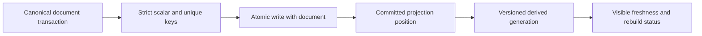

# ADR-006: Strict synchronous indexes and derived projections

Status: Accepted; implementation and GitHub qualification pending. Product source: [sections 7, 12, and 27](../design/architecture-v0.3.uk.md); current implementation: `src/KeyLoad.Core/Documents.cs`.

## Context and decision

An index used to enforce a write invariant must be updated in the same atomic transaction as its canonical document. Initial document indexes are explicit definitions with scalar fields, declared null/missing behavior, ordered/composite keys, and unique-within-partition enforcement. Search, text, vector, and other expensive projections may be derived asynchronously only when their watermark/freshness and stale-result behavior are visible to callers. An async projection cannot replace a strict constraint.

## Rationale, alternatives, consequences

Implicitly indexing arbitrary JSON fields risks uncontrolled write amplification and quota exhaustion. Making all indexes asynchronous would allow duplicate values or inconsistent authorization decisions. Strict indexes increase mutation cost and can reject an entire atomic batch; derived projections require rebuild/lag observability and cannot be silently treated as canonical.

## Related requirements

`REQ-DSTORE-002`/`AC-DSTORE-002`, Search `REQ-SR-003..005`/`AC-MP-004/005`, and atomic batch `REQ-DSTORE-004`/`AC-DSTORE-004`. See [DocumentStorage](../Features/DocumentStorage.md), [Search](../Features/Search.md), and [ADR-009](ADR-009-search-provider-boundaries.md).

## Implementation contract

1. Freeze supported scalar types, composite ordering, unique scope, sparse/null/missing semantics, and projection freshness contract.
2. Add real-store tests for insert/replace/delete key changes, unique conflict rollback, null/missing, rebuild consistency, stale projection revision, and result provenance.
3. Keep strict index ownership in `src/KeyLoad.Core/Features/DocumentStorage/`; derived projection/provider ownership stays in the existing `src/KeyLoad.Query/Features/Search/` slice. Catalog generation and status remain explicit; do not create a separate KeyLoad.Search technical root.
4. Rebuild creates a new generation from a committed cut plus retained deltas, validates it, swaps atomically, and retires the old generation after reader leases. Until those steps are proven, rebuild stays maintenance-scoped. Rollback restores the prior generation only while its source history remains available.
5. GitHub Actions runs TUnit, recovery, and RF3 tests that inspect canonical data and projections; root owns cross-slice generation/manifest review.

Dependencies: [ADR-001](ADR-001-partition-identity-affinity.md), [ADR-004](ADR-004-committed-read-views.md), [ADR-005](ADR-005-canonical-keyspace-codec.md), [ADR-009](ADR-009-search-provider-boundaries.md), [ADR-010](ADR-010-query-budgets-security.md), [ADR-011](ADR-011-format-upgrades.md), [ADR-015](ADR-015-sensitive-data-lineage.md), and [ADR-016](ADR-016-atomic-physical-placement.md). Escalate any claim of global uniqueness or online rebuild without a domain/movement protocol.

