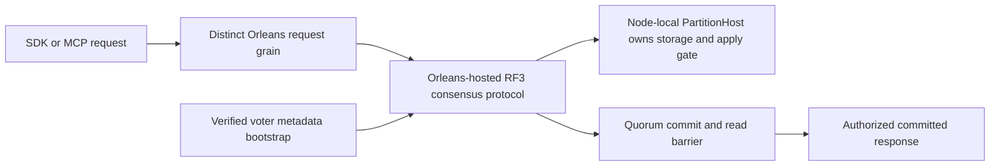
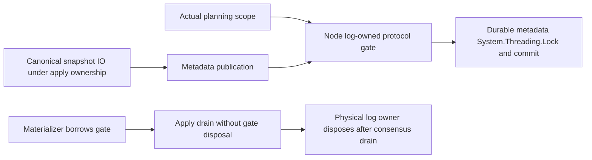

# ADR-007: Orleans replica consensus and metadata bootstrap

Status: Accepted current architecture contract; exact-source Linux qualification remains pending. Foundation decision: [ADR-036-orleans-foundation](ADR-036-orleans-foundation.md). Related source ownership: [ClusterReplication](../Features/ClusterReplication.md) and [ClusterRouting](../Features/ClusterRouting.md).

## Context and decision

The database cluster uses Orleans as its sole distributed runtime and membership/directory foundation. Consensus, terms/votes/log state, ordered appends, read barriers, snapshot transfer, and replicated metadata are KeyLoad-owned protocols hosted through Orleans. Every request uses its own routing grain; durable storage, journals, locks, and apply gate remain owned by the node-local `PartitionHost` if an Orleans activation moves. Do not introduce DotNext.AspNetCore.Cluster or DotNext.Net.Cluster.

Bootstrap must establish a fixed RF3 voter set and persisted cluster metadata without a second competing membership authority. Empty/restarted replicas join through verified metadata/snapshot and ordered tail. The precise consensus proof and deployment source of voter identity remain governed by the owning replication contract; no single-node substitute is allowed.

## Rationale and consequences

One cluster foundation avoids split-brain membership and duplicate routing layers. Orleans activation placement is not storage ownership. This requires explicit request routing, stable replica identity, control-plane capacity, quorum barriers, and recovery evidence. Source presence and historical CI do not qualify current delivered behavior.

## Related requirements

`REQ-REP-001..006`/`AC-REP-001..006` and `REQ-ROUTE-001..003`/`AC-ROUTE-001..003`. Related data guarantees: `REQ-MSG-001`/`AC-MSG-001` and `REQ-DSTORE-004`/`AC-DSTORE-004`.

## Implementation contract

1. Freeze voter identity/bootstrap, term/log/cut, read barrier, forwarding, membership changes, and recovery contracts with ADR-036; use Orleans only.
2. Add real TUnit protocol/state tests and process recovery for interrupted vote/append/snapshot; add Aspire Docker RF3 SDK and MCP tests for quorum, minority denial, failover, and activation movement.
3. Target owners are `src/KeyLoad.Orleans/Features/ClusterReplication/` for Orleans transport, `src/KeyLoad.Orleans/Features/ClusterRouting/` for routing, `src/KeyLoad.Replication/Features/ClusterReplication/` for consensus, and `src/KeyLoad.Server/Features/StorageRecovery/` for node-local `PartitionHost` lifecycle. Shared membership/contracts have one root integration owner.
4. Bootstrap must verify the complete current fixed-voter identity before serving. Rollout must not advertise readiness before quorum/read barrier; rollback fences the newer ownership epoch and restores only a complete cut.
5. The canonical Aspire-owned entry runs the TUnit, process-recovery and Docker/Aspire RF3 suites; RF3 exercises the real .NET and official MCP clients. Local runs are development evidence only. Only exact-source Linux GitHub jobs qualify delivered behavior. Root reviews membership/source changes and joins original artifacts.

Dependencies: [ADR-001](ADR-001-partition-identity-affinity.md), [ADR-003](ADR-003-durability-ack-barrier.md), [ADR-004](ADR-004-committed-read-views.md), [ADR-008](ADR-008-backup-log-retention.md), [ADR-016](ADR-016-atomic-physical-placement.md), and [ADR-036](ADR-036-orleans-foundation.md). Stop on any request to add DotNext or transfer storage ownership to activations whose placement may move; those conflict with root policy.

## Current benchmark membership boundary

The production contract remains an odd-voter RF3 cluster. Trusted comparison jobs
may select fixed native one-, two- or three-member target topologies under
[ADR-056](ADR-056-isolated-linux-comparison-cells.md) and
REQ-BC-053/AC-ISO-004. Majority remains `floor(n/2)+1`; RF1 tolerates no voter loss,
and RF2 requires both voters for quorum reads and writes. This bounded benchmark
profile does not enable HTTP caller opt-in, alternate storage, membership
reconfiguration that weakens quorum or a production-readiness claim. Its native
fault tests do not replace the unchanged RF3 recovery and qualification gates.

## Snapshot publication ordering and regressions

REQ-REP-051/AC-REP-051 require one node-owned `ProtocolGate` on
`IDurableReplicaLog`. `ReplicaMaterializer` borrows that exact
`SemaphoreSlim`; its shutdown drains apply work and never disposes the gate.
`DurableReplicaLog.Dispose` closes it only after node-host consensus/materializer
drain. `PublishSnapshot` acquires the gate before the existing metadata `System.Threading.Lock`
and releases it in `finally`. Both actual `SnapshotStore.Create` and
`SnapshotStore.Complete`, including recovery/reset incoming publication, use that
path. Canonical image I/O remains outside the gate. Gate-to-metadata-lock is the
only permitted order; recursive publication while the gate is held is forbidden.
Persisted format, voters, quorum and public database wire remain unchanged;
rollback is a coordinated source rollback after host drain and retains every valid
durable cut.

The owning recovery regression lives in
`tests/KeyLoad.RecoveryTests/Features/ClusterReplication/ReplicaCheckpointProtocolGate*.cs`
with a same-slice `ReplicaCheckpointProtocolPlanningScope.cs` helper only if needed.
It uses real `ReplicaState.LockedAsync` with the real materializer/log and ZoneTree
fixture. It captures planning state, term and suffix inside one owned planning
task, then starts actual Create and incoming Complete cases while that scope is
held. Every path releases and joins the original
planning/publication tasks before disposing the physical log owner. Preserve native
image flush and verification, blocked publication, unchanged metadata and final
tail/term/vote/applied-cut assertions. The production protocol gate is not replaced
with a test gate or hook.

Lifecycle cleanup preserves each original failure while continuing independent
cleanup: constructor failures close both opened stores; disposal attempts both
stores and fixture source/directory owners; aggregate and access-denied failures
remain visible as their original objects. Tests verify the actual planning and
publication tasks settle before disposal. Multiple simultaneous native filesystem
faults have source-review evidence only unless an exact original runtime receipt
proves their execution; no forced fatal failure or successful settlement is
invented.

TASK-REP-MATERIALIZER-FAULT-ORACLE implements AC-REP-002/004/051 in the existing
real ZoneTree lifecycle case and fixture. Preserve production fault propagation:
JournalFlushed failure fences the waiter with RecoveryRequired, while repeated
memoized disposal observes the same original UnknownWriteOutcome after terminal
cleanup. Verify the borrowed protocol gate, physical owner closure and committed
prefix reopen. Only the exact already-asserted terminal exception may be
acknowledged by fixture cleanup; every other scenario or cleanup failure remains
visible. Implement the test oracle, then its narrow fixture acknowledgment, review
the normal/faulted paths, and run native recovery before exact-source Linux
qualification. Root owns contract/integration; the recovery worker owns only
ReplicaMaterializerLifecycleTests.cs and ReplicaMaterializerLifecycleFixture.cs
under RecoveryTests/Features/ClusterReplication. No production, format, dependency
or topology change is involved; reverting the test correction preserves every
durable cut. Existing process-kill proof does not qualify power-loss or RF3.

Local development execution, when useful, uses the canonical Aspire-owned test
entry and is labeled development evidence. Only exact-source Linux GitHub
Recovery/RF3 jobs qualify delivered behavior. No test-only result or historical
receipt qualifies current-source delivery.

## TASK-KL035-INSTALL-BOUNDARY-003: actual descriptor limit and original cancelled admission

REQ/AC-REP-004 and original architecture KL035 atomic snapshot installation require an explicit install boundary, independent of existing GC cancellation/log read limits. ReplicaSnapshotInstallBoundaryTests.ActualSnapshotCeilingOrOriginalCancelledInstallPreservesWholeCutThenSameTransferAndColdTailAreHealthy uses the existing real CrashHost SnapshotChunkAcknowledged producer, actual killed/readers-joined native source/target and original partial descriptor. After the same genuine image is fully copied, one source argument validates an exact image-length-minus-one receiver ceiling with valid smaller chunk bounds; the other calls real materializer InstallCheckpointAsync with its original already-cancelled caller token. Exact Validation or original OCE/token must retain full canonical+replica records/positions/hardstate/native local identity/read generation and private image/manifest lengths+SHA. The SAME valid descriptor then installs snapshot4, applies retained tail5, preserves complete ordered original receipts, joins actual materializer/node/source and cold reopens full literal healthy state. This cancellation is before apply ownership; no in-flight IO rollback is claimed. No fixture/threshold/product limit/deadline/retry/provider/format/authority change.

The existing49 task objects remain unchanged. Root must compile and obtain genuine native typed argument expansion/UID/PDB source-image records before adding this class to the Recovery selector; two source Arguments are not native census or passing outcomes. Existing full-suite/fault/coverage/Linux RF3 gates remain mandatory, and process recovery cannot qualify power-loss/endurance. Shared heavyweight fixture ownership remains untouched.
