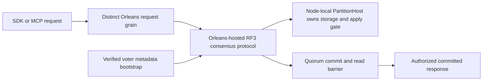
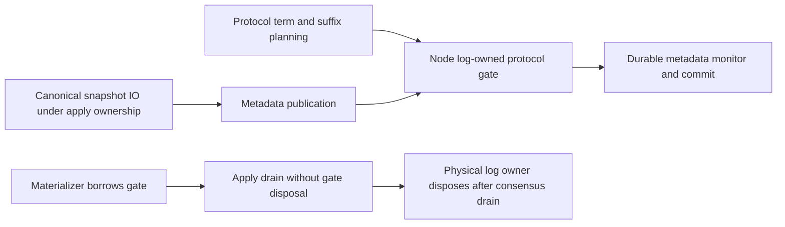

# ADR-007: Orleans replica consensus and metadata bootstrap

Status: Accepted; replacement implementation and GitHub qualification pending. Foundation decision: [ADR-036-orleans-foundation](ADR-036-orleans-foundation.md). Related source ownership: [ClusterReplication](../Features/ClusterReplication.md) and [ClusterRouting](../Features/ClusterRouting.md).

## Context and decision

The database cluster uses Orleans as its sole distributed runtime and membership/directory foundation. Consensus, terms/votes/log state, ordered appends, read barriers, snapshot transfer, and replicated metadata are KeyLoad-owned protocols hosted through Orleans. Every request uses its own routing grain; durable storage, journals, locks, and apply gate remain owned by the node-local `PartitionHost` if an Orleans activation migrates. Do not introduce DotNext.AspNetCore.Cluster or DotNext.Net.Cluster.

Bootstrap must establish a fixed RF3 voter set and persisted cluster metadata without a second competing membership authority. Empty/restarted replicas join through verified metadata/snapshot and ordered tail. The precise consensus proof and deployment source of voter identity remain governed by the owning replication contract; no single-node substitute is allowed.

## Rationale and consequences

One cluster foundation avoids split-brain membership and duplicate routing layers. Orleans activation placement is not storage ownership. This requires explicit request routing, stable replica identity, control-plane capacity, quorum barriers, and recovery evidence. Source presence and historical CI do not qualify the replacement implementation.

## Related requirements

`REQ-REP-001..006`/`AC-REP-001..006` and `REQ-ROUTE-001..003`/`AC-ROUTE-001..003`. Related data guarantees: `REQ-MSG-001`/`AC-MSG-001` and `REQ-DSTORE-004`/`AC-DSTORE-004`.

## Implementation contract

1. Freeze voter identity/bootstrap, term/log/cut, read barrier, forwarding, membership changes, and recovery contracts with ADR-036; use Orleans only.
2. Add real TUnit protocol/state tests and process recovery for interrupted vote/append/snapshot; add Aspire Docker RF3 SDK and MCP tests for quorum, minority denial, failover, and migration.
3. Target owners are `src/KeyLoad.Orleans/Features/ClusterReplication/` for Orleans transport, `src/KeyLoad.Orleans/Features/ClusterRouting/` for routing, `src/KeyLoad.Replication/Features/ClusterReplication/` for consensus, and `src/KeyLoad.Server/Features/StorageRecovery/` for node-local `PartitionHost` lifecycle. Shared membership/contracts have one root integration owner.
4. Bootstrap and metadata migration must verify a complete fixed voter identity before serving. Rollout must not advertise readiness before quorum/read barrier; rollback fences the newer ownership epoch and restores only a complete cut.
5. GitHub CI qualifies TUnit, Recovery, and Docker/Aspire RF3 through .NET and official MCP clients. Root reviews every membership/source change and joins artifacts. No local runtime claim.

Dependencies: [ADR-001](ADR-001-partition-identity-affinity.md), [ADR-003](ADR-003-durability-ack-barrier.md), [ADR-004](ADR-004-committed-read-views.md), [ADR-008](ADR-008-backup-log-retention.md), [ADR-011](ADR-011-format-upgrades.md), [ADR-016](ADR-016-atomic-physical-placement.md), and [ADR-036](ADR-036-orleans-foundation.md). Stop on any request to add DotNext or transfer storage ownership to migratable grains; those conflict with root policy.

## Owner-directed benchmark fixed membership, 2026-10-03

The production odd-voterRF3-first contract remains mandatory. Explicit trusted
benchmark startup may use fixed native1/2/3 voters under [ADR-056](ADR-056-isolated-linux-comparison-cells.md),
REQ-BC-053/AC-ISO-004 and TASK-ISO-005/010/012. Majority remainsfloor(n/2)+1;
RF1 tolerates no voter loss,RF2 needs both voters for quorum read/write. No HTTP
caller opt-in, alternate storage, membership migration, lowered quorum or production
readiness claim. Exact files/stages/migration/rollback/SDK+MCP fault tests and
root-owned integration are the ADR056 implementation contract. Status staysAccepted
until real benchmark topology and unchangedRF3 fault/recovery qualification exist.

## TASK-ISO-016K-F: one node-owned publication and planning gate

Root accepts REQ-REP-051/AC-REP-051 before implementation. IDurableReplicaLog
exposes a borrowed ProtocolGate SemaphoreSlim, owned by DurableReplicaLog.
ReplicaMaterializer borrows that exact gate; its shutdown drains apply work and
never disposes it. DurableReplicaLog.Dispose closes the gate only after existing
node-host consensus/materializer drain. PublishSnapshot acquires ProtocolGate
before its existing durable-log monitor and releases it in finally. Both real
SnapshotStore.Create and Complete, including recovery/reset incoming publication,
use this single publication path. Canonical image IO remains outside ProtocolGate.
ProtocolGate to durable-log monitor is the sole permitted order; no caller may
publish recursively while already holding the semaphore. Current production
call-site review found no such caller. Persisted format, voters, quorum and public
database wire do not change; rollback is a coordinated source rollback after host
drain and retains every valid durable cut.

Ordered stages: author real ZoneTree regression first; add the log contract/gate and
metadata-only serialization; update borrowed materializer lifecycle assertions;
run GitHub recovery and RF3/full intensive gates and retain exact source/job/raw
logs. Existing publisher_archive_review owns only ReplicaLogContracts.cs,
DurableReplicaLog.cs, ReplicaMaterializer.cs, ReplicaMaterializerShutdown.cs,
the two existing MaterializerLifecycle/ShutdownTests files and NEW
ReplicaCheckpointProtocolGate* tests/helpers under Recovery ClusterReplication.
Root owns docs/shared integration and reviews the entire diff. Stop on lock-order,
ownership/API or scope uncertainty; no replica retries, admission or election
threshold changes, suppressed diagnostics, mocks, local tests/runtime or Git
writes are delegated. The separate heartbeat/apply liveness exposure remains
unqualified and is not silently changed in this repair.

