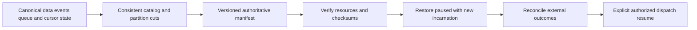
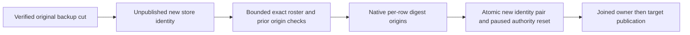

# ADR-008: Backup cuts and independent log retention

Status: Accepted; full backup/restore and cluster qualification pending. Product source: [sections 5–6 and 37–45](../design/architecture-v0.3.uk.md); source test status is tracked by [StorageRecovery](../Features/StorageRecovery.md) and peer-owned BackupRestore documentation.

## Context and decision

WAL/transaction journals, replicated command logs, domain event history, queue state, subscription checkpoints, inbox outcomes, and rebuildable projections have different authority and retention. Trimming a recovery log must not silently delete public event history. A backup records an internally consistent catalog epoch and per-atomic-partition cuts for every authoritative resource needed to restore that state. Derived indexes may use a documented rebuild recipe. Restoring an older cut starts with delivery paused and a new cluster incarnation until reviewed and resumed.

## Rationale and consequences

Separate lifecycles prevent log compaction from changing customer-visible history and make restore scope explicit. A backup is not valid if it omits metadata required to interpret data or if it silently replays external effects. Retention pins may consume storage; physical purge across replicas, snapshots and archives needs its own measured and operational contract.

## Related requirements

ClusterReplication `REQ-REP-004`/`AC-REP-004`, StorageRecovery `REQ-STORAGE-004`/`AC-REP-002/004`, EventStreams `REQ-EVENT-005..007`, and Messaging `REQ-MSG-006`. Related files: [ClusterReplication](../Features/ClusterReplication.md), [StorageRecovery](../Features/StorageRecovery.md), and planned [BackupRestore](../Features/BackupRestore.md).

## Implementation contract

1. Freeze authoritative manifest, per-partition cut, retention pins, event-history guarantees, paused restore, and external-effect reconciliation.
2. Add real-store tests for current-format backup consistency, interruption, corruption, retention pins, restore-old-cut token invalidation, and absence of automatic dispatch; qualify replica erase/reinstall separately.
3. Implement in `src/KeyLoad.Core/Features/BackupRestore/`, `src/KeyLoad.Storage.ZoneTree/Features/BackupRestore/`, and replication snapshot ownership under `src/KeyLoad.Replication/Features/ClusterReplication/`.
4. Validate the current manifest version and every resource before restore. Reject unsupported versions and preserve original archive bytes; stop dispatch if any resource/cut is unknown.
5. GitHub CI runs TUnit, recovery, and RF3 restore drills. Root owns the manifest/cut contract; Messaging/EventStreams join with checkpoint/inbox/retention proof and exact artifacts.

Dependencies: [ADR-003](ADR-003-durability-ack-barrier.md), [ADR-004](ADR-004-committed-read-views.md), [ADR-005](ADR-005-canonical-keyspace-codec.md), [ADR-007](ADR-007-replica-consensus-bootstrap.md), [ADR-016](ADR-016-atomic-physical-placement.md), and [ADR-030](ADR-030-retention-paused-restore.md). Stop if any authoritative message/history state is omitted or restore would automatically invoke an external side effect.

## TASK-KL042-CATALOG-001A implementation contract

The ordered roster foundation under REQ/AC-BACKUP-004 is frozen in
[BackupRestore](../Features/BackupRestore.md). Add stable generated native entry
contracts and canonical full-scope keys, then integrate actual staged-write
registration with command effects/outcomes and commit validation, including
Reset/rejection, empty placement and cross-partition destination writes. Author
the real ZoneTree command/reopen/retry/rejection/deletion flows in the same stage.
Root owns shared joins and native gates; Luna produces a bounded private source
packet in the exact feature-local paths specified there. No public backup API,
startup behavior, physical topology, or dependency changes are included here.

The current one-physical-shard RF3 cut is shared by logical partitions. A complete
catalog requires a later fenced, resumable RF3 census before capture admission;
the current roster comprises live partition-family keys and explicit placement
rows. A complete current-format census is required before capture admission.
Canonical data and ownership records remain authoritative. Preserve original rows
on rollback and withhold cluster capture; never reinterpret a partial roster as
ready. New records use their frozen aliases/IDs and a homogeneous current
release. Full build/format, Aspire unit/scalar/recovery/RF3, native functional
coverage and exact-source Linux proof remain required. This stage and ADR remain
unqualified until their mapped capture/restore operations meet acceptance.

## TASK-KL042-ROSTER-RESTORE-ORIGIN-001 — current-format historical coordinate ownership

REQ-BACKUP-ROSTER-RESTORE-001 maps to AC-BACKUP-ROSTER-RESTORE-001: restoring an actual replicated materialization into a new incarnation preserves each complete immutable roster entry and admits its first new scoped write, exact original new receipt replay and cold continuation. Historical firstSeen is never reused as current LastApplied, a minimum token or RF3 authority. Old command receipts/tokens remain incarnation-fenced.

Freeze before code: a generated native per-partition restore-origin record contains version, complete PartitionRef, actual source/new incarnation, admitted historical applied upper bound and SHA256 of the exact retained native roster bytes. The old four-field entry alias/Ids/bytes remain unchanged. Only a byte-identical historical row can use its bound; a new or changed row without its matching origin must satisfy current applied coordinates. The source restore owner validates existing origin against actual source incarnation/digest before carrying it into another restore; malformed/mismatched origin never falls back. FirstSeen local coordinates stay bounded by the verified source physical position. Replicated source coordinates must fit actual source LastApplied or a valid prior per-row origin.

The current staged native restore enumerates one actual roster row at a time and persists one validated historical origin per replicated row using the existing native commit/frame bound, before its original final identity-authority reset/publication. There is no new configured limit or unbounded map. All source/archive bytes stay unchanged; staged failure cannot publish a target. Restored physical position is the original verified cut plus actual historical-origin commits plus the existing reset commit; backups with no replicated roster retain the original single increment. This metadata is historical provenance only, not policy or placement authority. No physical-catalog reconciliation bypass is added.

Ownership: shared generated contracts, canonical keys and pure structural/digest match in Abstractions/BackupRestore; original staged restore in Storage.ZoneTree/BackupRestore; Core roster validation/atomic commit; complete native Unit BackupRestore operation flow. Related ADR008/011/046. Root reviews/joins/builds; native normal/scalar and exact-source Linux remain required. Current-format only, no migration or fallback. New public route/SQL/parser/client behavior N/A. Full KL042 catalog manifest/off-node/clean RF3/outbox/graph/RPO/RTO remains OPEN.

AC-BACKUP-ROSTER-RESTORE-002 requires actual replicated seed→verified backup→clean restore→first new local and early-new-replication command→full literal state and exact receipt replay→cold reopen→second verified restore; complete immutable roster/archive comparison. Corrupt origin version/scope/source/new identity/bound/digest and changed roster bytes must refuse without effect or physical cut change, then exact original repair yields healthy distinct command. Missing origin cannot admit an old firstSeen above current applied. Supporting native Unit flows do not qualify clean RF3 restoration.

This finite native owner regression uses the existing legitimate offline DatabaseEngine composition. Its stored command-outcome incarnation is new, while the archived physical catalog intentionally remains original; it does not prove production RF3 admission or invalidate every old minimum-token placement witness. Physical catalog reconciliation, clean-cluster bootstrap and actual SDK/MCP token fencing remain explicit KL042 gates. Invalid prior origin also rejects a second real restore without target publication or leaked staging; source/archive bytes and cuts stay unchanged, then exact metadata repair and healthy cold operation are required. Generated origin identity/digest metadata is not a MAC, a caller capability, or authority to modify the roster; normal clients cannot write these native families.

Each per-row SourceIncarnation must additionally equal the actual source in the native global restore-identity pair persisted by the final authority commit, whose RestoredIncarnation must equal the actual store identity. Prior pairs are checked against the actual recovered source before carry. Missing, mismatched or orphan identities fail closed; a random nonempty source UUID is insufficient. This pair carries no historical upper bound and cannot admit an unbound row. Empty/local-only backups add no origin metadata or extra commits.

Ordered stages are verify original artifact/source cut → create unpublished new identity → bounded native roster/prior-origin checks → actual per-row historical metadata commits → one final origin-identity/replica-reset/paused-dispatch commit → publish clean target after owner disposal. Any source/metadata/frame/cleanup failure rejects publication and retains primary plus disposal/staging-cleanup failures. Root alone joins, builds, runs native normal/scalar and source-bound Linux; rollback before publication removes only owned staging. This first-release current-format metadata is not a supported upgrade/downgrade migration or compatibility fallback; older source/runtime artifacts do not qualify it.

TASK-KL042-ROSTER-ORIGIN-NATIVE-ANALYZER-002 preserves REQ-BACKUP-ROSTER-RESTORE-001 and AC-BACKUP-ROSTER-RESTORE-001/002 after original source f3d7feb2/run37946644265 failed CA1819 and CA1062. The new unqualified generated-origin digest uses bounded ReadOnlyMemory<byte> at unchanged field Id5; compare its span against exact SHA256 without exposing a mutable array property. Validate actual public reference parameters before native key/identity matching. This is the current new metadata contract, with no format fallback, migration or acceptance claim. Existing genuine restore, first-write/replay, corrupt/missing-origin refusal, exact repair and cold/second-restore flows remain required. Root owns the source repair, coherent integration and fresh original Linux compiler/format/native operation evidence; rollback is confined to this still-unqualified origin contract.

## TASK-KL098-MIXED-RETAINED-ARCHIVE-001 traceability join

REQ/AC-BACKUP-003/004 and REQ/AC-EVENT-RETENTION-001–005 map to the exact current-format mixed-cut operation, ordering, native source owners, higher-epoch privacy repair and remaining qualification in [BackupRestore](../Features/BackupRestore.md#task-kl098-mixed-retained-archive-001--current-format-common-eventing-cut). Existing original local artifact, Phase1 queue backup, target-inbox cold/process and topic purge/process cases remain unchanged. The proposed new Unit case creates real original subscription gap/inbox, pending/parked/leased queue, target inbox/effects and separately purged source under ONE original native archive cut; no empty-family count or fake rows. Both actual atomic partitions, immutable outcomes and complete source/archive bytes stay exact. Paused new-incarnation restore, original authority refusal, explicit authorized continuation, current persisted privacy/revoke/repair and joined same-root cold/healthy follow.

Ordered join is this docs contract before new Unit BackupRestore Cases/Contracts/Models/Helpers/Assertions, then root native preview/build/normal+scalar discovery and original Linux source/DLL/PDB/images. No product/schema/public/family/option/default/timeout/clock change. Rollback removes this test-only addition and append, preserving original source/history. Actual 67 inventory and one source declaration are not native UIDs/PASS. Mixed six-owner SDK/official MCP/both Q1/process gates, queued Phase2 order, reviewed B/C source pins, receipt horizon/rebuild/transfer/remote KL094 and physical-erasure/endurance/power-loss requirements remain OPEN.
