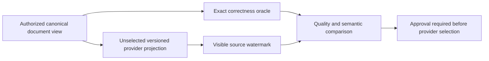

# ADR-009: Search provider and projection boundaries

Status: **Proposed**; provider selection and format choices remain unresolved. Existing source behavior is summarized by [Search](../Features/Search.md); product source: [sections 10–12 and 26–27](../design/architecture-v0.3.uk.md).

## Context

Owner suggestion2026-10-03 explicitly adds ZoneTree.FullTextSearch as an evaluated
text-index candidate. [Pinned source review](../implementation/zonetree-fulltextsearch-review.md)
records TASK-SQLC-R4 / REQ-SQLC-010 / AC-SQLC-010 under ADR-065. Its independent
postings writes, token/hash/order and partial-cancellation behavior require the
existing projection/freshness/semantic contracts to be frozen and tested; no
package/provider decision or speed claim follows from source inspection.

Search combines canonical documents with scalar, text, vector, graph, and hybrid candidate paths. Provider choice affects native dependencies, index format, authorization, freshness, recovery, and performance. The product design prefers managed-first ANN exploration with an exact oracle but requires a qualified provider and dependency audit before selection.

## Proposed decision boundary

Keep canonical documents and authorization in KeyLoad. Search providers own derived, versioned projections with source positions, bounded resource use, rebuild/retirement lifecycle, and caller-visible freshness. Preserve an exact path as the correctness oracle for any approximate path. Do not bind the product to a named provider or announce a provider-specific compatibility contract until the open questions below are resolved.

## Rationale, alternatives, consequences

Provider-neutral interfaces preserve the ability to compare managed and native options. Selecting a provider now would imply support and migration obligations unsupported by the current qualification packet. Exact-only search is a useful correctness baseline but may not meet future scale requirements; ANN is optional and its approximation is not canonical truth.

## Unresolved questions

Choose provider/licensing/native dependency policy; define vector codec and index upgrade; set supported dimensions/metrics and exact-vs-approximate semantics; define rebuild cut/watermark and stale-document handling; establish quality/performance budgets and capability manifest. Strong planner approval is required before converting this Proposed decision into an implementation contract.

## Related requirements

Search `REQ-SR-001..005`/`AC-MP-003..005`; DocumentStorage `REQ-DSTORE-002`/`AC-DSTORE-002`; `REQ-DOCS-006` forbids presenting a planned provider as selected. Related [Search](../Features/Search.md), [DocumentStorage](../Features/DocumentStorage.md), and ADR-006/010/015.

## Implementation contract after decision freeze

1. Decision owner records alternatives, selected provider/version/license, exact projection schema, freshness and rollback compatibility.
2. Add real-store oracle, authorization, crash/rebuild, malformed vector, and provider-specific recovery/quality tests before wiring a provider.
3. Target ownership is `src/KeyLoad.Query/Features/Search/`, the existing search technical root, with provider-isolated code under the same canonical slice; shared contracts remain in Abstractions only after approval.
4. Rollout is opt-in by capability, backfills a new generation, compares against exact results, then swaps at a verified cut; rollback returns to retained prior generation. No provider is required by this ADR while Proposed.
5. GitHub CI must qualify provider tests and source/license artifacts. Search owner joins root review with version, native dependency audit, raw test artifacts, and unresolved-risk list.

Dependencies: [ADR-004](ADR-004-committed-read-views.md), [ADR-006](ADR-006-strict-derived-indexes.md), [ADR-010](ADR-010-query-budgets-security.md), [ADR-011](ADR-011-format-upgrades.md), [ADR-015](ADR-015-sensitive-data-lineage.md), [ADR-016](ADR-016-atomic-physical-placement.md), [ADR-018](ADR-018-global-rank-fusion.md), and [ADR-019](ADR-019-managed-ann.md). Escalate any public contract or dependency addition before implementation.

