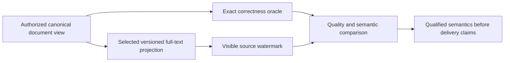

# ADR-009: Search provider and projection boundaries

Status: **Accepted text-provider selection** under ADR-071; ANN selection and projection-format implementation contracts remain unresolved. Existing source behavior is summarized by [Search](../Features/Search.md); product source: [sections 10–12 and 26–27](../design/architecture-v0.3.uk.md).

## Context

Owner selection2026-10-03 fixes ZoneTree.FullTextSearch as the text-index provider
under [ADR-071](ADR-071-canonical-zonetree-providers.md). [Pinned source review](../implementation/zonetree-fulltextsearch-review.md)
records TASK-SQLC-R4 / REQ-SQLC-010 / AC-SQLC-010 under ADR-065. Its independent
postings writes, token/hash/order and partial-cancellation behavior require the
existing projection/freshness/semantic contracts to be frozen and tested; no
speed claim follows from source inspection; the separate owner decision fixes provider choice.

Search combines canonical documents with scalar, text, vector, graph, and hybrid candidate paths. Provider choice affects native dependencies, index format, authorization, freshness, recovery, and performance. The product design prefers managed-first ANN exploration with an exact oracle but requires a qualified provider and dependency audit before selection.

## Proposed decision boundary

Keep canonical documents and authorization in KeyLoad. Search providers own derived, versioned projections with source positions, bounded resource use, rebuild/retirement lifecycle, and caller-visible freshness. Preserve an exact path as the correctness oracle for any approximate path. ZoneTree.FullTextSearch is the selected text provider; freeze its versioned projection contract and qualify semantics before advertising provider compatibility. ANN selection remains open.

## Rationale, alternatives, consequences

Provider-neutral interfaces preserve the ability to compare managed and native options. The selected text provider still requires support, projection-rebuild, and qualification contracts. Exact-only search is a useful correctness baseline but may not meet future scale requirements; ANN is optional and its approximation is not canonical truth.

## Unresolved questions

Pin the selected text provider package/source/license and native dependency policy; choose the ANN provider; define vector codec and current index-generation behavior; set supported dimensions/metrics and exact-vs-approximate semantics; define rebuild cut/watermark and stale-document handling; establish quality/performance budgets and capability manifest. The planner must freeze the remaining implementation contracts before delegated provider writes.

## Related requirements

Search `REQ-SR-001..005`/`AC-MP-003..005`; DocumentStorage `REQ-DSTORE-002`/`AC-DSTORE-002`; `REQ-DOCS-006` forbids presenting a planned provider as selected. Related [Search](../Features/Search.md), [DocumentStorage](../Features/DocumentStorage.md), and ADR-006/010/015.

## Implementation contract after decision freeze

1. Decision owner records alternatives, selected provider/version/license, exact projection schema, freshness, and rollback behavior.
2. Add real-store oracle, authorization, crash/rebuild, malformed vector, and provider-specific recovery/quality tests before wiring a provider.
3. Target ownership is `src/KeyLoad.Query/Features/Search/`, the existing search technical root, with provider-isolated code under the same canonical slice; shared contracts remain in Abstractions only after approval.
4. Enable only an explicitly qualified capability, build a new derived generation from canonical data, compare against exact results, then publish it at a verified cut; rollback returns to a retained complete generation. The selected text provider is mandatory; ANN remains unselected until its own contract is accepted.
5. GitHub CI must qualify provider tests and source/license artifacts. Search owner joins root review with version, native dependency audit, raw test artifacts, and unresolved-risk list.

Dependencies: [ADR-004](ADR-004-committed-read-views.md), [ADR-006](ADR-006-strict-derived-indexes.md), [ADR-010](ADR-010-query-budgets-security.md), [ADR-015](ADR-015-sensitive-data-lineage.md), [ADR-016](ADR-016-atomic-physical-placement.md), [ADR-018](ADR-018-global-rank-fusion.md), and [ADR-019](ADR-019-managed-ann.md). Escalate any public contract or dependency addition before implementation.

## TASK-KL028-SELECTED-PROVIDER-CAPABILITY-AUDIT-001

REQ-FTS-AUDIT-001 / AC-FTS-AUDIT-001 freezes original KL028 selected-provider audit: retain centrally pinned ZoneTree.FullTextSearch1.0.9/ZoneTree1.9.8 and native IndexOfTokenRecordPreviousToken<ulong,ulong> derived generation. No alternative provider selection. API/test-backed capability matrix:

|Capability|Actual ownership/API|Exact proof/boundary|
|---|---|---|
|Token postings and bounded candidates|NativeTextIndex.Open native primary index, configured synchronous native WAL; native range/token/record keys|NativeTextProjectionParityTests and hash-collision arguments; candidate completeness/revalidation remain KeyLoad-owned|
|English/Ukrainian Unicode query|KeyLoad frozen canonical tokenizer→native token postings→authorized canonical documents|New NativeTextBilingualLifecycleTests exact hello/ПРИВІТ references/fullJSON/revision/redaction and one-branch rank1/61|
|Ranking|KeyLoad exact lexical corpus scoring and RRF over canonical scoped cut|Existing native-vs-canonical Unicode scores/ties/hybrid; no native BM25 promise from postings API|
|Delete and immutable command replay|Canonical authorized DeleteDocument atomic command, source-cut generation replacement|New delete removes only Ukrainian result; complete same-ID receipt bytes/store-position/allbytes stable; English unchanged|
|Native reopen/rebuild|Dispose selected native projection and canonical ZoneTree, reopen canonical owner and same native projection root|New deleted output/English full literal retained, unknown principal denied with full-store no-effect, healthy continuation|
|Authorization/freshness|Persisted canonical policy/readcut governs candidates|Existing NativeTextProjectionAuthorityTests revocation/hidden rows/field denial/stale revision; new unknown-principal denial|
|Analyzer/stemming/stopwords/phrase/public grammar|Not exposed by current KeyLoad public text profile|Explicit unsupported/unavailable capabilities, no inferred provider parity or silently selectable analyzer|
|Formats/migration|Current typed owned projection manifest/index generation; disposable rebuild only|Existing malformed/unknown/link native projection tests; no Lucene index compatibility, migration or legacy fallback|

AC pass requires actual new native normal/scalar test plus original existing parity/authority/restart outcomes bound to same-source compile identities. No small corpus performance/recall/license delivery claim; RF3/package signature/resource/endurance gates remain independent. New case uses real ZoneTree and selected native provider, no fake/tokenizer injection/product seam. Docs/ADR freeze precedes assembled implementation; root owns join/build/native execution. Rollback removes only audit regression/docs, stored formats/dependencies unchanged.

R2: independent original delete commandId/partition/position and single full literal mutation bytes (deleteDocument, collection, Ukrainian ID, revision2), exact outer immutable operation ID on first submit and replay, full replay receipt/allstore/position preserved; final healthy postdenial cut equality required. Source-only; native execution remains pending.
