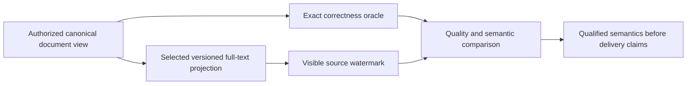

# ADR-009: Search provider and projection boundaries

Status: **Accepted text-provider selection** under ADR-071; ANN selection and projection-format implementation contracts remain unresolved. Existing source behavior is summarized by [Search](../Features/Search.md); product source: [sections 10–12 and 26–27](../design/architecture-v0.3.uk.md).

## Context

Owner selection2026-10-03 fixes ZoneTree.FullTextSearch as the text-index provider
under [ADR-071](ADR-071-canonical-zonetree-providers.md). [Pinned source review](../implementation/zonetree-fulltextsearch-review.md)
records TASK-SQLC-R4 / REQ-SQLC-010 / AC-SQLC-010 under ADR-065. Its independent
postings writes, token/hash/order and partial-cancellation behavior require the
existing projection/freshness/semantic contracts to be frozen and tested; no
speed claim follows from source inspection; the separate owner decision fixes provider choice.

Search combines canonical documents with scalar, text, vector, graph, and hybrid candidate paths. Provider choice affects native dependencies, index format, authorization, freshness, recovery, and performance. The product design prefers managed-first ANN exploration with an exact oracle but requires a qualified provider and dependency audit before selection.

## Proposed decision boundary

Keep canonical documents and authorization in KeyLoad. Search providers own derived, versioned projections with source positions, bounded resource use, rebuild/retirement lifecycle, and caller-visible freshness. Preserve an exact path as the correctness oracle for any approximate path. ZoneTree.FullTextSearch is the selected text provider; freeze its versioned projection contract and qualify semantics before advertising provider compatibility. ANN selection remains open.

## Rationale, alternatives, consequences

Provider-neutral interfaces preserve the ability to compare managed and native options. The selected text provider still requires support, projection-rebuild, and qualification contracts. Exact-only search is a useful correctness baseline but may not meet future scale requirements; ANN is optional and its approximation is not canonical truth.

## Unresolved questions

Pin the selected text provider package/source/license and native dependency policy; choose the ANN provider; define vector codec and current index-generation behavior; set supported dimensions/metrics and exact-vs-approximate semantics; define rebuild cut/watermark and stale-document handling; establish quality/performance budgets and capability manifest. The planner must freeze the remaining implementation contracts before delegated provider writes.

## Related requirements

Search `REQ-SR-001..005`/`AC-MP-003..005`; DocumentStorage `REQ-DSTORE-002`/`AC-DSTORE-002`; `REQ-DOCS-006` forbids presenting a planned provider as selected. Related [Search](../Features/Search.md), [DocumentStorage](../Features/DocumentStorage.md), and ADR-006/010/015.

## Implementation contract after decision freeze

1. Decision owner records alternatives, selected provider/version/license, exact projection schema, freshness, and rollback behavior.
2. Add real-store oracle, authorization, crash/rebuild, malformed vector, and provider-specific recovery/quality tests before wiring a provider.
3. Target ownership is `src/KeyLoad.Query/Features/Search/`, the existing search technical root, with provider-isolated code under the same canonical slice; shared contracts remain in Abstractions only after approval.
4. Enable only an explicitly qualified capability, build a new derived generation from canonical data, compare against exact results, then publish it at a verified cut; rollback returns to a retained complete generation. The selected text provider is mandatory; ANN remains unselected until its own contract is accepted.
5. GitHub CI must qualify provider tests and source/license artifacts. Search owner joins root review with version, native dependency audit, raw test artifacts, and unresolved-risk list.

Dependencies: [ADR-004](ADR-004-committed-read-views.md), [ADR-006](ADR-006-strict-derived-indexes.md), [ADR-010](ADR-010-query-budgets-security.md), [ADR-015](ADR-015-sensitive-data-lineage.md), [ADR-016](ADR-016-atomic-physical-placement.md), [ADR-018](ADR-018-global-rank-fusion.md), and [ADR-019](ADR-019-managed-ann.md). Escalate any public contract or dependency addition before implementation.

## TASK-KL028-SELECTED-PROVIDER-CAPABILITY-AUDIT-001

REQ-FTS-AUDIT-001 / AC-FTS-AUDIT-001 freezes original KL028 selected-provider audit: retain centrally pinned ZoneTree.FullTextSearch1.0.9/ZoneTree1.9.8 and native IndexOfTokenRecordPreviousToken<ulong,ulong> derived generation. No alternative provider selection. API/test-backed capability matrix:

|Capability|Actual ownership/API|Exact proof/boundary|
|---|---|---|
|Token postings and bounded candidates|NativeTextIndex.Open native primary index, configured synchronous native WAL; native range/token/record keys|NativeTextProjectionParityTests and hash-collision arguments; candidate completeness/revalidation remain KeyLoad-owned|
|English/Ukrainian Unicode query|KeyLoad frozen canonical tokenizer→native token postings→authorized canonical documents|New NativeTextBilingualLifecycleTests exact hello/ПРИВІТ references/fullJSON/revision/redaction and one-branch rank1/61|
|Ranking|KeyLoad exact lexical corpus scoring and RRF over canonical scoped cut|Existing native-vs-canonical Unicode scores/ties/hybrid; no native BM25 promise from postings API|
|Delete and immutable command replay|Canonical authorized DeleteDocument atomic command, source-cut generation replacement|New delete removes only Ukrainian result; complete same-ID receipt bytes/store-position/allbytes stable; English unchanged|
|Native reopen/rebuild|Dispose selected native projection and canonical ZoneTree, reopen canonical owner and same native projection root|New deleted output/English full literal retained, unknown principal denied with full-store no-effect, healthy continuation|
|Authorization/freshness|Persisted canonical policy/readcut governs candidates|Existing NativeTextProjectionAuthorityTests revocation/hidden rows/field denial/stale revision; new unknown-principal denial|
|Analyzer/stemming/stopwords/phrase/public grammar|Not exposed by current KeyLoad public text profile|Explicit unsupported/unavailable capabilities, no inferred provider parity or silently selectable analyzer|
|Formats/migration|Current typed owned projection manifest/index generation; disposable rebuild only|Existing malformed/unknown/link native projection tests; no Lucene index compatibility, migration or legacy fallback|

AC pass requires actual new native normal/scalar test plus original existing parity/authority/restart outcomes bound to same-source compile identities. No small corpus performance/recall/license delivery claim; RF3/package signature/resource/endurance gates remain independent. New case uses real ZoneTree and selected native provider, no fake/tokenizer injection/product seam. Docs/ADR freeze precedes assembled implementation; root owns join/build/native execution. Rollback removes only audit regression/docs, stored formats/dependencies unchanged.

R2: independent original delete commandId/partition/position and single full literal mutation bytes (deleteDocument, collection, Ukrainian ID, revision2), exact outer immutable operation ID on first submit and replay, full replay receipt/allstore/position preserved; final healthy postdenial cut equality required. Source-only; native execution remains pending.

## TASK-KL027-AUTHORITATIVE-VECTOR-PROFILE-001

REQ-VECTOR-PROFILE-001: a collection may declare a bounded server-persisted immutable set of field vector profiles through the existing authenticated ConfigureResource command. Each typed VectorFieldProfile binds canonical JSON pointer Field to full VectorSpace(Id,Dimension,Metric,Model,Version). ResourceDefinition gains new native Id13 VectorProfiles, default empty; VectorFieldProfile has stable GenerateSerializer/Alias and Id0Field/Id1Space. Existing aliases/IDs never move. No new transport/operation enum. Empty profiles retain explicitly unrestricted existing collection semantics; a configured field has an authoritative expected profile. First release only, no format fallback/migration or silent new interpretation of valid existing vectors.

AC-VECTOR-PROFILE-001: actual native ConfigureResource persists profile, same-ID exact replay is immutable; missing/duplicate/noncanonical field, null profile item, malformed identifiers, invalid metric/dimension and more than32 field profiles reject exact Validation/ResourceExhausted with native canonical outcome semantics and no configured resource effect. Profiles are collection-only. Existing policy-only ResourcePolicyUpdates fingerprint forbids profile mutation, including valid admin replacement; no profile-changing migration introduced.

REQ-VECTOR-PROFILE-002: every canonical vector publication (direct PutVector and ApplyVectorProjection) compares declared full profile with the persisted configured field after fresh persisted operation/field/row authorization and current target revision but before vector/lineage publication. Invalid coordinates/dimensions retain existing exact Validation diagnostic. Well-shaped wrong configured profile yields Validation / 'The declared vector profile does not match the configured field.' No embedding-model inference from numeric values. Authorization retains precedence and no profile metadata disclosure.

AC-VECTOR-PROFILE-002: native real same-partition mixed document+PutVector batch with correct dimension but wrong declared model must return exact Validation once, reset complete document/vector/lineage/source effects, persist complete failed receipt once and advance canonical position exactly once. Identical immutable command/principal repeated call retains identical outcome bytes and stable position; changed-content sameID remains distinct Conflict. Then fresh correct-model document/vector revision2 commits atomically with literal document/sidecar/full exactsearch ranking, preserves rival state, native reopen/replay; unauthorized wrong-profile caller remains denied without revealing profile. Both direct vector and actual authorized lineage projection paths enforced.

REQ-VECTOR-PROFILE-003 / AC-VECTOR-PROFILE-003: public ConfigureResource JSON, generated native Orleans serializers and SDK/official MCP/shared SQL operations carry the same typed bounded profile declaration. Exact operation schemas/digests/closed tool catalogue/source inventory must be updated from actual DTO/schema generation; no manual fake schema, new dispatcher or LocalImage whitelist expansion. Valid search query for a different model keeps existing empty incompatible-candidate result; this does not substitute for configured write mismatch rejection. Real transport negative/healthy whole-flow cases remain mandatory, plus native normal/scalar/process/RF3/Linux qualification. No SIMD acceleration, ANN/performance or originalKL027 closure until original missing criterion actually passes.

Ordered owners and join: (1) freeze this Search/ADR contract; (2) Abstractions Search Contracts VectorFieldProfile + feature Serialization alias, additive ResourceDefinitionId13; (3) Core Search Validation authoritative-profile validator plus direct/lineage publication callers; ResourceConfiguration calls bounded typed schema validator; (4) ClientApi shared generated schemas/current JSON decoder bindings and owning source goldens; SDK/SQL reuse ConfigureResource DTO; (5) actual UnitTests Search profile configuration/mixedatomic failure/replay/fullstate/healthy/reopen + projection parity; public Integration Search existing real fixture SDK/officialMCP/SQL regression; (6) root guarded join/build/format/native census/fullnormal/scalar/recovery/RF3/Linux. No product tasks relocated/detached. Rollback before release removes only new field/validator/tests/contracts; no stored-format downgrade promise. Dependency versions unchanged. Root reviews implementation and owns live writes/builds/tests/Git.

Private implementation maps both actual publication paths to VectorFieldProfiles.Require, with projection validation before prior effect lookup/reuse. Native generated public JSON/MCP/SQL decoder/schema types recurse through additive ResourceDefinition.VectorProfiles and VectorFieldProfile; no separate schema or transport dispatcher. New ConfiguredVectorProfileTests (direct and lineage), ConfiguredVectorProfileSchemaTests, and ConfiguredVectorProfileRf3Tests (SDK/officialMCP/SDKSQL/officialMCPSQL) are authored whole-flow gates, not native PASS. Empty-profile original callers remain unrestricted. Root owns actual fresh generated schema/census/full Linux execution.

R2 admission boundary: explicit public VectorProfiles:null decodes to a default ImmutableArray and retains existing strict native fatal Corruption ("The internal binary payload is invalid.") before Core admission and receipt persistence. No failed receipt or replay success is invented for that malformed array. ConfiguredVectorProfileNullArrayTests submits genuine raw JSON null through embedded normalization and the actual MCP HeaderCommand decoder, requires exact full native bytes/cut unchanged, then the same previously uncommitted ID configures the valid typed definition and replays its exact healthy outcome. Null items instead reach bounded Core Validation. Generic native serializer and transport semantics remain unchanged. Official MCP model rejection retains full error envelope assertions and exact literal Mismatch detail.

## TASK-KL028-RF3-IMMUTABLE-TEXT-REPLAY-001

REQ-FTS-AUDIT-001 / AC-FTS-AUDIT-001 and REQ/AC-FTS-005: extend the existing AcFts005UpdatedTextAndNativeProjectionRecoverAcrossLeaderLossAndRestart flow, retaining its original SDK atomic text/vector update and delete command and complete quorum receipt. After elected leader kill and existing actual survivor readiness, freshly connect the official MCP administrator and submit the exact original immutable command ID/payload once. Require all complete native receipt bytes equal the original; independently check command ID, atomic partition, positive native token authority, durability and all three literal mutation receipts. No replay loop or accepted OwnershipLost branch.

Before and after replay and after all original nodes rejoin, SDK and official MCP search must equal independent complete ordered literal document/rank oracles: replaced English text, removed Ukrainian/original English postings, surviving vector ranking and deleted document absence. Canonical document revision remains2 and deleted document remains absent. Current redaction policy and original caller identity are retained. There is no cross-node cut equality claim; replay retains the historical token exactly. Original resource restart/diagnostics/primary and cleanup ownership, deadlines and closed coverage inventory are unchanged. No LocalImage selector expansion.

Ownership: existing Search/Cases/NativeTextRf3LeaderLossTests.cs plus feature-local Search/Assertions/NativeTextRf3ReplayAssertions.cs. Root joins and executes native RF3 filter /*/*/NativeTextRf3LeaderLossTests/AcFts005UpdatedTextAndNativeProjectionRecoverAcrossLeaderLossAndRestart. Actual original Linux AcFts005 PASS is historical; these added assertions require a new exact-source native execution. No KL028 closure, full-provider/BM25/resource/performance qualification claimed.

## TASK-KL033-AUTHORIZED-HYBRID-EXPLAIN-001

REQ-SEARCH-EXPLAIN-001 / AC-SEARCH-EXPLAIN-001: opt-in SearchRequest.Explain (native Id12, default false) adds optional RankedDocument.Explanation (Id2, omitted JSON when absent), shared by ordinary and graph retrieval via GraphSearchRequest.Search. Typed v1 SearchHitExplanation contains FusionConstant and at most three ordered SearchBranchContribution records: fixed Text/Vector/Graph enum, actual one-based native rank after existing authorization/allowlist/graph scope and deterministic branch order, configured weight, exact weight/(FusionConstant+rank) double contribution. Final score remains the existing deterministic RankedDocument.Score; branch contributions use the same existing arithmetic evaluation/order. No raw similarity, term statistics, hidden candidate IDs, paths, query payload, private inventory or new ranking algorithm. Contributions describe only actual positive-weight fused branches; default ranking/JSON remains unchanged, including current zero-weight behavior.

REQ-SEARCH-EXPLAIN-002 / AC-SEARCH-EXPLAIN-002: capture actual already-computed contribution values only when requested; maximum three ordered contributions per authorized canonical EntityRef, candidate count constrained by existing native branch work/window bounds. Before retaining each contribution, exact serialized contribution bytes cumulatively must fit existing MaximumResultBytes; an oversized individual contribution uses existing result-byte error, cumulative capture overflow gives BudgetExceeded with safe detail The search explanation byte budget is exceeded. Selected-hit contribution lookup checks the original shared read budget/cancellation; no new readcut, principal reload, dispatcher or unbounded enumeration. Include complete metadata in existing exact cumulative result byte measurement before retaining each hit and final array. Budget rejection/cancellation exposes no partial success and does not mutate canonical store.

REQ-SEARCH-EXPLAIN-003 / AC-SEARCH-EXPLAIN-003: real ZoneTree wholeflows compare independent weighted Text/Vector/Graph scores/contributions, ordinal ties, allowed-candidate changes, denied field/hidden entity privacy, original cancellation/fullstore+cut/no partial then full literal healthy. Real RF3 SDK/official MCP and Q1 CALL graph-search operation carries actual opt-in typed request and complete result metadata through existing routes/schema; no new operation tool or named SQL dialect syntax. Qrels/window acceptance remains separately bound to approved cohort and existing internal GlobalBranchWindows contract; allowlist changes are not advertised as measured relevance-window qualification. No rerank/BM25/public candidate-window knob introduced.

Ownership: Abstractions Search/Contracts; Query Search/Queries existing fusion+projection+ordinary/graph execution; owning Unit/Integration Search flow roles. Native aliases and existing IDs retained; new aliases keyload.search.hit-explanation.v1 and keyload.search.branch-contribution.v1. No persisted format migration/fallback; new typed fields must be rebuilt together. Root joins/builds/runs all native and Linux gates; no source-authored PASS or KL033 closure. Rollback removes opt-in field/metadata and authored flows only before release, without modifying raw authority/provider.

R2 test ownership: DeniedExplainAndOriginalCancellationReturnNoPartialResultBeforeHealthyLiteralRead now cancels the original caller token synchronously from the existing owning TimeProvider only after same-store native RangeExaminedBytes increases. No asynchronous polling, sleeps, record padding, production hook or fake storage. Joined SearchEngine worker settles before fullstore/cut checks and healthy literal flow. Existing approved qrels/window gate remains separate.

# KL034 selected native FTS prefix wait — proposed bounded implementation contract

Original KL034 is Search freshness contract (architecture-v0.3.uk.md), not ANN availability. TASK-KL034-NATIVE-FTS-WAIT-001 maps REQ-SEARCH-004/005 and new REQ-SEARCH-WAIT-001/002/003 to AC-SEARCH-WAIT-001/002/003, ADR-009 and ClientApi shared-operation ownership. This packet is source implementation only; native execution, RF3 and original task closure remain pending.

1. A generated, aliased WaitForIndexRequest contains Partition, Collection, TextField and MinimumToken (existing CommitToken). A generated result contains the actual current applied CommitToken and the authorized resource SchemaVersion and principal PolicyEpoch. It does not expose principal identity, physical node ID, local file paths, document counts, hidden rows, posting counts or an invented persisted index watermark.
2. The standalone read enters the existing unique request actor/CQRS read dispatcher and fresh quorum/applied barrier. In its single canonical read cut, fresh persisted Query|DocumentsRead and field-use authorization precede token/provider diagnostics. Validate exact incarnation, atomic partition and physical placement epoch plus positive minimum position against actual persisted AppliedBytes. Missing/invalid AppliedBytes is Corruption; future or wrong-scope token is TokenInvalidated. Local ZoneTree Store.Position is used only by the existing native TextProjectionScope, never as replicated prefix authority. The returned applied token is constructed from the same placement witness and AppliedBytes.
3. Selected native FTS is mandatory for this operation. Without the selected provider, return UnsupportedCapability; ANN remains gated. Acquire the actual current-generation native projection lease. Visit all visible canonical documents using existing budgeted visitor and canonical field tokenizer, BeginRecord/ObserveToken each actual record/token, then complete existing native VerifyCandidates with empty terms/candidates to verify complete corpus visitation and publish a newly built generation. Empty verification requests do not rank a fabricated query. Existing generation mismatch/corruption errors and native generation quotas remain unchanged.
4. The operation returns only after successful publication/verification and joined native lease settlement. A pinned lease protects its generation under existing owner lifecycle. The original shared ReadExecutionBudget bounds admission, raw scan, token work, physical native projection, timeout, cancellation and result bytes; no polling, retry, custom timeout or admin privilege. Failure/cancellation returns no partial result. Canonical data, receipts and replication position are unchanged. Projection state is disposable and may be retired/rebuilt under existing failure rules.
5. SDK, HTTP, official MCP discovery/schema/effect hints and Q1 existing CALL invoke this one typed operation. A new discovery-only tool does not widen initial operation exposure or local-image qualification whitelist. No SELECT grammar or window syntax is introduced. Default search behavior and ranking remain unchanged.
6. Actual native tests must prove acknowledged prefix success, wrong scope/future token, fresh field denial, elapsed deadline and cancellation after observed real work, full canonical image/cut invariance and subsequent healthy literal text ranks. Actual SDK/official MCP/Q1 CALL must use an acknowledged token, compare full typed wait results on an owning node/cut where comparable and then independent literal search results. Node cuts must not be assumed equal across nodes. Required after-join Linux normal/scalar/RF3 qualification is explicit and unexecuted.

REQ-SEARCH-WAIT-001 / AC-SEARCH-WAIT-001 → NativeTextWaitForIndexTests.RejectedMinimumPrefixRetainsCompleteStoreThenNativePublicationReturnsLiteralHealthy (future/wrong-incarnation two native cases); same-cut applied token authority and complete healthy literal Ukrainian/English output. REQ-SEARCH-WAIT-002 / AC-SEARCH-WAIT-002 → NativeTextWaitObservedWorkTests.ActualNativePublicationWorkCancellationOrDeadlineSettlesWithoutPartialThenLiteralHealthy (original cancellation/deadline two cases); real native range-work, exact safe errors/no partial, full canonical bytes/cut and complete healthy output. REQ-SEARCH-WAIT-003 / AC-SEARCH-WAIT-003 → NativeTextWaitRf3Tests.AcknowledgedNativeTextPrefixSdkOfficialMcpAndQ1CallRejectDeniedThenPublishHealthyAndExcludeDeleted; actual persisted ordinary identity, protected field denial, SDK/official MCP and both existing Q1 CALL routes, complete result parity and literal deleted-document exclusion. Existing native catalog/decode cases verify shared generated schemas and71 operations/30 body read DTOs as supporting controls, not product operation evidence. All execution evidence is pending root native runs.

### R654 native inventory publication contract

REQ-FTS-INC-INVENTORY-002: The writable native owner settles eviction and joins native background work, then saves native ZoneTree metadata before disposal and exact complete inventory capture. Native single-segment garbage collection is disabled for this sealed disposable projection, so opening a generation cannot compact its sealed mutable WAL. All files, sizes and hashes remain mandatory; selected reads cannot refresh inventory or rebuild authority.

AC-FTS-INC-INVENTORY-002: Existing maintained bilingual update/delete/Restore, observed posting cancellation and reader-drain/cold-owner operations must return their full literal healthy pages with unchanged canonical cuts and exact inventory checks. The damaged-manifest operation must fail with the owned projection Corruption detail, preserve complete canonical state, then exact repair must restore its literal healthy operation. R654 original failures remain retained; this source correction is unexecuted.

Implementation: NativeTextIndex native factory option; NativeTextIncrementalNativeOwner original eviction then native SaveMetaData then joined disposal; NativeTextEnvelopeCodec maps only native Corruption at the owned envelope boundary to ProjectionCorrupt. No serialization fallback, file omission, format change, new deadline or provider replacement.

### TASK-KL034-NATIVE-WAIT-AUTHORITY-002

REQ-SEARCH-WAIT-001 / AC-SEARCH-WAIT-001 retains the existing exact token/applied
authority contract. SearchWaitAuthorityTests adds genuine native wrong atomic
partition, changed placement epoch and zero minimum-position refusals, plus
missing/negative persisted canonical AppliedBytes. Each actual WaitForIndex call
returns its existing exact TokenInvalidated or Corruption detail, no partial
result, and unchanged complete native bytes/cut. The metadata trials save and
restore only the exact actual original native applied row under joined fixture
ownership; restoration is test corruption repair, not a migration/production
recovery or manufactured new read authority. Its intentional repair commit may
advance the local storage cut; healthy wait must report the original actual
replica-applied token, never that local Store.Position. Full independently literal
WaitForIndexResult/schema/policy plus bilingual document/rank pages and complete
canonical cut/image invariance prove healthy continuation. Original assertion
and fixture/projection cleanup/restore errors are all retained.

Canonical source ownership: Unit Search Cases/SearchWaitAuthorityTests.cs,
Helpers/SearchWaitAuthorityTrial.cs and Assertions/SearchWaitAuthorityState.cs;
existing actual ReplicaAppliedPositionWaitFixture, native projection and public
SearchEngine own the real operations. No mock/provider/new dispatcher/timer,
new timeout/default/token/API/alias/format or policy change. Root guarded join,
coherent build, exact fresh native metadata and normal/scalar native controls and the existing real Linux RF3 scope qualify
the source; authored case counts are not discovery or pass evidence. Existing
KL02958/18/9 scope and all mandatory global suites remain unchanged.

Broader KL034 remains explicit: current WaitForIndexRequest selects NativeText
only. ApproximateSearchRequest has no minimum token or wait selector; existing
ANN pins/stale-generation/replay/public reads do not by themselves implement an
ANN minimum-prefix wait. This initial FTS boundary cannot silently close broader
required projection waiting/generation criteria. Any additive ANN wait interface
requires its own accepted generated contract, authority/lifecycle/budget and
real SDK/official MCP/Q1 complete-flow qualification. No new public API is
invented here and no broader capability is declared complete.

### TASK-KL034-NATIVE-PROVIDER-FAILURE-003

REQ-SEARCH-WAIT-002 / AC-SEARCH-WAIT-002 and REQ/AC-SEARCH-005 preserve
WaitForIndexExecution's existing unavailable-provider failure. The same actual
replica-applied seed, fresh authorized native canonical view and original
minimum token are passed to a real SearchEngine with its supported absent
native text provider. Its actual operation must return the exact existing
UnsupportedCapability detail, null partial result and unchanged complete
canonical image/cut. The actual registered native projection then completes
WaitForIndex with independently literal complete result and bilingual document
rank pages, preserving the whole native canonical image/cut. No provider fake,
fallback, configuration/default, timeout, token, public API or production code
change is introduced. All initiating and native fixture/projection cleanup
failures remain joined and retained. This adds one source-declared case to
SearchWaitAuthorityTests; fresh native metadata and normal/scalar execution are
required, not inferred. Existing KL02958/18/9 remains unchanged. Root owns join,
compiler, runtime verification and final original-task closure; all mandatory
Linux full-suite/RF3/product qualification gates remain required.
