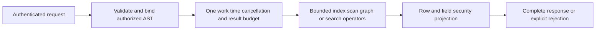

# ADR-010: Bounded query execution and security barriers

Status: Accepted; end-to-end qualification pending. Related current baseline: [QueryExecution](../Features/QueryExecution.md), [ResourceExecution](../Features/ResourceExecution.md), and product source [sections 13–15, 23–26, and 29–30](../design/architecture-v0.3.uk.md).

## Context and decision

Queries combine parsing/planning, index/scan work, point dereferences, graph expansion, search branches, projection, and serialized response metadata. Unbounded stages can consume memory/CPU or leak data through filtering/ranking. A request carries one bounded cancellation/deadline/work/read/result budget through relevant operators. Authorization and row/field policy must be applied before data can affect an observable result; security barriers cannot be moved below a filter or ranking stage that reveals protected values.

## Rationale and consequences

One budget prevents each operator from independently spending the full limit. Explicit failure preserves honesty when completeness cannot be proven; partial results require a separately explicit contract. Typed authorized ASTs and field lineage prevent SQL/JSON/C# surface differences from bypassing policy. Budgets may reject large valid workloads and must be surfaced as stable errors.

## Related requirements

QueryExecution `REQ-QUERY-001..003`/`AC-MP-003`, GraphTraversal `REQ-GRAPH-002..004`, DocumentStorage `REQ-DSTORE-003`, EventStreams `REQ-EVENT-001..003`, and Search `REQ-SR-001..005`.

## Implementation contract

1. Freeze per-request budget dimensions, operator charge points, error behavior, and authorization-before-observation rules.
2. Add real tests for scan/index/point accounting, metadata/result bytes, cancel/deadline, hidden rows/fields, aliases, explain, and following-operation health.
3. Implement shared budgets under `src/KeyLoad.Abstractions/Features/ResourceExecution/` and `src/KeyLoad.Core/Features/ResourceExecution/`; each canonical slice owns its operators under `Features/<Slice>/`.
4. Any budget or policy change is versioned/configured explicitly; rollback restores the prior bound without allowing an unbounded fallback. Capability manifests list only operators with an enforced budget.
5. GitHub CI executes TUnit and real RF3 API scenarios with the same caller-visible errors; root joins security/search/query owners and checks retained diagnostics without sensitive payloads.

Dependencies: [ADR-004](ADR-004-committed-read-views.md), [ADR-006](ADR-006-strict-derived-indexes.md), [ADR-009](ADR-009-search-provider-boundaries.md), [ADR-013](ADR-013-authorized-query-ast.md), [ADR-014](ADR-014-principals-rbac-row-policy.md), [ADR-015](ADR-015-sensitive-data-lineage.md), [ADR-018](ADR-018-global-rank-fusion.md), [ADR-019](ADR-019-managed-ann.md), and [ADR-022](ADR-022-policy-epoch-revocation.md). Stop if an operator cannot prove complete bounded output or policy order; do not silently truncate.

## TASK-KL051-NORMALIZED-PLAN-ERROR-001 — actual adapter plans and vector attachment boundary

REQ-KL051-PLAN-001 / AC-KL051-PLAN-001 refine existing REQ-QUERY-004/005/006 and AC-QUERY-004/005/006 under ADR004/010/118. Real SQL named decimal/string parameters, preserved JSON AST with same typed parameters and native C# Q1 builder literal lowering execute same indexed predicate/order/projection. Actual EXPLAIN pages must byte-match all three inputs, with independent literal accessPath/atomicPartition/nativeScanBudget plan, complete literal rows/source revisions and full-store/position invariance. Fresh persisted denied principal must yield exact same PermissionDenied safe detail on all three actual input operations; no returned partial page. Following privileged full literal results must remain healthy. This is real executor work, not static normalized-AST getter equality.

REQ-KL051-VECTOR-001 / AC-KL051-VECTOR-001 map REQ-QUERY-007 and existing graph-search profile to actual SQL named vector-array attachment, typed C# GraphSearchRequest and its public JSON roundtrip. Persist two real cosine vectors/raw documents, execute SQL SearchSqlAsync and native GraphSearchAsync for both typed/public JSON inputs, compare complete results with independent literal document/entity/revision/JSON/rank score/empty expansion. Wrong dimension must reject exact Validation before native access, preserve full store/cut, then valid actual operation completes. SQL parser safe detail and typed-search validator safe detail are distinct existing contract messages and remain exact; code parity does not fabricate message equivalence.

Source-proven boundary: KeyLoadQuery<T> currently explicitly supports scalar Q1 expression lowering only; there is no C# LINQ vector attachment/parameter-marker API. SQL vector attachments use Q1.Search.v1/SqlGraphSearchRequest, not scalar SELECT. These tests do not introduce a builder/parallel planner or claim three-input LINQ vector plan equivalence. Original KL051 remains open for complete vector-builder lowering and equivalent public profile errors; actual supported subset may be qualified only after original native execution. No unsupported expression is silently evaluated client-side.

Ownership UnitTests QueryExecution Cases/Helpers, existing ZoneTree/TestDatabase/QueryEngine/SearchEngine and actual public KeyLoadQuery APIs. Docs then tests; root guarded join/format/build/current native discovery normal/scalar/recovery/RF3/Linux gates; preserve originals and no source-only PASS. Rollback only tests/appendix, no production/dependency/protocol change.
