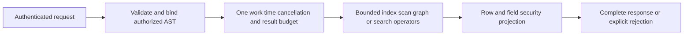

# ADR-010: Bounded query execution and security barriers

Status: Accepted; end-to-end qualification pending. Related current baseline: [QueryExecution](../Features/QueryExecution.md), [ResourceExecution](../Features/ResourceExecution.md), and product source [sections 13–15, 23–26, and 29–30](../design/architecture-v0.3.uk.md).

## Context and decision

Queries combine parsing/planning, index/scan work, point dereferences, graph expansion, search branches, projection, and serialized response metadata. Unbounded stages can consume memory/CPU or leak data through filtering/ranking. A request carries one bounded cancellation/deadline/work/read/result budget through relevant operators. Authorization and row/field policy must be applied before data can affect an observable result; security barriers cannot be moved below a filter or ranking stage that reveals protected values.

## Rationale and consequences

One budget prevents each operator from independently spending the full limit. Explicit failure preserves honesty when completeness cannot be proven; partial results require a separately explicit contract. Typed authorized ASTs and field lineage prevent SQL/JSON/C# surface differences from bypassing policy. Budgets may reject large valid workloads and must be surfaced as stable errors.

## Related requirements

QueryExecution `REQ-QUERY-001..003`/`AC-MP-003`, GraphTraversal `REQ-GRAPH-002..004`, DocumentStorage `REQ-DSTORE-003`, EventStreams `REQ-EVENT-001..003`, and Search `REQ-SR-001..005`.

## Implementation contract

1. Freeze per-request budget dimensions, operator charge points, error behavior, and authorization-before-observation rules.
2. Add real tests for scan/index/point accounting, metadata/result bytes, cancel/deadline, hidden rows/fields, aliases, explain, and following-operation health.
3. Implement shared budgets under `src/KeyLoad.Abstractions/Features/ResourceExecution/` and `src/KeyLoad.Core/Features/ResourceExecution/`; each canonical slice owns its operators under `Features/<Slice>/`.
4. Any budget or policy change is versioned/configured explicitly; rollback restores the prior bound without allowing an unbounded fallback. Capability manifests list only operators with an enforced budget.
5. GitHub CI executes TUnit and real RF3 API scenarios with the same caller-visible errors; root joins security/search/query owners and checks retained diagnostics without sensitive payloads.

Dependencies: [ADR-004](ADR-004-committed-read-views.md), [ADR-006](ADR-006-strict-derived-indexes.md), [ADR-009](ADR-009-search-provider-boundaries.md), [ADR-013](ADR-013-authorized-query-ast.md), [ADR-014](ADR-014-principals-rbac-row-policy.md), [ADR-015](ADR-015-sensitive-data-lineage.md), [ADR-018](ADR-018-global-rank-fusion.md), [ADR-019](ADR-019-managed-ann.md), and [ADR-022](ADR-022-policy-epoch-revocation.md). Stop if an operator cannot prove complete bounded output or policy order; do not silently truncate.

## TASK-KL051-NORMALIZED-PLAN-ERROR-001 — actual adapter plans and vector attachment boundary

REQ-KL051-PLAN-001 / AC-KL051-PLAN-001 refine existing REQ-QUERY-004/005/006 and AC-QUERY-004/005/006 under ADR004/010/118. Real SQL named decimal/string parameters, preserved JSON AST with same typed parameters and native C# Q1 builder literal lowering execute same indexed predicate/order/projection. Actual EXPLAIN pages must byte-match all three inputs, with independent literal accessPath/atomicPartition/nativeScanBudget plan, complete literal rows/source revisions and full-store/position invariance. Fresh persisted denied principal must yield exact same PermissionDenied safe detail on all three actual input operations; no returned partial page. Following privileged full literal results must remain healthy. This is real executor work, not static normalized-AST getter equality.

REQ-KL051-VECTOR-001 / AC-KL051-VECTOR-001 map REQ-QUERY-007 and existing graph-search profile to actual SQL named vector-array attachment, typed C# GraphSearchRequest and its public JSON roundtrip. Persist two real cosine vectors/raw documents, execute SQL SearchSqlAsync and native GraphSearchAsync for both typed/public JSON inputs, compare complete results with independent literal document/entity/revision/JSON/rank score/empty expansion. Wrong dimension must reject exact Validation before native access, preserve full store/cut, then valid actual operation completes. SQL parser safe detail and typed-search validator safe detail are distinct existing contract messages and remain exact; code parity does not fabricate message equivalence.

Source-proven boundary: KeyLoadQuery<T> currently explicitly supports scalar Q1 expression lowering only; there is no C# LINQ vector attachment/parameter-marker API. SQL vector attachments use Q1.Search.v1/SqlGraphSearchRequest, not scalar SELECT. These tests do not introduce a builder/parallel planner or claim three-input LINQ vector plan equivalence. Original KL051 remains open for complete vector-builder lowering and equivalent public profile errors; actual supported subset may be qualified only after original native execution. No unsupported expression is silently evaluated client-side.

Ownership UnitTests QueryExecution Cases/Helpers, existing ZoneTree/TestDatabase/QueryEngine/SearchEngine and actual public KeyLoadQuery APIs. Docs then tests; root guarded join/format/build/current native discovery normal/scalar/recovery/RF3/Linux gates; preserve originals and no source-only PASS. Rollback only tests/appendix, no production/dependency/protocol change.

## TASK-KL079-NATIVE-FEED-LIVE-001

REQ/AC-FEED-002/003/005 and REQ/AC-QUERY-001/003, AC-MP-003/012 retain one native owner read cut, persisted current/historical authorization, signed original cursors, gap-free snapshot/tail and no raw PII. ReadChangeFeed's existing two-argument API deliberately delegates to its new original-cancellation overload; no legacy path or schema. Original DatabaseEngine clock owns cursor expiry and operation deadline. One existing ReadExecutionBudget and read grant charge all actual raw storage bytes/record attempts before decode/copy, projected result retention and the complete final response. Request.MaxBytes still bounds change payload and preserves the first undelivered entry; it does not replace complete wrapper/read-work limits. Feed cancellation produces no returned partial page. Existing live reader/view budget and profile stay unchanged.

Order: this contract and canonical ChangeFeeds/ADR010 appendices precede source. Core owns public feed same-cut operation; Orleans forwards exact original token through existing native CQRS/unique request grain. Tests: native observed point-read cancellation/deadline -> original error/no partial/full canonical cut unchanged -> independent complete literal healthy feed/empty continuation; genuine Aspire RF3 SDK/official MCP reconnect, replay, historic/current row+field redaction, persisted revoke/token invalidation -> exact grant repair/fresh cursor -> healthy; live initial snapshot/concurrent committed writes/deltas/delete/current revocation -> ordinary query literal parity/healthy fresh subscription. Cold feed continuity is exercised by the RF3 reconnect case. SQL Q1 CALL uses existing tools/decoder, no new dialect/operation.

Ownership: existing Core ChangeFeeds.cs, existing Orleans GrainCoreReadCapabilities.cs, feature-local Unit and Integration ChangeFeeds roles, docs/Features/ChangeFeeds.md and ADR010 appendices. No shared fixture mutation, new option/quota/provider, alias/Id/default/deadline/protocol change. Root joins source and owns compiler/census/native normal+scalar/recovery/Linux RF3 qualification; source-authored arguments are not observed native counts or PASS. Original KL079 full criteria and mandatory full product/fault/endurance/coverage gates stay open. Rollback source stage only, no persisted migration.

## TASK-KL079-FULL-LIVE-PAGE-002

REQ/AC-FEED-002/003/005 and AC-MP-003/012 retain the existing six-field LiveQueryChange and five-field LiveQueryPage. Independent upsert revision2 and native tombstone revision3 come from the original stored document mutation, not a constructor overload. Complete SDK/official MCP/Q1 tail pages compare literal changes, through sequence, hasMore and the actual unchanged owning read cut. Each returned opaque cursor is nonempty and is consumed through the same real route; the complete empty continuation preserves through sequence, hasMore=false and the same unchanged cut. Cursor bytes are never fabricated or required to equal independently issued tokens. Current persisted revocation and obsolete-policy token failures cover SDK, official MCP and both Q1 routes, with no partial result, bracketed by existing full canonical no-effect checks; exact policy repair leads to a fresh healthy full page on all routes.

Order: feature/ADR contract, native constructor/delete semantic proof, bounded assertion helpers, unchanged two genuine RF3 case identities. No production schema/alias/Id, runtime option, timeout, topology or authorization change. Root owns fresh compiler/native census/Linux operations; this fixture correction alone does not qualify the whole task. Rollback removes only these fixture assertions and appendix together.

## TASK-KL079-COMPLETE-PAGE-COLD-003

REQ/AC-FEED-002/003/005 retain the same bounded polling/retention, current persisted privacy and six-field LiveQueryChange (original upsert revision2/delete revision3) contracts. The existing RF3 feed case must assert all seven page fields: complete independent literal changes, actual opaque cursor, exact through/tail/firstAvailable/hasMore, and actual read cut bounded by the original successful receipt. Fixture tail2 includes its hidden second row; updated tail3 follows only the actual acknowledged replacement. Each SDK, official MCP and both Q1 route consumes its own returned opaque cursor; the next page is the independently known hidden position or complete empty tail. Different issued cursor bytes/read cuts are not fabricated or required equal. Every original assertion remains.

The existing live RF3 case closes its actual original reader/administrator before genuine all-three fixture kill/restart, recreates fresh callers from the same persisted credentials and verifies original physical owner/incarnation and monotone observed generation (no +1/positive-initial assumption). The original pre-cold subscription cursor is then consumed for the actual fresh delete, exact native revision3/receipt/Remove and full page/empty continuation on all four routes, followed by persisted revocation, obsolete-policy token refusal, exact policy repair and fresh healthy snapshot/tail. This is continuation of the real original subscription, not resynchronizing under a replacement token. No connection-grain, public schema, limit/deadline, clock, topology or production behavior change.

Existing two `FeedLiveRf3Tests` identities are unchanged. Native discovery/source/PE/PDB and Linux normal/scalar outcomes plus actual owned resource/reader cleanup remain required; source review and local prior15 cases do not close the task. Existing Unit/projection process/native snapshot-install paths remain mandatory, with full product/endurance gates separate and open. Rollback removes only this fixture oracle/cold extension coherently; no state/format migration.

## TASK-KL079-SNAPSHOT-INSTALL-CURSOR-001

REQ/AC-FEED-002/005 and AC-REP-004 require the original public feed cursor across genuine empty-follower snapshot installation plus ordered tail and cold reopen. Extend the existing EmptyReplicaSnapshotScenario only with bounded read operations: after the original configuration/processing and denied-principal admission, before erase, capture a caught-up Start.Now cursor from the selected actual follower. Preserve that exact signed cursor, partition, incarnation and original outbox position. After the existing verified snapshot checksum, native ordered-tail entry and same installed-owner cold reopen, consume it through SDK, official MCP and both Q1 routes. Independently reconstruct all forty doc payloads plus the ordered-tail literal and revision1; validate sequence, current cut, authority, nondefault committed timestamps, original last-doc and tail receipts, complete seven-field pages and each route's empty continuation. No token bytes equality across separately issued responses.

Read-only additions do not change snapshot threshold16, suffix headroom, write cadence, existing three-minute deadline, membership, erase paths, grants, or startup. Native verification checks incarnation/current persisted policy/schema/visibility/expiry; NodeId is not a feed claim, so the genuine replacement follower must preserve this original cursor under unchanged authority. Any actual refusal is retained as a failure, never converted into resynchronization success. Existing revoke/redaction/history loss and live subscription cold controls remain mandatory. Implementation order: these docs and ADR010; fixture-only ChangeFeeds assertion; additive capture/verification calls in the existing erase/install case. Exact-source Linux normal/scalar, native UID/image/source and all cleanup gates remain unqualified. Rollback removes only these fixture assertions, no format/API/product change.

## TASK-KL079-REPAIRED-LIVE-COLD-004

REQ/AC-FEED-002/003/005: the same original ConcurrentSnapshotAndCommittedTailRemainGapFreePrivateAndRevocable RF3 case must retain its freshly authorized repaired-policy snapshot cursor, genuinely resurrect its original deleted row with original private payload/owner (previous native revision3, new revision4, outbox sequence5), and receive the full independent redacted upsert plus complete empty continuation through SDK, official MCP and both Q1 routes. The hidden row remains excluded. Preserve the actual new command and complete acknowledged receipt; same-ID replay under fresh persisted administrator authorization leaves the complete outbox state unchanged.

Close original callers and use the existing actual all-three same-root cold restart. Require the same NodeId/incarnation and nondecreasing generation via the original owner helper. The SAME repaired pre-write cursor must return that complete revision4/sequence5 delta after cold; independently issued cursor bytes are not required equal. The earlier old-policy subscription remains TokenInvalidated with no protected result/effects across all four routes, and the repaired current caller ends with a fresh full literal snapshot and healthy empty tail. No new product/schema/alias/Id/clock/quota/deadline/transport/connection policy. Original test declarations and every prior concurrent/delete/revoke/repair assertion stay.

Order/owners: append this feature/ADR010 contract before private source; existing LiveTailRf3Trial returns its actual repaired snapshot and delegates the added phase to bounded feature-local LiveRepairedRf3Continuation/Assertions. FeedLiveRf3Protocol owns only independent semantic revision/sequence constants. FeedLiveRf3Connections owns every original/fresh SDK+official client and preserves original initiating/cleanup ledger. Runtime/discovery/source-image/normal+scalar RF3 and complete Unit/recovery remain root-owned authentic gates; this packet claims no PASS or task closure. Rollback removes only this extension and its contract together.

## TASK-KL079-PUBLIC-FIRST-ENTRY-BACKPRESSURE-005

REQ/AC-FEED-002/003/005 and the original KL079 delivery/backpressure criteria retain the existing OriginalCursorReconnectsAcrossColdRf3AndRechecksRevokedPersistedAccess identity. Native PrepareChangeRead accepts MaxBytes=1 as a positive bound; native ProjectChangePage measures the complete authorized DocumentChange and refuses before retaining or advancing its first undelivered visible entry. The independently fixed first projected JSON {"number":1,"status":"open"} alone exceeds one UTF8 byte, and the original full literal healthy page proves this actual first entry/ref/revision/receipt/redaction. The visible original first entry precedes the hidden second row; the request is not an empty/hidden-only tail or invalid zero-bound control.

Before the original first page, issue that SAME positive one-byte request through actual SDK, official MCP, Q1 SDK and Q1 MCP and require exactly BudgetExceeded with no protected returned page. Existing complete QueryAst/outbox-status comparison brackets all refusals. Immediately continue the original unmodified full literal page and its actual own hidden-gap resume. Preserve its actual cursor across original caller close/all-three same-root cold, original acknowledged update, full receipt replay, current persisted revoke/repair/obsolete-token no-effect and healthy continuation. No new case/declaration/UID, copied token, producer effect, clock, topology, resource/operation deadline/default or product contract.

Ordered implementation: this feature/ADR010 append; only the existing FeedReconnectRf3Trial call and semantic test payload-bound constant in FeedLiveRf3Protocol; root coherent compiler/discovery and complete Linux normal/scalar Unit/projection process/RF3 SDK+official MCP+both Q1 qualification. Existing observed native read cancel/deadline controls, complete live-result cumulative cap, projection pins/backpressure/checkpoint/recovery and follower snapshot-install cursor41 remain mandatory. Source presence is not PASS or complete feature/cross-partition qualification. Rollback removes only this additive refusal call and named fixture bound together.

## TASK-KL079-FRESH-CONTINUATION-CUT-009

REQ/AC-FEED-002/005 and AC-REP-004 preserve every original41-event reference/revision/payload/sequence/receipt/cursor and all four SDK/official MCP/Q1 routes in the erased-follower snapshot-install flow. Original Linux scalar run38046690429/attempt1/c67 job114197543648 fails the complete empty continuation at SnapshotInstallFeedAssertions.RouteAsync line80 after all original event checks; later cleanup errors are retained separately. Native ReadChangeFeed creates a fresh Store.Read per call; PrepareChangeRead validates the cursor's original scope/incarnation/current principal-policy/schema/visibility/expiry and resumes After. ProjectChangePage returns that invocation's current Store.Position. The signed cursor has no frozen CutPosition, and ReadChangeFeedRequest has no as-of field. The existing IntegrationTests policy explicitly permits distinct committed cuts across separate calls.

Correct only the unsupported cross-call cut equality: the complete empty continuation must retain exact known through/tail/first/hasMore/changes and a nonempty actually consumed cursor, and its fresh cut must independently include the original acknowledged tail receipt. Do not infer a cross-node monotone cut beyond that receipt, copy a cursor, synthesize metadata or accept missing events. Strengthen both existing ChangeFeedObservedWorkTests Args without changing their native case identity: after actual observed cancellation/deadline, no-partial/no-effects and complete original literal healthy two-event page, perform a genuine canonical ConfigurePrincipal for an unrelated principal. Compare its complete original result; require the independently captured store position to advance without adding an outbox event or changing root/collection authority. Resume the SAME healthy cursor and compare all seven page fields against literal empty changes/through2/tail2/first1/hasMore=false, its opaque returned cursor and the independent actual new store position. The resumed read must leave the complete canonical image/cut unchanged. An incorrectly frozen old cut fails this control.

Ordered ownership: append this feature/ADR010 contract; native-preview/apply only existing SnapshotInstallFeedAssertions and ChangeFeedObservedWorkTests, with bounded feature-local ChangeFeedReadCutAssertions. No product/public contract, format/alias/Id, deadline, quota, topology, signed operation or fixture readiness change. Root joins once after the prior immutable image tests settle, builds affected images, retains native discovery/source/PE/PDB and executes full36 Unit normal/scalar plus all original7 process and5 RF3/Linux scopes. Strict48 task qualification, complete product coverage and all other acceptance gates remain mandatory and OPEN. Rollback removes only this coherent oracle/control extension; the original Linux failure remains immutable.
