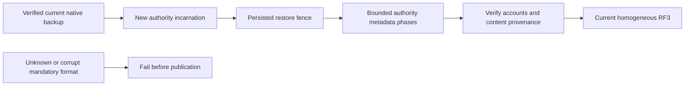

# ADR-011: Current native format and restore authority

Status: Accepted; implementation and exact-source qualification pending.
Owner: root integration. Related: REQ-STORAGE-006/007 and AC-STORAGE-006/007,
REQ/AC-BLOB-001–007, REQ/AC-DSTORE-009 and REQ/AC-BACKUP-004.
[CurrentFormat](../Features/StorageRecovery/CurrentFormat.md) and
[ADR-116](ADR-116-first-release-current-format.md) define the active format boundary.

## Decision

Use one current native reader and writer: identity epoch7, WAL4, checkpoint5,
KeyCodec v1 and the frozen generated Orleans aliases and field IDs. Unknown or
corrupt mandatory records fail closed before publication, without rewrite,
alternate-key lookup or loss of the original bytes. One homogeneous current RF3
cohort uses node-local ZoneTree ownership, ordered commit/apply, persisted
credentials and authorization, and the original receipt barriers.

Current reopen, compaction, same-incarnation snapshot install, crash recovery and
verified backup/restore are supported operations. Restoring a verified current
backup creates a new authority incarnation; bounded restore normalization changes
only authority metadata while preserving content provenance. It does not change
the persisted format. Dispatch stays paused and incomplete restoration fences
writable service until every required phase completes.

## Current partition roster

TASK-KL042-CATALOG-001A in [BackupRestore](../Features/BackupRestore.md) owns the
`keyload.backup.atomic-partition-catalog-entry.v1` record: Id0 Version, Id1
Partition, Id2 FirstSeenStorePosition, Id3 FirstSeenAppliedIndex. Registration and
its outcome share one native atomic commit. Local registration records a positive
store position and applied index0; replicated registration records store position0
and a positive applied index. Unsupported, negative, future or contradictory
coordinates fail closed before effects. A complete RF3-fenced current census is
required before cluster capture; row presence alone is not readiness. Current
snapshot copies retain exact row bytes. Cluster restore must bind roster authority
to its verified destination cut before admitting writes. Full cluster capture and
restore remain separate required acceptance gates.

## Current scoped command outcomes

[DocumentStorage](../Features/DocumentStorage.md), ADR-002 and ADR-017 own the
operation-aware identity and replay contract. Current outcome-v2 partition keys
contain the complete PartitionRef; Global and Unknown have distinct explicit
identities. A partition locator contains its exact matching outcome key.
StoredOutcome's alias, Id0..7, fingerprints, policy epochs, incarnation checks,
error semantics and atomic effect/watermark/clock transaction remain fixed.
Unknown is a persisted failed-operation scope with no locator or inferred
partition; an authorized retry of that same normalized operation can replay it.
Corrupt scope, orphan/mismatched locator or malformed bytes fail closed without
repair. Authorization precedes outcome decoding. A denied operation cannot
validate, overwrite or expose an existing corrupt result. Every actual caller
carries the original normalized operation and current server-authenticated identity.

## Current blob outcome and lifetime contract

The existing private StoredOutcome remains its current fingerprint/incarnation/
policyEpoch/result shape for nonblob commands. The current optional private BlobAuthority is
omitted when null. Its format is version1, immutable BeginCommandId and creator
PrincipalRecord.Id. Blob version state includes the same immutable BeginCommandId.
The lifetime is not a second command result log and is not inferred from UploadId,
clock, current head or caller roles.

Capture authority after current authorization and before command effects so final
reclaim can delete state without losing the original stamp. Successful Begin
captures its own command ID/creator; Write/Complete/Abort and a present-state
Reclaim capture the selected state's lifetime. Persist it in the same effects/
outcome/watermark transaction. Domain-failed operations store no blob stamp.
Replay of a successful upload-target operation requires current capability, row,
creator and PolicyEpoch checks plus the exact current lifetime stamp. Different or
missing lifetime is TokenInvalidated. Unknown stamp version is FormatUnsupported;
a missing stamp on an otherwise successful state-dependent blob outcome is a
mandatory-format failure. Cached failed Begin does not create phantom authority.

Final Reclaim may return its original Complete receipt when that selected state
is still absent and the current head does not reference UploadId. Empty/absent
Reclaim has no stamp. If that UploadId has a new state, an old null/different stamp
is TokenInvalidated; never return an obsolete cleanup success against a new
lifetime. A partial reclaim whose state is gone is TokenInvalidated. Reclaim
checks actual head reference even when state is missing (Corruption if referenced).
Outcomes from another incarnation after restore remain invalid and are not rebound.

## Current-format backup restoration

Native ZoneTree backup Restore copies the journal, changes authority incarnation/
signing key and clears applied/clock/membership. It does not rewrite feature
records; DispatchPaused is delivery-only. The integration lead invokes the
Core BlobStorage normalizer with borrowed IAtomicStore before the physical host
starts serving requests, consensus apply or background data work. It also resumes
an interrupted marker before writable startup. No provider->Core dependency.

Private state stores current authority Incarnation separately from immutable
IntegrityIncarnation. Published/retired raw bytes, head revisions, part hashes and
final chain hashes retain their original content provenance. New uploads seed
from the new incarnation. A version1 restore marker stores source/target authority,
phase and bounded exclusive cursor. Its singleton key is KeyCodec.Encode of the
named prefix `blob-restore-v1`; fields are FormatVersion1, SourceIncarnation,
TargetIncarnation, phase, exclusive cursor and checked fixed-size aggregate counts
(reserved bytes, object keys, versions, active uploads, resources). Resource
accounting uses bounded separate scratch rows under `blob-restore-account-v1`
(tenant/database/domain/resource) with format1, target incarnation and those
resource counters; do not put an unbounded resource dictionary in the marker.
Committed page effects/scratch/cursor are atomic; final quota verification removes
each scratch row and compares exact aggregated global accounting before removing
the marker. Unknown/orphan scratch rows fail closed.
Incomplete/mismatched marker fences all blob
reads/commands/configuration with RecoveryRequired; the reader rejects an
unknown marker version. This is an actual feature fence, not dispatch pause.

Ordered phases, each committed with its cursor:
1. Initialize the marker after validating source global authority and the new native
   store identity. Never infer a fresh database from missing counters.
2. Visit bounded metadata pages (at most128 records), collect owned records inside
   Read, then mutate only after traversal has ended inside Commit. Validate scope,
   state/head pairing, counts and supported versions before changes. Rebind state
   authority; Active becomes Aborted with restore invalidation. Release unused
   reservation and active-upload slots exactly once at resource/global levels;
   accepted bytes and version slots remain for ordinary reclaim. Preserve immutable
   BeginCommandId/IntegrityIncarnation/chain/raw bytes. Cursor and effects are atomic.
   Head/state records have the ADR-038 encoded16384-byte ceiling. Collection also
   uses a4MiB normal page byte budget before copying another record. One larger
   catalog record may form a page alone under the native examined-byte ceiling;
   VerifyResources writes only marker progress, never that catalog payload.
   A candidate not added to the page is revisited from the last accepted cursor.
3. Rebind remaining authority-bearing heads and resource/global counters, validating
   their accounting and state pairing in bounded resumable passes. Retain tombstone
   identity history. Source/target authority is accepted only by this restore phase,
   not by ordinary operations. No full-file or full-store payload materialization.
4. Follow the fixed sequence States -> Heads -> Quotas -> VerifyStates ->
   VerifyHeads -> VerifyResources -> Complete. VerifyResources visits bounded
   catalog metadata pages, checks every configured BlobStore's target-incarnation
   quota and transaction domain, and consumes exactly one checked Resources count
   per configured resource. Missing or orphan quota/account rows fail closed;
   resources are never collected in an unbounded marker dictionary.
5. Validate all phases and atomically remove the marker/publish completion with
   counters at the target incarnation. Only then enable writable service.

Every committed phase survives same-incarnation process restart and resumes from
its cursor. A second whole-store restore of an unfinished normalization is rejected
until the source normalization completes; there is no ambiguous nested transition.
Failure leaves destination fenced, current published bytes retained and backup
untouched. Genuine process cuts must prove every phase and counter adjustment.

## Retention and implementation

Current shared outcome expiry/pruning remains a required owning workstream under
ADR-002. Upload TTL must not erase command outcomes. Freeze bounded retry and
retirement semantics and prove failure, lost-reply, late-retry and recovery flows;
payload quotas alone do not bound outcome metadata. This ADR does not claim those
gates passed.

Root owns shared format/replay/host joins and qualification. Workers own disjoint
Core BlobStorage normalization and real unit/process/RF3 tests under the feature
contracts. Start only the current RF3 cohort after validating all stores and
completing required current-format restoration. Rollback restores a coherent
source checkpoint and a verified compatible current-format cut; it cannot reset
quotas, discard acknowledged outcomes or reuse stale ownership epochs.

Required evidence: enabled Release build/format/governance, current native
record/enum goldens, exact scope/lifetime/permission/error flows, bounded quota
and corruption rejection, real reopen/kill restore phases and counters,
same-incarnation snapshot install, actual Aspire SDK/official MCP RF3, functional
coverage and exact-source Linux qualification. Compilation alone closes no gate.

