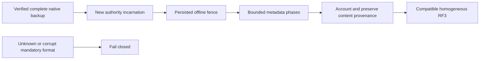

# ADR-011: Persisted format upgrade policy

Status: Accepted for the exact offline BlobStorage v1 additions, restore
normalization and scoped outcome-v2 transition below. Other format migrations and mixed-version rolling writes
remain unapproved. Source: architecture sections4–6/18/36, ADR-002/005/008/038.
Owner: KeyLoad integrator. Implementation and exact-SHA qualification pending.

## Decision and supported matrix

Unknown or corrupt mandatory records fail closed. Accepted transition:
current KeyCodec/storage format1 nonblob store -> same canonical format1 plus
BlobStorage feature format1. Existing nonblob keys, records, outcomes and wire JSON
are byte-preserved. The separately enumerated outcome-v2 reader below is the only
additional accepted retained-format path. No general compatibility reader, dual
write, legacy fallback, in-place re-encoding or mixed executable writers is authorized.

| Source | Target | Authorized mode and boundary |
|---|---|---|
| Current format1 without BlobStorage marker | Current format1 plus BlobStorage1 | Offline homogeneous RF3 binary upgrade; verified prefeature backup; first blob configuration proves feature prefixes/catalog evidence consistent and initializes counters atomically |
| BlobStorage1, same store incarnation | BlobStorage1, same incarnation | Reopen and same-incarnation replica InstallSnapshot preserve keys, hashes, quotas and outcomes exactly |
| Verified native backup containing BlobStorage1 | New store incarnation, BlobStorage1 | Offline resumable Core-owned normalization, staged invalidation and authority rebind before serving blobs; content hash provenance is preserved |
| Unknown blob/stamp/restore marker version or inconsistent initialized state | None | FormatUnsupported/Corruption; no reset, reinterpretation or writable fallback |
| BlobStorage1 after first feature write | Preblob binary | Unsupported downgrade; use compatible binary or explicit complete prefeature backup rollback |
| Native outcome at exact legacy principal/ID key, with v1 locator when scope is known | Scoped outcome-v2 writes plus exact retained-format reader | Cold writer-stopped homogeneous upgrade with verified complete pre-upgrade backup; preserve all existing keys/values; valid known scope remains authoritative for its scope, Unknown remains an ambiguity barrier; no automatic backfill or dual write |
| Store after first outcome-v2 write | Legacy-key-only binary | Unsupported downgrade; recover forward or explicitly approved complete pre-upgrade backup rollback with its data-loss scope |

## Exact scoped outcome key transition, 2026-10-05

REQ/AC-DSTORE-009 and TASK-DSTORE-SCOPED-OUTCOMES-001..004 in
[DocumentStorage](../Features/DocumentStorage.md) freeze the complete key, lookup,
negative/restart/RF3 acceptance and source ownership contract. Partition keys use
the complete PartitionRef under outcome-v2; Global has an explicit global key.
New Unknown errors use the explicit nonmovable `outcome-v2/unknown` key; only
retained old Unknown rows are ambiguity barriers. No new write uses an old key.
The v2 locator stores the exact matching partition outcome key. Keep KeyCodec v1,
StoredOutcome alias/IDs 0..7 and canonical fingerprints unchanged. New success
and persisted errors share the existing effects/watermark/clock transaction.
Unknown has no locator and no inferred partition. Its separate new identity
cannot shadow existing scoped results or require a cross-partition presence scan.

The native same-view resolver validates v2 and retained v1 authority before
replay or apply. Known different legacy scope permits a distinct v2 identity;
Unknown blocks a different fingerprint. Same-scope duplicates, bad scope/locator
or malformed bytes are Corruption, without preference, repair or rewrite.
Remove public unscoped key/result APIs and update their actual callers. The
internal legacy format helper exists only for this retained-data contract and
raw forensic tests; it is not a public compatibility alias or second execution
path. There is no temporary dual writer to remove. Never delete acknowledged
outcomes to simplify this upgrade. Missing partition fields in genuine native5/6
frames cannot be recovered from a one-way fingerprint or receipt partition hash;
any future backfill needs complete verified canonical history and a separately
accepted offline migration. Without that history preserve Unknown and fence
movement, rather than inventing scope.

Root owns the pre-code contract and shared integration; Luna owns the private
Core and actual caller/regression packet. Rollout stops every old writer, verifies
the full backup, installs homogeneous binaries and reopens before API admission.
An old binary has no claimed fence against a marker it does not understand.
Original native6 bytes, generated-serializer goldens and all existing BlobStorage
transitions remain mandatory. Unit/scalar/recovery and Docker/Aspire SDK/MCP
RF3 plus exact-source Linux evidence must pass before qualification.

## Exact additive outcome and lifetime format

The existing private StoredOutcome remains its current fingerprint/incarnation/
policyEpoch/result shape for nonblob commands. Add optional private BlobAuthority
omitted when null. Its format is version1, immutable BeginCommandId and creator
PrincipalRecord.Id. Blob version state includes the same immutable BeginCommandId.
The lifetime is not a second command result log and is not inferred from UploadId,
clock, current head or caller roles.

Capture authority after current authorization and before command effects so final
reclaim can delete state without losing the original stamp. Successful Begin
captures its own command ID/creator; Write/Complete/Abort and a present-state
Reclaim capture the selected state's lifetime. Persist it in the same effects/
outcome/watermark transaction. Domain-failed operations store no blob stamp.
Replay of a successful upload-target operation requires current capability, row,
creator and PolicyEpoch checks plus the exact current lifetime stamp. Different or
missing lifetime is TokenInvalidated. Unknown stamp version is FormatUnsupported;
a missing stamp on an otherwise successful state-dependent blob outcome is a
mandatory-format failure. Cached failed Begin does not create phantom authority.

Final Reclaim may return its original Complete receipt when that selected state
is still absent and the current head does not reference UploadId. Empty/absent
Reclaim has no stamp. If that UploadId has a new state, an old null/different stamp
is TokenInvalidated; never return an obsolete cleanup success against a new
lifetime. A partial reclaim whose state is gone is TokenInvalidated. Reclaim
checks actual head reference even when state is missing (Corruption if referenced).
Old-incarnation outcomes after restore remain invalid and are not rebound.

## Frozen offline restore normalization

Native ZoneTree backup Restore copies the journal, changes authority incarnation/
signing key and clears applied/clock/membership. It does not rewrite feature
records; DispatchPaused is delivery-only. The integration lead invokes the
Core BlobStorage normalizer with borrowed IAtomicStore before the physical host
starts serving requests, consensus apply or background data work. It also resumes
an interrupted marker before writable startup. No provider->Core dependency.

Private state stores current authority Incarnation separately from immutable
IntegrityIncarnation. Published/retired raw bytes, head revisions, part hashes and
final chain hashes retain their original content provenance. New uploads seed
from the new incarnation. A version1 restore marker stores source/target authority,
phase and bounded exclusive cursor. Its singleton key is KeyCodec.Encode of the
named prefix `blob-restore-v1`; fields are FormatVersion1, SourceIncarnation,
TargetIncarnation, phase, exclusive cursor and checked fixed-size aggregate counts
(reserved bytes, object keys, versions, active uploads, resources). Resource
accounting uses bounded separate scratch rows under `blob-restore-account-v1`
(tenant/database/domain/resource) with format1, target incarnation and those
resource counters; do not put an unbounded resource dictionary in the marker.
Committed page effects/scratch/cursor are atomic; final quota verification removes
each scratch row and compares exact aggregated global accounting before removing
the marker. Unknown/orphan scratch rows fail closed.
Incomplete/mismatched marker fences all blob
reads/commands/configuration with RecoveryRequired; current binary refuses an
unknown marker version. This is an actual feature fence, not dispatch pause.

Ordered phases, each committed with its cursor:
1. Initialize the marker after validating old global authority and the new native
   store identity. Never infer a fresh database from missing counters.
2. Visit bounded metadata pages (at most128 records), collect owned records inside
   Read, then mutate only after traversal has ended inside Commit. Validate scope,
   state/head pairing, counts and supported versions before changes. Rebind state
   authority; Active becomes Aborted with restore invalidation. Release unused
   reservation and active-upload slots exactly once at resource/global levels;
   accepted bytes and version slots remain for ordinary reclaim. Preserve immutable
   BeginCommandId/IntegrityIncarnation/chain/raw bytes. Cursor and effects are atomic.
   Head/state records have the ADR-038 encoded16384-byte ceiling. Collection also
   uses a4MiB normal page byte budget before copying another record. One larger
   catalog record may form a page alone under the native examined-byte ceiling;
   VerifyResources writes only marker progress, never that catalog payload.
   A candidate not added to the page is revisited from the last accepted cursor.
3. Rebind remaining authority-bearing heads and resource/global counters, validating
   their accounting and state pairing in bounded resumable passes. Retain tombstone
   identity history. Source/target authority is accepted only by this offline phase,
   not by ordinary operations. No full-file or full-store payload materialization.
4. Follow the fixed sequence States -> Heads -> Quotas -> VerifyStates ->
   VerifyHeads -> VerifyResources -> Complete. VerifyResources visits bounded
   catalog metadata pages, checks every configured BlobStore's target-incarnation
   quota and transaction domain, and consumes exactly one checked Resources count
   per configured resource. Missing or orphan quota/account rows fail closed;
   resources are never collected in an unbounded marker dictionary.
5. Validate all phases and atomically remove the marker/publish completion with
   counters at the target incarnation. Only then enable writable service.

Every committed phase survives same-incarnation process restart and resumes from
its cursor. A second whole-store restore of an unfinished normalization is rejected
until the source normalization completes; there is no ambiguous nested transition.
Failure leaves destination fenced, current published bytes retained and backup
untouched. Genuine process cuts must prove every phase and counter adjustment.

## Outcome retention remains an owning qualification dependency

No current shared outcome expiry/pruner or retirement horizon is delivered.
Upload TTL is separate and must never erase outcomes. Keep existing outcomes
untouched during this feature/restore transition. Fresh command IDs can grow shared
metadata; blob payload quota does not bound this. Before writable product rollout,
root must freeze and deliver the shared bounded-metadata/retry-retirement horizon
under ADR-002, with real failure/lost-reply/late-retry/recovery tests. Blind outcome
deletion or a blob-only result ledger is forbidden. This is a pending required
gate, not a source-present retention guarantee.

## Implementation, rollout and rollback

REQ-STORAGE-006/007, AC-STORAGE-006/007; REQ/AC-BLOB-001–007. Exact task graph:
[blob plan](../Features/BlobStorage.md). Root owns private outcome
addition, current replay hook, feature versions and physical-host restore join.
Workers own disjoint Core/Features/BlobStorage records/normalizer and real unit/
recovery/RF3 tests. Other format upgrades need their own accepted matrix first.

Stop all old voters/writers, create and verify a complete backup, deploy identical
compatible binaries, finish any required offline normalization, then form RF3 and
expose APIs. Pre-first-blob rollback can restore the verified unchanged backup.
After blob writes, rollback is to a blob-compatible release; prefeature backup
rollback requires explicit accepted data-loss scope. Do not delete blobs, reset
quotas, reinterpret old stamps, or allow an old executable to write newer state.

Verification is exact-SHA GitHub Actions: unchanged nonblob bytes/enum goldens,
partition/lifetime reuse adversaries, quotas and missing/unknown records, genuine
reopen/kill normalization phases, backup->new-incarnation publication/staged
invalidation, same-incarnation InstallSnapshot, homogeneous Docker/Aspire RF3
SDK/official MCP paths and coverage. Passing compilation is not these gates.

