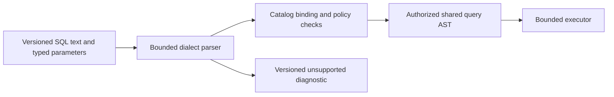

# ADR-012: Versioned KeyLoad SQL subset

Status: Accepted; dialect implementation and GitHub qualification pending. Product decision source: [sections 13, 23, 35, and 43](../design/architecture-v0.3.uk.md); current query feature: [QueryExecution](../Features/QueryExecution.md).

## Context and decision

SQL is a public query syntax and must have a bounded, versioned subset rather than an accidental promise of full vendor compatibility. The product design names a KeyLoad SQL subset with explicit capability/version reporting, typed parameters, deterministic ordering, bounded operators, and stable unsupported-expression diagnostics. SQL remains read-only unless an explicit mutation statement is separately specified and compiled to the same authorized commands.

## Rationale, alternatives, consequences

Full dialect compatibility would create a broad long-term contract and security/optimizer burden. JSON and C# query APIs alone do not meet familiar query needs. Versioned grammar plus explicit unsupported diagnostics supports evolution while preventing silent semantic drift. Parser grammar alone is not behavioral qualification.

## Related requirements

QueryExecution [REQ-QUERY-004](../Features/QueryExecution.md#повний-query-contract)/[AC-QUERY-004](../Features/QueryExecution.md#повний-query-contract) defines versioned capability/grammar rejection; [REQ-QUERY-005](../Features/QueryExecution.md#повний-query-contract)/[AC-QUERY-005](../Features/QueryExecution.md#повний-query-contract) defines SQL/JSON/C# adapter equivalence. Baseline resource-budget behavior remains [AC-MP-003](../Features/QueryExecution.md) and [AC-MP-012](../Features/QueryExecution.md), mapped from REQ-QUERY-001..003. ADR-013 owns the shared authorized AST boundary. Qualification remains pending as recorded in the Feature spec.

## Implementation contract

1. Freeze grammar/version, supported scalar/NULL/order semantics, parameter typing, unsupported diagnostics, and capability negotiation.
2. Add parser fixtures and real-store semantic tests for positive, negative, edge, and unsupported expressions; include differential SQL/JSON/C# cases under ADR-013.
3. Target code: `src/KeyLoad.Query/Features/QueryExecution/Syntax/` and `Binding/`; public capability contracts, if approved, in `src/KeyLoad.Abstractions/Features/QueryExecution/`.
4. Additive grammar is versioned; a breaking semantic change requires new capability/dialect version. Rollback stops advertising the new version and never reinterprets persisted cursors silently.
5. GitHub CI runs grammar/semantic TUnit and RF3 client queries, with exact unsupported outcomes; Query owner joins root on equivalence artifacts.

Dependencies: [ADR-010](ADR-010-query-budgets-security.md), [ADR-013](ADR-013-authorized-query-ast.md), [ADR-014](ADR-014-principals-rbac-row-policy.md), [ADR-015](ADR-015-sensitive-data-lineage.md), and [ADR-020](ADR-020-independent-query-contexts.md). No mutation route, grammar rule, or vendor-compatibility claim is implied beyond the accepted subset.

