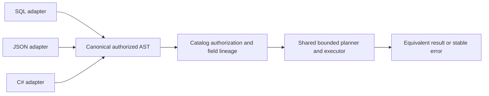

# ADR-013: One authorized query AST across interfaces

Status: Accepted; full equivalence qualification pending. Related product source: [sections 13, 23–26, and 29–30](../design/architecture-v0.3.uk.md); current implementation is tracked in [QueryExecution](../Features/QueryExecution.md).

## Context and decision

SQL, JSON, and C# query syntax must not become separate authorization/execution paths. Each interface validates and binds its input into one canonical authorized AST. The AST carries resource/field lineage, typed literals, limits, and policy context; the same planner/executor enforces row access, projection, budgets, cursor cuts, and stable errors. Unsupported expressions are rejected rather than evaluated by an unreviewed fallback.

## Rationale and consequences

One execution contract avoids permission and ranking discrepancies between interfaces. Interface-specific convenience remains possible only in boundary adapters. AST versioning and diagnostics become compatibility concerns; semantic equivalence requires differential tests and cannot be claimed merely because requests deserialize.

## Related requirements

QueryExecution [REQ-QUERY-004](../Features/QueryExecution.md#повний-query-contract)/[AC-QUERY-004](../Features/QueryExecution.md#повний-query-contract), [REQ-QUERY-005](../Features/QueryExecution.md#повний-query-contract)/[AC-QUERY-005](../Features/QueryExecution.md#повний-query-contract), [REQ-QUERY-006](../Features/QueryExecution.md#повний-query-contract)/[AC-QUERY-006](../Features/QueryExecution.md#повний-query-contract), and [REQ-QUERY-007](../Features/QueryExecution.md#повний-query-contract)/[AC-QUERY-007](../Features/QueryExecution.md#повний-query-contract) cover capability/version rejection, cross-interface AST semantics, planner/cursor security, and explicitly planned extensions; baseline requirements REQ-QUERY-001..003 remain applicable. DocumentStorage `REQ-DSTORE-003`; Search `REQ-SR-001..005`. [ADR-012](ADR-012-sql-dialect.md) owns SQL syntax; [ADR-010](ADR-010-query-budgets-security.md) budgets/security and [ADR-014](ADR-014-principals-rbac-row-policy.md) authorization rules apply.

## Implementation contract

1. Freeze canonical AST node set, versioning, binding semantics, field lineage, and unsupported behavior.
2. Add differential TUnit fixtures for SQL/JSON/C# success, denial, NULL/edge cases, ordering/ties, cursor, budget exhaustion, and unsupported constructs.
3. Own shared AST in `src/KeyLoad.Abstractions/Features/QueryExecution/`; adapters in `src/KeyLoad.Query/Features/QueryExecution/`; authorization and operators remain with their owning security/search/data slices.
4. Rollout adds an AST version only with compatible capability negotiation. Rollback disables that version; no interface may retain an independent weaker executor as a fallback.
5. GitHub CI runs semantic TUnit and real RF3 SDK calls across supported interfaces; root joins Query, Authorization, and Search owners on exact result/error comparisons.

Dependencies: [ADR-010](ADR-010-query-budgets-security.md), [ADR-012](ADR-012-sql-dialect.md), [ADR-014](ADR-014-principals-rbac-row-policy.md), [ADR-015](ADR-015-sensitive-data-lineage.md), [ADR-018](ADR-018-global-rank-fusion.md), [ADR-019](ADR-019-managed-ann.md), and [ADR-020](ADR-020-independent-query-contexts.md). Stop if a mapping changes a security barrier or unsupported syntax becomes executable without planned tests.

