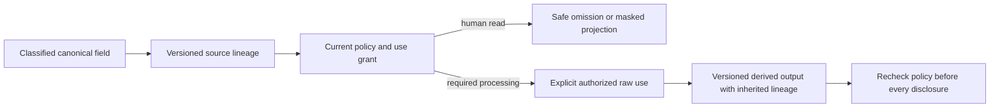

# ADR-015: Sensitive-data omission, use, and lineage

Status: Accepted; complete cross-projection privacy qualification pending. Current policy contracts are in `src/KeyLoad.Abstractions/Contracts.cs`, enforcement in `src/KeyLoad.Core/MutationAuthorization.cs` and `src/KeyLoad.Core/DatabaseEngine.cs`, and shared policy primitives in `src/KeyLoad.Security/AuthorizationPolicy.cs`; product source [sections 14, 26, 29–30, and 44](../design/architecture-v0.3.uk.md).

## Context and decision

Sensitive data can flow through documents, events, message payloads/headers, graph attributes, text/vector/search projections, query aliases, diagnostics, backups, and replay. Classified fields carry versioned policy/lineage. Human-readable outputs omit protected fields by default. A computation requiring raw fields needs an explicit data-use grant; redacted replacement is not silently substituted when it would change business semantics. Derived projections inherit source classification and policy epoch, and every read/replay/export boundary rechecks current restrictions.

## Rationale and consequences

Omission and lineage reduce accidental disclosure through search, logs, aliases, and replay. Reclassification/revocation may invalidate projections and cursors and may require rebuild. Historical raw bytes are not erased by response omission; retention, physical purge, backups, and crypto-erasure need separate verified lifecycle decisions. Hashes can themselves be sensitive.

## Related requirements

Authorization `REQ-AUTH-001..003` plus [REQ-AUTH-004..009 and matching AC-AUTH-004..009](../Features/Authorization.md#повний-public-authorization-contract), particularly field read/use/write, policy-epoch enforcement, protected processing inputs, and sensitive-data lineage/diagnostics. Search `REQ-SR-002/005`, DocumentStorage `REQ-DSTORE-003`, Messaging `REQ-MSG-002/003`, GraphTraversal `REQ-GRAPH-002`, and EventStreams `REQ-EVENT-003/006` also apply. ADR-014 defines authority; ADR-029 expands event/message classification.

## Implementation contract

1. Freeze classification vocabulary, schema lineage, required-input behavior, omission rules, derived-provider metadata, and safe diagnostic format.
2. Add canary tests across document, event/header, queue/DLQ, SQL alias/sort, graph edge, search/vector, export, trace, and replay; assert both allowed raw use and denied omission/failure.
3. Target owners: `src/KeyLoad.Security/Features/Authorization/`, each canonical source slice, and the existing `src/KeyLoad.Query/Features/Search/` projection slice; no generic endpoint may bypass source ownership or create a separate search technical root.
4. Reclassification increments policy/schema epochs and invalidates stale derived generations before exposing output. Rollback cannot restore permissive reads without restoring authorized policy state; purge migration must report replica/archive boundaries.
5. GitHub CI runs TUnit and real RF3 SDK/MCP privacy cases. Root joins Security, Search, Messaging, and backup owners; retain sanitized evidence only.

Dependencies: [ADR-004](ADR-004-committed-read-views.md), [ADR-006](ADR-006-strict-derived-indexes.md), [ADR-009](ADR-009-search-provider-boundaries.md), [ADR-010](ADR-010-query-budgets-security.md), [ADR-013](ADR-013-authorized-query-ast.md), [ADR-014](ADR-014-principals-rbac-row-policy.md), [ADR-018](ADR-018-global-rank-fusion.md), [ADR-019](ADR-019-managed-ann.md), [ADR-022](ADR-022-policy-epoch-revocation.md), [ADR-029](ADR-029-event-message-classification.md), and [ADR-030](ADR-030-retention-paused-restore.md). Stop on missing lineage or unsafe replay; do not infer erasure from omission.

