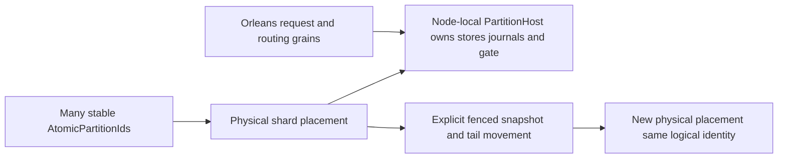

# ADR-016: Atomic partitions packed into physical shards

Status: Accepted; placement movement and GitHub RF3 qualification pending. Related source: node-local `PartitionHost` and ownership contracts; product source [sections 4, 6, 18, and 28](../design/architecture-v0.3.uk.md).

## Context and decision

Logical transaction scope and physical placement are separate identities. Each `AtomicPartitionId` owns its command ordering and resource binding; a physical shard/host may pack many atomic partitions. A `PartitionHost` on a physical node owns canonical storage, journals, locks, and ordered apply gate. Orleans grains route operations and may migrate activation placement without moving those node-owned resources. A partition move is explicit and transfers a complete verified cut plus lineage; it is not an incidental grain migration.

## Rationale, alternatives, consequences

One engine/grain per atomic partition is operationally unbounded; merging logical identity with physical host makes movement change transactional identity. Packing reduces physical object count while retaining per-partition isolation. It makes catalog placement, ownership epochs, resource budgets, snapshot transfer, and commit-token translation essential. Cross-partition atomicity remains unsupported except explicit transfer protocols.

## Related requirements

ClusterRouting `REQ-ROUTE-001..003`/`AC-ROUTE-001..003`; ClusterReplication `REQ-REP-004`/`AC-REP-004`; DocumentStorage `REQ-DSTORE-004`; Messaging `REQ-MSG-005`; GraphTraversal `REQ-GRAPH-001`.

## Implementation contract

1. Freeze logical ID, physical shard identity, placement catalog/epoch, ownership fencing, and token translation before movement implementation.
2. Add tests for many atomic partitions per host, isolated writes, stale-owner rejection, complete snapshot plus tail, interruption, and activation migration that leaves node-local locks/storage unmoved.
3. Target modules: `src/KeyLoad.Core/Features/ClusterRouting/`, `src/KeyLoad.Orleans/Features/ClusterRouting/`, and `src/KeyLoad.Replication/Features/ClusterReplication/`; node-local `PartitionHost` lifecycle and physical I/O belong to `src/KeyLoad.Server/Features/StorageRecovery/PartitionHost.cs`, with the provider in `src/KeyLoad.Storage.ZoneTree/Features/StorageRecovery/`. Core owns logical identity and business helpers, never physical node I/O.
4. Migration fences old owner, captures verified cut/lineage, installs destination, catches up ordered tail, then publishes placement epoch. Rollback reactivates old owner only if it remains complete and fenced against concurrent writes; otherwise stop and recover forward.
5. GitHub CI runs process recovery and Aspire RF3 move/failover tests through .NET and MCP clients. Root owns placement/catalog protocol and joins source-storage owners with cut evidence.

Dependencies: [ADR-001](ADR-001-partition-identity-affinity.md), [ADR-003](ADR-003-durability-ack-barrier.md), [ADR-004](ADR-004-committed-read-views.md), [ADR-005](ADR-005-canonical-keyspace-codec.md), [ADR-007](ADR-007-replica-consensus-bootstrap.md), [ADR-008](ADR-008-backup-log-retention.md), and [ADR-017](ADR-017-migration-tokens.md). Stop if a plan transfers journal/lock ownership with an activation or changes logical AtomicPartitionId during a physical move.

