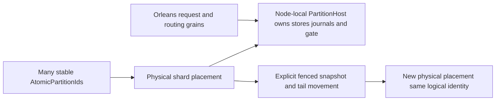

# ADR-016: Atomic partitions packed into physical shards

Status: Accepted; placement movement and GitHub RF3 qualification pending. Related source: node-local `PartitionHost` and ownership contracts; product source [sections 4, 6, 18, and 28](../design/architecture-v0.3.uk.md).

## Context and decision

Logical transaction scope and physical placement are separate identities. Each `AtomicPartitionId` owns its command ordering and resource binding; a physical shard/host may pack many atomic partitions. A `PartitionHost` on a physical node owns canonical storage, journals, locks, and ordered apply gate. Orleans grains route operations and may move activation placement without moving those node-owned resources. A partition move is explicit and transfers a complete verified cut plus lineage; it is not incidental Orleans activation movement.

## Rationale, alternatives, consequences

One engine/grain per atomic partition is operationally unbounded; merging logical identity with physical host makes movement change transactional identity. Packing reduces physical object count while retaining per-partition isolation. It makes catalog placement, ownership epochs, resource budgets, snapshot transfer, and commit-token translation essential. Cross-partition atomicity remains unsupported except explicit transfer protocols.

## Related requirements

ClusterRouting `REQ-ROUTE-001..003`/`AC-ROUTE-001..003`; ClusterReplication `REQ-REP-004`/`AC-REP-004`; DocumentStorage `REQ-DSTORE-004`; Messaging `REQ-MSG-005`; GraphTraversal `REQ-GRAPH-001`.

## Implementation contract

1. Freeze logical ID, physical shard identity, placement catalog/epoch, ownership fencing, and token translation before movement implementation.
2. Add tests for many atomic partitions per host, isolated writes, stale-owner rejection, complete snapshot plus tail, interruption, and activation movement that leaves node-local locks/storage unmoved.
3. Target modules: `src/KeyLoad.Core/Features/ClusterRouting/`, `src/KeyLoad.Orleans/Features/ClusterRouting/`, and `src/KeyLoad.Replication/Features/ClusterReplication/`; node-local `PartitionHost` lifecycle and physical I/O belong to `src/KeyLoad.Server/Features/StorageRecovery/Hosting/PartitionHost.cs`, with the provider in `src/KeyLoad.Storage.ZoneTree/Features/StorageRecovery/`. Core owns logical identity and business helpers, never physical node I/O.
4. A physical move fences the current owner, captures verified cut/lineage, installs the destination, catches up the ordered tail, then publishes the placement epoch. Rollback reactivates the source only if it remains complete and fenced against concurrent writes; otherwise stop and recover forward.
5. GitHub CI runs process recovery and Aspire RF3 move/failover tests through .NET and MCP clients. Root owns placement/catalog protocol and joins source-storage owners with cut evidence.

Dependencies: [ADR-001](ADR-001-partition-identity-affinity.md), [ADR-003](ADR-003-durability-ack-barrier.md), [ADR-004](ADR-004-committed-read-views.md), [ADR-005](ADR-005-canonical-keyspace-codec.md), [ADR-007](ADR-007-replica-consensus-bootstrap.md), and [ADR-008](ADR-008-backup-log-retention.md). Stop if a plan transfers journal/lock ownership with an activation or changes logical AtomicPartitionId during a physical move.

## First accepted native page stage, 2026-10-05

TASK-PMOVE-PAGES and TASK-PMOVE-PAGE-ORACLES implement
[REQ/AC-PMOVE-001..004](../Features/ClusterRouting/PartitionTransfer.md) as pure
internal bounded record reads over an existing owned native committed view.
Root freezes the listed reader signature, complete partition identity, exact raw
bytes and record/retained/examined bounds. The implementation worker owns only
new Core ClusterRouting Queries/Contracts/Validation files; the independent
test worker owns only new UnitTests ClusterRouting Cases/Helpers. Root reviews
both packets, joins them and runs strict build plus actual Aspire normal/scalar
cases before checkpointing all code. No new package or project is required.

There is no persisted-format rollout in this stage. Removing the unused
internal primitive is its rollback; no data, token or journal is rewritten.
Installation remains inadmissible until partition-associated outcomes, shared
authorization/catalog/blob accounting and source fencing are frozen and tested.
The final movement stages and all process/RF3 gates above remain required;
this stage does not mark this ADR Implemented or close KL-036/071/072.

## Accepted query-scoped observation composition, TASK-PMOVE-OBSERVATION-001

REQ-PMOVE-002/003 and AC-PMOVE-002/003 require deterministic cancellation during actual native traversal, not an aggregate-counter polling race. Preserve the existing PartitionRecordPageReader.Read signature and all default callers. Add an internal overload accepting the existing typed StorageReadObserver before optional afterKey and cancellationToken. Its production purpose is caller-owned query-scoped examined-work accounting, admission and cooperative cancellation; it exposes byte counts only, never keys, values, identity or payloads. It owns no view/store/thread and makes no placement or persistence change.

Compose the native VisitRange observation after existing checked page examined-byte charging, exactly once for each successfully charged native observation including lookahead; immediately check the initiating token again before any consumer copy. Existing provider/page bounds retain precedence. The callback is synchronous inside the original caller-owned read gate and cannot escape that call. Callback failure propagates as the original exception, prevents successful partial-page return and leaves storage unchanged. Callers must supply bounded nonblocking accounting/admission callbacks; no awaited work, store reentry or detached work is supported. Default calls take one null callback branch per charge with no extra native reads, copies, counters or retained buffers. No throughput/latency improvement is claimed without measurements.

Implementation ownership: Core ClusterRouting/Queries/PartitionRecordPageReader.cs composes the existing native delegate; UnitTests ClusterRouting/Helpers/PartitionRecordCancellationRunner.cs executes one synchronous original read and cancels only after its actual observed bytes exceed a separately measured one-record page including lookahead. Cases/PartitionRecordCancellationTests.cs and Assertions/PartitionRecordCancellationStateAssertions.cs require exact initiating token, no partial page, completed original call before owner disposal, exact diagnostic observed-byte agreement, all seeded canonical key/value bytes and position unchanged, and a healthy complete bounded page. A second real native flow throws from the caller observation and retains that exact exception with the same full-state/healthy oracles. No fake view/provider, timing sleeps, retries, thread priorities, larger fixture or accepted-success alternative is admissible.

Root freezes/joins this private packet, runs strict build/native normal/scalar reports and retains original raced-case failures. Rollback removes the observer overload/test composition only; no format or data migration. Linux/process/RF3 and complete movement gates remain required, and ADR-016 is not marked Implemented by this stage.

## TASK-GRAPH-RF3-UNKNOWN-RECONCILIATION-001 (source-only acceptance amendment)

Preserves REQ-GRAPH-010 / AC-GRAPH-009 and REQ/AC-REP-003 stable-command outcomes under original fixture-owned graph-path-rf3-leader-loss. Original Linux run37612238705/attempt1/job112762012221/SHA24c0ac47 actual AcGraph009 failed on UnknownWriteOutcome after leader loss; that failure is immutable. Unknown does not establish either commit or absence. Native KeyLoadClient.CommitAsync is the existing public canonical CommitReceipt operation with caller-owned stable command identity. There is no generic public read-only command receipt lookup; specialized queue-transfer inspection is unrelated and cannot substitute.

Freeze before code: capture the original CommandRequest exactly once, preserve its original partition/mutation bytes, existing administrator principal/client and unchanged original initiating deadline/token. Only an actual first UnknownWriteOutcome admits ONE awaited same-object CommitAsync reconciliation. Any other first error, any unsuccessful reconciliation (including another unknown), and cancellation remain failure. No loops, new IDs, alternate caller, sleep/backoff, generic election retry, health-only success or deadline extension. A successful receipt must come from the real SDK, never inferred from readiness or path existence. After actual canonical success, one same-command receipt replay must return byte-identical complete CommandId/token/mutations/durability. Literal mutation upsertEdge/exact graph+edge/revision1 and complete shortcut edge endpoints/label/attributes{} /revision1 prove one logical graph effect. This also applies when initial call succeeds.

Owning paths: existing IntegrationTests GraphTraversal Helpers/GraphPathRf3LeaderLoss.cs and cohesive Helpers/GraphPathRf3CommandReconciliation.cs. The existing real AcGraph009 flow is the regression; no fake provider/probe is introduced. All original survivor SDK and official MCP path checks, restored-node health/native status/catchup, every replica SDK path and restored-node official MCP path remain, strengthened with exact shortcut edge equality. Cleanup retains primary and all original stop/restart errors. Dependencies unchanged; no migration/public dispatcher/consensus repair. Root guards/joins/builds and runs exact native AcGraph009 plus mandatory full gates. Source reconstruction is unqualified. Rollback removes helper/calls/oracle amendments together, without changing canonical identity or RF3 policies.
