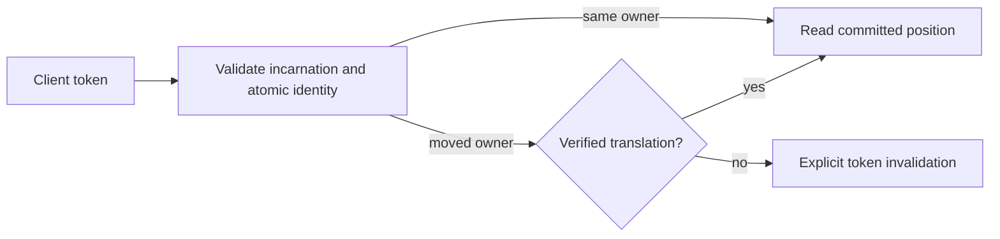

# ADR-017: Migration-aware commit and session tokens

Status: Proposed. The representation that preserves order across physical-group movement is unresolved. No source format or public token migration is approved by this proposal.

## Context and decision

Current commit tokens identify a database incarnation, atomic partition, log position, and ownership epoch. A group-local Raft position cannot be compared directly with another group's log after split, merge, or movement. The design requires a client/session token to remain meaningful across ownership changes without conflating atomic identity and physical placement.

Keep token validation fail-closed. Candidate designs are a durable old-to-new position lineage or a stable per-atomic-partition sequence replicated with canonical mutations. Select neither until real migration/recovery prototypes show monotonic reads, deduplication, and bounded metadata. A token from another incarnation or unverifiable lineage must return an explicit invalidation error.

## Alternatives and consequences

- Compare source and destination Raft indexes directly: rejected because unrelated logs do not share an ordering domain.
- Silently restart at the destination head: rejected because it can skip acknowledged writes.
- Durable lineage: supports movement but adds retention, compaction, and restore obligations.
- Stable atomic sequence: simplifies client ordering but adds replicated metadata and write-path work.

Until selection, movement-dependent tokens are invalidated rather than guessed. Existing source contracts are in `src/KeyLoad.Abstractions/Contracts.cs`; token application is shared by Core, Query, and Replication. The physical movement work remains in `src/KeyLoad.Replication/Features/ClusterReplication/` and the node-local ownership boundary in the pending [ADR-036](ADR-036-orleans-foundation.md).

## Related requirements and implementation contract

Related: `REQ-REP-004/AC-REP-004`, `REQ-ROUTE-002/AC-ROUTE-002`, `REQ-ROUTE-004/AC-ROUTE-004`, `REQ-ROUTE-005/AC-ROUTE-005`, `REQ-FEED-002/AC-FEED-002`, and KL-017, KL-035..037, KL-072. Atomic identity remains distinct from physical placement; fenced movement and token translation remain planned.

1. **Freeze** the token migration contract and choose lineage or stable sequence only after the prototype decision is accepted; owner: architecture lead.
2. **Test** same-owner monotonic read, movement during pagination, stale owner, restart, compaction, snapshot catch-up, and restore to a new incarnation using real processes and RF3.
3. **Implement** in Core/Replication token and ownership helpers; Query and ChangeFeeds own their cursor consumers. Abstractions/public DTO changes require a separate reviewed contract.
4. **Migrate/roll out** only after the format transition is explicitly accepted under [Proposed ADR-011](ADR-011-format-upgrades.md). A compatibility transition is not authorized by this ADR: its separate contract must state the reason, owner, exact scope, verification, and removal date. Rollback may restore only a complete verified committed cut after catch-up and assignment of a newly fenced authoritative routing epoch, or recover forward; never decrement or reuse a stale ownership epoch.
5. **Qualify** the exact delivered SHA through GitHub unit, recovery, and Docker/Aspire RF3 SDK/MCP gates before changing status.

Current files: `src/KeyLoad.Abstractions/Contracts.cs`, `src/KeyLoad.Core/`, `src/KeyLoad.Replication/`. Target files: matching `Features/ClusterReplication/` and consuming slice helpers. Integration owner: root cluster lead; dependencies: ADR-036, snapshot installation, and partition movement. No local test run qualifies this decision.
