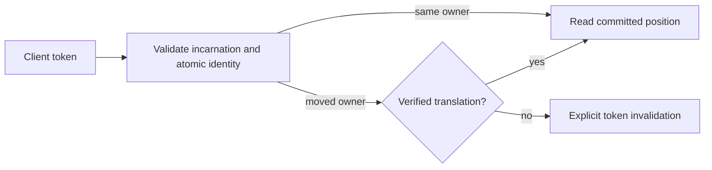

# ADR-017: Migration-aware commit and session tokens

Status: Accepted for the native same-view epoch and additive outcome-association stages described below; implementation and qualification remain open. Translation across physical-group movement remains Proposed. Public CommitToken fields stay unchanged.

## Context and decision

Current commit tokens identify a database incarnation, atomic partition, log position, and ownership epoch. A group-local Raft position cannot be compared directly with another group's log after split, merge, or movement. The design requires a client/session token to remain meaningful across ownership changes without conflating atomic identity and physical placement.

Keep token validation fail-closed. Candidate designs are a durable old-to-new position lineage or a stable per-atomic-partition sequence replicated with canonical mutations. Select neither until real migration/recovery prototypes show monotonic reads, deduplication, and bounded metadata. A token from another incarnation or unverifiable lineage must return an explicit invalidation error.

## Alternatives and consequences

- Compare source and destination Raft indexes directly: rejected because unrelated logs do not share an ordering domain.
- Silently restart at the destination head: rejected because it can skip acknowledged writes.
- Durable lineage: supports movement but adds retention, compaction, and restore obligations.
- Stable atomic sequence: simplifies client ordering but adds replicated metadata and write-path work.

Until selection, movement-dependent tokens are invalidated rather than guessed. Existing source contracts are in `src/KeyLoad.Abstractions/Contracts.cs`; token application is shared by Core, Query, and Replication. The physical movement work remains in `src/KeyLoad.Replication/Features/ClusterReplication/` and the node-local ownership boundary in the pending [ADR-036](ADR-036-orleans-foundation.md).

## Related requirements and implementation contract

Related: `REQ-REP-004/AC-REP-004`, `REQ-ROUTE-002/AC-ROUTE-002`, `REQ-ROUTE-004/AC-ROUTE-004`, `REQ-ROUTE-005/AC-ROUTE-005`, `REQ-FEED-002/AC-FEED-002`, and KL-017, KL-035..037, KL-072. Atomic identity remains distinct from physical placement; fenced movement and token translation remain planned.

1. **Freeze** the token migration contract and choose lineage or stable sequence only after the prototype decision is accepted; owner: architecture lead.
2. **Test** same-owner monotonic read, movement during pagination, stale owner, restart, compaction, snapshot catch-up, and restore to a new incarnation using real processes and RF3.
3. **Implement** in Core/Replication token and ownership helpers; Query and ChangeFeeds own their cursor consumers. Abstractions/public DTO changes require a separate reviewed contract.
4. **Migrate/roll out** only after the format transition is explicitly accepted under [Proposed ADR-011](ADR-011-format-upgrades.md). A compatibility transition is not authorized by this ADR: its separate contract must state the reason, owner, exact scope, verification, and removal date. Rollback may restore only a complete verified committed cut after catch-up and assignment of a newly fenced authoritative routing epoch, or recover forward; never decrement or reuse a stale ownership epoch.
5. **Qualify** the exact delivered SHA through GitHub unit, recovery, and Docker/Aspire RF3 SDK/MCP gates before changing status.

Current files: `src/KeyLoad.Abstractions/Contracts.cs`, `src/KeyLoad.Core/`, `src/KeyLoad.Replication/`. Target files: matching `Features/ClusterReplication/` and consuming slice helpers. Integration owner: root cluster lead; dependencies: ADR-036, snapshot installation, and partition movement. No local test run qualifies this decision.

## Accepted native preparation stages, 2026-10-05

The complete implementation contract is frozen in [TokenMigrationLineage](../Features/ClusterRouting/TokenMigrationLineage.md), REQ/AC-MTOKEN-001..004 and REQ/AC-PMOVE-005..006. Root integrates the contract before source work. Luna owns private Core native view-bearing token issuance/fencing, exhaustive normalized outcome scope association and actual ZoneTree regression packets. Root joins shared paths and executes the required Aspire build/normal/scalar/recovery/RF3 gates, then commits and pushes the complete stage.

Ordered stages: explicit same-view authority resolution and token producers/consumers; additive native scope fields and atomic locator/replay checks; explicit test-owned catalog bootstrap and independent regressions; root source review, canonical gates and exact-source Linux evidence. Preserve the existing global dedup key, original domain-failure semantics and all old outcomes. Rollout is additive native metadata with stable existing aliases/IDs, and no automatic backfill. Rollback stops movement preparation/exposure while retaining outcome metadata and locators for a compatible reader; it never deletes or resets acknowledged outcomes or ownership epochs. Old unknown-scope records remain movement-ineligible without the separate writer-excluded, verified-history/backup ADR-011 migration. No translation, cross-group install, owner switch or physical movement is authorized by this stage.

The 2026-10-05 native format freeze preserves StoredOutcome fields 0..5 and its
alias, appends ScopeKind Id6 and nullable Partition Id7, and assigns the native
int enum Unknown=0, Global=1, Partition=2 with stable alias
`keyload.command-outcome-scope-kind.v1`. Values and IDs are append-only; no JSON
fallback or replacement codec. Missing fields decode Unknown/null; unrecognized
numeric values reject as Corruption. The owning Orleans generator must verify
the enum's unchanged primitive representation. Native round-trip, legacy frame
and corrupt-value regressions join AC-PMOVE-005/006 before acceptance. Until
native unknown-field retention is proven, cold-compatible writer-stopped rollout
is mandatory; mixed-version outcome writers and old-writer rollback after scoped
outcomes exist are prohibited. Keep outcomes/locators and recover forward through
a compatible reader without guessing or deleting committed metadata.

## Accepted genuine prior-frame proof, 2026-10-05

REQ/AC-MTOKEN-005/006 in TokenMigrationLineage freeze the independent native
compatibility oracle before implementation. Reuse the existing recovery
AppHost-owned native6 prerequisite pinned to revision
`2801b03091efc5cf45b1268c6570457539f12f27`, tree
`678ac682c90294306a0ae4092c4c80b382c4a18b`: its actual StoredOutcome source
contains the unchanged alias and exact IDs 0..5. The prior generated serializer
must produce bytes through a real Apply and raw canonical outcome-key read.
The current reader receives those bytes unchanged, with a 16,384-byte frame
bound and existing archive/driver/assembly receipts and process ownership intact.

Ordered stages: extend the shared prior-probe test driver without changing the
immutable provider/codec; add the ClusterRouting recovery consumer using existing
artifact/process verification; add only the RecoveryTests Core friendship to
assert genuine missing-field defaults; run the actual Aspire-owned recovery gate
and retain original evidence. Luna owns the private driver/case packet; root owns
shared joins, review, build/formatter and qualification. The final join must
preserve every existing epoch5/epoch6 operation, receipt and negative fixture.

This is a test-only compatibility proof: no target database migration, automatic
backfill, mixed-version writer permission or old-writer rollback is introduced.
Removal or rollback of the test must retain qualification artifacts; product
outcomes/locators retain the compatible forward-reader rollout contract above.
The ADR remains accepted with implementation and all required gates open until
the genuine prior-frame case and complete related source qualification pass.

## Accepted transaction-local witness reuse, 2026-10-05

REQ/AC-MTOKEN-007 fixes the source-review gap where Batch authorization still
compared a literal epoch while receipt and per-effect outbox token creation
repeated placement reads. Root first freezes the feature contract, then joins
CommandAuthorization, AtomicCommandCommit, OperationDispatcher and
AtomicMutationApplication in the existing apply path. Authorization returns only
its validated same-transaction Batch witness; receipt and all outbox effects
reuse one typed token. Other mutation groups resolve one token per group. No
request/transaction cache or public/native format change is introduced.

The genuine document paired-size read counters account for exactly three new
placement point reads, with unchanged single before-image decode and no final
staged image read. Native epoch, same-ID replay, domain-failure, composition,
messaging, recovery and RF3 tests remain required through Aspire. Root retains
original failures, source-bound receipts and actual gate outcomes before stage
delivery. Rollback joins authorization/issuance/outbox callers coherently and
cannot restore an invented epoch or discard scoped outcomes; recover forward if
acknowledged metadata already exists. No movement-created epoch or acceleration
claim follows from source/counter changes alone.

## Accepted independent outcome identity follow-up, 2026-10-05

The earlier additive association stage preserved global dedup identity; it did
not implement ADR-002's independent full-partition scope. REQ/AC-DSTORE-009,
[DocumentStorage](../Features/DocumentStorage.md) and the accepted
[ADR-011 outcome-v2 matrix](ADR-011-format-upgrades.md) now authorize that exact
key/locator and operation-aware lookup completion before source work. Stable
native aliases/IDs, original legacy bytes and same-view epoch witnesses remain
unchanged. The later scoped contract governs dedup identity and both retained
locator generations; prior-stage global-key statements are historical scope,
not permission for new ambiguous public access or dual writes. TokenMigrationLineage
distinguishes new explicit nonmovable Unknown-v2 identities from retained old
Unknown ambiguity barriers; no new write uses an old key. TokenMigrationLineage
records the matching inventory/prior-reader amendment. Root owns these joins and
qualification; Luna owns the guarded private Core/caller/test packet. Cold
homogeneous backup/reopen rollout and unsupported old-writer downgrade remain
mandatory. No physical movement, token translation or partition backfill follows.
