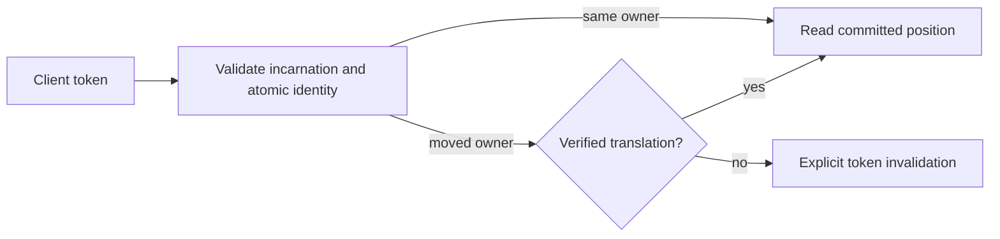
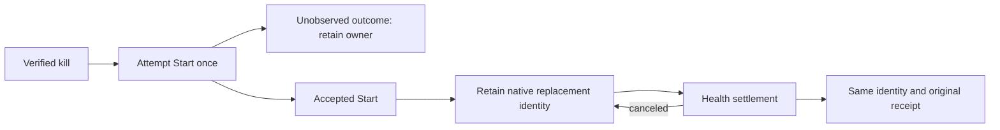

# ADR-017: Commit and session tokens across ownership movement

Status: Accepted for the native same-view epoch and scoped outcome association below; implementation and qualification remain open. Translation across physical-group movement remains Proposed. Public CommitToken fields stay unchanged.

## Context and decision

Current commit tokens identify a database incarnation, atomic partition, log position, and ownership epoch. A group-local Raft position cannot be compared directly with another group's log after split, merge, or movement. The design requires a client/session token to remain meaningful across ownership changes without conflating atomic identity and physical placement.

Keep token validation fail-closed. Candidate designs are a durable old-to-new position lineage or a stable per-atomic-partition sequence replicated with canonical mutations. Select neither until real movement/recovery prototypes show monotonic reads, deduplication, and bounded metadata. A token from another incarnation or unverifiable lineage must return an explicit invalidation error.

## Alternatives and consequences

- Compare source and destination Raft indexes directly: rejected because unrelated logs do not share an ordering domain.
- Silently restart at the destination head: rejected because it can skip acknowledged writes.
- Durable lineage: supports movement but adds retention, compaction, and restore obligations.
- Stable atomic sequence: simplifies client ordering but adds replicated metadata and write-path work.

Until selection, movement-dependent tokens are invalidated rather than guessed. Existing source contracts are in `src/KeyLoad.Abstractions/Contracts.cs`; token application is shared by Core, Query, and Replication. The physical movement work remains in `src/KeyLoad.Replication/Features/ClusterReplication/` and the node-local ownership boundary in accepted [ADR-036](ADR-036-orleans-foundation.md).

## Related requirements and implementation contract

Related: `REQ-REP-004/AC-REP-004`, `REQ-ROUTE-002/AC-ROUTE-002`, `REQ-ROUTE-004/AC-ROUTE-004`, `REQ-ROUTE-005/AC-ROUTE-005`, `REQ-FEED-002/AC-FEED-002`, and KL-017, KL-035..037, KL-072. Atomic identity remains distinct from physical placement; fenced movement and token translation remain planned.

1. **Freeze** the token movement contract and choose lineage or stable sequence only after the prototype decision is accepted; owner: architecture lead.
2. **Test** same-owner monotonic read, movement during pagination, stale owner, restart, compaction, snapshot catch-up, and restore to a new incarnation using real processes and RF3.
3. **Implement** in Core/Replication token and ownership helpers; Query and ChangeFeeds own their cursor consumers. Abstractions/public DTO changes require a separate reviewed contract.
4. **Roll out** only the current homogeneous cohort. A physical move fences its source owner, verifies the complete cut and lineage, catches up its destination and publishes a new authoritative routing epoch. Rollback requires a complete verified cut and a freshly fenced epoch; otherwise recover forward. Never decrement or reuse a stale epoch, compare unrelated group indexes or translate unsupported tokens.
5. **Qualify** the exact delivered SHA through GitHub unit, recovery, and Docker/Aspire RF3 SDK/MCP gates before changing status.

Current files: `src/KeyLoad.Abstractions/Contracts.cs`, `src/KeyLoad.Core/`, `src/KeyLoad.Replication/`. Target files: matching `Features/ClusterReplication/` and consuming slice helpers. Integration owner: root cluster lead; dependencies: ADR-036, snapshot installation, and partition movement. No local test run qualifies this decision.

## Current native token and outcome contract

The feature contract is [TokenOwnershipLineage](../Features/ClusterRouting/TokenOwnershipLineage.md),
REQ/AC-MTOKEN-001..004 and REQ/AC-PMOVE-005..006. Root owns contract integration,
shared source joins and actual qualification; Luna workers own guarded private
native view-bearing token, scoped outcome and real ZoneTree test packets.

Resolve authority and issue tokens in the same transaction/read view. Reuse a
validated placement witness for authorization, receipt and per-effect outbox
issuance; do not invent an epoch or cache authority across requests. Current
StoredOutcome has its frozen alias and Id0..7; ScopeKind Id6 uses Unknown0,
Global1, Partition2 and Partition Id7 carries complete identity. Unknown is an
actual failed-operation scope, never an inferred movable partition. Unsupported
scope values and inconsistent required identities fail as Corruption. Current
outcome-v2 keys and exact locators use the original fingerprint, incarnation,
policy and authorization rules. No operation searches an alternate outcome key
or rewrites malformed metadata.

Ordered implementation: freeze same-view authority and operation-aware scope;
join token producers/consumers and atomic locator/replay validation; preserve
explicit current catalog bootstrap; execute native unit/scalar/process and RF3
flows. Current native round trips, corruption, repeated command identity,
authorization, complete partition isolation and current restart tests are
required. Rollback fences movement exposure while retaining current canonical
metadata and acknowledged effects. This stage does not implement cross-group
token translation, destination install or owner switching.

## Accepted transaction-local witness reuse, 2026-10-05

REQ/AC-MTOKEN-007 fixes the source-review gap where Batch authorization still
compared a literal epoch while receipt and per-effect outbox token creation
repeated placement reads. Root first freezes the feature contract, then joins
CommandAuthorization, AtomicCommandCommit, OperationDispatcher and
AtomicMutationApplication in the existing apply path. Authorization returns only
its validated same-transaction Batch witness; receipt and all outbox effects
reuse one typed token. Other mutation groups resolve one token per group. No
request/transaction cache or public/native format change is introduced.

The genuine document paired-size read counters account for exactly three new
placement point reads, with unchanged single before-image decode and no final
staged image read. Native epoch, same-ID replay, domain-failure, composition,
messaging, recovery and RF3 tests remain required through Aspire. Root retains
original failures, source-bound receipts and actual gate outcomes before stage
delivery. Rollback joins authorization/issuance/outbox callers coherently and
cannot restore an invented epoch or discard scoped outcomes; recover forward if
acknowledged metadata already exists. No movement-created epoch or acceleration
claim follows from source/counter changes alone.

## TASK-KL021-DOCUMENT-SESSION-READ-001

Accepted homogeneous first-release document session-read implementation contract; runtime qualification remains open.

REQ-SESSIONREAD-001 / AC-SESSIONREAD-001: Only document GET gains optional typed GetDocumentRequest.MinimumToken at generated native Id1, keeping Reference Id0 and alias. SDK explicit GetAsync(EntityRef, CommitToken, CancellationToken), HTTP/official MCP keyload_documents_get and Q1 CALL keyload_documents_get(@arguments) decode the exact same typed request via existing canonical catalog; absent option remains ordinary strong GET. This is not generic model/session cache support and does not add a dispatcher.

REQ-SESSIONREAD-002 / AC-SESSIONREAD-002: The existing unique request/read grain obtains fresh native quorum barrier under original bounded ReplicaReadRoundExecutor timeout, including existing actual WaitForApplyAsync(barrier.Position). Afterwards document execution reloads persisted principal/grants and validates minimum token in the exact same native Store.Read cut as row/field authorization and document projection. Token must match database incarnation, exact atomic partition and current persisted ownership epoch; position must be positive and no greater than actual lastApplied at that cut. This barrier applies the current quorum commit cut, hence it already meets every previously acknowledged minimum token. A token beyond that fresh applied cut is explicitly rejected; there is no speculative wait for a caller-invented future position. No physical-lineage translation, stale-mode API or authority cache is added.

REQ-SESSIONREAD-003 / AC-SESSIONREAD-003: Explicit existing TokenInvalidated category with distinct fixed safe reasons WrongIncarnation / OutOfScope / FuturePosition / InvalidPosition identifies token failures without exposing token values/credentials/records. Missing/corrupt applied authority is Corruption; unsupported ownership epoch is OwnershipLost or token invalidation per current placement witness policy. Persisted authorization is checked before token failure reasons; denial contains no row. Caller cancellation checked before admission and inside final cut, no partial result; native deadline/admission/drain unchanged. Former leader with no quorum cannot pass existing fresh barrier even for a valid historical token.

REQ-SESSIONREAD-004 / AC-SESSIONREAD-004: Real ZoneTree local whole flows prove literal document/complete state+position unchanged after invalid incarnation/scope/future/position and pre-cancel, fresh authorized minimum succeeds and later revision continues. Real fixture-owned Aspire RF3 SDK+official MCP failover operation proves acknowledged write token→elected leader kill→token-bearing complete literal healthy read→all invalid variants fail→healthy token read; isolated former surviving leader/minority strong token read fails, both voter restoration and healthy read follow. Existing native receipt replay/Unknown scenarios remain separate and unchanged. Auth revocation must deny valid token then renewed persisted grant/healthy read.

Ownership: Abstractions DocumentStorage DTO; Client overload; Core feature-local same-view validator and Documents reader; Orleans existing GrainCoreReadCapabilities routing; docs ClientApi/DocumentStorage/ClusterReplication + ADR017/036 amendment; unit DocumentStorage and RF3 ClusterReplication wholeflow. SQL Q1 CALL is exact typed operation envelope only; Q1 SELECT/AST and other read models do not accept session options in this stage. Same homogeneous current first-release cohort; native Id append/alias remains stable, no legacy reader/migration/runtime fallback. Root owns join/build/native discovery/test/Linux evidence and status; no qualification or closure inferred from authored source.

## Proven epoch meaning before implementation

DatabaseEngine.Token in Core/DatabaseEngine.cs obtains OwnershipEpoch from persisted ReadPlacementWitness.PlacementEpoch. AtomicPartitionPlacementReader Fallback/Explicit uses PhysicalShardCatalog.DefaultShard.PlacementEpoch; PhysicalShardCatalogRecordSerialization.InitialRecord initializes that physical-placement value. ReplicaElection.RunRound changes DurableReplicaLog term/vote, not physical catalog. Original authenticated 4e18 RF3 passed LeaderLossQueueScenario compares the entire pre-kill commit token to the actual replay token after elected leader kill. Hence elected leader failover keeps physical PlacementEpoch, and equality does not invalidate that acknowledged token. The new public wholeflow additionally checks a fresh postfailover command retains the same physical epoch/incarnation/atomic identity. Physical ownership movement with a changed placement epoch is explicitly unsupported by this minimal surface; it fails closed without invented lineage, and does not claim KL035/036/072 movement support.

The current native fixture supports Kill/Restart and retains actual owner receipts.
The authored authority-denial flow is a still-live surviving voter without quorum,
not a network-isolated former leader while another majority stays live. That
stronger KL021 authority scenario remains open until a bounded fixture-owned
network partition contract exists; no manual Docker or new fault hook is added.
Fresh barrier implementations are ReplicaReadRoundExecutor + ReplicaLeader.BarrierAsync:
both use native Materializer.WaitForApplyAsync at their authenticated quorum cut.
SDK method ownership is Features/DocumentStorage/Transport/DocumentSessionClient.cs.

### Native MCP no-quorum boundary refinement

McpHttpPipeline.RunAsync invokes DatabaseCredentialResolver.ReadAsync before
native tool dispatch. Its fresh signed Authenticate read itself needs quorum.
Therefore the no-quorum official caller must retain the actual native
HttpRequestException HTTP503 rather than invent a CallToolResult error; SDK
GET still asserts its actual typed OwnershipLost problem. The healthy
restored token-bearing SDK/MCP/SQL results remain complete literal checks.
This is not a tool outcome or session initialization success claim.

The final no-quorum oracle retains both SDK's exact OwnershipLost/503/NoLeader
problem and the official caller's actual native HTTP503 original exception,
with its bounded five-field Problem body and credential/document privacy checks.
It never converts that pre-tool HTTP failure into a fictitious tool result.

## TASK-KL021-OWNED-SILO-ISOLATION-002 — accepted namespace control implementation contract

REQ-MTOKEN-ISOLATION-003: native fault image derives from the exact existing Dockerfile pinned aspnet/runtime and server build. A dedicated feature-owned fault Dockerfile derives from the authenticated exact server @sha256 image receipt; fault-runtime installs native iptables and a bounded coreutils timeout wrapper as container UID0 at image build, then restores APP_UID. Normal root Dockerfile and its runtime final/default target remain byte-for-byte unchanged and receives no fault tools or capability changes. Aspire13.6 public WithDockerfile(context,Dockerfile,stage:fault-runtime) owns the selected three-node image build/start; WithContainerRuntimeArgs adds only NET_ADMIN to these exact owned resources. No privileged, host network/PID namespace, production default changes, manual topology, image digest fiction or whitelist expansion. Tool version/package/license and base/build/image/config identities are actual build/start receipts, not inferred from a web page.

AC-MTOKEN-ISOLATION-003: fixture opts into a separate owned native fault wave and requires Linux/running container Config.User APP_UID, only admitted additional capability NET_ADMIN, no Host/PID/shared namespace, exactly three model names and matching incarnation/config image/build source. Before every firewall mutation re-inspect owned ID/name/image/config/incarnation and verified unique IPv4 endpoints; reject malformed/ambiguous/IPv6/foreign source rather than accepting alias fallback. Native discovery SiloAddress IP/port must match inspected network address TCP11111; HTTP8080 endpoint remains discovered from Aspire. Unconfigured standard/default/covered fixtures cannot acquire this fault capability.

REQ-MTOKEN-ISOLATION-004: create unique per-run bounded-length chains inside only the old leader's network namespace. For each of exactly two owned peer IPv4s, INPUT source and OUTPUT destination rules block both sport11111 and dport11111; attach those exact chains first in the corresponding chain so existing connections and both directions are isolated. HTTP8080 remains outside all rules. Record chain/rule mutation intent BEFORE execution and actual exit/output/check receipt before next mutation, including partial chain creation/jump install. Never flush shared INPUT/OUTPUT rules or unrelated chains. Restore only own exact jump/rules/chains and verify absence.

AC-MTOKEN-ISOLATION-004: native docker exec --user0 uses inspected full owned container ID, executable argument list, no shell interpolation, no detach/privileged. Image timeout wrapper bounds remote iptables work; xtables lock wait fits within it. Host original exec task and bounded stdout/stderr readers remain owned and are actually joined even after initiating cancellation, then partial intents reconcile against native exact chain/rule state before restore. Docker CLI cancellation alone is not evidence of remote exec completion. Unsettled original remote/host work retains primary/cleanup/resource/image ownership and fails; never restores over an in-flight mutation or deletes retained receipts. Actual counter/rule checks and genuine surviving-majority new-term ACK provide fault proof, not HTTP reachability alone.

AC-MTOKEN-ISOLATION-005: real SDK/officialMCP whole-flow uses current optional MinimumToken public contract: original canonical command ACK/token; exact old leader/container/native term; namespace isolation; actual different surviving leader/newer term and majority ACK of one immutable next command; reachable running old leader rejects token-bearing strong read with exact native no-authority error, no stale/partial body; same exact nodes/rules restored and joined; literal current document/revision/token/receipt and healthy reads across restored replicas. Existing parent/start/cleanup deadlines unchanged, no timer sleeps or generic retry-to-green. Any canonical UnknownWriteOutcome is preserved and reconciled only under existing original-ID/receipt contract, never replaced by fresh IDs or fabricated ACK.

Public API evidence: Docker documents container exec UID selection and non-detached process lifetime at https://docs.docker.com/reference/cli/docker/container/exec/ ; namespace isolation and NET_ADMIN (rather than privileged) at https://docs.docker.com/engine/containers/run/ . Pinned Aspire13.6 local XML advertises WithDockerfile stage/build-before-start and WithContainerRuntimeArgs; these are source/API evidence, not native execution. Netfilter upstream https://www.netfilter.org/projects/iptables/index.html owns rule manipulation semantics. Current tool package version/image ID/namespace behavior will be measured in root's genuine native build/start gates; no runtime availability claim before execution.

Ordered ownership: docs/ADR017 contract precedes Dockerfile fault-only stage and AppHost ClusterReplication resource composition helper. Integration ClusterReplication models/lifecycle/processes own exact node/image/IP/chain/rule receipts, original process/readers and restoration; owning case/flow consumes disjoint KL021 MinimumToken API packet. Root joins source/serialization/API paths coherently, builds and runs actual native Linux RF3. Source/API readiness, functional proof and all broader endurance/performance gates remain distinct; no KL021 task closure from authored code.

REQ/AC-MTOKEN-ISOLATION-006: NodeStatus gains additive native Id9 ConsensusTerm, verified free after existing IDs0..8. NodeAdministration.StatusAsync copies Term from the same existing locked partition.Consensus.StateAsync snapshot used for Leader/Applied. Current persisted authorization, separate request grain, readonly status semantics and native/public serializers remain unchanged. Purpose is authenticated operational authority diagnostics, not a test hook. Original ACK and actual new-majority ACK whole-flow requires positive original term and strictly larger surviving term; changed leader alone does not prove it. No on-disk live inspection or invented term. Public SDK/official MCP status full outcomes bind actual native term; defaults of construction do not qualify it.

Frozen bounded native authority observation (owner approved2026-10-08): under the SAME original McpCallerDeadline token, sequential authenticated SDK Status operations, exactly one awaited original request in flight, on the two inspected surviving voters may observe readiness. No Task.Delay, sleep, polling worker, reset deadline, mutation retry or health-only inference. The latest32 actual status/error observations form a fixed-size closed diagnostic summary; replies do not accumulate. Readiness is bounded by the original deadline, never by an arbitrary attempt count. Only exact OwnershipLost/503/"The cluster has no current leader with a reachable majority." is a pending authority observation; any other failure remains fatal to the flow. Readiness requires an explicit positive ConsensusTerm strictly newer than the original ACK's status and Leader equal to one of those exact two surviving voters, different from the isolated voter. Then submit exactly one immutable next command; require its actual quorum ACK and fresh status/official MCP status native term. Original cancellation fails honestly after joining its actual observation. Default production status semantics remain diagnostics, not a new strong-read promise; the subsequent actual ACK is the authority proof.

Service-user invariant clarification: the fault Dockerfile inherits and restores the base APP_UID USER. The selected resources preserve the already existing ClusterResourceSettings --user uid:gid override exactly, captured through pinned public ContainerRuntimeArgsCallbackAnnotation before adding NET_ADMIN. They do not change default host/container identity or start service as root. Native tool/read commands alone use --user0 inside each verified owned namespace.

Persisted NodeStatus.NodeId is a physical GUID independent of Aspire node1/node2/node3 resource names. The real flow captures each original authenticated endpoint identity and requires it unchanged after restoration; public SDK/official MCP status comparisons bind that actual GUID rather than an invented resource-name identity.

## Accepted partial native restart ownership (2026-10-08)

TASK-REP-PARTIAL-RESTART-001 refines REQ-REP-004 / AC-REP-004 and REQ-TEST-007 / AC-TEST-007. Before implementation: an actual successful Aspire Start is retained independently from its health/readiness completion. Once attempted, an unobserved Start outcome cannot be repeated; it remains owned until actual application/resource shutdown retires it. Once accepted, subsequent recovery resumes only native inspection, health wait and receipt settlement under the caller's existing token/deadline. It never reissues Start because health wait was canceled. The first observed replacement ID/configured image/image ID/start timestamp is retained and exact unchanged identity is required after health, before the original receipt is published. Native runtime identity changing during settlement fails; no readiness success is inferred from running state. Kill cannot replace an unsettled prior restart owner. The original initiating error and all cleanup errors remain separate.

The fixture exposes a useful two-phase native ownership boundary: BeginContainerRestartAsync accepts the actual Start and observes its running replacement; RestartContainerAsync settles native health and receipts for the same owner. This is fixture lifecycle composition, not a product test hook. AC-REP-PARTIAL-RESTART-001: AcEvent008AcceptedRestartCancellationResumesSameReplacementAndPreservesReplay uses actual killed leader/accepted replacement, cancels at the exact-token original health-settlement admission gate, then resumes under the original operation deadline and proves the same running replacement identity, canonical SDK receipt replay, full literal SDK/official MCP aggregate state on all three replicas. No timer, sleep, fake resource, deadline increase or mutation retry is added. During-health scheduler timing is not claimed: the deterministic cancellation is at the explicit accepted-Start-to-native-health boundary. Existing original leader-loss case remains intact.

Original aa103 run37686560768/job113015778654 failure remains immutable. Its initiating Starting/unknown-health cause is unresolved; this repair addresses only the proven secondary repeated Start. Exact-source Linux native RF3 qualification remains open. Root owns join/build/native execution.

Restart diagnostic refinement: resumed attempts explicitly record AcceptedStartRetained, never a fabricated new Start success. Begin phase failures save the original exception/category at actual StartCommand or RuntimeInspection stage; diagnostic cleanup failure is attached through the unchanged failure-retention path.

## First-incarnation readiness evidence (2026-10-08)

TASK-REP-READINESS-EVIDENCE-001 refines REQ-REP-004 / AC-REP-004 and REQ/AC-TEST-007. This stage follows TASK-REP-PARTIAL-RESTART-001 without changing admission. For each exact Aspire discovered owned node endpoint, one native GET /health/ready is awaited and its bounded response reader settled/disposed. It shares the existing three-second per-node diagnostic deadline with signed discovery, rather than granting either a second budget. Only status200,503,other HTTP status or fixed unavailable is retained; response bodies are drained within the existing8192-byte cap and never retained as readiness explanations. Server's503 body does not identify DatabaseReady/compatible-cohort/catalog branch, so branch remains explicitly Unobserved. No server response/auth semantics change or inferred reason is introduced.

Each existing actual native ResourceId log subscription records its closed started/running/completed/canceled/faulted state plus observation timestamps of first/last received log lines. These are observer times, not invented native event timestamps; observed faults are rethrown for existing joined disposal. Save snapshots this evidence without replacing its original failure. ResourceId-keyed task lifecycle is retained; no unproved reattachment is introduced. Current24-line buffers and80-line/8192-byte total artifact limits remain unchanged. Evidence groups put resource/readiness/discovery/subscription state first, followed by newest retained logs so prefix clipping cannot omit the latest signal. Existing failure markers remain.

AC-REP-READINESS-EVIDENCE-001 maps to the actual AcEvent008AcceptedRestartCancellationResumesSameReplacementAndPreservesReplay flow: canceled accepted restart saves real diagnostic evidence before recovery; after real all-three SDK/MCP healthy replay, another one-shot observation must contain HTTP200 for all three owned discovered endpoints and actual log observation state. No fake response/source assertion/timer/retry/increased budget. Native execution and exact Linux original evidence remain root-owned and pending.

### TASK-MTOKEN-ISOLATION-ADMISSION-EVIDENCE-001

REQ/AC-MTOKEN-ISOLATION-003 retains every original exact native container namespace guard. The original46a4 inspected-container rejection has no retained compound predicate member. Evaluate the existing conditions in their original short-circuit order and retain the first observed mismatch as one closed enum: running state, privilege, PID namespace, network count/mode, capability count/value, exact name/image/user/build source/incarnation. Invalid JSON/required fields and exact GUID parsing still fail; no alias, alternate namespace, permission or admitted-cohort expansion. On an actual predicate rejection emit one bounded fixed-schema stderr row containing only schema/kind/closed mismatch, then throw the unchanged primary rejection. Retain any output failure after that primary through the existing ServerFailureObserver. No native names, addresses, image refs, identifiers, payloads or credentials are emitted.

IntegrationTests ClusterReplication Contracts owns the closed enum; Validation owns native field evaluation; Diagnostics owns the bounded row and original failure order; Serialization reader consumes them at its existing admission boundary. Root joins these together and builds/formats; genuine Kl021ReachableFormerLeaderRejectsMinimumTokenWhileOtherVotersAcknowledgeNewerTerm and its original exact SDK/MCP/isolation/restoration gates remain the runtime evidence. A future observed row identifies only the actual failing predicate, not a consensus cause or successful fault. Original source/namespace guard, shutdown/resource retention, deadlines and all acceptance counts remain unchanged. ADR-017 owns this additive test evidence contract.

### Genuine native terminal movement supporting flow (2026-10-08)

REQ-MOVE-NATIVE-TERMINAL-001: The configured two-owner native supporting fixture submits every immutable target StagePage and Install phase through the actual A grant/MAC admission and independently signed B journal/materializer. Every actual B journal is acknowledged at A before a subsequent authority transition. Terminal Install uses the original Handle.PageCount; A Installed advancement accepts only the actual returned CommitReceipt and ACKed terminal grant. Technical publication does not authorize ordinary target traffic while the public A-authority bridge remains closed.

AC-MOVE-NATIVE-TERMINAL-001: The complete mixed original source corpus is captured with independently checked family/page/resource digests. Every StagePage leaves all destination canonical model families unchanged; same-ID phase replay is byte-identical and preserves complete raw state, canonical position and native journal index. Installation checks full independently expected destination values, storage-incarnation normalization and original integrity incarnation, exact terminal command/token/mutations/durability, original A receipt authority and cold A/B reopening. Finalize/Publish/Retire must use actual preceding grants/journals; no synthesized Installed/MoveReady/receipt.

REQ-MOVE-NATIVE-HISTORY-001: The supporting fixture retains at most64 native entries. The explicitly selected terminal fixture admits at most426 original entries:19 throughCaptured +4*55 transfer pages +2 terminalInstall +3 InstalledAdvance/Finalize/CompleteRetirement +2 Publish +180 source cleanup operations. Native per-append MaxAppendEntries64, MaxAppendBytes, snapshot/materialization ceilings, command timeout, database/cache limits remain unchanged. The actual corpus must fit55 transfer families and one bounded cleanup batch per family; excess is a failure, not a quota adjustment.

AC-MOVE-NATIVE-HISTORY-001: Original command lookup reads actual retained native journal pages bounded by the original configuration; every page and entry checks the original token, exact index continuity and nonempty progress. Actual same-ID result/cut/index remains stable after replay and cold reopen. The final case asserts its independently counted history; no visibility-only history, fake journal or lost reader ownership is accepted.

All cases remain authored and unexecuted until root's genuine native gate. Public six-silo movement, terminal abort and four-child crash acceptance remain separate mandatory criteria; no task/status closure is proposed.

REQ/AC-MOVE-NATIVE-NONE-CORRUPTION-001: The separate real native malformed-control case replaces only persisted current-format control Phase with None0 and submits the original first Install authorization through configured MAC admission and the actual replica log/materializer. Fatal apply preserves complete canonical bytes/cut and produces no receipt. The original waiter exposes RecoveryRequired/corrupt-log; joined original worker shutdown retains Corruption/invalid-state. Exact original row bytes are restored with one native commit, faulted owners fully dispose, and cold new owners/admission replay the original retained command before genuine complete target installation and cold model/receipt checks. Two intentional fault-preparation/repair commits are explicitly counted apart from the replicated index. Production markers1..9, native serializer, quotas/timeouts and all original terminal case assertions remain unchanged. No immediate fabricated corruption receipt or materializer reset.

## Authored active-capture abort native operation

REQ-PMOVE-ABORT-FLOW-001 / AC-PMOVE-ABORT-FLOW-001 binds `ControlledPartitionMovementAbortTests.GenuineActiveCaptureAbortJoinsBothOwnersPreservesOriginalModelAndColdHealthyCommand`: genuine original Capture/page owner remains alive; A BeginAbort, every empty-target bounded cleanup family/ACK, SourceBeginAbort marker, old Capture rejection with full canonical/cut/native-accounting invariance, original producer/page/image join, terminal source/target journals, original exact body-bound ACKs, one actual grant-disposal batch and FinalizeAbort precede cold A/B reopening. Complete original document/vector/topic/queue values, full/partial blob reads and immutable A receipt remain authoritative. A new original-scope document command has full literal token/receipt, exact replay/no effects and cold literal read.

Independent history bound: source starts16 after genuinely authorized active Capture; BeginAbort1, target60*(authorize+ACK)120, SourceBeginAbort3, source terminalAbort3, cancel1 and finalize1 yield source145, target bootstrap1+60=61; healthy source146. All target families are genuinely empty before abort; all grants are actually ACKed except one deliberately unreleased Capture, so a nonterminal grant disposal fails the case. Existing selected terminal history426 covers this strict bound; production per-append64, database/cache limits and timeouts stay unchanged. Actual six distinct native loopback listeners/configured MAC admission are required; unsupported host bind is a failure, not a substitute proof. Source-only authored operation; no native execution, staged-target cleanup, process-cut or public RF3 qualification is claimed.

TASK-MOVE-NATIVE-COMPOSED-003 joins the current terminal, malformed-control and active-capture abort source operations through the canonical [ClusterRouting traceability and integration contract](../Features/ClusterRouting.md#task-move-native-composed-003). Current source/helper guards, one root compiler/native-test owner and all original qualification limits remain mandatory; this authored candidate does not change the ADR implementation status.

## Admitted movement Fence process recovery implementation contract

REQ/AC-PMOVE-PROCESS-001 freezes the shared genuine configured producer and four-child scope described in ClusterRouting/StorageRecovery. Ordered stages are native mixed/blob seed → original Prepare/Authorize → exact configured MAC verification/local issuer → joined parent owners → committed-predecessor ACK/kill → actual original Fence atomic-cut/kill → original-WAL recovery child → cold original replay child → independently literal complete model/receipt/cut verification → actual ACK/AcceptFence → both cold owners. Native payload bytes and original user receipt remain exact; complete independently constructed public values use canonical JSON equality rather than binary reference topology.

Dependencies are current joined CoreR3/TransportR2 supporting native fixture, configured owner directory and native ZoneTree/replica journals; no new provider/format/migration/parent dispatcher. Source owner only writes private CrashHost ClusterRouting/Recovery ClusterRouting and one separately guarded closed-mode dispatch append. Root joins, compiles and runs exact-source native gates; independent peer reviews the sealed source. Rollback removes only this additive authored process slice; canonical stores/production dispatch unchanged. No status promotion, production/RF3/power-loss/endurance claim is authorized without actual gates.

### TASK-PMOVE-FENCE-PROCESS-002: joined producer ownership

REQ-PMOVE-PROCESS-001 / AC-PMOVE-PROCESS-001 requires the original parent producer to close both actual canonical/replica nodes, MAC/native admission and all discovered native/HTTP listeners before the first of the four original CrashHost children starts. The shared ProcessOperation preparation scope returns only frozen value/configuration/original signed operation evidence after joined disposal; original known source and target native owner locks are checked before child execution. Discovered owner/voter/silo/caller addresses remain immutable original metadata, never claims of a live six-silo deployment. Actual fixed11111 native identity and six distinct IP pins are unchanged; unavailable original host bindings fail and actual Linux process qualification remains necessary.

The child consumes only the bounded current-format original typed CreateNew input, local native signature, persisted original owner/grant/placement/authorization and existing real journal/materializer. It does not issue a permit, configure live DNS/listener owners, create a dispatcher or reconnect to the parent producer. The post-child ACK14/Accept15 continuation invokes current configured MAC/native admission and its original DNS/IP address validation against frozen identities; DNS validation does not require an open original producer listener. No alias, different native port, deadline/expiry extension or bypass is admitted.

The existing five atomic cuts each retain all four joined original children, strict bounded Unix0600 native CreateNew files, one90s parent deadline, original readers/owner checks/primary-plus-cleanup failures, complete literal document/vector/topic/queue/blob/original receipt and unchanged-target images. ProcessRecoveryTests.OriginalAdmittedFenceSurvivesFourOwnedChildrenWithMixedStateExactReplayAndHealthySettlement remains the complete mapped automated flow. Root alone reviews/applies/formats/builds and executes original native TUnit/MTP development and Linux delivered-source gates. This source-only correction has no runtime pass and does not qualify full Install/Retire/Abort process movement, public RF3, power-loss or endurance.

The same Fence recovery flow also replays the genuine original CompleteBlob command, immutable request/evaluation time and complete original outcome in both recovered and final cold owners. Original published blob receipt/token/value are independently checked before handoff, then retained byte-identical after each replay. Existing complete raw-image/cut/index checks reject any new effect or journal entry. This activates the previously unused original blob replay assertion without changing the mixed corpus, canonical queue oracle or process stage.

### TASK-PMOVE-FENCE-PROCESS-003: independent blob oracle

REQ-PMOVE-PROCESS-001 / AC-PMOVE-PROCESS-001 also binds the blob expected reference, upload and original completion IDs, full bytes [1,2,3,4], partial bytes [2,3], part SHA256, published revision and part count to an independent literal recovery corpus. The parent compares the producer's original CompleteBlobUpload request against that corpus and recomputes its integrity from the actual persisted source incarnation plus literal input via the canonical native BlobIntegrity API. Parent, recovered and cold-owner assertions reuse this independent expected corpus, never the producer helper or its expected hash. Original outcome replay remains byte-exact and whole-store/journal-index oracles remain unchanged. This source repair addresses FENCE-PEER-001; it is not a compiler/native runtime pass or any Install/Retire/Abort/public/power-loss qualification.

### TASK-MTOKEN-ISOLATION-PARTIAL-RETIREMENT-001: original Linux59 cleanup correction

REQ/AC-MTOKEN-ISOLATION-003/004/005 retain strict native namespace admission and joined ownership after any startup or mutation failure. Original run37744013727/job113201104531 Kl021ReachableFormerLeaderRejectsMinimumTokenWhileOtherVotersAcknowledgeNewerTerm fails first at NetworkMode admission and also fails cleanup because no complete admitted node set was recorded. The primary NetworkMode cause remains unknown; do not change or relax that predicate. Two independent definite lifecycle defects are corrected: partial startup must not require successful admission of every node before invoking the existing native stopped-namespace verifier, and native canonical/replica lock checks must open actual owner.lock, matching ZoneTree's real owner, rather than nonexistent store.owner.lock.

Ordered contract: require actual owned AppHost stop success; invoke existing VerifyNodesStoppedAsync for every exact admitted model name, using recorded full IDs where available and its existing exact-name/unique-full-ID/stopped-state checks for unobserved nodes. Any running, ambiguous, substituted observed ID or native Docker failure retains primary/cleanup/root/image ownership and fails. Only after all namespaces settle, acquire all9 actual native locks (3node owners plus3canonical/3replica owner.lock files); only then run unchanged actual derived-image/base/layer/source proof, no-referencing-container check, tag removal and remaining-tag verification. Capture original retirement/mutation evidence and original cleanup failures. Incomplete admission alone does not establish unsettled resources; actual native stopped and lock proofs do. No weakened namespace, lock, image, deadline, resource, exception or assertion contract is introduced.

IntegrationTests ClusterReplication Lifecycle/ReplicaIsolationOwner.cs owns partial-start shutdown admission; Lifecycle/ReplicaIsolationRetirement.cs owns exact physical locks. Cases/ReplicaIsolationNativeRetirementTests.cs and Fixtures/ReplicaIsolationNativeRetirementFixture.cs exercise real native3node lock files and6ZoneTree stores: committed literal rows, all9-held-lock retirement rejection without FileNotFound, actual owner disposal, all9exclusive canonical lock proofs, unchanged literal rows/positions after native reopen and joined private-root cleanup. This is supporting native storage/lifecycle regression, without claiming Docker RF3 or functional product-contributor coverage. The existing full genuine Kl021 SDK/officialMCP isolation/restoration/retirement flow remains mandatory exact-source Linux proof; source and original failure are not passing runtime evidence. Root owns docs-first guarded join, build/format, native TUnit and required Linux RF3 qualification. Rollback restores both cleanup corrections together; original primary errors remain visible.
