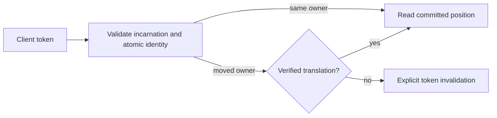

# ADR-017: Commit and session tokens across ownership movement

Status: Accepted for the native same-view epoch and scoped outcome association below; implementation and qualification remain open. Translation across physical-group movement remains Proposed. Public CommitToken fields stay unchanged.

## Context and decision

Current commit tokens identify a database incarnation, atomic partition, log position, and ownership epoch. A group-local Raft position cannot be compared directly with another group's log after split, merge, or movement. The design requires a client/session token to remain meaningful across ownership changes without conflating atomic identity and physical placement.

Keep token validation fail-closed. Candidate designs are a durable old-to-new position lineage or a stable per-atomic-partition sequence replicated with canonical mutations. Select neither until real movement/recovery prototypes show monotonic reads, deduplication, and bounded metadata. A token from another incarnation or unverifiable lineage must return an explicit invalidation error.

## Alternatives and consequences

- Compare source and destination Raft indexes directly: rejected because unrelated logs do not share an ordering domain.
- Silently restart at the destination head: rejected because it can skip acknowledged writes.
- Durable lineage: supports movement but adds retention, compaction, and restore obligations.
- Stable atomic sequence: simplifies client ordering but adds replicated metadata and write-path work.

Until selection, movement-dependent tokens are invalidated rather than guessed. Existing source contracts are in `src/KeyLoad.Abstractions/Contracts.cs`; token application is shared by Core, Query, and Replication. The physical movement work remains in `src/KeyLoad.Replication/Features/ClusterReplication/` and the node-local ownership boundary in accepted [ADR-036](ADR-036-orleans-foundation.md).

## Related requirements and implementation contract

Related: `REQ-REP-004/AC-REP-004`, `REQ-ROUTE-002/AC-ROUTE-002`, `REQ-ROUTE-004/AC-ROUTE-004`, `REQ-ROUTE-005/AC-ROUTE-005`, `REQ-FEED-002/AC-FEED-002`, and KL-017, KL-035..037, KL-072. Atomic identity remains distinct from physical placement; fenced movement and token translation remain planned.

1. **Freeze** the token movement contract and choose lineage or stable sequence only after the prototype decision is accepted; owner: architecture lead.
2. **Test** same-owner monotonic read, movement during pagination, stale owner, restart, compaction, snapshot catch-up, and restore to a new incarnation using real processes and RF3.
3. **Implement** in Core/Replication token and ownership helpers; Query and ChangeFeeds own their cursor consumers. Abstractions/public DTO changes require a separate reviewed contract.
4. **Roll out** only the current homogeneous cohort. A physical move fences its source owner, verifies the complete cut and lineage, catches up its destination and publishes a new authoritative routing epoch. Rollback requires a complete verified cut and a freshly fenced epoch; otherwise recover forward. Never decrement or reuse a stale epoch, compare unrelated group indexes or translate unsupported tokens.
5. **Qualify** the exact delivered SHA through GitHub unit, recovery, and Docker/Aspire RF3 SDK/MCP gates before changing status.

Current files: `src/KeyLoad.Abstractions/Contracts.cs`, `src/KeyLoad.Core/`, `src/KeyLoad.Replication/`. Target files: matching `Features/ClusterReplication/` and consuming slice helpers. Integration owner: root cluster lead; dependencies: ADR-036, snapshot installation, and partition movement. No local test run qualifies this decision.

## Current native token and outcome contract

The feature contract is [TokenOwnershipLineage](../Features/ClusterRouting/TokenOwnershipLineage.md),
REQ/AC-MTOKEN-001..004 and REQ/AC-PMOVE-005..006. Root owns contract integration,
shared source joins and actual qualification; Luna workers own guarded private
native view-bearing token, scoped outcome and real ZoneTree test packets.

Resolve authority and issue tokens in the same transaction/read view. Reuse a
validated placement witness for authorization, receipt and per-effect outbox
issuance; do not invent an epoch or cache authority across requests. Current
StoredOutcome has its frozen alias and Id0..7; ScopeKind Id6 uses Unknown0,
Global1, Partition2 and Partition Id7 carries complete identity. Unknown is an
actual failed-operation scope, never an inferred movable partition. Unsupported
scope values and inconsistent required identities fail as Corruption. Current
outcome-v2 keys and exact locators use the original fingerprint, incarnation,
policy and authorization rules. No operation searches an alternate outcome key
or rewrites malformed metadata.

Ordered implementation: freeze same-view authority and operation-aware scope;
join token producers/consumers and atomic locator/replay validation; preserve
explicit current catalog bootstrap; execute native unit/scalar/process and RF3
flows. Current native round trips, corruption, repeated command identity,
authorization, complete partition isolation and current restart tests are
required. Rollback fences movement exposure while retaining current canonical
metadata and acknowledged effects. This stage does not implement cross-group
token translation, destination install or owner switching.

## Accepted transaction-local witness reuse, 2026-10-05

REQ/AC-MTOKEN-007 fixes the source-review gap where Batch authorization still
compared a literal epoch while receipt and per-effect outbox token creation
repeated placement reads. Root first freezes the feature contract, then joins
CommandAuthorization, AtomicCommandCommit, OperationDispatcher and
AtomicMutationApplication in the existing apply path. Authorization returns only
its validated same-transaction Batch witness; receipt and all outbox effects
reuse one typed token. Other mutation groups resolve one token per group. No
request/transaction cache or public/native format change is introduced.

The genuine document paired-size read counters account for exactly three new
placement point reads, with unchanged single before-image decode and no final
staged image read. Native epoch, same-ID replay, domain-failure, composition,
messaging, recovery and RF3 tests remain required through Aspire. Root retains
original failures, source-bound receipts and actual gate outcomes before stage
delivery. Rollback joins authorization/issuance/outbox callers coherently and
cannot restore an invented epoch or discard scoped outcomes; recover forward if
acknowledged metadata already exists. No movement-created epoch or acceleration
claim follows from source/counter changes alone.
