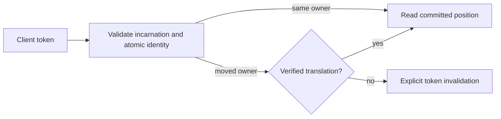

# ADR-017: Commit and session tokens across ownership movement

Status: Accepted for the native same-view epoch and scoped outcome association below; implementation and qualification remain open. Translation across physical-group movement remains Proposed. Public CommitToken fields stay unchanged.

## Context and decision

Current commit tokens identify a database incarnation, atomic partition, log position, and ownership epoch. A group-local Raft position cannot be compared directly with another group's log after split, merge, or movement. The design requires a client/session token to remain meaningful across ownership changes without conflating atomic identity and physical placement.

Keep token validation fail-closed. Candidate designs are a durable old-to-new position lineage or a stable per-atomic-partition sequence replicated with canonical mutations. Select neither until real movement/recovery prototypes show monotonic reads, deduplication, and bounded metadata. A token from another incarnation or unverifiable lineage must return an explicit invalidation error.

## Alternatives and consequences

- Compare source and destination Raft indexes directly: rejected because unrelated logs do not share an ordering domain.
- Silently restart at the destination head: rejected because it can skip acknowledged writes.
- Durable lineage: supports movement but adds retention, compaction, and restore obligations.
- Stable atomic sequence: simplifies client ordering but adds replicated metadata and write-path work.

Until selection, movement-dependent tokens are invalidated rather than guessed. Existing source contracts are in `src/KeyLoad.Abstractions/Contracts.cs`; token application is shared by Core, Query, and Replication. The physical movement work remains in `src/KeyLoad.Replication/Features/ClusterReplication/` and the node-local ownership boundary in accepted [ADR-036](ADR-036-orleans-foundation.md).

## Related requirements and implementation contract

Related: `REQ-REP-004/AC-REP-004`, `REQ-ROUTE-002/AC-ROUTE-002`, `REQ-ROUTE-004/AC-ROUTE-004`, `REQ-ROUTE-005/AC-ROUTE-005`, `REQ-FEED-002/AC-FEED-002`, and KL-017, KL-035..037, KL-072. Atomic identity remains distinct from physical placement; fenced movement and token translation remain planned.

1. **Freeze** the token movement contract and choose lineage or stable sequence only after the prototype decision is accepted; owner: architecture lead.
2. **Test** same-owner monotonic read, movement during pagination, stale owner, restart, compaction, snapshot catch-up, and restore to a new incarnation using real processes and RF3.
3. **Implement** in Core/Replication token and ownership helpers; Query and ChangeFeeds own their cursor consumers. Abstractions/public DTO changes require a separate reviewed contract.
4. **Roll out** only the current homogeneous cohort. A physical move fences its source owner, verifies the complete cut and lineage, catches up its destination and publishes a new authoritative routing epoch. Rollback requires a complete verified cut and a freshly fenced epoch; otherwise recover forward. Never decrement or reuse a stale epoch, compare unrelated group indexes or translate unsupported tokens.
5. **Qualify** the exact delivered SHA through GitHub unit, recovery, and Docker/Aspire RF3 SDK/MCP gates before changing status.

Current files: `src/KeyLoad.Abstractions/Contracts.cs`, `src/KeyLoad.Core/`, `src/KeyLoad.Replication/`. Target files: matching `Features/ClusterReplication/` and consuming slice helpers. Integration owner: root cluster lead; dependencies: ADR-036, snapshot installation, and partition movement. No local test run qualifies this decision.

## Current native token and outcome contract

The feature contract is [TokenOwnershipLineage](../Features/ClusterRouting/TokenOwnershipLineage.md),
REQ/AC-MTOKEN-001..004 and REQ/AC-PMOVE-005..006. Root owns contract integration,
shared source joins and actual qualification; Luna workers own guarded private
native view-bearing token, scoped outcome and real ZoneTree test packets.

Resolve authority and issue tokens in the same transaction/read view. Reuse a
validated placement witness for authorization, receipt and per-effect outbox
issuance; do not invent an epoch or cache authority across requests. Current
StoredOutcome has its frozen alias and Id0..7; ScopeKind Id6 uses Unknown0,
Global1, Partition2 and Partition Id7 carries complete identity. Unknown is an
actual failed-operation scope, never an inferred movable partition. Unsupported
scope values and inconsistent required identities fail as Corruption. Current
outcome-v2 keys and exact locators use the original fingerprint, incarnation,
policy and authorization rules. No operation searches an alternate outcome key
or rewrites malformed metadata.

Ordered implementation: freeze same-view authority and operation-aware scope;
join token producers/consumers and atomic locator/replay validation; preserve
explicit current catalog bootstrap; execute native unit/scalar/process and RF3
flows. Current native round trips, corruption, repeated command identity,
authorization, complete partition isolation and current restart tests are
required. Rollback fences movement exposure while retaining current canonical
metadata and acknowledged effects. This stage does not implement cross-group
token translation, destination install or owner switching.

## Accepted transaction-local witness reuse, 2026-10-05

REQ/AC-MTOKEN-007 fixes the source-review gap where Batch authorization still
compared a literal epoch while receipt and per-effect outbox token creation
repeated placement reads. Root first freezes the feature contract, then joins
CommandAuthorization, AtomicCommandCommit, OperationDispatcher and
AtomicMutationApplication in the existing apply path. Authorization returns only
its validated same-transaction Batch witness; receipt and all outbox effects
reuse one typed token. Other mutation groups resolve one token per group. No
request/transaction cache or public/native format change is introduced.

The genuine document paired-size read counters account for exactly three new
placement point reads, with unchanged single before-image decode and no final
staged image read. Native epoch, same-ID replay, domain-failure, composition,
messaging, recovery and RF3 tests remain required through Aspire. Root retains
original failures, source-bound receipts and actual gate outcomes before stage
delivery. Rollback joins authorization/issuance/outbox callers coherently and
cannot restore an invented epoch or discard scoped outcomes; recover forward if
acknowledged metadata already exists. No movement-created epoch or acceleration
claim follows from source/counter changes alone.

## TASK-KL021-DOCUMENT-SESSION-READ-001

Accepted homogeneous first-release document session-read implementation contract; runtime qualification remains open.

REQ-SESSIONREAD-001 / AC-SESSIONREAD-001: Only document GET gains optional typed GetDocumentRequest.MinimumToken at generated native Id1, keeping Reference Id0 and alias. SDK explicit GetAsync(EntityRef, CommitToken, CancellationToken), HTTP/official MCP keyload_documents_get and Q1 CALL keyload_documents_get(@arguments) decode the exact same typed request via existing canonical catalog; absent option remains ordinary strong GET. This is not generic model/session cache support and does not add a dispatcher.

REQ-SESSIONREAD-002 / AC-SESSIONREAD-002: The existing unique request/read grain obtains fresh native quorum barrier under original bounded ReplicaReadRoundExecutor timeout, including existing actual WaitForApplyAsync(barrier.Position). Afterwards document execution reloads persisted principal/grants and validates minimum token in the exact same native Store.Read cut as row/field authorization and document projection. Token must match database incarnation, exact atomic partition and current persisted ownership epoch; position must be positive and no greater than actual lastApplied at that cut. This barrier applies the current quorum commit cut, hence it already meets every previously acknowledged minimum token. A token beyond that fresh applied cut is explicitly rejected; there is no speculative wait for a caller-invented future position. No physical-lineage translation, stale-mode API or authority cache is added.

REQ-SESSIONREAD-003 / AC-SESSIONREAD-003: Explicit existing TokenInvalidated category with distinct fixed safe reasons WrongIncarnation / OutOfScope / FuturePosition / InvalidPosition identifies token failures without exposing token values/credentials/records. Missing/corrupt applied authority is Corruption; unsupported ownership epoch is OwnershipLost or token invalidation per current placement witness policy. Persisted authorization is checked before token failure reasons; denial contains no row. Caller cancellation checked before admission and inside final cut, no partial result; native deadline/admission/drain unchanged. Former leader with no quorum cannot pass existing fresh barrier even for a valid historical token.

REQ-SESSIONREAD-004 / AC-SESSIONREAD-004: Real ZoneTree local whole flows prove literal document/complete state+position unchanged after invalid incarnation/scope/future/position and pre-cancel, fresh authorized minimum succeeds and later revision continues. Real fixture-owned Aspire RF3 SDK+official MCP failover operation proves acknowledged write token→elected leader kill→token-bearing complete literal healthy read→all invalid variants fail→healthy token read; isolated former surviving leader/minority strong token read fails, both voter restoration and healthy read follow. Existing native receipt replay/Unknown scenarios remain separate and unchanged. Auth revocation must deny valid token then renewed persisted grant/healthy read.

Ownership: Abstractions DocumentStorage DTO; Client overload; Core feature-local same-view validator and Documents reader; Orleans existing GrainCoreReadCapabilities routing; docs ClientApi/DocumentStorage/ClusterReplication + ADR017/036 amendment; unit DocumentStorage and RF3 ClusterReplication wholeflow. SQL Q1 CALL is exact typed operation envelope only; Q1 SELECT/AST and other read models do not accept session options in this stage. Same homogeneous current first-release cohort; native Id append/alias remains stable, no legacy reader/migration/runtime fallback. Root owns join/build/native discovery/test/Linux evidence and status; no qualification or closure inferred from authored source.

## Proven epoch meaning before implementation

DatabaseEngine.Token in Core/DatabaseEngine.cs obtains OwnershipEpoch from persisted ReadPlacementWitness.PlacementEpoch. AtomicPartitionPlacementReader Fallback/Explicit uses PhysicalShardCatalog.DefaultShard.PlacementEpoch; PhysicalShardCatalogRecordSerialization.InitialRecord initializes that physical-placement value. ReplicaElection.RunRound changes DurableReplicaLog term/vote, not physical catalog. Original authenticated 4e18 RF3 passed LeaderLossQueueScenario compares the entire pre-kill commit token to the actual replay token after elected leader kill. Hence elected leader failover keeps physical PlacementEpoch, and equality does not invalidate that acknowledged token. The new public wholeflow additionally checks a fresh postfailover command retains the same physical epoch/incarnation/atomic identity. Physical ownership movement with a changed placement epoch is explicitly unsupported by this minimal surface; it fails closed without invented lineage, and does not claim KL035/036/072 movement support.

The current native fixture supports Kill/Restart and retains actual owner receipts.
The authored authority-denial flow is a still-live surviving voter without quorum,
not a network-isolated former leader while another majority stays live. That
stronger KL021 authority scenario remains open until a bounded fixture-owned
network partition contract exists; no manual Docker or new fault hook is added.
Fresh barrier implementations are ReplicaReadRoundExecutor + ReplicaLeader.BarrierAsync:
both use native Materializer.WaitForApplyAsync at their authenticated quorum cut.
SDK method ownership is Features/DocumentStorage/Transport/DocumentSessionClient.cs.

### Native MCP no-quorum boundary refinement

McpHttpPipeline.RunAsync invokes DatabaseCredentialResolver.ReadAsync before
native tool dispatch. Its fresh signed Authenticate read itself needs quorum.
Therefore the no-quorum official caller must retain the actual native
HttpRequestException HTTP503 rather than invent a CallToolResult error; SDK
GET still asserts its actual typed OwnershipLost problem. The healthy
restored token-bearing SDK/MCP/SQL results remain complete literal checks.
This is not a tool outcome or session initialization success claim.

The final no-quorum oracle retains both SDK's exact OwnershipLost/503/NoLeader
problem and the official caller's actual native HTTP503 original exception,
with its bounded five-field Problem body and credential/document privacy checks.
It never converts that pre-tool HTTP failure into a fictitious tool result.
