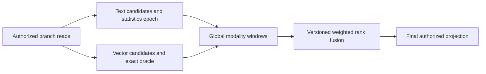

# ADR-018: Global per-modality windows and weighted rank fusion

Status: Proposed. Distributed statistics epochs, branch-window completeness, and tie policy need a quality prototype before this becomes an implementation mandate.

## Context and decision

Current `SearchEngine` builds lexical and exact-vector rankings from one authorized read view and combines branch ranks using weighted reciprocal rank fusion. Per-shard corpus statistics and local top-k pruning can change global order or omit a candidate. The target is a documented, deterministic fusion contract with explicit candidate windows and observable approximation.

Evaluate global per-modality windows followed by a versioned weighted RRF function. Specify which text statistics are global or approximate, stable tie-breaking, missing-branch contribution, candidate completeness, and resource limits before accepting wire-visible options. Do not claim global ranking completeness from current local scoring.

## Alternatives and consequences

Local scoring is simpler but shard distributions can skew relevance. Raw-score normalization introduces incomparable units and unstable fusion. Rank fusion makes branch scale independent but needs fixed windows and deterministic ties. Quality claims require a labeled relevance corpus; none is inferred here.

## Related requirements and implementation contract

Related: `REQ-SEARCH-001/AC-SEARCH-001`, `REQ-SEARCH-002/AC-SEARCH-002`, `REQ-SEARCH-003/AC-SEARCH-003`, `REQ-SEARCH-004/AC-SEARCH-004`, `REQ-SEARCH-005/AC-SEARCH-005`, `REQ-SEARCH-006/AC-SEARCH-006`; `REQ-SR-001/AC-MP-004` and `REQ-SR-004/AC-MP-004/005`; ADR-006, ADR-009, ADR-013, ADR-019, ADR-022; KL-033..034, KL-056..058, KL-060, KL-067. Current exact/hybrid source is in `src/KeyLoad.Query/Features/Search/Queries/SearchEngine.cs`; intended target is `src/KeyLoad.Query/Features/Search/` and `tests/KeyLoad.UnitTests/Features/Search/`.

1. Freeze schema, statistics scope/epoch, candidate-window semantics, ties, and RRF version before implementation.
2. Add real-store relevance/quality fixtures for lexical-only, vector-only, hybrid, missing branches, ties, filters, ACLs, cancellation, and budget exhaustion.
3. Implement bounded branch windows and fusion under the same authorized cut; preserve exact-vector oracle and current accepted request semantics.
4. Persisted statistics and generation updates must support bounded rebuild, checkpointing, rollback, and stale-generation rejection.
5. Run TUnit and RF3 Search through .NET and official MCP SDK in GitHub Actions; publish quality evidence with source SHA before claiming qualification.

Current source: `src/KeyLoad.Query/Features/Search/Queries/SearchEngine.cs`, `src/KeyLoad.Core/GraphAndSeries.cs`; current tests: `tests/KeyLoad.UnitTests/GraphAndSearchTests.cs`. Planned external/provider files are owned by Search, not this ADR. Dependencies: ADR-009, ADR-019, ADR-020, ADR-022. Owner: Search lead; global quality/review join: root.

## Controlled prototype stage,2026-10-05

TASK-SEARCH-QUALITY-CORPUS implements REQ/AC-SEARCH-007 in
[Search](../Features/Search.md#task-search-quality-corpus-controlled-relevance-and-window-sensitivity).
Root freezes32 fixed documents, four-dimensional vectors, six independent query
and graded-qrel definitions, Recall@5/10, MRR@10, nDCG@5/10 and test-only
per-branch widths1/4/8/32. Independent eligibility and metric goldens accompany
real ZoneTree/ZoneTree.FullTextSearch and production three-way ranking. There is
no production per-branch window control in SearchRequest; this stage therefore
measures sensitivity over complete real branch observations using the existing
fusion and merger kernels, with explicit truncation. It cannot qualify an absent
request-time feature or a distributed scorer/statistics epoch.

Ordered delivery: root freezes the linked REQ/AC contract; Luna cluster_wave adds
only new HybridQuality-prefixed Search unit cases/helpers/pure data; root reviews
the qrels, independent oracles, actual-provider ownership and numeric limits,
integrates and runs Aspire normal/scalar tests with original source inventories,
then commits. Existing production source and BenchmarkComparisons ownership stay
with their current owners. No dependency, persisted format, wire or runtime
ranking change occurs; removal of the controlled tests is the rollback. Actual
native RF3 clients, scorer-variant and masking/freshness/performance comparisons,
preselected primary target and authenticated gain/no-gain publication remain later
join points. This ADR remains Proposed for the broader global-ranking contract.

## TASK-KL037-GLOBAL-MODALITY-001 — actual distributed statistics and modality execution

Pre-implementation owning contract. REQ-DQUERY-GLOBAL-001 / AC-DQUERY-GLOBAL-001 requires exact lexical and vector candidate windows from independently configured physical owners before weightedRrfV1 fusion. It reuses native TextRanker BM25 arithmetic, VectorRanker metric/scalar/SIMD contract, GlobalBranchWindowMerger full-reference order and SearchRankFusion. Local fused top-k cannot substitute per-modality global windows. Exact profile rejects a candidate window that is truncated, incomplete, approximate, incomparable or exceeds its original grant; there is no silent exact claim. Approximate ANN/provider profiles remain explicitly unsupported by this new exact route and their separate existing APIs remain unchanged. No distributed graph, aggregate SQL or ANN approximation completion is inferred.

REQ-DQUERY-GLOBAL-002 / AC-DQUERY-GLOBAL-002 requires one server-derived statistics epoch over the exact ordered vector of actual owner/partition cuts, principal policy epochs, resource schemas, request term/profile identity and configured owner/directory fences. Each owner captures actual authorized visible document count (including documents without the text field), total canonical token length and per-query-term document frequency. The parent sums these finite native summaries with checked arithmetic, using canonical query-term order and distinct full atomic partitions. Every candidate phase revalidates its original same owner cut and current persisted authority before applying the shared global BM25 values. Changed cuts/policy/placement/generation refuse OwnershipLost with no partial page; no automatic recapture/retry. Epoch is ephemeral operation evidence, not persisted global coordinator authority or a caller-selected freshness token. Independent owner cuts are never equated or replaced by a scalar global cut. ACL-visible corpus statistics cannot be returned publicly.

REQ-DQUERY-GLOBAL-003 / AC-DQUERY-GLOBAL-003 requires all effects/read phases through existing server-owned ConnectionGrain with freshly signed bounded call-local read work and native ManagedCode.Communication streaming. Source authorizes every partition/collection before catalog diagnostics. Destination reloads the same authenticated subject from its own persisted database and enforces Query/DocumentsRead, vector and field policy before reads. The existing configured physical-owner transport MAC/nonce/expiry/registered ordered voters and source fence protect private typed leaves. No roles, grants, raw credentials, caller statistics or borrowed storage views are accepted. Default existing PartitionQuery Q1 request validation and ModelSource rejection remain unchanged.

REQ-DQUERY-GLOBAL-004 / AC-DQUERY-GLOBAL-004 reserves the complete statistics, modality-candidate, selected projection and final revalidation grants before any dispatch using the original centrally validated MaximumPartitions/MaximumConcurrentPartitionLeaves and DatabaseLimits scan/raw/retained/result ceilings. All phase work shares one original token/deadline; no per-phase reset, work stealing, new quota or limit. Native measured typed summaries, candidates, transport copies and selected documents are charged before retaining/encoding/allocating. A bounded batch retains original tasks until all settle; first failure cancels all admitted children, stops later phases and joins all readers/providers/transports before response/store shutdown. No partial success; server-only statistics or raw secret fields never enter public output, hints or logs.

REQ-DQUERY-GLOBAL-005 / AC-DQUERY-GLOBAL-005 requires actual independent two-store and genuine two-RF3 owner full flows: independently centralized lexical/vector/fusion literal oracle; ties/identical text IDs under distinct full references; empty/nonmatching/missing fields/skew; exact and one-over budgets; changed statistics/cut/policy and receiver denial; actual in-flight cancellation/deadline followed by unchanged full canonical images/independent cuts and healthy continuation; same-root cold owner/replay; all SDK/official MCP/Q1 caller/schema/privacy parity. Natural slow-owner RF3 evidence is separate from the approved native receiving-work clock regression. No benchmark, power-loss, resource or performance claim is supplied by source.

### Stable native component contracts before source

`DistributedTextStatisticsV1` alias `keyload.query.distributed-text-statistics.v1`, IDs0 Terms:ImmutableArray<string>,1 DocumentCount:int,2 TotalLength:long,3 DocumentFrequencies:ImmutableArray<int>. Version belongs to the encompassing typed request; this statistics record has no identity/roles/epoch supplied by callers. Its actual Terms are produced by existing canonical SearchTerms under native execution limits, and every value is validated/charged. Existing native/public aliases and IDs are unchanged. TextRanker local Rank continues its original field-based arithmetic without a new default allocation; global Rank consumes exactly this validated summary through the SAME scoring body.

Subsequent source shipment must freeze complete private statistics/candidate/projection request/result aliases and IDs plus additive public DistributedSearch route/schema tuple and signed read-purpose fields before their code. No partial ingress is joined alone. Stages: actual native statistics/scoring component → same-view exact-cut private leaf → authorized signed multi-owner coordinator → public SDK/MCP/Q1 composition → independent Unit/process/RF3 oracles → fresh root-owned census/build/Linux acceptance. Rollback withdraws only the additive operation and removes disposable stats; no persistent current format or migration fallback is introduced.

Owning paths: QueryExecution Contracts/Serialization/Validation/Execution and QueryExecution Unit/Integration roles; actual Search TextRanker/branch extraction are declared dependencies, not copied implementations; Server QueryExecution/physical transport and Orleans read dispatch borrow original owner options/lifecycles; Abstractions/Client/ClientApi additive canonical public operation. Root serializes all shared joins and current catalog integration. Existing connection-grain transport is external ownership and untouched. Source, native discovery and runtime acceptance remain separate; whole KL037 stays open until original full criteria and mandatory gates qualify.

### Native leaf statistics witness before code

`DistributedTextWitnessV1`, alias `keyload.query.distributed-text-witness.v1`, IDs0 Partition:PartitionRef,1 Owner:PhysicalShardRecord,2 NodeId:Guid,3 ReadGeneration:long,4 CutPosition:long,5 PolicyEpoch:long,6 SchemaVersion:long,7 ResourcePolicyDigest:string,8 Statistics:DistributedTextStatisticsV1. Every value is captured by the receiving actual WithPartitionQueryFenceView read and native placement validator, after fresh persisted Query/DocumentsRead/field authorization. The supplied owner is an already-authenticated receiving owner tuple, never a public selector. The complete current native Store.Identity and resource digest/cut must match before candidate read; absence/change refuses, never reopens an old cut. `DistributedSearchEpochInputV1`, alias `keyload.query.distributed-search-epoch-input.v1`, IDs0 Version:int,1 RequestDigest:string,2 Witnesses:ImmutableArray<DistributedTextWitnessV1>; actual canonical SHA256 of the bounded native generated input is the common opaque epoch. No scalar equal-owner cut, common policy epoch or fabricated global durable row is introduced.

Statistics capture and candidate copies reserve actual existing PartitionQueryRetention array/string descriptors and pointer/primitive sizes before clone; native measurement and original budget remain mandatory. No new hard-coded operational cap. Returned terms are canonicalized by actual TextRanker; local Rank() still avoids the new DTO allocation and delegates the same exact arithmetic. No identity, secret canary, statistics count or resource digest is published in the public epoch value.

### Actual per-phase native accounting and candidate contract

The statistics witness appends Id9 ReadBytes:long and Id10 ExaminedRecords:int from the actual entered native read grant. The parent imports these original counters before retention and progression, while charged retention/result frames remain independently admitted under original bounds. Statistics-only TextRanker construction retains no candidate corpus; it preserves the exact native tokenizer/frequency/length path. Each receiver statistics leaf owns the original database.AdmitQuery permit once for the complete synchronous operation.

Vector-only scope records the actual authorized visible canonical document count with no selected text terms/frequencies or text length, rather than fabricating a text query/field. Fresh VectorSearch and vector-field-use policy precedes capture; hybrid scope requires both actual field capabilities. Empty normalized text terms in statistics-only construction still measure the selected text field corpus; old local empty-text ranking remains unchanged.

DistributedSearchCandidateLeafV1 alias keyload.query.distributed-search-candidate-leaf.v1: Id0 original statistics witness, Id1 nullable actual text GlobalBranchWindow, Id2 nullable actual vector GlobalBranchWindow, Id3 actual phase native ReadBytes, Id4 actual phase native ExaminedRecords. Existing GlobalBranchWindow/Candidate/Scope aliases and fields are reused unchanged. Full source windows are captured only after successful complete canonical scans; each score is rebound at that exact cut to its actual full document reference/revision before bounded retention, then sorted with existing full-reference GlobalBranchOrder. No leaf top-k discards candidates before global per-modality merge.

The existing PartitionQueryParallelBatch remains the task owner. Its exact original WhenAll/sibling-cancellation/primary+cleanup join body is factored once into a typed generic overload; Q1 delegates through a static noncapturing runner with one original task array. New typed phases reuse that same bounded owner, not a new dispatcher or scheduling authority. Supporting native tests execute actual two-owner statistics/ranking/projection, an actual committed policy-epoch failure, fresh complete literal results and owning cold reopen. These are supporting operation tests, not public RF3 qualification.

### Additive public operation boundary before source

`DistributedSearchRequestV1` alias `keyload.distributed-search-request.v1`, IDs0 Version:int,1 Partitions:ImmutableArray<PartitionRef>,2 Search:SearchRequest. The EXISTING SearchRequest is the one common caller-visible typed search shape/defaults/weights/vector/allowlist/explain contract; its logical template partition must equal the first declared partition, all partitions are unique and bounded by existing QueryExecutionOptions.MaximumPartitions, and each internal leaf replaces only that logical partition. No copied defaults, owner proofs, identity, roles, statistics, expiry or grants are accepted. Version1 only. TextIndex selection is explicitly UnsupportedCapability in this canonical distributed profile; existing selected Search/ANN APIs remain unchanged.

`DistributedSearchPageV1` alias `keyload.distributed-search-page.v1`, IDs0 Version:int,1 Hits:ImmutableArray<RankedDocument>,2 Leaves:ImmutableArray<PartitionQueryLeafWitnessV1>,3 StatisticsEpoch:string,4 Complete:bool. Hits are actual fully projected same-cut documents with independent full references/revisions/redaction and weightedRrfV1 scores/explanation. Leaves reuse the existing public scoped per-partition cut/policy/schema/access-path witness, without exposing private physical-owner/proof/resource-policy bytes. StatisticsEpoch is opaque descriptive evidence only and cannot authorize another read. Complete means exact requested top-k over complete global per-modality windows; no partial/approximate candidate result is admitted by this profile.

New public read name `DistributedSearch` maps the same typed request/result across native SDK, official MCP and Q1 CALL, under current ADR125 bounded connection-owned call-local/ManagedCode.Communication read execution. Shared GrainReadKind append composes AFTER KL039 OnlineTextMaintenance, and current connection-owned capability/codec/catalog additions compose against KL039 exact immutable ancestors. Root owns independent complete literal catalog integration and current native metadata count; no count is guessed here. No partial public ingress is integrated alone.

### Closed authenticated receiving phases and final projection

Current Server/Orleans policy and ADR125 supersede per-operation activation wording: ingress and all native children retain independent signed call identities/current persisted authorization/context/cancellation and joined work in the existing bounded ConnectionGrain/call-local pipeline. The human-owned connection source is not replaced. No completed call history or new request activation is introduced.

The private native receiving family is frozen before integration: DistributedSearchPhase alias keyload.query.distributed-search-phase.v1 has Statistics0/Candidates1/Projection2/Revalidate3. DistributedSearchOwnedLeafV1 alias keyload.query.distributed-search-owned-leaf.v1 uses Id0 Version,1 Phase,2 SearchRequest,3 configured Owner,4 Tenant,5 MaxReadBytes,6 MaxExaminedRecords,7 MaxResultBytes,8 original Witness?,9 common Statistics?,10 GlobalBranchScope?,11 SourceWindowId?,12 immutable selected GlobalBranchCandidate array. Mutually exclusive slots must match the phase exactly. Original centrally validated bounds and authenticated absolute envelope expiry constrain every phase; no lifetime reset or public phase input exists. DistributedSearchLeafResultV1 alias keyload.query.distributed-search-leaf-result.v1 uses Id0 Phase,1 original Witness,2 CandidateLeaf?,3 ProjectionLeaf?,4 actual read bytes,5 actual examined records. The witness appends Id11 actual native Incarnation; expected configured owner and current store incarnation must match independently.

DistributedSearchProjectionLeafV1 alias keyload.query.distributed-search-projection-leaf.v1 uses Id0 original witness,1 immutable RankedDocument hits,2 actual native read bytes,3 actual examined records. Before any result it freshly requires the same owner/cut/current principal/resource and all original text/vector field capabilities, then checks each selected full reference and actual canonical document revision. No deleted/revised/foreign selected document is projected. Explain is attached from the parent actual globally fused rank contributions, not generated by an unrelated local ranking pass. Final revalidation repeats actual current modality capabilities and original witness before response.

Canonical-only leaves call the original TextRanker scoring kernel directly, so SearchBranchExecution/KL039 selected-reader lifecycle is not replaced. The provisional shared rank overload is excluded. The existing GlobalBranchWindowMerger retains its original MaxResults bound; if a complete globally ranked branch would be truncated there, the exact operation refuses BudgetExceeded before fusion instead of silently using a local/global top-k approximation or adding a larger cap. Existing original Search/ANN profiles and defaults remain unchanged.
