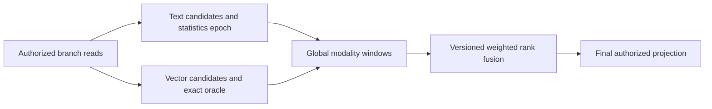

# ADR-018: Global per-modality windows and weighted rank fusion

Status: Proposed. Distributed statistics epochs, branch-window completeness, and tie policy need a quality prototype before this becomes an implementation mandate.

## Context and decision

Current `SearchEngine` builds lexical and exact-vector rankings from one authorized read view and combines branch ranks using weighted reciprocal rank fusion. Per-shard corpus statistics and local top-k pruning can change global order or omit a candidate. The target is a documented, deterministic fusion contract with explicit candidate windows and observable approximation.

Evaluate global per-modality windows followed by a versioned weighted RRF function. Specify which text statistics are global or approximate, stable tie-breaking, missing-branch contribution, candidate completeness, and resource limits before accepting wire-visible options. Do not claim global ranking completeness from current local scoring.

## Alternatives and consequences

Local scoring is simpler but shard distributions can skew relevance. Raw-score normalization introduces incomparable units and unstable fusion. Rank fusion makes branch scale independent but needs fixed windows and deterministic ties. Quality claims require a labeled relevance corpus; none is inferred here.

## Related requirements and implementation contract

Related: `REQ-SEARCH-001/AC-SEARCH-001`, `REQ-SEARCH-002/AC-SEARCH-002`, `REQ-SEARCH-003/AC-SEARCH-003`, `REQ-SEARCH-004/AC-SEARCH-004`, `REQ-SEARCH-005/AC-SEARCH-005`, `REQ-SEARCH-006/AC-SEARCH-006`; `REQ-SR-001/AC-MP-004` and `REQ-SR-004/AC-MP-004/005`; ADR-006, ADR-009, ADR-013, ADR-019, ADR-022; KL-033..034, KL-056..058, KL-060, KL-067. Current exact/hybrid source is in `src/KeyLoad.Query/SearchEngine.cs`; intended target is `src/KeyLoad.Query/Features/Search/` and `tests/KeyLoad.UnitTests/Features/Search/`.

1. Freeze schema, statistics scope/epoch, candidate-window semantics, ties, and RRF version before implementation.
2. Add real-store relevance/quality fixtures for lexical-only, vector-only, hybrid, missing branches, ties, filters, ACLs, cancellation, and budget exhaustion.
3. Implement bounded branch windows and fusion under the same authorized cut; preserve exact-vector oracle and current accepted request semantics.
4. Any persisted statistics/epoch migration must support rebuild, checkpointing, rollback, and stale-generation rejection.
5. Run TUnit and RF3 Search through .NET and official MCP SDK in GitHub Actions; publish quality evidence with source SHA before claiming qualification.

Current source: `src/KeyLoad.Query/SearchEngine.cs`, `src/KeyLoad.Core/GraphAndSeries.cs`; current tests: `tests/KeyLoad.UnitTests/GraphAndSearchTests.cs`. Planned external/provider files are owned by Search, not this ADR. Dependencies: ADR-009, ADR-019, ADR-020, ADR-022. Owner: Search lead; global quality/review join: root.
