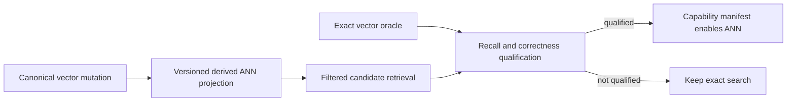

# ADR-019: Managed-first ANN provider qualification

Status: Proposed. No approximate-nearest-neighbor provider or index format is selected by this record.

## Context and decision

Exact vector scans are the correctness oracle and current source path. The product prefers a managed-first ANN implementation; a native provider adds deployment, license, persistence, concurrency, deletion, and memory-ownership risks. The current design identifies provider criteria but has not qualified a library or implementation.

Select a provider only after a pinned-source audit and real-store comparison against exact search. Required evidence includes recall by filter/selectivity, update/delete/reinsert behavior, concurrent access, persistence/rebuild, memory accounting, and platform/license dependencies. ANN remains optional until the exact oracle and fallback semantics are measurable.

## Alternatives and consequences

- Always scan exact vectors: dependable oracle but scaling cost remains.
- Add an unreviewed native package: rejected until transitive binaries, licensing, and ownership are audited.
- Managed HNSW or another candidate: research direction only; API fit and lifecycle remain open.

## Related requirements and implementation contract

Related: `REQ-SEARCH-001/AC-SEARCH-001`, `REQ-SEARCH-003/AC-SEARCH-003`, `REQ-SEARCH-004/AC-SEARCH-004`, `REQ-SEARCH-005/AC-SEARCH-005`, `REQ-SEARCH-006/AC-SEARCH-006`, ADR-006, ADR-009, ADR-018, ADR-022; KL-030..032, KL-059..060, KL-067. Current source: canonical vectors are document-revision-bound records in `src/KeyLoad.Core/GraphAndSeries.cs`, with the exact oracle in `src/KeyLoad.Query/SearchEngine.cs`. The node-local canonical vector and document-revision authority stays outside any provider; Search owns only a rebuildable derived ANN index/projection. The Search slice under `src/KeyLoad.Query/Features/Search/` owns the provider unless a separate assembly is accepted.

1. Freeze provider, license/platform matrix, score/filter API, exact-oracle boundary, and rebuildable generation contract.
2. Add real-store property/differential tests for recall, mutation, deletion, filtered retrieval, concurrency, restart, and corrupted generation rejection.
3. Implement projection generation and provider adapter in Search; never move node-local canonical vector or document-revision authority out of Core.
4. Roll out behind an explicit capability setting; rollback disables the projection and rebuilds from canonical data without changing document state.
5. Qualify pinned provider and workload on GitHub CI across supported platforms; publish exact source/package versions and resource/quality evidence.

No package or index format is approved here. Runtime tests/benchmarks run only in GitHub Actions. The current historical benchmark is not ANN qualification.
