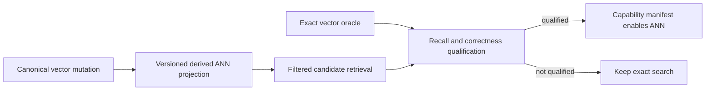

# ADR-019: Managed-first ANN provider qualification

Status: Accepted for the bounded first-party managed HNSW candidate stage on 2026-10-04. Online projection, persisted index format and public ANN capability remain unqualified and gated by later contracts.

The accepted 2026-10-05 test-resource stage is REQ/AC-ANN-013 in
[ManagedAnn](../Features/Search/ManagedAnn.md). Root freezes/reviews/joins; a Luna
worker changes only native TUnit attributes on the specified six heavyweight
fixture methods to unkeyed `[NotInParallel]`, as refined on 2026-10-07. The
unused named Search test-resource helper is removed. Only those six flows are
globally isolated within their TUnit process; there is no assembly-wide
serialization. Test bodies, corpus sizes, explicit concurrency tests, product
execution budgets and global runner settings remain unchanged. Verify
the private base/post packet, full strict build/format/governance, native TUnit normal
and scalar suites and exact-source Linux originals before any qualification
claim. The unchanged full R111 failure and focused pass indicate scheduling
sensitivity without proving the failure's cause. Rollback restores only the
prior test scheduling; there is no data,
dependency, public API or production admission change.

## Context and decision

Exact vector scans are the correctness oracle and current public source path. The product prefers a managed-first ANN implementation; a native provider adds deployment, license, persistence, concurrency, deletion, and memory-ownership risks. Root selects an independently authored KeyLoad-owned packed managed HNSW candidate for the first computational stage, with no new package, native binary or project. This decision approves implementation of the bounded candidate and its independent real-store tests; it does not qualify recall, an online projection, a persisted format or a public capability.

Select a provider only after a pinned-source audit and real-store comparison against exact search. Required evidence includes recall by filter/selectivity, update/delete/reinsert behavior, concurrent access, persistence/rebuild, memory accounting, and platform/license dependencies. ANN remains optional until the exact oracle and fallback semantics are measurable.

## Alternatives and consequences

- Always scan exact vectors: dependable oracle but scaling cost remains.
- Add an unreviewed native package: rejected until transitive binaries, licensing, and ownership are audited.
- Audited Hnsw.Net 0.1.4: not admitted. Its first vector chunk allocates 256 MiB, search/build lack cancellation and work admission, and pooled visited state has no retained concurrency cap. A consumer-side wrapper cannot supply cancellation inside its synchronous unbounded algorithm. This is a third-party package, not a ManagedCode-owned dependency repair.
- First-party packed managed HNSW: selected as the bounded computational candidate; lifecycle and public integration remain separate qualification stages.

## Related requirements and implementation contract

Related: `REQ-SEARCH-001/AC-SEARCH-001`, `REQ-SEARCH-003/AC-SEARCH-003`, `REQ-SEARCH-004/AC-SEARCH-004`, `REQ-SEARCH-005/AC-SEARCH-005`, `REQ-SEARCH-006/AC-SEARCH-006`, ADR-006, ADR-009, ADR-018, ADR-022; KL-030..032, KL-059..060, KL-067. Current source: canonical vectors are document-revision-bound records in `src/KeyLoad.Core/GraphAndSeries.cs`, with the exact oracle in `src/KeyLoad.Query/Features/Search/Queries/SearchEngine.cs`. The node-local canonical vector and document-revision authority stays outside any provider; Search owns only a rebuildable derived ANN index/projection. The Search slice under `src/KeyLoad.Query/Features/Search/` owns the provider unless a separate assembly is accepted.

1. Freeze provider, license/platform matrix, score/filter API, exact-oracle boundary, and rebuildable generation contract.
2. Add real-store property/differential tests for recall, mutation, deletion, filtered retrieval, concurrency, restart, and corrupted generation rejection.
3. Implement projection generation and provider adapter in Search; never move node-local canonical vector or document-revision authority out of Core.
4. Roll out behind an explicit capability setting; rollback disables the projection and rebuilds from canonical data without changing document state.
5. Qualify the exact candidate source and workload on Linux GitHub CI, retaining scalar portability checks; publish exact source/package versions and resource/quality evidence.

No external ANN package or persisted index format is approved here. The root owner-authorized local development workflow applies: actual TUnit tests run through Aspire, and local results remain development evidence. Delivered-source Linux CI, recovery, Docker/Aspire RF3 and genuine GitHub comparison gates remain required. The current historical benchmark is not ANN qualification.

## Accepted ordered candidate contract, 2026-10-04

The complete computational API, bounds, requirements, acceptance criteria, slice ownership and rollout are frozen in [ManagedAnn](../Features/Search/ManagedAnn.md). Related tasks are KL-030/031/032/059/060; no task is closed by this decision.

Root accepts the bounded local R2A canonical input seam in [ManagedAnnSeed](../Features/Search/ManagedAnnSeed.md), REQ/AC-ASD-001–006. The ordered contract assigns new Core/Search AnnSeed files to query_wave, independent new AnnSeed TUnit cases to cluster_wave, read-only review to lifecycle_wave and all shared/gate/Git joins to root. One current persisted-policy read cut captures owned visible full-space vectors, actual scalar source/applied/outbox metadata; budgeted metadata and the original vector view avoid double charging. Sorting and exact-bit hashing run only after the gate is released, with finite pre-allocation owned/peak reservations and work/cancellation checks. This is a historical computational seed, not pinned replay, durable generation, public approximation, current authorization or complete AC-ANN-007/008. Existing synchronous queued-gate cancellation and later policy/source/generation validation remain explicit later contracts; R2A changes no storage or client contract.

R2A source is joined and locally verified: full solution build23/formatter23/governance23 passed, and actual Aspire normal/scalar 34-case regressions passed unchanged source/runtime inventories. The linked seed spec retains all original passing reports, the earlier 31/33 failure and its concrete reservation/corruption fixes. This development checkpoint does not mark this ADR Implemented; persisted projection, replay, public admission and exact-source Linux/recovery/RF3 gates remain open.

1. R1: implement the immutable packed computational candidate in new Query/Search files and independently authored real-ZoneTree metric, budget, filter, recall and rebuild tests. Root owns integration, all shared files, strict solution checks, Aspire execution and a stage commit. Public exact search and canonical stored data remain unchanged.
2. R2: root must first accept an exact native-generated ZoneTree manifest/chunk and source-cut/outbox replay contract, including atomic publication, locks, leases, cancellation, corruption and crash recovery. Only then implement the node-local disposable projection. The current decision does not authorize workers to invent that current-format lifecycle.
3. R3: root must first accept versioned SQL/SDK/MCP approximation, completeness, fallback, eligibility and freshness metadata. Only then integrate an explicit ANN capability with persisted authorization in one scoped read cut and genuine RF3 tests. No silent approximation or branch truncation is permitted.
4. R4: retain actual loaded corpora, quality/resource counters, normal/scalar reports and exact-source Linux qualification. Global performance still requires the mandated 100,000/1,000,000-record matched GitHub workloads; R1's 10,000-record recall control is not that evidence.

The algorithm reference is the primary [HNSW paper](https://arxiv.org/abs/1603.09320v4), algorithms 1–5. Code is independently authored within KeyLoad's own source ownership and root LICENSE; no source code or package is imported. The immutable source ordinal seeds bounded geometric levels, base degree is at most twice Connections and upper degree at most Connections. Current metric-specific selection uses the unchanged exact similarity oracle: diversification for Cosine/Euclidean and the paper's simple highest-score selection for DotProduct under the refinement below.

Vector-only PutVector updates can preserve DocumentRevision. R2 freshness therefore must bind committed source cuts and actual outbox positions, not only document revision. Logical index identity includes partition, collection, field and the complete VectorSpace; node identity/incarnation/data epoch and read-generation binding belong to the later physical projection contract. Orleans coordinates logical ownership and admission; open ZoneTree handles remain node-local.

Rollback of R1 removes the unused candidate. R2/R3 rollback disables its derived capability and rebuilds from canonical ZoneTree data without changing acknowledged writes, native WAL, replication or atomic recovery journals. R1 changes no public wire or persisted data; later stages require their separately accepted current-product contracts before implementation.

Root accepted the R1 packing/reservation refinement in [ManagedAnn](../Features/Search/ManagedAnn.md#accepted-packing-and-reservation-refinement-2026-10-04) before the first runtime gate: actual-level upper offsets/edges, per-query visit bitmap, explicit conservative array/string/object accounting, reported build/search reservations and inclusive exact/excess/sparse admission. This corrects source-review findings without changing public search, canonical data or the unapproved R2/R3 contracts. Both workers retain their disjoint new-file scopes; root must review the revised source and execute every gate before any qualification claim.

The first real Aspire R1 run passed17/19 cases and failed both10,000-record builds on the unchanged work cap before recall/deadline assertions. Root accepts the [insertion-work correction](../Features/Search/ManagedAnn.md#accepted-insertion-work-correction-2026-10-04): Algorithm1 establishes Connections new edges, keeps base2M/upperM maximum degree, reselects reciprocal neighbors only on overflow, and uses validated source ordinals for identical ID ordering with truthful integer-comparison charges. TASK-ANN-R1-PACKED-ALGORITHM owns these changes; TASK-ANN-R1-INDEPENDENT-TESTS retains the same independent cases and limits; TASK-ANN-R1-ROOT-JOIN retains the original failure reports and repeats strict checks and actual Aspire normal/scalar evidence. This is an implementation correction, not a qualified performance result or waived acceptance gate.

The second original Aspire cohort also passed17/19 and hit the unchanged build work cap in FindWorst. Root accepts the [operation-local worst-slot cache](../Features/Search/ManagedAnn.md#accepted-worst-slot-cache-refinement-2026-10-04): reject against a validated cached worst, update on append, and fully recompute only after an accepted replacement. One scratch integer fits the declared fixed object reservation; graph state, arrays, work caps, metrics and independent tests remain unchanged. The same owned tasks must review reset/replacement invariants and repeat complete gates; no observed recall or performance improvement is claimed yet.

The third original Aspire cohort remains17/19 and hits the same cap in reciprocal-link work. Root accepts the [bounded dual-heap search refinement](../Features/Search/ManagedAnn.md#accepted-bounded-dual-heap-refinement-2026-10-04), replacing repeated frontier/worst scans while preserving exact extraction/tie order and the diversified neighbor-selection rule. Three explicitly reserved int[E] heap arrays replace the old bool[E] processed array/cache; private admission formulas include every array before allocation. Root and independent review must prove map/remove/reset invariants and unchanged test outcomes. Reciprocal work, recall and deadline qualification remain open; the three original failures are retained and no cap/AC reduction is authorized.

The fourth original report reaches and passes all10 Cosine/Euclidean cells, but remains17/19 because DotProduct builds exceed the unchanged work cap. Root accepts [simple DotProduct neighbor selection](../Features/Search/ManagedAnn.md#accepted-dotproduct-neighbor-selection-refinement-2026-10-04) for both new and overflowing reciprocal edges, with unchanged exact dot scores and deterministic ties. This selects Algorithm3 for that nonmetric similarity while preserving diversification for the two qualified metric controls. It removes pair-diversity work without changing bounds or ACs; the potential bridge/recall cost must pass the unchanged five DotProduct cells. Whole-source guard failure from concurrent benchmark edits and separate unchanged ANN/runtime proof remain explicit; all results are local development evidence.

Unit44b's four ordinary build-deadline failures lead to the accepted
[packed-owned validation refinement](../Features/Search/ManagedAnn.md#accepted-packed-owned-validation-refinement-2026-10-04),
REQ/AC-ANN-009 and TASK-ANN-R1-OWNED-SCORES. Only privately copied finite vectors
may use the internal trusted scorer; untrusted validation, metric arithmetic,
quality, work/deadline limits and all existing tests remain mandatory. A unique
DotProduct candidate copy may remove redundant membership work with actual
charges and identical selection/ties. Root reviews the private Luna patch and
retains full normal/scalar/Linux evidence before any qualification claim.

The 2026-10-05 [prepared-value refinement](../Features/Search/ManagedAnn.md#accepted-prepared-value-refinement-2026-10-05)
accepts REQ/AC-ANN-010 and TASK-ANN-R1-PREPARED-VALUE. Replace per-candidate
prepared-object allocations only in privately owned packed neighbor work with a
finite-checked-carrier readonly value. One shared helper retains the exact current
metric reduction and untrusted validation remains mandatory. Implement numeric
extraction, private value, consumed diversification/overflow joins and independent
exact-score/allocation regressions in that order. Query worker owns its private
Search implementation packet, cluster worker owns its independent real-store test
packet, and root owns complete review, joins, full checks,
Aspire native/scalar corpus gates and original exact-source evidence. No data,
wire, capability or persisted-format change is introduced; rollback reverts the value
joins. This ADR remains unqualified until its original full acceptance is proven.

Root accepts the R2B pin prerequisite in
[ManagedAnnSeed](../Features/Search/ManagedAnnSeed.md#accepted-r2b-outbox-pin-contract-proof-2026-10-05),
REQ/AC-ASD-007–009 and TASK-ANN-R2-PIN-CONTRACT-PROOF. Select the existing
persisted administrator-gated canonical consumer operations: commit an observed
current-Tail pin before seed capture, bridge exactly through the captured Tail
with signed empty-effect receipts, and retain later history for replay. The
bounded single-record bridge in independent real-store tests is a correctness
control, not a production performance choice. Cluster worker owns only new
private Search test files; root owns review, Aspire normal/scalar/full gates,
original evidence and all-code checkpoints. This prerequisite accepts no physical generation, alias,
format, public capability, or canonical-data change;
the complete native ZoneTree projection/recovery contract remains required.

Root accepts TASK-ANN-R1-CONSTRUCTION-VALUE and REQ/AC-ANN-011 in the
[construction join](../Features/Search/ManagedAnn.md#accepted-prepared-value-construction-join-2026-10-05).
Use the existing finite-owned readonly value for construction, with one internal
constrained generic traversal and explicit class/value contract implementations.
Preserve every score, ordinal order, validation and work/deadline/cancellation
charge. Root freezes and reviews the private implementation, joins independent
class/value traversal and allocation tests, then retains full Release/static and
Aspire native/scalar corpus evidence. Exact-source Linux and ANN lifecycle/RF3
acceptance remain required. No persistence or public transport changes occur;
rollback reverts these computational joins, with no store change.

## Accepted unchanged-build observations, 2026-10-05

REQ/AC-ANN-014 and TASK-ANN-BUILD-OBSERVATION are frozen in
[ManagedAnn](../Features/Search/ManagedAnn.md#accepted-construction-observation-contract-2026-10-05).
The Luna worker owns only the four existing heavy Search case files and two new
feature-local model/helper files in that contract; root owns review, join, strict
checks, actual Aspire normal/scalar evidence and all-code commits. Measure the
single existing synchronous Build after retaining its original budget. Emit
safe counters, elapsed ticks and current-thread allocations only after it settles,
with original/fatal failure priority. Preserve every original resource limit,
input, assertion and admission setting. No dependency, production, data or wire
change occurs; rollback removes only the diagnostic wrappers. This stage measures
failure context without claiming a cause, deadline repair or performance gain.

Root accepts REQ/AC-ANN-015 and TASK-ANN-R1-NEIGHBOR-COUNT in
[ManagedAnn](../Features/Search/ManagedAnn.md#accepted-adjacency-count-packing-2026-10-05).
Query's owned RAM adjacency packs the count into its existing first slot within
the unchanged five-million-record/degree128 admission. Preserve neighbor order,
metric arithmetic, actual edge charges and every original resource/deadline cap;
there is no data or public-format change. One Luna worker owns the narrow
PackedAnnGraph source packet and independent native graph/candidate regressions;
root owns contract review, exact-base join, unchanged-work before/after
development observations, strict checks and Aspire normal/scalar/full Linux
gates. Rollback restores only the scan representation. Qualification remains
pending until the original full quality, authorization, recovery and RF3 gates
have evidence; this source-level work reduction is not a measured speedup claim.

## Accepted ADR-019 amendment — ANN-016 adjacent budget check de-duplication

Accepted bounded stage: REQ/AC-ANN-016 and TASK-ANN-DUPLICATE-BUDGET-CHECKS in `REQ-AC-ANN-016.md`.

`AnnWorkBudget.Charge` begins by calling `Check`, then validates the charge and updates the existing work counter. In eight frozen Search source files, twelve sites call `Check` immediately before `Charge` with no intervening operation. Remove only those twelve calls. Retain every `Charge` and its original amount, so each charged action still observes cancellation/deadline immediately before its counter update. Preserve other explicit checks, particularly any path that can exit without reaching a charge.

The Luna worker owns only the eight listed ANN source files in the private packet. Root owns exact-base review, integration, strict checks, and same-source genuine Aspire normal/scalar observations with no changes to the corpus, caps, deadline, test admission, or assertions. This is an equivalent-check-count optimization candidate, not a measured speedup, timeout diagnosis, or qualification. Rollback restores the eight source files. Persistence, public transport, and storage are outside this stage.

## Accepted ADR-019 amendment — charged ANN inner-loop check de-duplication

Candidate stage REQ/AC-ANN-017 / TASK-ANN-INNERLOOP-CHECKS in
`REQ-AC-ANN-017.md`.

The 10k Build report records 165M work units, 4.37M distances and 12.41M edge
visits, but does not attribute their per-method source or prove the original
deadline cause. Actual source walks HNSW edge lists, scores unseen neighbors,
performs heap comparisons and diversifies / repairs reciprocal neighborhoods.
These counters remain exact and unchanged in this stage.

In four binary-heap sift loops, a loop-entry `budget.Check()` is followed on
every executed iteration by `IsBetter` / `IsWorse`, which calls
`budget.Charge(1)` and therefore the same `ReadExecutionBudget.Check()` before
its work update. In `Greedy`, each loop iteration similarly reaches charged
`NeighborCount`. Remove only those five duplicated loop-entry checks. Preserve
every comparison, distance, edge, mutation and charge. Keep the `SearchLayer`
loop check because its `PopBest` sentinel may exit without charging; retain all
other checks, cancellation/deadline paths and original bounds.

The source owner is restricted to `PackedAnnCandidateHeaps.cs` and
`PackedAnnLayerSearch.cs`. Root owns cumulative source join with pending ANN
patches, review, normal/scalar unchanged-corpus observations, strict gates and
qualification. This is an unmeasured repeated-check optimization candidate,
not a deadline diagnosis or speed claim. Rollback restores the five checks.

## Accepted reciprocal insertion invariant, 2026-10-05

REQ/AC-ANN-018 and TASK-ANN-RECIPROCAL-INSERTION in ManagedAnn freeze a narrow
source-proven correction. Ascending private construction inserts a source once
per layer; distinct prior reciprocal targets cannot already contain that new
source at that layer. Remove only the target membership scan and unused helper,
preserving the graph, candidate deduplication, scores, actual distance/edge work,
cancellation, original deadlines and admission. Work counters must report the
comparisons actually performed, without fabricated replacement charges.

The Luna owner supplies the guarded source packet and independent native
adjacency regressions. Root compares complete successful controls, retains
original incomplete Linux normal/scalar observations, and owns the join and
all strict/Aspire gates. A partial failed build cannot prove graph equivalence
or speed. R1 remains an internal immutable candidate with no serialized/public
contract; R2/R3 require separate accepted contracts. Rollback
restores only the removed scan and helper.

Root's successful-control observation joins AC-ANN-018 before code: fixed v1
SHA-256 framing covers the actual complete native IDs/revisions/levels and
ordered adjacency plus entry point/maximum level. Build-only ticks/allocations
are captured before independent snapshot/assertion/output; actual counters and
fixed options are retained. Identical control/test source runs on the original
and candidate in each native mode. Failed builds cannot supply a graph hash or
equivalence baseline. This remains test-only evidence with no public or
persistence contract, and does not qualify acceleration by itself.

## KL031 exact-through native projection boundary (accepted root direction 2026-10-08)

REQ-PROJECTION-PREFIX-001 / AC-PROJECTION-PREFIX-001: optional ReadProjectionBatchRequest ThroughSequence native Id3 limits the existing administrative signed projection batch to the exact retained source prefix U. JSON omits null and existing null behavior remains latesthead. Fresh persisted ClusterAdministrator and actual current consumer/released-generation checks precede U validation. Current checkpoint<=U<=retainedhead is required, including an empty U=checkpoint batch. Out-of-range U is TokenInvalidated with exact safe detail `The projection upper sequence is outside the current consumer checkpoint and retained head.`; no read mutation/checkpoint effect. Returned and signed ThroughSequence never exceed U; HasMore refers to remaining range through U, not later head. Limit/MaxBytes/ordering/checksum/signature/expiry/replay/receipt semantics remain unchanged. Existing SDK/MCP/SQL request paths forward the actual typed option through their unique request grain; no new dispatcher/admin role. ADR019 owns the ANN consumer use; existing changefeed projection authority contracts remain mandatory.

TASK-ANN-R2-PREFIX tests use actual persisted consumer pin and native canonical vectors, capture seedU then append a later vector, native/JSON request roundtrip, exact bounded original Mutation bytes, signed empty-effect checkpoint+sameID full native receipt replay/no new effects, next latesthead healthyread, inclusive emptyU and invalidlow/high no-effect followedhealthy. Revoked/nonadministrator/obsoleteconsumer must fail under original persisted checks rather than trusting suppliedU. Source authored, not qualification.

### Native PackedAnn snapshot transport refinement

The native payload is one bounded private `index.bin` containing little-endian length-framed generated Orleans header and node chunks (each at most65536 encoded bytes); framing carries lengths only and is not an alternate serializer. Header/native policy/node aliases are packed-ann-header.v1, packed-ann-policy.v1 and packed-ann-node.v1, stable Id0..7/Id0..12/Id0..5 respectively. Exact vector float bits, ordered neighbors for every level, IDs/revisions/levels/entrypoint/maxlevel are restored into actual PackedAnnGraph/PackedAnnVectors arrays without invoking PackedAnnBuilder. Native syntax inspection precedes typed decode. Existing checked admission formulas are reused to recompute restored graph/vector/identity reservations; file-controlled RetainedBytes/BuildScratchBytes must equal them and never authorize allocations. Fixed typed PackedAnnStorageOptions admit filebytes/combined retained snapshot+restored model peak before work. Per-chunk transient bytes are included. Original construction path keeps its prior identity/level charge ordering and does not gain delegate allocations.

`PackedAnnNativeStorageTests` uses actual native vector commits in ZoneTree, real owned FileStream Save→Load→resave exact payload/digest equality, independent literal dotproduct IDs/scores/revisions and unchanged original query work/mode/counters; original complete canonical raw bytes/position remain unchanged. Copied controlled checksum/truncation/profile negatives cannot replace original evidence/index; exact file-bound and one-byte-below plus original-token cancellation then native healthy restore are source-authored regressions. Native codec Save only flushes its borrowed stream; physical publication owner must additionally Flush(true) and perform manifest/pointer ordering. No snapshot-only test establishes generation/replay/process or public approximation qualification.

## TASK-KL031-NATIVE-ADMIN-MAINTENANCE-001

# KL031 native administrative maintenance contract (private, before product parent code)

REQ/AC-ANN-GEN-003/004/006; AC-ANN-007. The parent operation is not a CoreAtomic operation and owns no durable receipt itself. One independently keyed RequestGrain consumes the existing native CQRS stream. A fresh persisted ClusterAdministrator is mandatory before provision, capture, advance, publication and terminal metadata. VectorSearch is unchanged and approximate public search remains disabled pending AC-ANN-008.

The typed public request carries stable CommandId, exact Partition/Collection/Field/VectorSpace, an explicitly provisioned IndexGeneration, and the exact physical NodeId/Incarnation/PlacementEpoch. Native generated fields and aliases are first-release contracts. JSON SDK, HTTP and official MCP invoke the same operation descriptor through bounded authorized discovery; no alternative dispatcher or invisible administrative endpoint. The reply contains only bounded generation/cut/digest/status metadata and actual canonical child receipts; never seeds or credentials. Native progress is a closed phase enum with bounded numeric counters, through the existing CQRS writer and limits.

The ordered parent stages are: configure the exact existing projection consumer generation (stable child CommandId), observe its persisted active pin; issue one fresh signed capture capability; release the canonical raw view after retaining the bounded immutable native seed; load or construct arrays and stage a versioned native file; read signed batches through a fixed canonical U using optional ThroughSequence; apply T..U to a bounded immutable corpus; verify exact corpus/scope against a fresh retained canonical seedU; save and Flush(true) staged files; atomically publish the manifest; commit the admitted last signed projection checkpoint through the original canonical request grain. Every child has a distinct native request-grain GUID and server-signed subject-only identity. Physical owner, persisted consumer generation, incarnation and placement fences are checked before each owner access/publication. A migrated or wrong-node actor fails OwnershipLost rather than translating physical identity.

Configure pins BEFORE capture and uses a stable definition/start boundary. No direct consumer/live-replica commit. Captured state stays node-local; no unbounded intergrain snapshot. The fresh DatabaseReadGrain first establishes its existing quorum barrier, verifies the envelope again, reloads persisted principal/admin policy, then borrows the owner. The same owner validates canonical identity and exact consumer generation at the capture cut. Construction never retains a canonical raw view or applies under the database gate. Serialized node data is disposable acceleration only.

Restart semantics follow actual source: CommandOutcomes.ValidateCachedResult calls ProjectionClaims; a Released consumer invalidates a previously successful projection result. An empty Through==After commit creates no ProjectionReceipt, so expiration cannot be bypassed using allowExpiredReceipt. Therefore the active generation retains its pin. A completed nonempty checkpoint can recover its original canonical receipt while the generation stays active, including original expired claims with the genuine persisted ProjectionReceipt. A zero-prefix restart obtains a fresh authorized signed empty page; it does not invent an old durable receipt. Supersession/release fences the old generation and explicitly invalidates maintenance reentry. Parent cancellation/transport interruption remains UnknownWriteOutcome after a canonical child may have committed; actual receipt reconciliation and manifest validation determine continuation. No token reset, retry-to-green, migration or fallback rebuild under Load.

Owner lifetime: exclusive private root lock; one bounded stage writer; immutable published generations; leases pin exact generation arrays/files; obsolete publication denied; obsolete files deleted only after final reader release. Cancellation releases every borrowed view/lease, abandons only unpublished owned files and joins original workers. Primary and cleanup failures remain aggregated. Native file Save/Load preserves exact graph edges/vector arrays/options/identity, validates checksums before decode and after load, and checks bounded combined decoded/restored reservations. No cache skipping or silent rebuilding.

Source evidence: Core/CommandOutcomes.cs ValidateCachedResult; Core/ChangeFeeds/Execution/ProjectionOutbox.cs ProjectionClaims/CommitProjectionBatch/ReleaseProjectionConsumer; Orleans/ClusterRouting/Grains/RequestGrain.cs special-parent ReceiveAcrossLanes routing; DatabaseReadGrain existing fresh barrier/reload. Root owns build/native SDK/MCP/process qualification. This contract is an unsealed implementation input, not current product capability or PASS.

## Native dependency invalidation and explicit rebuild (owner-approved 2026-10-08)

REQ/AC-ANN-GEN-004/006 and AC-ANN-007: exact-through replay consumes same-partition native putDocument, patchDocument, deleteDocument, putVector and applyVectorProjection entries, including canonical nested Target. Consumer Resources is empty (all same-partition resources) to retain source-document transitions as well as target writes. Native mutation limits, byte/work admission and signed checkpoint contracts remain unchanged.

Pinned capture records a bounded native identity of current resource policy/configuration within the admitted atomic transaction domain; it excludes user documents and credentials, is computed inside the same cut, and is checked under fresh persisted authorization before generation use. Configuration transitions without native outbox history explicitly invalidate the generation. Replay never imports fresh U vector values as deltas. It may remove rows excluded by the actual fresh authorized U cut, then verifies complete actual replay corpus bytes/digest against U. Any remaining eligible row absent/different in replay, or unavailable policy/dependency history, fails HistoryUnavailable with exact safe detail "The native ANN dependency history is unavailable; explicitly rebuild the generation." No partial generation/results are served.

An explicit Build maintenance request can provision a fresh active generation/canonical cut and publish only after native seed/replay verification. Restore validates and loads original arrays and applies actual deltas; it never invokes Build as a fallback. Policy hide/restore must demonstrate invalidation/no partial/full canonical no-effect, then explicitly invoked fresh build and independent literal results. All new public progress/error/owner use boundaries share this rule; public approximate Search remains disabled pending AC-ANN-008. Native source declaration is not execution/qualification.

The published generated manifest also retains the exact original canonical CommitProjectionBatchRequest checkpoint intent (empty Effects only), before its canonical acknowledgement. A cold restore reconciles that exact nonempty request through the existing native request grain and validates the genuine persisted receipt/current active checkpoint; metadata does not authorize it. For Through==After, no expired empty intent is treated as durable: obtain a new signed empty read and use a fresh child identity. Signed intent bytes are private owned file metadata and are never emitted as diagnostic/progress payload. The public result exposes only the real resulting receipt/cut.

### Native multi-page staged replay ownership
Before each real nonempty page checkpoint submission the node owner persists a bounded generated-native pending replay record containing the actual immutable records after that page, original admitted canonical upper cut U, exact page Through P, native corpus digest of those pending arrays, and the original signed empty-effects checkpoint intent. P is replay progress, never relabeled as an observed canonical source cut. Pending records cannot serve readers or replace a completed generation. Resume first validates current persisted consumer/generation and reconciles the exact original nonempty checkpoint receipt through a fresh signed child request grain; only after canonical checkpoint equals P may loaded arrays resume P..U. No checkpoint ACK can precede its durable pending record. A malformed/partial pending record fails closed; load never builds missing state. Original U must remain verifiable through a fresh actual canonical view before completion; changed dependency identity, missing history, or an unavailable original upper corpus yields explicit HistoryUnavailable/rebuild-required without partial output. Publication occurs only after the complete replay arrays match that real admitted upper corpus/digest. Actual multi-page process interruption before/after checkpoint ACK and reopen/resume are mandatory proof, not inferred from serialization or local compilation.

An observed current canonical dependency mismatch permanently unpublishes that disposable generation in the native owner receipt before returning HistoryUnavailable. Existing pinned readers retain only their admitted immutable generation until joined release. Restoring a previous resource policy cannot reactivate the unpublished pointer. Cold restore selects only an enrolled currently published pointer; arbitrary orphaned generation files are not an authority. Only the explicitly admitted Build operation may publish a fresh generation, after full current canonical verification.

## Ordered current-child cancellation over retained ANN replay work

REQ-ANN-GEN-007 / AC-ANN-GEN-007: a retained native replay keeps the same original ReadExecutionBudget start timestamp, counters, grants, original token and limits. Every later independently signed child capability owns one additional current-token scope around the actual synchronous ApplyPage, Pending and Finish loops. Native Check observes both original and current tokens; scope release follows joined original work and restores the prior neutral stage, never a reset budget/deadline. Nested/concurrent stage admission fails closed. Reuse the exact Core ReadExecutionBudget.EnterStageCancellation dependency shared with native FTS; ordinary query budgets allocate no stage owner.

The regression must first settle one real replay stage with its original linked token disposed, then admit a genuine later signed native outbox page. Cancel that later child only after original replay WorkUnits advance; exact original child OCE must prevent pending publication/ACK, leave complete canonical bytes/position unchanged, and retain the previous native checkpoint intent. Drop the failed in-memory session and perform actual native pending load/canonical receipt reconciliation/remaining replay/full literal healthy publication. This is an actual work diagnostic, not a getter-only contributor, fake native provider or increased deadline. Existing exact-score contracts use SearchEngine.Similarity in the same invocation mode over independent literal vectors; no tolerance substitution. Canonical acceptance labels remain AC-ANN-007/008.

## Native capture admission and shutdown ownership

REQ-ANN-GEN-008 / AC-ANN-GEN-008: the node-local maintenance service owns an actual bounded admission lease for every Execute capability, including synchronous Begin seed capture and Release authority capture before generation-worker enrollment. Maximum active operations retains existing GrainRouting.MaximumRequestProducers. Dispose closes this admission, joins all genuinely admitted operations, then joins the native generation worker/pinned readers/root; only afterwards may PartitionHost dispose canonical owners. The beginning flag remains solely a one-session admission fence, never completion evidence. Admission/lease objects carry no payload, diagnostic callback or authority; original cancellation/deadline/failure propagation is unchanged. A real native capture held through owning TimeProvider/native-work observation must demonstrate shutdown remains pending, rejected new admission, release then joined shutdown and full-state/healthy reopen.

### Bounded actual maintenance work observation
REQ-ANN-GEN-009 / AC-ANN-GEN-009: an internal node-owned readonly maintenance observation returns only exact active SessionId and the retained AnnSeedWork.Units counter. It adds no callback/test flag/public schema/tool and contains no payload, corpus identity or credentials. Service gate binds the active session identity/lifetime; original one-worker ownership remains the sole counter writer, Volatile reads/writes make cross-thread progress observation atomic/visible without making the diagnostic authority. A missing/stale session has no observation. Counters retain original values across stages and cancellation scopes. Owning TimeProvider may observe actual progress to cancel the genuine original child; no controller replaces work or changes deadlines. Actual complete no stage/ACK/canonical effects plus native healthy resume is the acceptance flow.

### Native compiler ownership corrections for scoped ANN bounds

REQ/AC-ANN-GEN-003/009 and AC-ANN-007 retain the same centrally bound NativeAnn/AnnSeed/PackedAnnStorage limits. Feature-local Configuration/NativeAnnSeedOptionsFactory and NativeAnnStorageOptionsFactory own only validated downward derivation from those original IOptions and actual remaining resident/disk reservations. They never read environment/configuration, introduce defaults, raise quotas or reset the original read budget. Replay and stage-store constructors consume those typed options; storage and seed admission keep their existing formulas and fail closed. Native generation shutdown directly joins the actual worker before original reader settlement and root disposal, retaining every primary/cleanup failure. Existing whole operation, cancellation, cold replay and shutdown flows remain the verification contract; compiler success is not runtime acceptance.

## AC-ANN-008 current first-release read and physical partial-write stage

REQ-ANN-008 / AC-ANN-008: additive vector-only ApproximateSearchRequest v1 owns explicit RequestedMode=Approximate, Consumer and IndexGeneration; AnnSearchPage v1 reports separately requested/actual Mode, CompleteTopK, and the actual same authorized Position, even for empty pages. Default-off centrally bound QueryExecutionOptions.EnableApproximateSearch is a qualification rollout gate, not authority. Native query grain and fresh quorum/persisted row+field read admission precede generation lookup. Existing exact Search remains unchanged. No public corpus count/digest, consumer/admin capability, load/rebuild or self-provisioning occurs on read. Missing/stale/corrupt state fails closed; only actual charged native insufficient-candidate exact work reports ExactFallback.

SDK ApproximateSearchAsync, HTTP /v1/search/ann and discovered official MCP/shared SQL CALL keyload_search_ann_read share one canonical typed descriptor and executor. New generated aliases/field IDs are the explicit version-one request/page/mode contracts; no existing persisted generation format changes or legacy reader. Initial discovery and covered-eleven selection are unchanged.

Each public native owner frame reserves both capture peaks, ordinal bitmap, configured packed scratch and complete projected result/ranking retention before allocation, counts all simultaneous index/frame reservations, and transfers to an original pinned lease. Original cancellation/time/read/result/work limits remain. Shutdown and every failure join/release actual admitted capture, native worker, index reader and memory frame.

REQ-ANN-007 / AC-ANN-007 physical write observation is internal bounded native operational diagnostics: exact session GUID, actual admitted closed capability kind, actual current work and completed frame-write bytes. PackedAnnStorageFrames increments bytes only after successful actual synchronous header/payload writes; this is not flush/durability evidence. A Volatile-published immutable stage holder and Interlocked counters prevent torn observation; the session owns its holder until abort/shutdown, and no corpus, credentials, callback or injected test switch is exposed. The owning TimeProvider can observe this native counter and cancel the original current child to exercise actual partial-file cleanup; it cannot modify the operation or fabricate an outcome. Existing signed fault v2 JournalFlushed does not observe this separate native ANN writer, so no alternate fault framework is introduced.

Required actual native wholeflows: provisioned exact/approximate/fallback and zero eligible modes; persisted ordinary row/field caller admission; disabled/missing/stale/budget denial without partial/provisioning; original cancellation and elapsed budget after native read work; concurrent pinned lease resident admission and shutdown joins; physical partial frame write cancellation before publication/ACK, full canonical/native file invariance and healthy resume; actual Aspire RF3 SDK/official MCP/both CALL equivalence. Authored source does not establish these gates or task closure.

## Signed public read admission cancellation (AC-ANN-008)

The actual current-image Aspire RF3 wave may accept the same centrally validated
QueryExecutionOptions already owned by ClusterFixture. A typed optional profile
is applied before BuildAsync; null preserves every existing caller. It changes
no image whitelist, authority, deadline, signed control format or covered-eleven
inventory. The explicit ANN profile is disabled outside its owned scenario.

AnnPublicCancellationScenario arms the existing signed v2 AuthorizationReload
read phase for one newly persisted c1-probe identity, empty command identifier,
ApproximateSearch read kind and actual discovered voter. It cancels the original
SDK/official MCP token only after that exact signed observation; cancellation and
ProducerDisposed settle before retiring the arm, rereading the full canonical
literal corpus and performing healthy SDK/MCP/Q1 ANN reads. SDK read cancellation
is Cancelled with no page, never UnknownWriteOutcome. Official cancellation is
its actual interruption. This proves public admission cancellation only; native
observed-work and partial-file-write cases separately prove execution cancellation.
Existing parent/wave/cleanup deadlines, original task joins, locks and primary
plus cleanup retention remain unchanged. No runtime success is claimed.

Source-bound phase precision: the existing signed AuthorizationReload observation
is immediately BEFORE GrainRequestAuthority.ReloadForRequest, followed by the
original scope recheck and fresh persisted reload. This cancellation case proves
pre-reload public read admission settlement, not completed authorization or
during-index work. The ordinary healthy follow-up performs actual current
persisted authorization and one-cut search; separate native worker cases retain
the genuine after-work cancellation oracle. No control semantics are renamed.

## Native ANN fixture applied authority (TASK-ANN-NATIVE-FIXTURE-001)

REQ-ANN-001/007 and AC-ANN-007 require actual persisted applied authority. ANN
Unit and CrashHost fixtures must submit original commands through independently
owned native DurableReplicaLog and ReplicaMaterializer; embedded Apply does not
establish a replicated cut. Every configure/seed/consumer/checkpoint command
retains its exact identifier, payload, explicit time and outcome. The native
materializer writes applied authority through original canonical Apply(index).
After actual bounded WaitForApplyAsync the original operation is replayed only
to retrieve its persisted outcome, with exact no-effect assertions unchanged.
No manual AppliedBytes, no synthetic no-op authority, no collector weakening.

The opt-in TestDatabase native admission preserves every default embedded and
explicit-time caller. It owns its separate replica store/log/snapshots/materializer
and joins the materializer before disposing log/replica/canonical owners. Local
fixture commit is not a claim of RF3 quorum; public RF3 gates remain mandatory.
Original validated ReplicaExecutionOptions.CommandTimeout bounds apply settlement;
original caller cancellation remains linked. Native worker failure is propagated,
not retried or hidden. Constructor and terminal cleanup retain primary plus owner
failures. CrashHost keeps distinct acknowledged and JournalFlushed original cuts
and reopens the same actual durable replica log before replay. Process-kill is
not power-loss evidence. Original R4 defect receipt remains immutable history.

Known native command IDs bind their ORIGINAL retained ReplicaEntry index. If a
restart/canceled wait left that entry unsettled, admission publishes only its
original commit index if not already committed, joins its original apply cut
under the same existing timeout/caller token and resolves its fresh original
outcome. RecoveryRequired cannot cause a second append for a retained ID. Native
entry absence within LastIndex fails closed; no fabricated command authority.

## R3 native simultaneous maintenance reservation contract (before code)

REQ/AC-ANN-GEN-003/009 and AC-ANN-007/008 retain unchanged MaximumResidentBytes and the original seed/build/load/public-frame formulas. A node owner accounts one active maintenance session's retained memory alongside published/retired indexes and all public read frames. Before every actual maintenance capture/load/construction, the original worker expands that session's reservation under the same native owner gate to the actual remaining resident capacity. Allocation runs outside that gate and uses only the reservation's downward remaining capacity; public reads subtract the live reservation before retaining a frame. This avoids lock inversion with canonical Store.Read. After stage settlement, the reservation shrinks to the complete modeled retained session bytes. A completed index transfers its actual modeled retention into the published slot under the same gate before the stage reservation can admit other work; failed construction retains the original frame through cleanup. Abort and joined shutdown release once after original worker settlement. No generation format, quota, default, public privilege, retry or deadline changes. Initial source capture before first owner publication remains bounded by the unchanged cap while no resident index/read owner exists; owner+reservation handoff is protected by the service gate before exposing that owner. The real native regression observes actual maintenance read work, attempts a complete public operation while its original stage reservation is live, requires resident admission rejection/no partial/full store+files invariant, then proves full literal healthy publication/read and original teardown.

R3 exact source trace: `AnnPublicMaintenanceReservationTests.ActualMaintenanceReadReservationRejectsConcurrentPublicFrameThenSettledStageReturnsLiteralHealthyPage` maps REQ-ANN-008 / AC-ANN-008 and REQ/AC-ANN-GEN-003/009 / AC-ANN-007 to actual native Verify capture bytes, one joined original-token public operation, exact ResourceExhausted owned detail/null page, complete canonical image/cut/native-file invariance and complete literal healthy page after reservation contraction. Build Begin derives two simultaneous seed/replay frames downward from the same original resident cap; restore Load derives two source/replay frames downward. Existing replay maximum-stage peak is reserved before native stage capture, and current capture peak remains accounted during final index construction. No expected native UID, runtime PASS or coverage count is manufactured. Original unit catalog expectation is 73, matching the actual additive ANN descriptor; closed initial/covered selections stay unchanged.

### Stage XVII combined integration

The initial combined catalog and unpublished native read-kind order are frozen in docs/Features/ClientApi.md, Stage XVII composed native integration contract. Preserve all existing REQ/AC gates, default-off/opt-in admission, original operation budgets, scoped witnesses and node-owned joined lifetimes. Root-reviewed shared seams, full native compile/format and genuine normal/scalar/process/public RF3 tests remain required before acceptance. This appendix is an implementation contract, not an Implemented or runtime qualification claim.

### Stage XVII native compiler contract corrections

The initial unpublished AnnSearchPage Id1 uses ImmutableArray<RankedDocument>, matching native generated collection contracts. The executor transfers its exclusively owned completed projection array into that immutable container without copying or retaining a mutable alias; JSON remains the same complete array. Field IDs/alias/modes and complete literal caller oracles are unchanged. Native public acquisition transfers index/frame ownership only after construction succeeds, retains direct cleanup on every exceptional construction path, and its returned lease directly disposes both original resources under an idempotent lifetime gate. The owner shares one native gate with a separate read-lifetime owner for exact admission, pending reader joins and retained retirement errors. Maintenance memory receives the same centrally validated IOptions snapshot. These are required ownership/configuration/shape corrections from original native diagnostics, not cap, deadline, authority or format-migration changes.

### Stage XVII directly owned ANN read construction

REQ-ANN-008 / AC-ANN-008 and REQ/AC-ANN-GEN-003/009 require the actual public read lifetime to own its reserved frame and pinned native index from their creation. Its constructor reserves the unchanged original frame before source capture, captures under the same authorized canonical view outside the node owner gate, and acquires the exact published index only after that source validation. Every failed construction directly disposes the same partially initialized lifetime; every successful read retains it until ordered search/teardown settlement. Disposal attempts both native resources exactly once under the original lifetime gate and retains primary, nonfatal and fatal cleanup failures. The acquisition helper owns no escaping disposable locals. This corrects the original R637 ownership diagnostics without a new budget, authority, deadline, format or public wire contract; the genuine public failure, cancellation, pinned-reader, shutdown and healthy continuation tests remain mandatory.

R648 implementation repair freezes no new public or storage format: existing AC-ANN-007/008 and original stage failure contracts retain the exact synchronous OperationCanceledException before joined reservation contraction, together with every primary/cleanup exception. ServerFailureObserver observes the actual inline stage without manufacturing a canceled task; actual returned tasks retain their own native terminal state. Public whole-flow fixtures advance existing persisted principal epochs1→2→3 and explicitly execute the mandatory Restore Begin→Load→Apply/Stage/ACK→Verify→Publish sequence. Existing actual canceled write/replay/Verify, stale no-effect and full literal healthy continuation tests remain required under fresh normal/scalar/recovery/RF3 execution. Root owns join/gates, agents own disjoint source repair; runtime acceptance and Linux/full AC closure remain pending.

## TASK-KL030-DELETE-REINSERT-STRESS-001

The cold-owner oracle compares the complete generated native identity through a boolean equality assertion so a failed regression cannot print its raw signer bytes. This preserves the exact identity invariant; it adds no runtime authority or serialization change.

REQ/AC-ANN-002/003/006 and original KL030 exact-comparison/stress/bounded-memory criteria retain the managed-first provider and every existing quality, scalar, resource, cancellation, concurrent-read, ownership, native storage and recovery gate. `PackedAnnDeleteReinsertStressTests.Kl030RepeatedNativeDeleteReinsertRejectsFailedRebuildThenColdRestoresExactCandidates` executes real64 canonical vectors, dimension8,16 successive delete/reinsert cycles of the same document under each original metric. Actual revisions and acknowledged mutation positions advance; deleted current corpus excludes the document. Every actual generation must return all complete candidates exactly equal the independent public Similarity oracle, with source ordinals/revisions/score bits/ID tie order; prior immutable computational snapshots remain exact after mutations. Original ExactThreshold0 exercises graph traversal; reported reservations remain within unchanged options and are modeled bounds, not measured RSS.

A duplicate-input rebuild must yield typed Validation without canonical mutation or loss/change of the previous complete successful index. Each failed rebuild is followed by a full genuine query. After all cycles, actual generated-native Save and physical flush complete and release the file; original canonical owner closes; same ZoneTree files reopen with exact native identity, position and all raw rows. A new actual canonical DatabaseEngine enumerates persisted authorized vectors and compares all native bytes to the final corpus. Native Load restores the actual saved graph without Build fallback and serves complete independently exact candidates with canonical state unchanged.

Ordered ownership: docs/ADR contract before new UnitTests Search/Cases, Helpers and Assertions listed in the private guarded manifest; no product/canonical/public/serialization/limit/token/deadline changes. Original TestDatabase and file using lifetimes own shutdown; closed canonical handle precedes actual reopen. This is supporting real-store provider qualification, not RF3 acknowledgement, public snapshot freshness, power-loss, maximum-scale stress or acceleration proof. Existing10k/100query per-cell recall, genuine in-progress cancellation/deadline and simultaneous immutable searches remain mandatory. Root owns single join/compiler/formatter/native census/normal-scalar/Linux execution. Fresh expanded count/UID/outcomes are unknown until original native records exist. KL031 lifecycle and KL059 broader gates remain OPEN; rollback removes only this additional source regression/docs, no storage migration.

### KL030 selected managed source/license/transitive-target audit

Original KL030 is the managed candidate audit; KL031 projection lifecycle and KL059 broader qualification remain separate. The provider is KeyLoad-owned `PackedAnnIndex`/builder/packed graph/vectors/search/storage codec, governed by ManagedCode's root Elastic License2.0. Its algorithm reference is the existing primary HNSW paper cited above; no external ANN source/package is imported by this contract. Query declares the centrally pinned Orleans SDK and Core project; the read-only restored net10.0 Query asset snapshot contains57 transitive packages, their actual cached nuspec license/repository identities, package hashes and selected compile/runtime assets. Every cached nuspec supplies a license declaration and those package archives contain no native payload path. None is Hnsw.Net/USearch/another external ANN provider. This is a current inspected restore snapshot, not a fresh restore, package signature, feed, full Server graph or runtime-platform qualification. Shared .NET runtime native components remain real platform dependencies. Root requires exact-source Linux normal/scalar build and genuine operation artifacts; no multi-OS matrix or scalar acceleration claim.

Audit ownership is the bounded private `managed-source-dependency-audit.json` and `whole-ac-map.json` with source/package/license/SDK/asset hashes, not generated product data or a new catalog. Existing root-pinned net10.0/C#14 and global SDK are unchanged. Required operations are actual Build/filter/Search, owned immutable concurrent queries, canonical mutation/rebuild and generated-native Save/Load; their source tests are mapped under AC-ANN001..006 and native storage refinement. An arbitrary graph getter, managed reservation estimate or package license field cannot qualify measured memory, recall, fault/recovery or public authority. Existing detailed checksums/native IDs/layout, exact/excess reservations, current persisted policy/cut and original process/SDK/officialMCP joins remain required. No new dependency/provider/current-format/public API/optional comparison is introduced.
