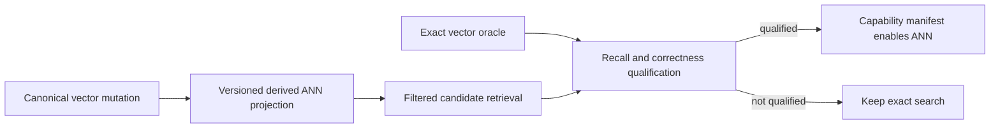

# ADR-019: Managed-first ANN provider qualification

Status: Accepted for the bounded first-party managed HNSW candidate stage on 2026-10-04. Online projection, persisted index format and public ANN capability remain unqualified and gated by later contracts.

## Context and decision

Exact vector scans are the correctness oracle and current public source path. The product prefers a managed-first ANN implementation; a native provider adds deployment, license, persistence, concurrency, deletion, and memory-ownership risks. Root selects an independently authored KeyLoad-owned packed managed HNSW candidate for the first computational stage, with no new package, native binary or project. This decision approves implementation of the bounded candidate and its independent real-store tests; it does not qualify recall, an online projection, a persisted format or a public capability.

Select a provider only after a pinned-source audit and real-store comparison against exact search. Required evidence includes recall by filter/selectivity, update/delete/reinsert behavior, concurrent access, persistence/rebuild, memory accounting, and platform/license dependencies. ANN remains optional until the exact oracle and fallback semantics are measurable.

## Alternatives and consequences

- Always scan exact vectors: dependable oracle but scaling cost remains.
- Add an unreviewed native package: rejected until transitive binaries, licensing, and ownership are audited.
- Audited Hnsw.Net 0.1.4: not admitted. Its first vector chunk allocates 256 MiB, search/build lack cancellation and work admission, and pooled visited state has no retained concurrency cap. A consumer-side wrapper cannot supply cancellation inside its synchronous unbounded algorithm. This is a third-party package, not a ManagedCode-owned dependency repair.
- First-party packed managed HNSW: selected as the bounded computational candidate; lifecycle and public integration remain separate qualification stages.

## Related requirements and implementation contract

Related: `REQ-SEARCH-001/AC-SEARCH-001`, `REQ-SEARCH-003/AC-SEARCH-003`, `REQ-SEARCH-004/AC-SEARCH-004`, `REQ-SEARCH-005/AC-SEARCH-005`, `REQ-SEARCH-006/AC-SEARCH-006`, ADR-006, ADR-009, ADR-018, ADR-022; KL-030..032, KL-059..060, KL-067. Current source: canonical vectors are document-revision-bound records in `src/KeyLoad.Core/GraphAndSeries.cs`, with the exact oracle in `src/KeyLoad.Query/Features/Search/Queries/SearchEngine.cs`. The node-local canonical vector and document-revision authority stays outside any provider; Search owns only a rebuildable derived ANN index/projection. The Search slice under `src/KeyLoad.Query/Features/Search/` owns the provider unless a separate assembly is accepted.

1. Freeze provider, license/platform matrix, score/filter API, exact-oracle boundary, and rebuildable generation contract.
2. Add real-store property/differential tests for recall, mutation, deletion, filtered retrieval, concurrency, restart, and corrupted generation rejection.
3. Implement projection generation and provider adapter in Search; never move node-local canonical vector or document-revision authority out of Core.
4. Roll out behind an explicit capability setting; rollback disables the projection and rebuilds from canonical data without changing document state.
5. Qualify the exact candidate source and workload on Linux GitHub CI, retaining scalar portability checks; publish exact source/package versions and resource/quality evidence.

No external ANN package or persisted index format is approved here. The root owner-authorized local development workflow applies: actual TUnit tests run through Aspire, and local results remain development evidence. Delivered-source Linux CI, recovery, Docker/Aspire RF3 and genuine GitHub comparison gates remain required. The current historical benchmark is not ANN qualification.

## Accepted ordered candidate contract, 2026-10-04

The complete computational API, bounds, requirements, acceptance criteria, slice ownership and rollout are frozen in [ManagedAnn](../Features/Search/ManagedAnn.md). Related tasks are KL-030/031/032/059/060; no task is closed by this decision.

Root accepts the bounded local R2A canonical input seam in [ManagedAnnSeed](../Features/Search/ManagedAnnSeed.md), REQ/AC-ASD-001–006. The ordered contract assigns new Core/Search AnnSeed files to query_wave, independent new AnnSeed TUnit cases to cluster_wave, read-only review to lifecycle_wave and all shared/gate/Git joins to root. One current persisted-policy read cut captures owned visible full-space vectors, actual scalar source/applied/outbox metadata; budgeted metadata and the original vector view avoid double charging. Sorting and exact-bit hashing run only after the gate is released, with finite pre-allocation owned/peak reservations and work/cancellation checks. This is a historical computational seed, not pinned replay, durable generation, public approximation, current authorization or complete AC-ANN-007/008. Existing synchronous queued-gate cancellation and later policy/source/generation validation remain explicit later contracts; no storage or client migration is authorized by R2A.

R2A source is joined and locally verified: full solution build23/formatter23/governance23 passed, and actual Aspire normal/scalar 34-case regressions passed unchanged source/runtime inventories. The linked seed spec retains all original passing reports, the earlier 31/33 failure and its concrete reservation/corruption fixes. This development checkpoint does not mark this ADR Implemented; persisted projection, replay, public admission and exact-source Linux/recovery/RF3 gates remain open.

1. R1: implement the immutable packed computational candidate in new Query/Search files and independently authored real-ZoneTree metric, budget, filter, recall and rebuild tests. Root owns integration, all shared files, strict solution checks, Aspire execution and a stage commit. Public exact search and canonical stored data remain unchanged.
2. R2: root must first accept an exact native-generated ZoneTree manifest/chunk and source-cut/outbox replay contract, including atomic publication, locks, leases, cancellation, corruption and crash recovery. Only then implement the node-local disposable projection. The current decision does not authorize workers to invent that format or lifecycle.
3. R3: root must first accept versioned SQL/SDK/MCP approximation, completeness, fallback, eligibility and freshness metadata. Only then integrate an explicit ANN capability with persisted authorization in one scoped read cut and genuine RF3 tests. No silent approximation or branch truncation is permitted.
4. R4: retain actual loaded corpora, quality/resource counters, normal/scalar reports and exact-source Linux qualification. Global performance still requires the mandated 100,000/1,000,000/5,000,000-record matched GitHub workloads; R1's 10,000-record recall control is not that evidence.

The algorithm reference is the primary [HNSW paper](https://arxiv.org/abs/1603.09320v4), algorithms 1–5. Code is independently authored within KeyLoad's existing MIT ownership; no source code or package is imported. The immutable source ordinal seeds bounded geometric levels, base degree is at most twice Connections and upper degree at most Connections. Current metric-specific selection uses the unchanged exact similarity oracle: diversification for Cosine/Euclidean and the paper's simple highest-score selection for DotProduct under the refinement below.

Vector-only PutVector updates can preserve DocumentRevision. R2 freshness therefore must bind committed source cuts and actual outbox positions, not only document revision. Logical index identity includes partition, collection, field and the complete VectorSpace; node identity/incarnation/data epoch and read-generation binding belong to the later physical projection contract. Orleans coordinates logical ownership and admission; open ZoneTree handles remain node-local.

Rollback of R1 removes the unused candidate. R2/R3 rollback disables its derived capability and rebuilds from canonical ZoneTree data without changing acknowledged writes, native WAL, replication or atomic recovery journals. No public wire/data migration occurs in R1; later stages require their explicit upgrade contracts before implementation.

Root accepted the R1 packing/reservation refinement in [ManagedAnn](../Features/Search/ManagedAnn.md#accepted-packing-and-reservation-refinement-2026-10-04) before the first runtime gate: actual-level upper offsets/edges, per-query visit bitmap, explicit conservative array/string/object accounting, reported build/search reservations and inclusive exact/excess/sparse admission. This corrects source-review findings without changing public search, canonical data or the unapproved R2/R3 contracts. Both workers retain their disjoint new-file scopes; root must review the revised source and execute every gate before any qualification claim.

The first real Aspire R1 run passed17/19 cases and failed both10,000-record builds on the unchanged work cap before recall/deadline assertions. Root accepts the [insertion-work correction](../Features/Search/ManagedAnn.md#accepted-insertion-work-correction-2026-10-04): Algorithm1 establishes Connections new edges, keeps base2M/upperM maximum degree, reselects reciprocal neighbors only on overflow, and uses validated source ordinals for identical ID ordering with truthful integer-comparison charges. TASK-ANN-R1-PACKED-ALGORITHM owns these changes; TASK-ANN-R1-INDEPENDENT-TESTS retains the same independent cases and limits; TASK-ANN-R1-ROOT-JOIN retains the original failure reports and repeats strict checks and actual Aspire normal/scalar evidence. This is an implementation correction, not a qualified performance result or waived acceptance gate.

The second original Aspire cohort also passed17/19 and hit the unchanged build work cap in FindWorst. Root accepts the [operation-local worst-slot cache](../Features/Search/ManagedAnn.md#accepted-worst-slot-cache-refinement-2026-10-04): reject against a validated cached worst, update on append, and fully recompute only after an accepted replacement. One scratch integer fits the declared fixed object reservation; graph state, arrays, work caps, metrics and independent tests remain unchanged. The same owned tasks must review reset/replacement invariants and repeat complete gates; no observed recall or performance improvement is claimed yet.

The third original Aspire cohort remains17/19 and hits the same cap in reciprocal-link work. Root accepts the [bounded dual-heap search refinement](../Features/Search/ManagedAnn.md#accepted-bounded-dual-heap-refinement-2026-10-04), replacing repeated frontier/worst scans while preserving exact extraction/tie order and the diversified neighbor-selection rule. Three explicitly reserved int[E] heap arrays replace the old bool[E] processed array/cache; private admission formulas include every array before allocation. Root and independent review must prove map/remove/reset invariants and unchanged test outcomes. Reciprocal work, recall and deadline qualification remain open; the three original failures are retained and no cap/AC reduction is authorized.

The fourth original report reaches and passes all10 Cosine/Euclidean cells, but remains17/19 because DotProduct builds exceed the unchanged work cap. Root accepts [simple DotProduct neighbor selection](../Features/Search/ManagedAnn.md#accepted-dotproduct-neighbor-selection-refinement-2026-10-04) for both new and overflowing reciprocal edges, with unchanged exact dot scores and deterministic ties. This selects Algorithm3 for that nonmetric similarity while preserving diversification for the two qualified metric controls. It removes pair-diversity work without changing bounds or ACs; the potential bridge/recall cost must pass the unchanged five DotProduct cells. Whole-source guard failure from concurrent benchmark edits and separate unchanged ANN/runtime proof remain explicit; all results are local development evidence.

Unit44b's four ordinary build-deadline failures lead to the accepted
[packed-owned validation refinement](../Features/Search/ManagedAnn.md#accepted-packed-owned-validation-refinement-2026-10-04),
REQ/AC-ANN-009 and TASK-ANN-R1-OWNED-SCORES. Only privately copied finite vectors
may use the internal trusted scorer; untrusted validation, metric arithmetic,
quality, work/deadline limits and all existing tests remain mandatory. A unique
DotProduct candidate copy may remove redundant membership work with actual
charges and identical selection/ties. Root reviews the private Luna patch and
retains full normal/scalar/Linux evidence before any qualification claim.
