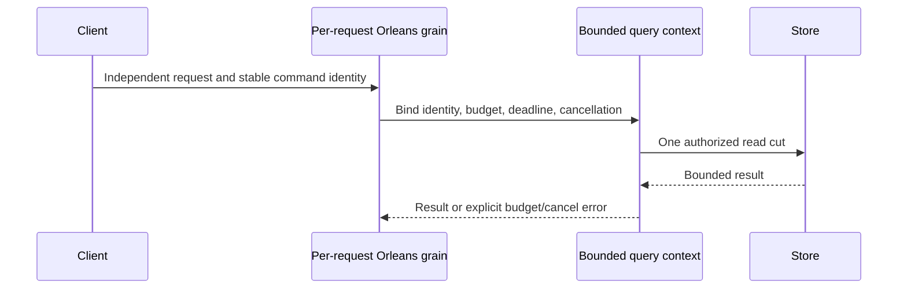

# ADR-020: Independent bounded query contexts

Status: Accepted; implementation and qualification pending.

## Context and decision

Each request must have an independent query context and bounded work/deadline/cancellation state so one caller cannot block another. The optional client session facade in the product design may carry convenience state, but it must not replace the mandatory separate Orleans request grain per database request or create a long-lived server session as the source of query authority.

Use immutable request-scoped prepared state and one explicit execution budget. Any future SDK session facade remains client-side or delegates independent operations; it cannot freeze a shared server read cut across unrelated requests. Query context disposal releases iterators, views, and admission reservations on success, error, timeout, and cancellation.

## Rationale, alternatives, and consequences

Unbounded shared contexts risk head-of-line blocking and stale authority. A per-client server session is not required for the accepted architecture and would complicate cancellation and policy reauthorization. Separate request contexts cost setup work but isolate budgets and preserve current authorization boundaries.

## Related requirements and implementation contract

Related: `REQ-ROUTE-001/AC-ROUTE-001`, `REQ-MP-002/AC-MP-002..006`, `REQ-SEARCH-004/AC-SEARCH-004`, and `REQ-QUERY-006/AC-QUERY-006`; ADR-036 is the mandatory Orleans foundation reference. Current source includes `src/KeyLoad.Query/Features/QueryExecution/Queries/QueryEngine.cs`, `ReadExecutionBudget`, and per-request routing contracts; target helpers stay in QueryExecution/Search feature slices.

1. Freeze context lifetime, shared-versus-operation budget rules, and cancellation propagation before changing APIs.
2. Test concurrent independent requests, cancellation at each stage, policy revocation between pages, and healthy subsequent operations using real storage and Kestrel/RF3.
3. Implement context-local immutable preparation and scoped resources; preserve one distinct Orleans request grain for every request.
4. Keep query-context changes within the current persisted format; rollback removes only the optimization and retains request isolation.
5. Qualify real SDK and official MCP calls through GitHub TUnit/recovery/RF3 suites; source-only build is not qualification.

Current files: `src/KeyLoad.Query/Features/QueryExecution/Queries/QueryEngine.cs`, `src/KeyLoad.Core/ReadExecutionBudget.cs`, `src/KeyLoad.Orleans/CommandRouterGrain.cs`. Target paths are matching QueryExecution/Search feature folders. Root owns the router and integration join; dependencies are ADR-036, Admission, Search and Authorization.
