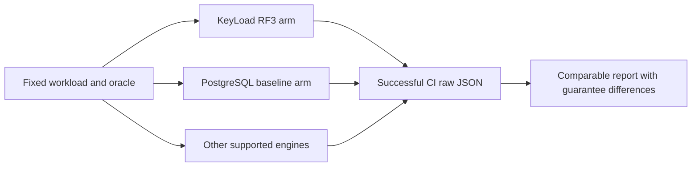

# ADR-021: Comparable PostgreSQL performance baseline

Status: Accepted; benchmark execution and claims require successful GitHub evidence.

## Context and decision

PostgreSQL is the primary general-purpose performance baseline for equivalent KeyLoad workloads. Comparisons must hold dataset, semantic oracle, client placement, concurrency, read/write acknowledgement, durability, security, topology, resource limits, and warm-up constant or explicitly report differences. The current benchmark contract expands comparison coverage to nine engines and keeps only free/community engine deployments.

Historical schema-2 six-engine results are retained as historical baseline evidence only; they do not qualify the nine-engine/schema-3 contract. Values and charts must derive solely from successful GitHub Actions artifacts tied to an exact full source SHA. No hand-entered or inferred performance values are accepted.

## Rationale, alternatives, and consequences

An uncontrolled best-case competitor chart is rejected because acknowledgement and topology differences distort comparisons. PostgreSQL is selected as primary baseline by the product design; specialized systems remain workload-specific arms. Historical runs remain accessible but are labeled to prevent schema mixing.

## Related requirements and implementation contract

Related: `REQ-BC-001..009/AC-BC-001..009`, [ADR-034](ADR-034-cluster-comparisons.md), and KL-006, KL-073..076, KL-101. Current harness/docs live in `benchmarks/KeyLoad.Comparisons/`, `tests/KeyLoad.ComparisonTests/`, `docs/Features/BenchmarkComparisons.md`, `docs/implementation/comparative-benchmarks.md`, and `.github/workflows/ci.yml`.

1. Freeze workload, equivalence oracle, topology, durability/ack semantics, and exact data schema in ADR-034 and the feature contract.
2. Add real container correctness tests for each supported engine and reject missing/failed/unsupported measurements distinctly.
3. Implement the runner and report publisher to preserve every attempt and actual raw results; no synthetic benchmark constants.
4. Store immutable history by source/run/attempt; latest publication must not regress and rollback selects a prior verified publication without rewriting history.
5. Run comparisons only through successful GitHub Actions; attach exact SHA, run/job/artifact, topology and guarantees. Publish no winner or superiority statement without matched evidence.

Root owns runner contracts, workflows, README and site integration. Target adapters remain in the named BenchmarkComparisons slice. CI, Pages and live first-render checks are pending for current source; this ADR does not claim results.
