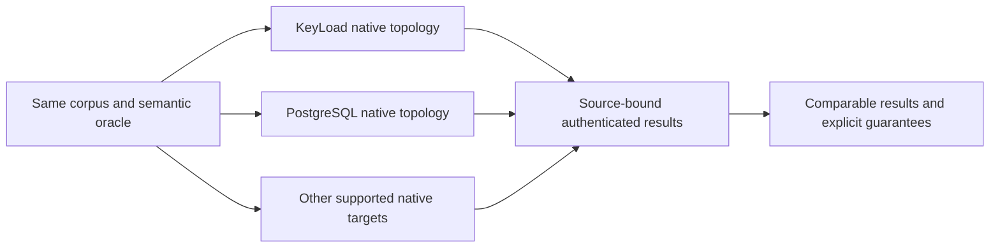

# ADR-021: PostgreSQL comparison baseline

Status: Accepted; current source and delivered-source benchmark qualification are separate.
Related: REQ-BC-001..009 / AC-BC-001..009, ADR-034, ADR-062, ADR-064, ADR-071, ADR-076, ADR-080, ADR-112.

## Decision

PostgreSQL is the general-purpose baseline where its native capabilities support the same workload. A comparison is meaningful only when the corpus, oracle, client placement, concurrency, acknowledgement and durability semantics, topology, resource limits, and warmup match or the report states the difference. Each database group runs in its own isolated Linux job. A PostgreSQL result cannot stand in for another system's unsupported topology or operation.

The canonical current plan contains 11 targets and 1,386 workers: 330 control cells, 264 scaled CRUD cells across the 100,000- and 1,000,000-record profiles, and 792 vector cells. Every applicable scaled workload cell performs at least 100,000 measured operations. These counts are derived from the current source plan; the plan and authenticated current inputs remain the authorities.

## Acceptance and evidence

REQ-BC-001..009 / AC-BC-001..009 require equal workload semantics, actual native topology and acknowledgement, correctness, resource/provenance validation, and honest unsupported or failed outcomes. A failure or unsupported capability has no measurement value and cannot create a winner. Reports and the Website consume only a complete authenticated current cohort under ADR-076/080/112. No hand-entered or inferred value is accepted.

Implementation owners retain the canonical BenchmarkComparisons feature, isolated runner/targets, workflow, aggregation and Website boundaries identified in the feature map. The decision changes no database API, persistence format or engine selection. Verification requires the delivered source, isolated Linux benchmark jobs, complete accounting, Website freshness checks and actual publication evidence. Historical reports retain their original labels and are not accepted as current-cohort evidence. No benchmark, durability or readiness claim follows from this ADR alone.

## Ordered contract

1. Freeze the workload and guarantee comparison in the feature plan and applicable target ADRs.
2. Exercise real native target correctness and record actual topology, acknowledgement and resource observations.
3. Authenticate source, run, attempt, job, artifact, inputs and terminal result for every planned slot.
4. Publish only after complete current-cohort validation and required source/browser/coverage/provider gates.

Root owns the shared plan, workflows, aggregate, Website and final integration. Target owners change only their named BenchmarkComparisons slices. Local source or development results are not delivered-source qualification.
