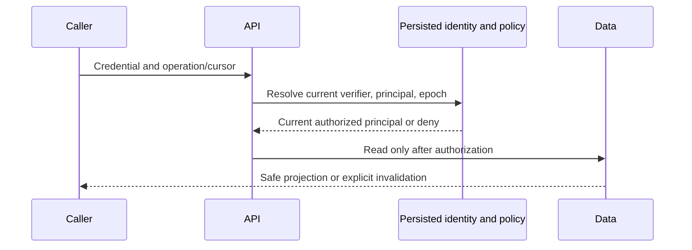
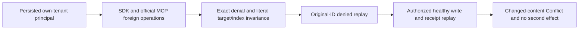

# ADR-022: Policy epoch reauthorization at request and page boundaries

Status: Accepted; full RF3 and all-caller qualification pending.

## Context and decision

Credentials, principals, grants, row restrictions, field classifications, and policy epochs are database-owned. Public callers cannot supply trusted roles. A previously authorized page cursor or cached command receipt must not preserve access after revocation or relevant schema/visibility changes.

Every request resolves identity and policy from persisted state at the authoritative read/apply cut. Signed cursors bind principal and policy epoch plus relevant schema, row-visibility, incarnation, and resource scope. Reauthorization happens before payload projection or cached outcome disclosure. On a stale binding, fail closed with an explicit invalidation response and require a fresh authorized read.

## Rationale, alternatives, and consequences

Long-lived in-memory role caches permit stale grants. Caller-supplied identity/role fields cross the trust boundary and are rejected. Epoch binding adds token invalidation and requires clients to resynchronize after policy changes; that behavior is explicit and safe.

## Related requirements and implementation contract

Related: `REQ-AUTH-004..009/AC-AUTH-004..009`, `REQ-REP-005/AC-REP-005`, `REQ-FEED-002/AC-FEED-002`; ADR-014/015, ADR-029; KL-061..068, KL-066. Current source: `src/KeyLoad.Core/DatabaseEngine.cs`, `MutationAuthorization.cs`, `src/KeyLoad.Security/Features/Authorization/Execution/AuthorizationPolicy.cs`, Query and ChangeFeeds cursor validation.

1. Freeze epoch advancement and the exact state covered by each token/cache within the current persisted and public contracts.
2. Test invalid/expired/revoked credentials, tenant/row forgery, field grants, cursor/cache invalidation, leadership change, and no-effect denial.
3. Implement in Authorization-owned policy/core helpers; Query, Search, EventStreams, Messaging and ChangeFeeds must call common authoritative checks.
4. Validate epoch fields under the current contract; rollback must not reactivate revoked access or accept stale unsafe tokens.
5. Qualify through GitHub TUnit, real-process recovery, and Docker/Aspire RF3 with .NET and official MCP callers; include before/after failover denial.

Current tests include `SecurityAndQueryTests` and `ChangeFeedTests`; path references are traceability, not CI results. Root owns shared host identity and RF3 fixture integration; feature owners own business checks. Dependency: pending ADR-036 cluster foundation.

## TASK-KL015-CROSS-TENANT-RF3-001

REQ-AUTH-KL015-001 / AC-AUTH-KL015-001 supplements REQ/AC-AUTH005/009 and REQ/AC-CLIENT005/006 under existing ADR002/022/039. A persisted non-admin principal belongs to one native tenant, with persisted document read/write/query grants on its resource. Actual SDK and official MCP foreign-tenant GET, bounded full scan, indexed predicate and immutable Batch write must return exact PermissionDenied/safe scope detail and disclose no credential or payload canary. Canonical foreign/owned documents and actual indexed membership remain literal and unchanged after rejection/retry. Same-ID denied replay remains PermissionDenied; authorization precedes fingerprint selection, so different payload under that still-unauthorized ID must likewise remain denied. An authorized healthy command proves exact revision/effect, stable same-ID receipt replay and changed-content Conflict with no second effect.

ADR002 definitive failed writes remain logged: first denied command may advance persisted failure/clock/replica watermark without changing target documents/indexes. Same-ID public retry is stable in result/target effect, not a fabricated global storage position promise. Separate public reads do not guarantee equal cluster-wide cuts while metadata changes; positive cut and complete literal state are checked, and query errors expose no partial page. No pre-submit authorization, product lock, timeout or catalog change is introduced. Telemetry privacy proof remains the real signed native AcOrl012RealSignedOperationsExportBoundedPrivateNativeTelemetry (original4e18 normal/scalar pass), which inspects exported spans/metrics and canaries. This RF3 scenario separately checks actual public failure envelopes; those envelopes alone do not prove every server exporter. Native exact-source execution and original receipts are mandatory before any KL015 closure.

Canonical ownership: IntegrationTests Features/Authorization Cases/Helpers/Assertions. Existing shared ClusterFixture owns Docker/Aspire RF3 endpoints/lifetime; official session is joined with original primary+cleanup errors preserved. Existing standard catalogs/selectors remain unchanged; no LocalImage expansion.

