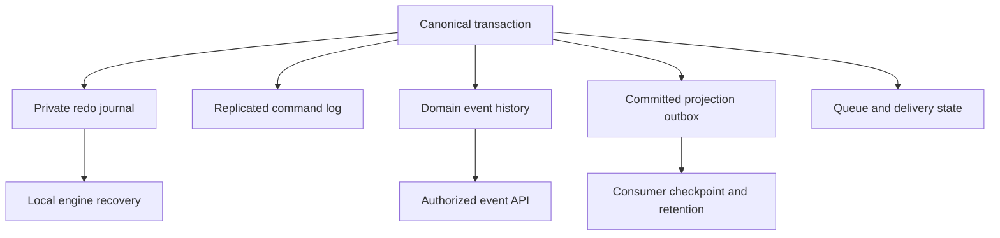

# ADR-023: Separate lifecycle and authority for journals, events, CDC, and queues

Status: Accepted; complete all-capability retention and restore qualification pending.

## Context and decision

The local redo journal supports database recovery; the replicated command log orders replica-group apply; domain event streams are user business history; the committed projection outbox supplies change/projection work; queue and subscription state own delivery progress. They differ in authority, retention, acknowledgement, and public visibility. Trimming one must never silently erase another's promised history.

Keep these records as separately named logical authorities, even when they share a physical store or atomic apply. WAL cleanup follows verified storage/checkpoint rules; public event retention follows stream policy; outbox cleanup follows consumer/rebuild pins; queue cleanup follows delivery/retention rules. Backup manifests identify each included state class.

## Alternatives and consequences

Treating every ordered record as one interchangeable log is rejected because its GC rules and access policies differ. Shared physical storage may reduce overhead, but separate keyspaces, manifests, ownership, and tests remain mandatory. Operators must receive explicit history availability and corruption errors.

## Related requirements and implementation contract

Related: `REQ-FEED-001/AC-FEED-001`, `REQ-EVENT-003/AC-MP-005`, `REQ-MSG-003/AC-MSG-003`, `REQ-BACKUP-004/AC-BACKUP-004`; ADR-003/008, ADR-024/025/027/030; KL-003/005/016, KL-081/082/084/098/099.

1. Freeze record authority, lifecycle, and retention owner for each state class before storage/schema changes.
2. Test independent trim, corruption, backup/restore, reopen/compaction, and consumer pin boundaries against a real store.
3. Implement catalog/keyspace, recovery, and manifest owners in their canonical slices; atomic writes include every affected state and receipt.
4. Roll out versioned manifests only with verified upgrade/rollback; never repurpose one journal's sequence as another public cursor.
5. Qualify local recovery and RF3 snapshot/restore through GitHub process and cluster suites; separately qualify retention and endurance.

Current source: `src/KeyLoad.Storage.ZoneTree/`, `src/KeyLoad.Core/ProjectionOutbox.cs`, `Events.cs`, `Messaging.cs`, `EventSources.cs`; tests include ChangeFeed, EventStreams, Messaging, Recovery, and Artifact suites. These paths are not proof of full capability qualification.
