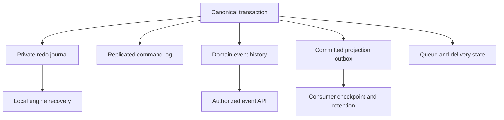

# ADR-023: Separate lifecycle and authority for journals, events, CDC, and queues

Status: Accepted; complete all-capability retention and restore qualification pending.

## Context and decision

The local redo journal supports database recovery; the replicated command log orders replica-group apply; domain event streams are user business history; the committed projection outbox supplies change/projection work; queue and subscription state own delivery progress. They differ in authority, retention, acknowledgement, and public visibility. Trimming one must never silently erase another's promised history.

Keep these records as separately named logical authorities, even when they share a physical store or atomic apply. WAL cleanup follows verified storage/checkpoint rules; public event retention follows stream policy; outbox cleanup follows consumer/rebuild pins; queue cleanup follows delivery/retention rules. Backup manifests identify each included state class.

## Alternatives and consequences

Treating every ordered record as one interchangeable log is rejected because its GC rules and access policies differ. Shared physical storage may reduce overhead, but separate keyspaces, manifests, ownership, and tests remain mandatory. Operators must receive explicit history availability and corruption errors.

## Related requirements and implementation contract

Related: `REQ-FEED-001/AC-FEED-001`, `REQ-EVENT-003/AC-MP-005`, `REQ-MSG-003/AC-MSG-003`, `REQ-BACKUP-004/AC-BACKUP-004`; ADR-003/008, ADR-024/025/027/030; KL-003/005/016, KL-081/082/084/098/099.

1. Freeze record authority, lifecycle, and retention owner for each state class under the current storage schema.
2. Test independent trim, corruption, backup/restore, reopen/compaction, and consumer pin boundaries against a real store.
3. Implement catalog/keyspace, recovery, and manifest owners in their canonical slices; atomic writes include every affected state and receipt.
4. Validate the current manifest version and reject unsupported versions; never repurpose one journal's sequence as another public cursor.
5. Qualify local recovery and RF3 snapshot/restore through GitHub process and cluster suites; separately qualify retention and endurance.

Current source: `src/KeyLoad.Storage.ZoneTree/`, `src/KeyLoad.Core/Features/ChangeFeeds/Execution/ProjectionOutbox.cs`, `Events.cs`, `Messaging.cs`, `EventSources.cs`; tests include ChangeFeed, EventStreams, Messaging, Recovery, and Artifact suites. These paths are not proof of full capability qualification.

## TASK-KL035-CURRENT-NATIVE-TAIL-HEADROOM-002

REQ/AC-REP-004 and REQ/AC-FEED-002/005 preserve the original genuine erased-follower snapshot installation, checksummed native image, same-owner restart, fresh subsequent tail command and complete SDK/official MCP/Q1/cold/feed41 oracles. Original df75 normal/scalar UID95c7915c-a20f-4fe4-f8b9-c1ef5d58034f failures report old-baseline differences21/22 and remain failures; they do not expose the final native snapshot/entry state or identify background commit causes.

Actual ReplicaMaintenance.ScheduleCheckpoint uses current canonical LastApplied minus current Snapshots.Current.Index. Native CaptureAndReclaim legitimately captures/replaces that checkpoint at a later exact applied cut; a subsequent restart does not freeze the previously observed snapshot. Therefore later headroom must be measured against the SAME current stopped native snapshot used by the existing strict tail-entry/image oracle, rather than an old pre-restart snapshot. Keep initial installed-prefix settlement, original full image and LastIndex-installedSnapshot+one-tail<16 admission unchanged. After the original tail has genuinely applied and the owner is actually stopped, require current snapshot.Index>=original installed snapshot.Index; current snapshot.Index<the exact tail receipt position; current native LastIndex-current snapshot.Index<16; committed/last cuts cover that original tail; retained native tail index/commandID/term match. Full current snapshot checksum is still mandatory. Legitimate newer checkpoint is admitted only by these exact predicates; a snapshot covering the tail, missing entry, altered image, older checkpoint or suffix exceeding16 still refuses.

Ordered ownership: this appendix precedes private source; only EmptyReplicaSnapshotScenario passes the original snapshot cut to its existing final stopped-state assertion and removes the stale online status comparison. Native node readiness/status/replication/storage/checkpoint scheduling remain unchanged. Existing63-line flow capture extraction, original case declarations/Args, all full receipts/models/processing/privacy/cursor41, faults and initiating/cleanup ledgers remain unchanged. No polling/retry, snapshot cadence/configuration/limit/deadline/topology change or fabricated index. Root runs authentic current Linux normal/scalar SDK+official MCP+Q1 RF3 and native recovery/source/image/census gates. Source correction is not runtime PASS or historical root-cause closure. Rollback removes only this oracle-origin correction and appendix coherently.

### TASK-KL035-CURRENT-NATIVE-TAIL-FAILURE-FACTS-003

The final stopped-owner refusal retains bounded original installed snapshot/current snapshot/committed/last/tail integer facts and actual hasEntry, including absent native-entry and strict ancestry/headroom/image/assertion failures. No payload, command/owner identity, exception message or credentials are exported. The initiating native/assertion failure remains first and keeps its original identity/stack; synchronous diagnostic failures join the same existing failure ledger. Successful calls emit nothing. This supplements the exact current-snapshot oracle without changing any predicates, original whole case, deadline, topology or runtime qualification requirement. Rollback removes only this failure-observation appendix and its two owning helper edits; original snapshot/tail proof remains unchanged.
