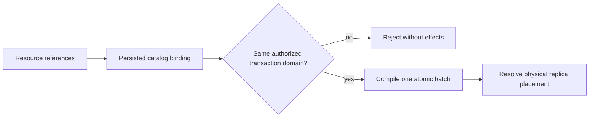

# ADR-024: Catalog-bound shared TransactionDomain

Status: Accepted; complete replicated movement qualification pending.

## Context and decision

Atomic document, event, and local queue effects require a server-verified shared transaction scope. Equal literal partition keys must not merge resources from different tenants, databases, transaction domains, or partitions. Physical shard placement is a separate mapping and may pack several atomic partitions.

Resolve every resource through the persisted catalog and bind it to a `TransactionDomainId` and atomic partition before compilation. A multi-resource batch is atomic only when all participating resources resolve to the same permitted atomic scope. Cross-domain or cross-partition effects fail before partial apply. Moving physical owners preserves the atomic identity and its complete state.

## Alternatives and consequences

Partitioning only by a user-supplied string is rejected because it permits accidental cross-resource aliasing. Equating physical shard and atomic partition is rejected because it constrains packing and movement. Catalog validation makes stale bindings explicit and requires catalog epoch to participate in move/recovery checks.

## Related requirements and implementation contract

Related: `REQ-DSTORE-001/AC-DSTORE-001`, `REQ-DSTORE-004/AC-DSTORE-004`, `REQ-EVENT-004/AC-EVENT-004`, `REQ-MSG-005/AC-MSG-005`, `REQ-FEED-001/AC-FEED-001`, `REQ-REP-004/AC-REP-004`; ADR-001/005/016, ADR-023/025; KL-007/009..012, KL-069..071, KL-081/091/094/099.

1. Freeze catalog binding, atomic key identity, physical placement epoch, and cross-resource failure semantics.
2. Test same/different-domain resources, duplicate literal keys, failed mixed batches, movement, recovery, and snapshot catch-up using real stores and RF3.
3. Implement binding and compiler checks in DocumentStorage/Core, with routing and physical placement owned by ClusterReplication/ClusterRouting.
4. Before a physical move, verify catalog bindings; rollback stops movement and preserves the current owner, never merging domains.
5. Qualify exact source through GitHub unit, process-recovery, and three-node SDK/MCP tests before claiming atomic cluster movement.

Current identity types and checks are in `src/KeyLoad.Abstractions/Contracts.cs`, `src/KeyLoad.Core/DatabaseEngine.cs`, and `PartitionRef`; `TransactionTests.SameLiteralPartitionKeyCannotCrossTransactionDomains` is existing source evidence. Current delivered-source qualification remains pending.

### TASK-KL086-ENQUEUE-COLD-WHOLE-001 supporting operation contract

Under REQ-MSG-001/005 and AC-MSG-001/005, use only existing native DatabaseEngine batch/configure/receive/delivery interfaces and the original same-directory ZoneTree owner. No format/API/routing/migration boundary changes: Core Enqueue already stages QB/QM/ready-or-scheduled/counters atomically. Private tests own only their fresh fixture roots and join each handle before reopen; current persisted authorization is reloaded by real admission. Preserve original failed command outcomes and immutable receipt identity, separate business-image equality from native failure metadata, then prove authorized healthy continuation and cold full lane state. Existing required Unit/scalar/process/RF3 gates are unchanged. Rollback removes only this additive regression/traceability; root owns integration and execution.
