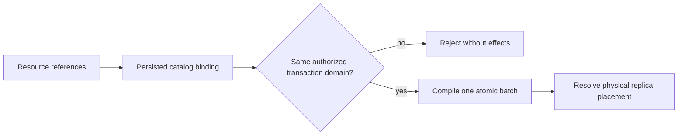

# ADR-024: Catalog-bound shared TransactionDomain

Status: Accepted; complete replicated movement qualification pending.

## Context and decision

Atomic document, event, and local queue effects require a server-verified shared transaction scope. Equal literal partition keys must not merge resources from different tenants, databases, transaction domains, or partitions. Physical shard placement is a separate mapping and may pack several atomic partitions.

Resolve every resource through the persisted catalog and bind it to a `TransactionDomainId` and atomic partition before compilation. A multi-resource batch is atomic only when all participating resources resolve to the same permitted atomic scope. Cross-domain or cross-partition effects fail before partial apply. Moving physical owners preserves the atomic identity and its complete state.

## Alternatives and consequences

Partitioning only by a user-supplied string is rejected because it permits accidental cross-resource aliasing. Equating physical shard and atomic partition is rejected because it constrains packing and movement. Catalog validation makes stale bindings explicit and requires catalog epoch to participate in move/recovery checks.

## Related requirements and implementation contract

Related: `REQ-DSTORE-001/AC-DSTORE-001`, `REQ-DSTORE-004/AC-DSTORE-004`, `REQ-EVENT-004/AC-EVENT-004`, `REQ-MSG-005/AC-MSG-005`, `REQ-FEED-001/AC-FEED-001`, `REQ-REP-004/AC-REP-004`; ADR-001/005/016, ADR-023/025; KL-007/009..012, KL-069..071, KL-081/091/094/099.

1. Freeze catalog binding, atomic key identity, physical placement epoch, and cross-resource failure semantics.
2. Test same/different-domain resources, duplicate literal keys, failed mixed batches, movement, recovery, and snapshot catch-up using real stores and RF3.
3. Implement binding and compiler checks in DocumentStorage/Core, with routing and physical placement owned by ClusterReplication/ClusterRouting.
4. Before a physical move, verify catalog bindings; rollback stops movement and preserves the current owner, never merging domains.
5. Qualify exact source through GitHub unit, process-recovery, and three-node SDK/MCP tests before claiming atomic cluster movement.

Current identity types and checks are in `src/KeyLoad.Abstractions/Contracts.cs`, `src/KeyLoad.Core/DatabaseEngine.cs`, and `PartitionRef`; `TransactionTests.SameLiteralPartitionKeyCannotCrossTransactionDomains` is existing source evidence. Current delivered-source qualification remains pending.

### TASK-KL086-ENQUEUE-COLD-WHOLE-001 supporting operation contract

Under REQ-MSG-001/005 and AC-MSG-001/005, use only existing native DatabaseEngine batch/configure/receive/delivery interfaces and the original same-directory ZoneTree owner. No format/API/routing/migration boundary changes: Core Enqueue already stages QB/QM/ready-or-scheduled/counters atomically. Private tests own only their fresh fixture roots and join each handle before reopen; current persisted authorization is reloaded by real admission. Preserve original failed command outcomes and immutable receipt identity, separate business-image equality from native failure metadata, then prove authorized healthy continuation and cold full lane state. Existing required Unit/scalar/process/RF3 gates are unchanged. Rollback removes only this additive regression/traceability; root owns integration and execution.

### TASK-KL091-PUBLIC-TRIAD-COLD-001

TASK-KL091-PUBLIC-TRIAD-COLD-001 — REQ-DSTORE-004/006, REQ-MSG-005; AC-DSTORE-004/006, AC-MSG-005; ADR024/002.
Existing TransactionTests and genuine CommandIdempotencyProcessRecoveryTests remain mandatory; no duplicate native process fixture or product behavior change. Extend the existing QueueProducerAtomicRf3Tests two arguments, original deadlines, response cancellation and two same-volume cold cycles. Configure an actual same-domain StreamSet and a separate-domain StreamSet through the original administrator; grants are persisted. Original and healthy batches stage document, actual event and queue mutations in one existing CommandRequest. Late queue quota/duplicate failure must leave document/event head/records/sequence/queue unchanged; an actual existing-stream NoStream refusal exercises the event precondition; foreign transaction-domain stream refuses before effects. Replays on SDK/MCP and both Q1 paths retain every original CommitReceipt field; actual stream head and full event records are compared across replay/cold/current epoch refusal. Independently validate stream identity, exact EventData, revision/generation and sequence; retain original native RecordedAt verbatim across reads/restarts. Read-cut/cursor values belong to each real read, are not falsely frozen across replicated log progress. Persisted demotion/restore keeps historical receipt rejection and fresh healthy continuation. Production contracts/aliases/Ids, RF3 storage, same-partition atomicity, quotas and deadlines are unchanged. Ordinary independent cases retain native concurrency. Source-only; root native build/discovery, Linux normal/scalar Unit/process and actual Docker SDK/MCP/Q1 two-cold gates remain required. Rollback removes additive test coverage only; no data migration.

Actual source traceability (no UID or execution qualification):
- Unit normal+scalar: TransactionTests.DocumentEventAndQueueCommitTogetherAndCommandRetryDoesNotRepeatEffects; UniqueConflictRollsBackDocumentIndexEventAndEnqueue; SameLiteralPartitionKeyCannotCrossTransactionDomains; MessagingTests.QueueQuotaFailureRollsBackProducerDocument. These preserve canonical same-domain commit, late document refusal, domain refusal and queue quota atomicity.
- Genuine process cuts: EventAppendProcessRecoveryTests.AcEventCrash001002SeededProducerRecoversOneWholeCutAndStableReplay: HeaderWritten/0, PayloadWritten/0, JournalFlushed/0, MutationApplied/0, /3, /6, ApplyCompleted/0. EventAppendCrashScenario submits the real document/event/queue producer; EventAppendRecoveryOracle requires one whole cut, exact durable original outcome/outbox, changed-content refusal with unchanged native bytes, dedup and authorized healthy continuation.
- Genuine acknowledged process/cold replay: CommandIdempotencyProcessRecoveryTests.AcDocument006OneHundredCommandRetriesSurviveRealProcessRestart; no duplicate process case is added.
- Existing Docker leader/minority: ClusterTests.ReplicatedAtomicBatchSurvivesLeaderContainerKillAndMinorityRejectsWrites. Existing initial full mixed batch and leader-loss flow retained.
- Deepened Docker public flow: QueueProducerAtomicRf3Tests.ActualMixedProducerBatchRefusalsAndOriginalResponseCancellationSurviveColdHealthyContinuation(bool cancelAfterResponse), exact existing Arguments(false) and Arguments(true), original McpCallerDeadline and ClusterFixture. Same original SDK response cancellation may return actual success or UnknownWriteOutcome; neither is fabricated. Official MCP independently reconciles the complete original receipt.
- New event assertions compare every stable StreamHead/EventRecord field and original RecordedAt across real reads/replay/cold. Initial stream/id/EventData/revision/generation and original sequence1/healthy sequence2 are independent literals. RecordedAt is captured from the original native record, checked nonempty, and retained exactly; no invented clock equality. Dynamic read CutPosition/Cursor are never presented as stable business records.
- Cross-domain refusal uses a genuinely configured foreign-domain resource, exact Conflict, no document/message/event effect, then a separately authorized read of that actual foreign domain proves the stream empty. This does not claim distributed atomicity.
- Runtime gates OPEN: fresh root Release/analyzers/native discovery/current Source+PDB+case identities; Linux normal/scalar required Unit/process and actual SDK/official MCP/Q1 Docker two-cold flows; no current pass/runtime/native UID inferred from source. Entire required suites remain mandatory.

## TASK-KL091-DOCUMENT-CAS-COLD-001 — same original failed command after cold

REQ-MSG-005/AC-MSG-005, REQ-DSTORE-004/006 and AC-DSTORE-004/006 retain the existing native transaction/process gates and the SAME QueueProducerAtomicRf3Tests false/true Args, original deadline, signed authorization, grants, response-cancellation flow and two cold cycles. Original producer17 already covers triad success, event precondition, queue quota/duplicate/domain refusal, complete original and fresh healthy receipt/model/cold operations. This additive test-only edge closes the missing public document-CAS precondition replay: stage a genuinely new event first, then PutDocument of the original existing document with independent ExpectedRevision0; require RevisionConflict before the remaining queue effect. No product/API/schema/persisted IDs or quota change.

Retain the SAME actual CommandRequest and complete original safe five-field Problem. SDK, official MCP and both Q1 routes must return null success body and exactly that semantic Problem before and after first real same-root RF3 cold restart. Each rejection is immediately followed by full four-route original document/event/head/message/scheduled-image equality, refused document/message absence, empty refused stream with independent head0/first1/generation1, then the original full receipt replay and unchanged images. Problem JSON comparison preserves every field/value/null and never compares volatile outer execution IDs. MCP output must omit private credential/payload. Native physical read cuts remain current per real request, not falsely invariant across replicated failure metadata.

Original policy epoch demotion/repair, historical receipt refusal, actual fresh healthy event sequence2 (proving failed event sequence/dedup was rolled back), original ready/scheduled counters, ACK and second same-root cold continuation remain intact. No invented failure, wait, fallback, polling, retry or longer timeout. Ordered integration: this appendix and ADR024/DatabaseComposition source map; two feature-local helper/assertion owners plus the existing Trial and named fixture literal; native previews and guarded join; canonical compiler/analyzers/formatter, original Unit normal/scalar and genuine process cases, full current-image Docker SDK/official MCP/Q1 two Args. Source/native preview does not qualify runtime UID or acceptance; root retains full exact-source/image/PDB/discovery and cleanup gates. Rollback removes only this additive test/doc edge with exact guards, never stored data or product behavior.
