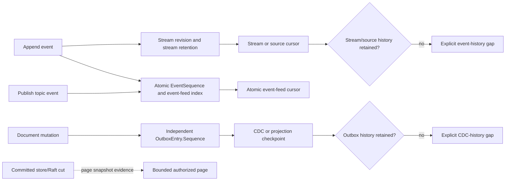

# ADR-025: Stream revisions and stable per-atomic event-feed positions

Status: Accepted; cluster movement and retained-history qualification pending.

## Context and decision

The event, CDC, and commit-order paths have separate position domains. A stream revision orders records within one stream and is its append/OCC and stream-read cursor. Current `Events.cs` allocates a per-atomic-partition `EventSequence` for canonical stream records and stores those records in the `event-feed` index. `EventSources` increments the same partition sequence for topic events while retaining a topic-local source `Position`; its current topic path does not populate the shared `event-feed` index. The product target in section 38.3 requires the stable sequence and feed index to travel with canonical event state. The committed store/Raft cut describes the snapshot at which a page was read, not an event cursor. CDC uses `ProjectionOutbox`'s independent per-partition `OutboxHead.Tail` and `OutboxEntry.Sequence` for document-mutation delivery. Neither event sequence nor outbox sequence is a command sequence or Raft `LogIndex`.

Keep those domains distinct in contracts and ownership. EventStreams owns stream revisions and retained stream history; Messaging owns topic/event-source reads and event-feed sequencing; ChangeFeeds owns the document-change outbox, its cursor/checkpoint, and retention pins. Event/source retention and outbox retention report gaps independently. A source cursor may be scoped to a stream or topic; a future multi-partition atomic event-feed cursor may use a bounded vector of per-partition EventSequence values, but no new wire contract is selected here. Canonical event positions move with canonical event state across physical placement changes; they are not mechanically translated as group-log positions. Invalidate a cursor when its incarnation or ownership epoch is stale; do not translate it across epochs. A read page's committed cut remains separate evidence of read consistency.

## Alternatives and consequences

Using stream revision as an atomic feed cursor fails when streams interleave. Reusing CDC outbox sequence for event-feed order couples independent retention and consumer lifecycles. Treating the committed read cut as a cursor confuses snapshot evidence with continuation. Using raw group-local log indexes fails after movement. Atomic EventSequence gives per-partition event order but exposes filtered gaps and needs event-history retention. Multi-partition vector cursors add bounded state and merge policy.

## Related requirements and implementation contract

Related: `REQ-EVENT-001` (bounded work/deadline/cancellation; `AC-MP-005`), `REQ-EVENT-002` (complete page result limit; `AC-MP-005`), `REQ-EVENT-003` (revisions, retention, and payload/header policy; `AC-MP-005/012`), `REQ-EVENT-004/AC-EVENT-004`, `REQ-EVENT-005/AC-EVENT-005`, `REQ-EVENT-006/AC-EVENT-006`, `REQ-MSG-003/AC-MSG-003`, `REQ-FEED-002/AC-FEED-002`, `REQ-FEED-005/AC-FEED-005`; ADR-023/024/027/030; KL-016, KL-081/083/084/089/098/099. Current source: `src/KeyLoad.Core/Features/EventStreams/Execution/Events.cs` assigns stream revisions and EventSequence; `src/KeyLoad.Core/Features/EventStreams/Execution/EventSources.cs` keeps topic/source Position distinct from EventSequence; `src/KeyLoad.Core/Features/ChangeFeeds/Execution/ProjectionOutbox.cs` assigns an independent outbox sequence; `src/KeyLoad.Core/Features/ChangeFeeds/Execution/ChangeFeeds.cs` reads CDC positions. Product section 38.3 likewise distinguishes EventSequence from StreamRevision, CommandSequence, and Raft LogIndex.

1. Freeze each cursor's domain, fields, retention-gap errors, and movement behavior under the current persisted format; preserve the separation between stream/source positions, atomic EventSequence, outbox sequence, and committed read cut.
2. Test concurrent append/read, expected revision conflicts, filter gaps, retention loss, cursor scope/revocation, reopen, and snapshot movement.
3. Keep stream revisions and canonical atomic EventSequence under EventStreams, topic/source positions and event-feed sequencing under Messaging, and document CDC/outbox positions under ChangeFeeds; token/cursor ownership-epoch handling belongs to ClusterReplication. Canonical event positions move with canonical event state, not as group-log indexes.
4. Validate supported cursor versions and invalidate stale incarnation/epoch bindings; never rewind acknowledged positions.
5. Qualify event and feed behavior through GitHub TUnit, process recovery, and RF3 .NET/MCP tests.

Target ownership is `src/KeyLoad.Abstractions/Features/EventStreams/`, `Features/Messaging/`, and `Features/ChangeFeeds/` for shared contracts; `src/KeyLoad.Core/Features/EventStreams/` for stream revisions and canonical event sequence, `Features/Messaging/` for topic/source positions and event-feed sequencing, and `Features/ChangeFeeds/` for document CDC/outbox sequence; `src/KeyLoad.Query/Features/ChangeFeeds/` for query-facing CDC cursors; and matching `tests/KeyLoad.UnitTests/Features/` slices. Existing unit tests are evidence paths, not passing current CI. Owners: EventStreams/Messaging/ChangeFeeds leads; root owns token and movement integration.
