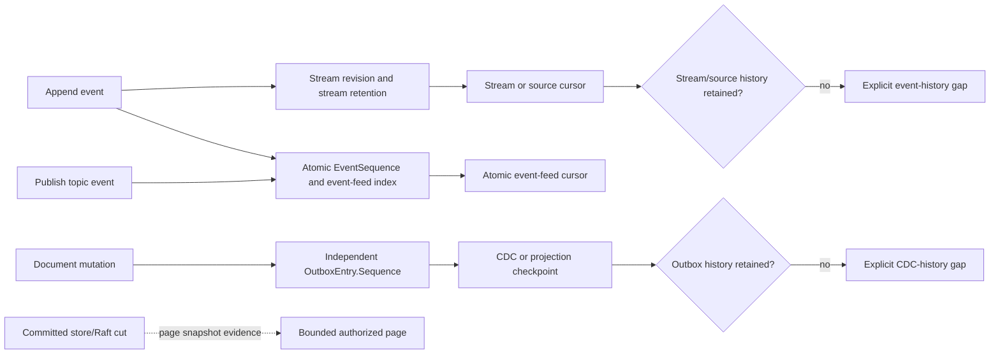
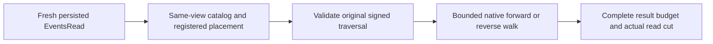

# ADR-025: Stream revisions and stable per-atomic event-feed positions

Status: Accepted; cluster movement and retained-history qualification pending.

## Context and decision

The event, CDC, and commit-order paths have separate position domains. A stream revision orders records within one stream and is its append/OCC and stream-read cursor. Current `Events.cs` allocates a per-atomic-partition `EventSequence` for canonical stream records and stores those records in the `event-feed` index. `EventSources` increments the same partition sequence for topic events while retaining a topic-local source `Position`; its current topic path does not populate the shared `event-feed` index. The product target in section 38.3 requires the stable sequence and feed index to travel with canonical event state. The committed store/Raft cut describes the snapshot at which a page was read, not an event cursor. CDC uses `ProjectionOutbox`'s independent per-partition `OutboxHead.Tail` and `OutboxEntry.Sequence` for document-mutation delivery. Neither event sequence nor outbox sequence is a command sequence or Raft `LogIndex`.

Keep those domains distinct in contracts and ownership. EventStreams owns stream revisions and retained stream history; Messaging owns topic/event-source reads and event-feed sequencing; ChangeFeeds owns the document-change outbox, its cursor/checkpoint, and retention pins. Event/source retention and outbox retention report gaps independently. A source cursor may be scoped to a stream or topic; a future multi-partition atomic event-feed cursor may use a bounded vector of per-partition EventSequence values, but no new wire contract is selected here. Canonical event positions move with canonical event state across physical placement changes; they are not mechanically translated as group-log positions. Invalidate a cursor when its incarnation or ownership epoch is stale; do not translate it across epochs. A read page's committed cut remains separate evidence of read consistency.

## Alternatives and consequences

Using stream revision as an atomic feed cursor fails when streams interleave. Reusing CDC outbox sequence for event-feed order couples independent retention and consumer lifecycles. Treating the committed read cut as a cursor confuses snapshot evidence with continuation. Using raw group-local log indexes fails after movement. Atomic EventSequence gives per-partition event order but exposes filtered gaps and needs event-history retention. Multi-partition vector cursors add bounded state and merge policy.

## Related requirements and implementation contract

Related: `REQ-EVENT-001` (bounded work/deadline/cancellation; `AC-MP-005`), `REQ-EVENT-002` (complete page result limit; `AC-MP-005`), `REQ-EVENT-003` (revisions, retention, and payload/header policy; `AC-MP-005/012`), `REQ-EVENT-004/AC-EVENT-004`, `REQ-EVENT-005/AC-EVENT-005`, `REQ-EVENT-006/AC-EVENT-006`, `REQ-MSG-003/AC-MSG-003`, `REQ-FEED-002/AC-FEED-002`, `REQ-FEED-005/AC-FEED-005`; ADR-023/024/027/030; KL-016, KL-081/083/084/089/098/099. Current source: `src/KeyLoad.Core/Features/EventStreams/Execution/Events.cs` assigns stream revisions and EventSequence; `src/KeyLoad.Core/Features/EventStreams/Execution/EventSources.cs` keeps topic/source Position distinct from EventSequence; `src/KeyLoad.Core/Features/ChangeFeeds/Execution/ProjectionOutbox.cs` assigns an independent outbox sequence; `src/KeyLoad.Core/Features/ChangeFeeds/Execution/ChangeFeeds.cs` reads CDC positions. Product section 38.3 likewise distinguishes EventSequence from StreamRevision, CommandSequence, and Raft LogIndex.

1. Freeze each cursor's domain, fields, retention-gap errors, and movement behavior under the current persisted format; preserve the separation between stream/source positions, atomic EventSequence, outbox sequence, and committed read cut.
2. Test concurrent append/read, expected revision conflicts, filter gaps, retention loss, cursor scope/revocation, reopen, and snapshot movement.
3. Keep stream revisions and canonical atomic EventSequence under EventStreams, topic/source positions and event-feed sequencing under Messaging, and document CDC/outbox positions under ChangeFeeds; token/cursor ownership-epoch handling belongs to ClusterReplication. Canonical event positions move with canonical event state, not as group-log indexes.
4. Validate supported cursor versions and invalidate stale incarnation/epoch bindings; never rewind acknowledged positions.
5. Qualify event and feed behavior through GitHub TUnit, process recovery, and RF3 .NET/MCP tests.

Target ownership is `src/KeyLoad.Abstractions/Features/EventStreams/`, `Features/Messaging/`, and `Features/ChangeFeeds/` for shared contracts; `src/KeyLoad.Core/Features/EventStreams/` for stream revisions and canonical event sequence, `Features/Messaging/` for topic/source positions and event-feed sequencing, and `Features/ChangeFeeds/` for document CDC/outbox sequence; `src/KeyLoad.Query/Features/ChangeFeeds/` for query-facing CDC cursors; and matching `tests/KeyLoad.UnitTests/Features/` slices. Existing unit tests are evidence paths, not passing current CI. Owners: EventStreams/Messaging/ChangeFeeds leads; root owns token and movement integration.

### TASK-KL084-STABLE-STREAM-STAGE-A-001 — current product implementation contract

REQ-EVENT-READ-DIRECTION-001 / AC-EVENT-READ-DIRECTION-001 requires complete independent forward/backward retained-event pages, exclusive bounds, current field/header redaction, byte refusal without partial publication, cancellation/refusal followed by a healthy operation. REQ-EVENT-READ-CUT-001 / AC-EVENT-READ-CUT-001 freezes original traversal tail/floor and snapshot cut, with subsequent append excluded until a new traversal; current CutPosition remains actual same-view position. Original generation/history, signed source feed and every global gate remain mandatory.

ReadStreamRequest IDs0..2 remain unchanged; Direction3 (Forward0/Backward1), MaxBytes4 (0 means original centrally validated MaxBatchBytes), Cursor5 are additive current contracts. StreamPage0..4 remain unchanged; Cursor5 and SnapshotCutPosition6 are appended. Head is the captured immutable traversal head; fresh current head separately proves original range remains available. Complete native result, including cursor/head metadata, must fit the original constrained result budget. Over-budget produces a closed refusal, not a partial page. Native reverse VisitReverseRange retains exclusive LOWER afterKey and exclusive UPPER untilKey, with original counting/cancellation reader. The new undelivered traversal cursor field6 SchemaVersion uses the actual ResourceDefinition.SchemaVersion long type without narrowing; existing alias, field IDs, constructor shape and authorization comparisons remain fixed.

The generated native stream-traversal cursor alias is keyload.core.stream-traversal-cursor.v1: 0Version,1Purpose,2Incarnation,3Stream,4PrincipalId,5PolicyEpoch,6SchemaVersion,7PlacementEpoch,8Direction,9CapturedTailRevision,10CapturedFirstAvailableRevision,11SnapshotCutPosition,12NextExclusiveRevision,13ExpiresAt,14LogicalPlacementRevision,15DirectoryFence. Fields7/14/15 are actual AtomicPartitionPlacementResolution PlacementEpoch/Revision/DirectoryRevision; no scalar reinterpretation. Original owning signer and EventSourceExecutionOptions.CursorLifetime supply MAC/expiry; continuation does not renew original expiry.

Core authenticates current persisted principal and EventsRead before token decode or event payload. On that SAME bounded native view, actual catalog and registered owner/directory/logical placement resolve and verify exact borrowed configured PhysicalShardRecord (including ordered voters), store incarnation, and current selected owner. Original ConnectionReadCapabilities supplies only its existing DI PhysicalShardRecord to the Stream branch. Core verifies the tuple; it grants no caller roles. Public Core request/scalar paths acquire native default catalog authority and refuse if it is not this store; nondefault owner paths must provide genuine configured authority which is revalidated. No administrator-read workaround, fabricated default epoch or parallel dispatcher.

Ownership/mapping: Abstractions EventStreams DTO/enum; Core EventStreams Contracts/Queries/Execution; existing Orleans GrainCoreReadCapabilities + ConnectionReadCapabilities only Stream dispatch; Client current ReadStreamAsync request transport unchanged; existing SDK/MCP/Q1 same public request and complete schema/result controls; Unit native real-store controls and RF3 same-root cold traversal. All original reader/producer cleanup and failure trees remain. Native source preview precedes root join, actual strict fresh metadata and Linux normal/scalar/process/RF3 evidence follow. Stage A does not implement vector-map admission or live registration/backpressure Stage B/C and cannot close KL084. No migration/fallback, policy/deadline/limit change or runtime PASS is asserted.

Stage A boundary details: negative or above-captured-bound AfterRevision and invalid Direction/MaxBytes are Validation, as frozen in the approved traversal proposal; original Limit<1/>MaxResults remains BudgetExceeded. Cursor requests use AfterRevision=0 rather than a second competing boundary. Exhausted traversal returns Cursor=null. The existing scalar Core signature delegates to this one current reader; no retained legacy reader is introduced. UTC expiry control in native Unit tests borrows the original timer/monotonic owner and exact same EventSourceExecutionOptions instance; it is a supporting expiry operation, not natural RF3 time qualification.

## TASK-KL084-PUBLIC-CATCHUP-COLD-001

REQ/AC-EVENT-006 and architecture38.3/KL084: existing forward ReadStream numeric exclusive-revision continuation must not lose an append at an observed empty tail. Freeze one real original stream/generation and append receipt, read its complete three-event catch-up, then start an empty-tail read concurrently with one exact3 append. The race page is validated against its actual committed cut: complete empty old head3 or complete one-event new head4 only. After both original operations settle, consume the original after3 continuation through SDK/official MCP and both Q1 routes, exact independently authored event4/full record/page, empty continuation and immutable original append receipt replay. Current wrong-generation denial on all routes precedes healthy continuation. Dispose original caller owners, kill/restart the same Aspire-owned RF3 resources with original clocks/deadline/roots and native readiness, reconnect fresh clients with same persisted credential, assert unchanged node/incarnation/voters and nondecreasing actual generation, and require the same original continuation and full four-event history/receipt.

This finite test does not claim notification registration, backward read, signed stream cut/cursor, vector cursor/discovery-map or >RAM qualification. Current DTO IDs0Stream/1AfterRevision/2Limit and forward same-cut native operation remain unchanged. Architecture38.3 still requires backward, maxBytes, vector cursor and catch-up/register race; ADR025 explicitly has no chosen vector wire yet. Those are real remaining implementation gates, not replaced by this test or by document CDC cursors. No clock/limit/retry/provider/topology/schema/auth modification; no new operational option. Existing Unit range/work/result/privacy/cancellation/retention tests and process/restore/movement scopes remain mandatory. Exact-source Linux native discovery/source+PE/PDB, normal/scalar original outcomes and joined resources/reader cleanup required. Docs precede source; rollback removes these fixture-only files and appendage coherently.

The existing ReadEventSource stream path already supplies a signed scalar SourceCursor with incarnation, exact source, persisted principal/policy/schema and expiry, plus stable per-atomic EventSequence. This is preserved and exercised: retain its original caught-up cursor before append, consume the identical cursor through all four routes before/after cold, verify complete independent event4 and empty continuation. No claim that this existing scalar token is a vector cursor or stable historical ReadStream cut.

## TASK-KL084-OPERATION-KIND-RESERVATION-001

REQ-EVENT-READ-CUT-001 / AC-EVENT-READ-CUT-001 and the pending KL084 Stage B/C control-map admission reserve the exact native operation values EventFeedControl=36 and EventFeedSourcePhase=37; target-only CommitInbox retains its already frozen value38. These are consecutive distinct operation discriminants, never flags or combinations. The reservation does not implement or qualify Stage B/C.

Before the verified control/source implementation is joined, both reserved operations must remain unavailable: the existing generic CreateNativeOperation factory refuses them with UnsupportedCapability, public JSON normalization records the existing unsupported refusal, and no public endpoint, MCP operation tool or native payload decoder is added by this reservation. Stage B/C must independently authorize actual control36 admission and private source37 execution through the owning trusted receiver; it cannot enable either via the generic public factory. Existing operation identities, aliases, field IDs and receipts are unchanged.

Implementation ownership: Abstractions/Contracts.cs only for these exact enum values, under EventStreams/ADR025 traceability; root composes the declarations after this contract and retains the existing closed factory/normalization branches. The Stage B/C agent rebases its shared declarations rather than duplicating them. Root verifies full build and affected native operation/refusal regressions, then exact-source Linux normal/scalar/process/RF3 complete Stage B/C flows before acceptance. Rollback of this undelivered reservation must remove the related undelivered consumers together; no persisted migration, fallback or legacy path is authorized. Runtime qualification and KL084 closure remain pending.
