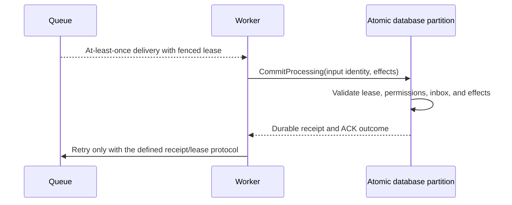
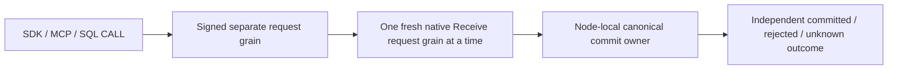

# ADR-026: At-least-once delivery with fenced leases and inbox effects

Status: Accepted; end-to-end RF3 delivery and reconciliation qualification pending.

## Context and decision

Durable queue delivery can repeat after lost responses, worker restarts, or expired leases. Exactly-once handler execution cannot be guaranteed for arbitrary user code or external services. The database can provide at-least-once delivery and protect canonical effects by fencing stale claims and atomically committing inbox identity, database effects, and local acknowledgement.

Every claim has a persisted lease version/generation and signed token bound to message, lane, principal, incarnation, and expiry. ACK, NACK, and renew validate current ownership. `CommitProcessing` deduplicates handler input/fingerprint and commits permitted same-partition effects plus inbox receipt and ACK atomically. External calls remain outside the transaction and require their own idempotency protocol.

## Alternatives and consequences

Claiming exactly-once external execution is rejected. Unfenced ACK can let an expired worker acknowledge a reclaimed message. Separate effect and ACK commits create duplicate effects after a lost response. Atomic inbox state protects database effects but does not make arbitrary handler code or network side effects transactional.

## Related requirements and implementation contract

Related: `REQ-MSG-001..003/AC-MSG-001..003`, ADR-023/024/027/029/030; KL-086..090, KL-096, KL-099, KL-102..103.

1. Freeze lease-token fields, dedup identity/horizon, supported atomic scope, and external-side-effect caveat.
2. Test lost claim/ACK response, stale and expired worker, changed fingerprint, permission revocation, quota failure, process kill, and reopen with real store/process.
3. Implement lease state and inbox effect transaction in `src/KeyLoad.Core/Features/Messaging/`; keep worker transport in the ClientApi/Messaging boundary and Orleans routing in its existing ClusterRouting slice.
4. Fence stale token generations. Rollback may restore only a verified cut matching retained inbox receipts and canonical effects; assign a new/fenced identity, keep delivery paused, and reconcile before redelivery. Never reactivate stale lease tokens or repeat a known canonical effect. The current wire and persisted-data formats remain fixed.
5. Run GitHub TUnit, process recovery, and RF3 SDK/MCP races; publish only exact-SHA evidence.

Current source: `src/KeyLoad.Core/Features/Messaging/Execution/Messaging.cs`, `src/KeyLoad.Core/DatabaseEngine.cs`, `src/KeyLoad.Abstractions/Contracts.cs`; tests: `tests/KeyLoad.UnitTests/MessagingTests.cs`, `SubscriptionTests.cs`, `TransactionTests.cs`. The feature contract is [Messaging](../Features/Messaging.md). No external exactly-once claim is made.

## Multi-lane receive composition

Accepted implementation contract for TASK-KL087-MULTI-LANE-RECEIVE-001,
REQ-MSG-007 / AC-MSG-007; qualification remains pending. The complete normative
request/result, ordering, bounded admission, per-lane authorization/read-cut,
atomicity, cancellation and uncertainty contract is in
[Messaging](../Features/Messaging.md#task-kl087-multi-lane-receive-001).

Implement in order: freeze that contract; add native attributed Messaging types
and centrally validated lane ceiling; compose existing claims through fresh signed
request grains and joined native Communication CQRS streams; bind one SDK/HTTP/MCP
operation and its SQL CALL inventory; add real ZoneTree and public RF3 whole flows;
then run every required native gate and retain original results before status
changes. Existing request/identity/grain/commit lifetimes are reused, no new
scheduler, read-cut authority, persisted group receipt or cross-partition commit.
Explicit request-to-request graph permission is limited to the existing native
ExecuteStreamAsync transition; a multi-lane parent only emits ordinary Receive
children and cannot recursively emit multi-lane children. Field aliases/IDs of
existing persisted claims remain fixed. Rollback drains the new ingress while
preserving committed lease/receipt recovery. Root is the integration owner.

## TASK-KL087-NATIVE-POST-SUBMIT-ENCODING-001

REQ/AC-CRS-003/004, REQ-MSG-007/AC-MSG-007 and ADR-026 require truthful write
uncertainty after an actual native Submit has returned a committed value. The
existing GrainCommandExecutor already tags its reply encoder failure with the
private closed ReplyEncoding stage; GrainReplyFactory must classify that command
failure as UnknownWriteOutcome, using the existing fixed safe interrupted-write
detail while logging the original failure's closed category/stage. Preserve
actual primary/cleanup settlement. This rule applies only to tagged command reply
encoding, including a multi-lane parent's final encoding. Definitive canonical
failed operations (including quota/validation) and read failures keep their exact
codes. No blanket ResourceExhausted mapping, fake provider, gate bypass or new
production observation hook is introduced. Actual native whole-flow byte-bound
claim proof is in MultiLaneReceiveBoundaryWholeFlowTests; source-only pending run.

### TASK-KL087-POST-DISPATCH-DRAIN-001 and caller cancellation follow-on

REQ-MSG-007 / AC-MSG-007: once an actual child stream creation is invoked, a typed KeyLoad transport/stream-validation exception is an uncertain child outcome, not a definitive whole-group rejection. Retain already confirmed lane outcomes, emit UnknownWriteOutcome with the canonical static interrupted detail for that child, and mark the undispatched suffix NotAttempted. Preserve original exceptions in closed native diagnostics. Exceptions before invocation retain their original classification. Cancellation and cleanup aggregate failures are not caught or rewritten. This is a source correction; KL-087 remains in progress.

The required caller-after-submit RF3 regression uses the existing RequestCqrsProbeFixture Hold at SubmitReturned for the first original stable ReceiveRequestId, bound to the persisted principal and signed discovery voter. Observe the marker and the public persisted first-lane claim before cancelling the original caller token; join the existing settlement and ProducerDisposed boundary before examining the outcome. SDK must expose its actual UnknownWriteOutcome; official MCP must retain its actual safe unknown tool result or actual transport/cancellation exception. No synthetic tool reply is permitted. The next lane must retain its complete original message state and have no original receipt. Retire the owned arm, retry unchanged original leaf IDs through the real callers, compare the durable first receipt and full literal deliveries, then ACK and run a complete healthy continuation. Original outer cancellation, deadlines, per-lane authorization and cleanup remain unchanged. Existing probe ownership, current-image Aspire orchestration and private marker trust are reused; no new production test hook, delay or retry loop. Native execution is mandatory and not claimed by this contract.

### TASK-KL087-CALLER-AFTER-SUBMIT-RF3-001

REQ-MSG-007 / AC-MSG-007, related REQ-CRS-003/004: two native tests, SDK and official MCP, use one actual separately Aspire-owned current-image RF3 wave each. The fixture arms the first original leaf ReceiveRequestId at existing SubmitReturned/Hold for the persisted non-admin queue principal; the signed-voter-bound marker plus complete public MessageInspection proves the first claim committed while the original caller is pending. No second leaf is submitted until this held first leaf finishes. Cancel the original caller CTS only after this observation. Require the native Cancelled settlement marker and ProducerDisposed join; original SDK must return UnknownWriteOutcome without a success payload; official MCP must expose its actual safe unknown tool error or its actual transport/cancellation exception. A nested leaf marker RequestId is not the outer MCP execution ID.

Compare complete first and second MessageInspection bytes after settlement; the second is still Ready with original metadata/body/headers. Retire the exact owned arm before receipt reconciliation. Recover the unchanged first leaf via actual SDK and official MCP single-lane Receive, require complete result bytes and unchanged committed message bytes, then retry the entire unchanged group through both actual public clients: first result equals recovered durable receipt, second contains its first lease only. Full SDK/MCP group result bytes match and replay leaves complete inspections unchanged. ACK both exact recovered tokens through SDK and replay ACK through official MCP, verify the complete literal Acked metadata (state version3, attempt1, lease version1, generation1, original ready sequence1), cleared lease and null payload/headers because native ACK deletes message body. The healthy message uses the literal next ready sequence2. Delivered payload/headers remain checked before ACK. Then enqueue, claim and ACK a complete healthy literal message. This proves receipt recovery and exactly one observable first claim; it does not claim a public receipt-inspection endpoint for an undispatched leaf.

The existing shared cleanup accepts a non-generic original Task solely to join any native SDK result type; it cancels admission, releases only owned open arms, joins original calls and producers, disposes clients, stops Aspire, joins controls, preserves primary and cleanup errors, and removes owned roots only on complete cleanup. Deadlines and image admission remain unchanged. New tests live in Messaging/Cases and Messaging/Helpers. Required native filters are /*/*/MultiLaneReceiveCancellationRf3Tests/* (two authored cases, not discovered inventory). Existing local-image standard8 selection is not expanded. Use the owning full RF3 image/fixture entry or separately reviewed explicit admission. Fresh build, actual native discovery, exact-source Linux execution and original output receipts remain mandatory. KL-087 remains in progress until its complete original criteria are qualified.
